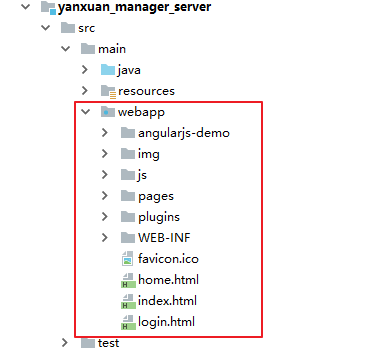
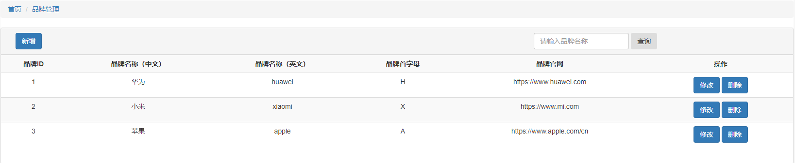

# 极光严选-第二章-AngularJS&品牌信息管理

## 课程内容

- AngularJS
  - 特性
  - 常用指令
  - 路由机制
- 品牌信息管理
  - 列表展示功能
  - 分页列表展示功能
  - 新增功能
  - 修改功能
  - 删除（停用）功能
  - 多条件组合查询功能

## 学习目标

- [ ] 了解AngularJS的四个特性
- [ ] 能够使用AngularJS完成数据绑定、数据初始化、事件触发、列表渲染、远程请求
- [ ] 编码实现品牌列表展示功能
- [ ] 编码实现品牌分页列表展示功能
- [ ] 编码实现新增品牌信息的功能
- [ ] 编码实现修改品牌信息的功能
- [ ] 编码实现删除（停用）品牌信息的功能
- [ ] 编码实现多条件组合查询品牌信息的功能


## 一、 AngularJS

### 1.1. AngularJS简介

​	AngularJS诞生于2009年，由Misko Hevery 等人创建，后为Google所收购。是一款优秀的前端JS框架，已经被用于Google的多款产品当中。AngularJS有着诸多特性，最为核心的是：MVVM、模块化、自动化双向数据绑定、语义化标签、依赖注入等等。


### 1.2. AngularJS的四大特性

#### 1.2.1. MVVM

​	MVVM是Model-View-ViewModel的简称。由模型（Model）、视图（View）、视图模型（ViewModel）三部分组成。

| 名称       | 作用                                                         |
| ---------- | ------------------------------------------------------------ |
| Model      | 在web页面中，大部分Model都是来自Ajax的服务端返回数据或者是全局的配置对象 |
| View       | 在angular中是html里面包含一堆声明式*Directive*的视图模板     |
| ViewModel  | 负责给View提供显示的数据，以及提供了View中Command事件操作Model的途径，<br/>**在angular中*$scope*对象充当了这个ViewModel的角色**； |
| Controller | 负责ViewModel对象的初始化，它将组合一个或者多个service来获取业务领域Model放在ViewModel对象上，使得应用界面在启动加载的时候达到一种可用的状态 |


#### 1.2.2. 双向数据绑定

​	在Angular网页应用中，数据绑定是数据模型(model)与视图(view)组件的自动同步。Angular的实现方式允许你把应用中的模型看成单一数据源。而视图始终是数据模型的一种展现形式。当模型改变时，视图就能反映这种改变，反之亦然。


​	如图表中所示：模板（指未经编译的附加了标记和指令的HTML）是在浏览器中编译，编译阶段生成了动态(live)视图。保持视图动态的原因是，任何视图中的改变都会立刻反映到数据模型中去，任何数据模型的改变都会传播到视图中去。这使得数据模型始终是应用的单一数据源。大幅度简化了开发者的编程核心，你可以将视图简单的理解为数据模型的实时映射。

​	因此，将视图作为数据模型的一种映射，使得控制器完全与视图分离，而不必关心视图的展现。这使测试变得小菜一碟，你可以在没有视图和有关DOM/浏览器的依赖情况下轻松测试你的应用。


#### 1.2.3. 依赖注入

​	在软件工程中，依赖注入是实现控制反转的一种软件设计模式，一个依赖是一个被其他对象(client)调用的对象（服务）,注入则是将被依赖的对象(service)实例传递给依赖对象(client)的行为。将 被依赖的对象传给依赖者，而不需要依赖者自己去创建或查找所需对象是DI的基本原则。 依赖注入允许程序设计遵从依赖倒置原则（简单的说就是要求对抽象进行编程，不要对实现进行编程，这样就降低了客户与实现模块间的耦合） 调用者(client)只需知道服务的接口，具体服务的查找和创建由注入者(injector)负责处理并提供给client，这样就分离了服务和调用者的依赖，符合低耦合的程序设计原则。


#### 1.2.4. 模块化设计

| 模块名       | 描述                                                         |
| ------------ | ------------------------------------------------------------ |
| `ng`         | AngularJS的默认模块，包含AngularJS的所有核心组件。           |
| `ngRoute`    | AngularJS是一套前端的MVC框架。<br />那么，为了实现视图的中转，肯定会涉及到路由的概念。<br />`ngRoute`即是AngularJS的路由模块。 |
| `ngAnimate`  | AngularJS的动画模块，<br />使用`ngAnimate`各种核心指令能为你的应用程序提供动画效果。<br />动画可使用css或者JavaScript回调函数。 |
| `ngAria`     | 使用`ngaria`为指令注入共同的可达性属性和提高残疾人用户体验。 |
| `ngResource` | 当查询和发送数据到一个REST 服务器时，使用`ngResource`模块。  |
| `ngCookies`  | `ngCookies`模块提供了一个方便的包用于读取和写入浏览器的cookies。 |
| `ngTouch`    | `ngRoute`模块提供触摸事件，方便的应用于移动触摸设备。它的实现是实现是基于jQuery移动触摸事件处理。 |
| `ngSanitize` | `ngSanitize`模块可安全地在你的应用程序中解析和操作HTML数据。 |
| `ngMessages` | AngularJS表单验证模块。<br />`ngMessages`模块完美的实现了很多表单验证的常用功能，简化你的开发流程。 |

### 1.3. 入门案例

#### 1.3.1. 数据绑定

```html
<!DOCTYPE html>
<html>
<head>
	<title>hello</title>
	<script type="text/javascript" src="./angular.min.js"></script>
</head>
<!--  ng-app是angular程序的入口 -->
<body ng-app>
	<div>
	  <label>姓名：</label>
	  <!-- ng-model指定输入的内容绑定到的模型 -->
	  <input type="text" ng-model="yourName" placeholder="请输入你的姓名">
	  <hr>
      <!-- 使用{{}}输出model的值 -->
	  <h1>Hello {{yourName}}!</h1>
	</div>
</body>
</html>
```

执行结果：


说明：

​	ng-app：页面加载时，会告诉AngularJS处理body标签中的元素，并引导应用

​	ng-model：把输入框中的值绑定到变量 yourname

​	{{ }}：会对其包裹的 yourname变量进行解析，展示到视图中


#### 1.3.2. 初始化指令

```html
<!DOCTYPE html>
<html>
<head>
	<title>初始化指令</title>
	<script type="text/javascript" src="./angular.min.js"></script>
</head>
<!--  ng-app是angular程序的入口 
	ng-init 执行指定的表达式，在表达式中就可完成model的赋值
-->
<body ng-app ng-init="yourName='张三丰'">
	<div>
	  <label>姓名：</label>
	  <!--  -->
	  <input type="text" ng-model="yourName" placeholder="请输入你的姓名">
	  <hr>
	  <h1>Hello {{yourName}}!</h1>
	</div>
</body>
</html>
```

执行结果： 


> 建议控制器中完成初始化

#### 1.3.3. 控制器

```html
<!DOCTYPE html>
<html>
<head>
	<title>控制器</title>
	<script type="text/javascript" src="./angular.min.js"></script>
</head>
<!--  ng-app是angular程序的入口 -->
<body ng-app="demo" ng-controller="demoController">
	<div>
	  <label>姓名：</label>
	  <!--  -->
	  <input type="text" ng-model="yourName" placeholder="请输入你的姓名">
	  <hr>
	  <h1>Hello {{yourName}}!</h1>
	</div>
</body>
<script type="text/javascript">
	// 定义模块
	var demo = angular.module('demo',[])
	// 定义控制器,
	// 第一参数是 控制器名称，第二参数是回调函数($scope是指当前的ViewModel)
	demo.controller('demoController',function($scope){
		// 变量初始化
		$scope.yourName = '张三丰'
	})
</script>
</html>
```

运行结果：


> $scope的使用贯穿整个AngularJS App应用，它与数据模型相关联，同时也是表达式执行的上下文；
>
> $scope应用在 HTML (视图) 和 JavaScript (控制器)之间的纽带；
>
> $scope 是一个 JavaScript 对象，带有属性和方法，这些属性和方法可以在视图和控制器中使用。
>
> 
>
> 注意：控制器不仅仅可以用来初始化变量，也可有方法

```html
<!DOCTYPE html>
<html>
<head>
	<title>控制器</title>
	<script type="text/javascript" src="./angular.min.js"></script>
</head>
<!--  ng-app是angular程序的入口 -->
<body ng-app="demo" ng-controller="demoController">
	<div>
	  <label>姓名：</label>
	  <!--  -->
	  <input type="text" ng-model="yourName" placeholder="请输入你的姓名">
	  <hr>
	  <h1>{{sayhello()}}</h1>
	</div>
</body>
<script type="text/javascript">
	// 定义模块
	var demo = angular.module('demo',[])
	// 定义控制器,
	// 第一参数是 控制器名称，第二参数是回调函数($scope是指当前的ViewModel)
	demo.controller('demoController',function($scope){
		// 变量初始化
		$scope.yourName = '张三丰'
		// 定义方法
		$scope.sayhello=function(){
			return 'hello ' + $scope.yourName 
		}
	})
</script>
</html>
```

运行结果：


#### 1.3.4. 事件指令

```html
<!DOCTYPE html>
<html>
<head>
	<title>点击事件</title>
	<script type="text/javascript" src="./angular.min.js"></script>
</head>
<!--  ng-app是angular程序的入口 -->
<body ng-app="demo" ng-controller="demoController">
	<!-- 使用ng-click绑定点击事件触发的操作 -->
	<button ng-click="addCount()">点我！</button>
	<span>{{count}}</span>
</body>
<script type="text/javascript">
	// 定义模块
	var demo = angular.module('demo',[])
	// 定义控制器,
	// 第一参数是 控制器名称，第二参数是回调函数($scope是指当前的ViewModel)
	demo.controller('demoController',function($scope){
		// 变量初始化
		$scope.count = 0;
		
		$scope.addCount = function(){
			// 每次点击都让count 的值+1
			$scope.count++;
		}
	})
</script>
</html>
```

运行结果：


#### 1.3.5. 列表渲染

1. 简单列表

```html
<!DOCTYPE html>
<html>
<head>
	<title>简单列表渲染</title>
	<script type="text/javascript" src="./angular.min.js"></script>
</head>
<!--  ng-app是angular程序的入口 -->
<body ng-app="demo" ng-controller="demoController">
	<ul>
		<!-- ng-repeat指令，每次从列表中取出一个值，并赋值给in 前面的变量 -->
		<li ng-repeat="item in dataList">
			{{item}}
		</li>
	</ul>
</body>
<script type="text/javascript">
	// 定义模块
	var demo = angular.module('demo',[])
	// 定义控制器,
	// 第一参数是 控制器名称，第二参数是回调函数($scope是指当前的ViewModel)
	demo.controller('demoController',function($scope){
		// 初始化列表
		$scope.dataList = [
			"JavaEE","前端","大数据","人工智能"
		]
	})
</script>
</html>
```

运行结果：


2. 复杂列表

```html
<!DOCTYPE html>
<html>
<head>
	<title>简单列表渲染</title>
	<script type="text/javascript" src="./angular.min.js"></script>
</head>
<!--  ng-app是angular程序的入口 -->
<body ng-app="demo" ng-controller="demoController">
	<table border="1">
		<tr>
			<th>姓名</th>
			<th>年龄</th>
		</tr>
		<tr ng-repeat="item in dataList">
			<td>{{item.userName}}</td>
			<td>{{item.age}}</td>
		</tr>
		
	</table>
</body>
<script type="text/javascript">
	// 定义模块
	var demo = angular.module('demo',[])
	// 定义控制器,
	// 第一参数是 控制器名称，第二参数是回调函数($scope是指当前的ViewModel)
	demo.controller('demoController',function($scope){
		// 初始化列表
		$scope.dataList = [
			{userName:'张三',age:10},
			{userName:'张三丰',age:100},
			{userName:'张无忌',age:70}
		]
	})
</script>
</html>
```

运行结果：


#### 1.3.6. 获取远程数据

```html
<!DOCTYPE html>
<html>
<head>
	<title>请求远程数据</title>
	<script type="text/javascript" src="./angular.min.js"></script>
</head>
<!--  ng-app是angular程序的入口 -->
<body ng-app="demo" ng-controller="demoController">
	<table border="1">
		<tr>
			<th>品牌编号</th>
			<th>品牌名称</th>
			<th>品牌首字母</th>
		</tr>
		<tr ng-repeat="item in dataList">
			<td>{{item.id}}</td>
			<td>{{item.name}}</td>
			<td>{{item.firstChar}}</td>
		</tr>
		
	</table>
</body>
<script type="text/javascript">
	// 定义模块
	var demo = angular.module('demo',[])
	// 定义控制器,
	// 第一参数是 控制器名称，第二参数是回调函数($scope是指当前的ViewModel)
	// 使用服务需要把服务注入到控制器中
	demo.controller('demoController',function($scope,$http){
		// 初始化列表
		$http({
				method:'get',
				// 服务地址
				url:'http://localhost:9001/brands'
			})
		.then(function successCallback (res){
			// 成功的回调函数
			console.log(res);
			$scope.dataList = res.data.rows;
		},function errorCallback (res){
			// 失败的回调函数
			console.log(res);
		})
	})
</script>
</html>
```

运行结果：


1. $http请求参数

| 参数   | 类型     | 描述                                                         |
| ------ | -------- | ------------------------------------------------------------ |
| config | `object` | **method**：字符串，请求方法。<br />**url**：字符串，请求地址。<br />**params**：字符串或者对象，将使用paramserializer序列化并且作为GET请求的参数。<br />**data**：字符串或者对象，作为请求信息数据的数据。<br />headers：对象，字符串或者函数返回表示发送到服务器的HTTP请求头。如果函数的返回值为空，则headers则不发送。函数接受一个配置对象作为参数。xsrfHeaderName：字符串，填充XSRF令牌的HTTP请求头名称。<br />xsrfCookieName：字符串，含有XSRF令牌cookie的名字。<br />transformRequest：函数/函数的数组。转换函数或者一个包含转换函数的数组。转换函数获取http请求体和请求头，并且返回他们的转换版（通常是序列化）。<br />transformResponse：函数/函数的数组。转换函数或者一个包含转换函数的数组。转换函数获取http响应体和响应头，并且返回他们的转换版（通常是序列化）。<br />paramSerializer：字符串或者返回字符串的函数。用于编写请求参数（指定为对象）的字符串表示形式的函数。如果指令是字符串，那么将被解释为通过$injector注册的函数，这意味着你能通过注册服务方式创建你自己的序列化程序。默认的序列化是$httpParamSerializer；或者你可以使用$httpParamSerializerJQLike。<br />cache：boolean，如果为true，一个默认的$http缓存将被作为请求的缓存，否则如果存在一个用$cacheFactory创建的缓存实例，则将用于缓存。<br />timeout：数值，毫秒，超时则让请求中止。<br />withCredentials：boolean，是否设置withcredentials flag的XHR对象。查看更多信息的凭据。<br />responseType：字符串，响应头类型。 |

2. 返回值

- data：字符串或对象。变换函数变换后的响应体。
- status：数值，响应的http状态码。
- headers：函数，响应头的getter函数。
- config：对象，用于生成请求的配置对象。
- statusText：字符串，响应的HTTP状态文本。

3. 简化

- $http.get(url,[config])
- $http.post(url,data,[config])
- $http.put(url,data,[config])
- $http.patch(url,data,[config])
- $http.delete(url,[config])

#### 1.3.7. 条件渲染

```html
<!DOCTYPE html>
<html>
<head>
	<title>请求远程数据</title>
	<script type="text/javascript" src="./angular.min.js"></script>
</head>
<!--  ng-app是angular程序的入口 -->
<body ng-app="demo" ng-controller="demoController">
	<table border="1">
		<tr>
			<th>姓名</th>
			<th>性别</th>
			<th>是否成年</th>
		</tr>
		<tr>
			<td>{{user.name}}</td>
			<td><span ng-if="user.gender=='1'">男</span><span ng-if="user.gender!='1'">女</span></td>
			<td><span ng-if="user.age >= 18">已成年</span><span ng-if="user.age < 18">未成年</span></td>
		</tr>
	</table>
</body>
<script type="text/javascript">
	// 定义模块
	var demo = angular.module('demo',[])
	// 定义控制器,
	// 第一参数是 控制器名称，第二参数是回调函数($scope是指当前的ViewModel)
	// 使用服务需要把服务注入到控制器中
	demo.controller('demoController',function($scope){
		$scope.user={
			name:'张三',gender:'1',age:19
		}
	})
</script>
</html>
```

运行结果：


### 1.4. ngRoute

AngularJS的路由模块,完成视图的中转。在使用ngRoute的时候，实际上，我们是在应用的主模块中引入`ngRoute`模块并添加`$routeProvider`服务到主模块的config方法中来达到我们的目标。

在ngRoute中主要有$route、$routeProvider、$routeParams三个服务项目。

$routeProvider用于在主应用主模块的配置方法中。$route与$routeParams一般常见于控制器中。

#### 1.4.1. 基本使用

1. 主页index.html

```html
<!DOCTYPE html>
<html>
<head>
	<title>主页</title>
	<script type="text/javascript" src="../angularjs/angular.min.js"></script>
	<script type="text/javascript" src="../angularjs/angular-route.min.js"></script>
</head>
<body ng-app="demo">
这是主页中的内容
<br/>
<a href="#/01">01</a>
<a href="#/02">02</a>
<hr/>
<div ng-view></div>
</body>
<script type="text/javascript">
    // 依赖于 路由模块 ngRoute
	var app = angular.module("demo",["ngRoute"]);
	// 定义路由规则
	app.config(['$routeProvider', function($routeProvider){
		$routeProvider
		.when(
			"/01",{
				templateUrl: "./01.html",
				controller: "controller01",
			})
		.when(
			"/02",{
				templateUrl: "./02.html",
				controller: "controller02"
			})
		.otherwise(
			{
				redirectTo:'/01'
			});
	}]);

	// controller01
	app.controller("controller01", function($scope){
		$scope.name = "01-html";
	});

	// controller02
	app.controller("controller02", function($scope){
		$scope.name = "02-html";
	});
</script>
</html>
```

2. a-html

```html
<!DOCTYPE html>
<html>
<head>
	<title>a</title>
</head>
<body>
这是Ahtml中的内容<br/>
</body>
</html>
```

3. b-html

```html
<!DOCTYPE html>
<html>
<head>
	<title>b</title>
</head>
<body>
这是Bhtml中的内容<br/>
</body>
</html>
```

#### 1.4.2. 路由传参

1. 路由中定义参数

```js
// 定义路由规则
	app.config(['$routeProvider', function($routeProvider){
		$routeProvider
		.when(
			"/02",{
				templateUrl: "./02.html",
				controller: "controller01",
			})
		.when(
			"/02/:id",{
				templateUrl: "./02.html",
				controller: "controller01",
			})
		.when(
			"/02",{
				templateUrl: "./02.html",
				controller: "controller02"
			})
		.otherwise(
			{
				redirectTo:'/02'
			});
	}]);
```

2. 接收参数

```js
	// 使用$routeParams接收路由传递的参数
	app.controller("controller01", function($scope, $routeParams){
		$scope.name = "01-html";
		// 使用 $routeProvider接收传入参数
		console.log("传入的参数为："+$routeParams.id);
	});
```


## 二、 品牌信息管理

### 2.1.  无分页列表展示

#### 2.1.1. 准备工作 

> 把资料中的`yanxuan-manager`中的文件拷贝到 `jiguangyanxuan-manager-server`中的`src\main\webapp` 目录下




#### 2.1.2. 前端页面需求分析



> 在页面加载时，向服务器发送请求，获取所有的品牌信息，并进行渲染
>
> 1. 页面加载，也就是使用anguljs中的初始化指令（ng-init）完成数据请求
> 2. 数据请求，使用到的`$http`获取远程数据
> 3. 品牌列表，是一个数组集合，渲染使用的是`ng-repeat`指令

#### 2.1.3. 请求逻辑

1. 在index.js中设置路由名称


2. 定义brandController控制器，在控制器中发送请求获取数据

```javascript
// 定义brandController
app.controller("brandController", function ($http, $scope) {
    // 发送请求，获取所有的商品品牌信息
    $http.get("../../brand/queryAll")
        .then(
            function (value) {
                console.log(value);
                $scope.brandList = value.data;
            },
            function (reason) {
                console.log(reason)
            }
        );
});
```

#### 2.1.4. html数据遍历

```html
<tbody>
    <tr ng-repeat="brand in brandList">
        <td>{{brand.id}}</td>
        <td>{{brand.name}}</td>
        <td>{{brand.englishName}}</td>
        <td>{{brand.firstChar}}</td>
        <td>
            <button type="button" class="btn btn-primary" data-toggle="modal" data-target="#newModal">修改
            </button>
            <button type="button" class="btn btn-primary">删除</button>
        </td>
    </tr>
</tbody>
```


#### 2.1.5. 运行测试


### 2.2. 分页列表展示

#### 2.2.1. 需求分析

> 1. 在表格下方显示分页工具条
> 2. 获取远程数据的请求中携带分页信息（当前页码、当前页展示记录数）
> 3. 服务器根据分页信息进行查询，并返回当前页展示数据和相关分页信息（总记录数）
> 4. 根据服务器返回的数据进行列表渲染


#### 2.2.2. 前端代码

##### 2.2.2.1.添加分页相关文件

> 把分页相关的页面拷贝到 `src/main/webapp/js/common/`目录下


##### 2.2.2.2. 展示分页工具条

1. index.html 引入js文件

```html
<script type="text/javascript" src="js/common/pagination/pagination.js"></script>
```

2. brand.html中添加分页工具条展示

```javascript
<!-- 使用自定的指令完成分页条的展示 -->
<pagination />
```


##### 2.2.2.3. 请求逻辑

```javascript
// 创建模块,传入 分页工具依赖
app.controller("brandController",function ($scope,$http) {
    // 定义分页信息
    $scope.pageOption  = {
        total ; 0 , // 总记录数
        currentPage : 1 , // 当前页码值，初始值为1
        pageSize : 10, // 每页显示的记录数，初始值为10
        pageSizeArr : [10, 20 ,30, 40, 50] , // 每页显示记录的选择数组
        onChange : function () {
            // 页码和每页显示记录数发生变化执行触发的业务逻辑，可以用来请求数据查询的操作
            $scope.pageQuery();
        }
    }
    // 分页查询
    $scope.pageQuery = function () {
    	// 发送请求，并携带当前页码、页面显示记录数
        $http.get("../../brand/pageQuery?pageNum="+$scope.pageOption.currentPage+"&pageSize="+$scope.pageOption.pageSize)
            .then(function (res){
                $scope.dataList = res.data.rows;
                $scope.pageOption.total = res.data.total;
            }
        )
    }
}
```


#### 2.2.3. 后端代码

##### 2.2.3.1. 创建分页数据封装实体类

在 `jiguangyanxuan-model`工程中创建 `cc.jgxy.yanxuan.entity`包，并在该包下创建实体类

```java
package cc.jgxy.yanxuan.entity;

import java.io.Serializable;
import java.util.List;

/**
 * 用来封装分页数据
 */
public class PageResult<T> implements Serializable{

    private long total;//总记录数
    private List<T> rows;//分页数据

    public long getTotal() {
        return total;
    }

    public void setTotal(long total) {
        this.total = total;
    }

    public List<T> getRows() {
        return rows;
    }

    public void setRows(List<T> rows) {
        this.rows = rows;
    }
}
```

##### 2.2.3.2.  创建服务接口

在 `jiguangyanxuan-manager-api`工程中的`IGoodsBrandService`添加服务接口方法

```java
	/**
     * 根据分页信息进行查询
     * @param pageNum
     * @param pageSize
     * @return 分页数据的封装实体类
     */
    public PageResult<GoodsBrand> pageQuery(Integer pageNum, Integer pageSize);
```

##### 2.2.3.3. 创建服务实现

在 `jiguangyanxuan-manager-service`工程中的`GoodsBrandServiceImpl`中实现服务接口的方法

```java
@Override
public PageResult<GoodsBrand> pageQuery(Integer pageNum, Integer pageSize) {
    // 使用第三方插件开启分页查询
    PageHelper.startPage(pageNum, pageSize);
    // 执行查询，没有查询条件故为空
    Page<GoodsBrand> pageData = (Page<GoodsBrand>)goodsBrandMapper.selectByExample(null);
    // 构建返回的分页数据
    PageResult<GoodsBrand> pageResult = new PageResult<GoodsBrand>();
    pageResult.setRows(pageData.getResult());
    pageResult.setTotal(pageData.getTotal());
    // return 分页数据
    return pageResult;
}
```

##### 2.2.3.4. 创建控制层

在 `jiguangyanxuan-manager-server`工程中的`GoodsBrandController`中添加分页查询的方法

```java
/**
* 接受分页信息，并完成查询
* @param pageNum
* @param pageSize
* @return
*/
@RequestMapping("/pageQuery")
public PageResult<GoodsBrand> pageQuery(Integer pageNum, Integer pageSize){
    return goodsBrandService.pageQuery(pageNum, pageSize);
}
```

#### 2.2.4. 运行效果


### 2.3. 增加品牌信息

#### 2.3.1. 需求分析


> 1. 点击 新增按钮，弹出模态窗口，在模态窗口中输入品牌的信息
> 2. 点击模态窗口中的保存按钮，完成向服务器发送表单数据，
> 3. 后台服务器接收到数据后，完成数据的保存，并相应前端是否成功

#### 2.3.2. 前端代码

##### 2.3.2.1. 表单数据绑定


##### 2.3.2.2. 执行保存

1. 保存按钮绑定事件

```html
<button type="button" class="btn btn-primary" ng-click="save()">保存</button>
```

2. 保存

```JavaScript
$scope.save = function () {
    $http.get("../../brand/save",{params:$scope.brand})
        .then(function (res) {
        if(res.data.code){
            // 保存成功，关闭模态窗口，并且提示保存成功，刷新列表
            $('#newModal').modal('hide');
            alert("品牌信息保存成功！");
            $scope.pageQuery();
        }
    })
}
```


#### 2.3.3. 后端代码

##### 2.3.3.1. 服务接口

```java
/**
* 保存品牌信息
* @param goodsBrand
* @return
*/
public Integer save(GoodsBrand goodsBrand);
```

##### 2.3.3.2. 服务接口实现

```java
@Override
public Integer save(GoodsBrand goodsBrand) {
    // 暂定创建人是 system
    goodsBrand.setCreatePerson("system");
    // 设置新增的时间
    goodsBrand.setCreateDate( new Date());
    // 执行保存操作
    int insert = goodsBrandMapper.insertSelective(goodsBrand);
    // 返回影响的记录数
    return insert;
}
```

##### 2.3.3.3. 创建封装响应结果实体类

```java
package cc.jgxy.yanxuan.entity;

import java.io.Serializable;

/**
 * 用来封装新增、修改、删除操作的响应结果
 */
public class Result implements Serializable {

    private boolean code;//响应结果成功true/失败false
    private String message;// 响应的提示信息

    public boolean isCode() {
        return code;
    }

    public void setCode(boolean code) {
        this.code = code;
    }

    public String getMessage() {
        return message;
    }

    public void setMessage(String message) {
        this.message = message;
    }
}
```


##### 2.3.3.4. 控制层

```java
@RequestMapping("/save")
public Result save(GoodsBrand goodsBrand){
    // 执行保存操作
    Integer save = goodsBrandService.save(goodsBrand);
    // 构建响应结果
    Result result = new Result();
    if(save ==1 ){
        result.setCode(true);
        result.setMessage("新增品牌信息成功");
    }else{
        result.setCode(false);
        result.setMessage("新增品牌信息失败，请稍后重试");
    }
    return result;
}
```

#### 2.3.4. 运行效果


### 2.4. 修改品牌信息

#### 2.4.1. 需求分析

> 1. 点击列表中的修改按钮，弹出模态窗口，并回显当前记录的信息
> 2. 修改模态框中的数据之后，点击保存按钮，把数据发送到服务端
> 3. 服务端接收到数据之后，执行修改操作

#### 2.4.2. 前端代码

##### 2.4.2.1. 数据回显

1. 修改绑定事件

```html
<button type="button" class="btn btn-primary" data-toggle="modal" 
        data-target="#newModal" ng-click="initSourceData(item)">修改
</button>
```

2. js代码

```JavaScript
// 初始化待修改的数据
$scope.initSourceData = function (source){
    $scope.brand = source;
}
```

##### 2.4.2.2. 执行修改保存

> 点击的同样时保存按钮，那么就要区分时新增保存、还是修改保存

```javascript
$scope.save = function () {
    // 如果主键ID为null，那么就是新增保存，否则为修改保存
    if($scope.brand.id === undefined){
        // 新增保存
        $http.get("../../brand/save",{params:$scope.brand}).then(function (res) {
            if(res.data.code){
                // 保存成功，关闭模态窗口，并且提示保存成功，刷新列表
                $('#newModal').modal('hide');
                alert("品牌信息保存成功！");
                $scope.pageQuery();
            }
        })
    }else{
        // 修改保存
        $http.get("../../brand/update",{params:$scope.brand}).then(function(res){
            if(res.data.code){
                // 保存成功，关闭模态窗口，并且提示保存成功，刷新列表
                $('#newModal').modal('hide');
                alert("品牌信息修改成功！");
                $scope.pageQuery();
            }
        })
    }
}
```


#### 2.4.3. 后端代码

##### 2.4.2.1. 服务接口

```java
    /**
     * 修改品牌信息
     * @param goodsBrand
     * @return
     */
    public Integer update(GoodsBrand goodsBrand);
```

##### 2.4.2.2. 服务接口实现

```java
@Override
public Integer update(GoodsBrand goodsBrand) {
    // 暂定更新人为system
    goodsBrand.setUpdatePerson("system");
    // 设置更新时间
    goodsBrand.setUpdateDate(new Date());
    // 执行更新操作
    int update = goodsBrandMapper.updateByPrimaryKeySelective(goodsBrand);
    return update;
}
```

##### 2.4.2.3. 控制层

```java
    @RequestMapping("/update")
    public Result update(GoodsBrand goodsBrand){
        // 执行修改操作
        Integer update = goodsBrandService.update(goodsBrand);
        // 构建响应结果
        Result result = new Result();
        if(update==1){
            result.setCode(true);
            result.setMessage("更新品牌信息成功");
        }else{
            result.setCode(false);
            result.setMessage("更新品牌信息失败，请稍后重试");
        }
        return result;
    }
```


### 2.5. 删除品牌信息

#### 2.5.1. 需求分析

> 1. 点击每条记录的删除操作按钮，向服务器发送请求，并携带记录的主键ID
> 2. 服务器根据接收到的主键ID，进行删除

#### 2.5.2. 前端代码

##### 2.5.2.1. 删除按钮绑定事件

```html
<button type="button" class="btn btn-primary" ng-click="delete(item.id)">删除</button>
```

##### 2.5.2.2. 发送请求

```javascript
// 发送删除请求
$scope.delete = function (id) {
    $http.get("../../brand/delete?id="+id).then(function(res){
        if(res.data.code){
            // 删除，并且提示保存成功，刷新列表
            alert("品牌删除修改成功！");
            $scope.pageQuery();
        }
    })
}
```


#### 2.5.3. 后端代码

##### 2.5.3.1. 服务接口

```java
    /**
     * 根据品牌信息的主键ID，删除品牌信息
     * @param id
     * @return
     */
    public Integer delete(Long id);
```

##### 2.5.3.2. 服务接口实现

> 删除有两种方式：物理删除和逻辑删除
>
> 物理删除：在数据库中执行delete命令，删除记录本身
>
> 逻辑删除：修改数据记录的标识，标识删除

```java
    @Override
    public Integer delete(Long id) {
        // 构建删除的品牌信息
        GoodsBrand goodsBrand = new GoodsBrand();
        goodsBrand.setId(id);
        // 进行逻辑删除
        goodsBrand.setIsDelete("1");
        // 执行逻辑删除
        int update = goodsBrandMapper.updateByPrimaryKeySelective(goodsBrand);
        return update;
    }
```

##### 2.5.3.3. 控制层

```java
@RequestMapping("/delete")    
public Result delete(Long id){
    // 执行逻辑删除操作
    Integer delete = goodsBrandService.delete(id);
    // 构建响应结果
    Result result = new Result();
    if(delete==1){
        result.setCode(true);
        result.setMessage("删除品牌信息成功");
    }else{
        result.setCode(false);
        result.setMessage("删除品牌信息失败，请稍后重试");
    }
    return result;
}
```

#### 2.5.4. 显示状态

> 出现的问题：
>
> 由于服务端采取的是逻辑删除，在前端页面上看不出是否已经删除，
>
> 解决办法：
>
> 在列表中添加状态列，显示是否删除

1. 添加列


2. 设置列显示的值

```javascript
$scope.statusArray = ['正常','停用'];
```

3. 运行效果


### 2.6. 多条件组合查询

#### 2.6.1. 需求分析

> 为了方便更好的定位某一个品牌信息，就需要针对某些条件进行查询，暂时指定可以根据名称进行查询
>
> 1. 在前端页面输入查询条件，并点击查询按钮
> 2. 发送请求到服务器，携带查询条件
> 3. 服务端根据条件进行分页查询，并返回结果

#### 2.6.2. 前端代码

1. 数据绑定，按钮点击事件绑定

```html
<input class="form-control" type="search" ng-model="name" placeholder="请输入品牌名称" 
       aria-label="Search">
<!-- 也是进行分页查询，所有直接调用pageQuery进行查询 -->
<button class="btn btn-outline-success" type="submit" ng-click="pageQuery()">查询</button>
```

2. 改造pageQuery方法

```javascript
// 查询条件初始化
$scope.name = "";
// 分页查询
$scope.pageQuery = function () {
    $http.get("../../brand/pageQuery?pageNum="+$scope.pageOption.currentPage+
              "&pageSize="+$scope.pageOption.pageSize+"&name="+$scope.name)
        .then( function (res){
            $scope.dataList = res.data.rows;
            $scope.pageOption.total = res.data.total;
        })
}
```


#### 2.6.3. 后端代码

##### 2.6.3.1. 改造分页查询服务接口

在接口方法中添加传入条件

```java
    /**
     * 根据分页信息进行查询
     * @param pageNum 当前页码
     * @param pageSize 每页显示记录数
     * @param goodsBrand 查询条件
     * @return 分页数据的封装实体类
     */
    public PageResult<GoodsBrand> pageQuery(Integer pageNum, Integer pageSize, GoodsBrand goodsBrand);
```

##### 2.6.3.2. 改造服务接口实现

> 加入对查询条件的处理

```java
@Override
public PageResult<GoodsBrand> pageQuery(Integer pageNum, Integer pageSize, GoodsBrand goodsBrand) {
    // 设置查询条件
    GoodsBrandExample example = new GoodsBrandExample();
    GoodsBrandExample.Criteria criteria = example.createCriteria();
    if(goodsBrand != null){
        // 传入条件中品牌名称不为空,根据名称模糊查询
        if(goodsBrand.getName() != null && !"".equals(goodsBrand.getName())){
            criteria.andNameLike("%"+goodsBrand.getName()+"%");
        }
    }
    // 使用第三方插件开启分页查询
    PageHelper.startPage(pageNum, pageSize);
    // 执行查询，并传入查询条件
    Page<GoodsBrand> pageData = (Page<GoodsBrand>)goodsBrandMapper.selectByExample(example);
    // 构建返回的分页数据
    PageResult<GoodsBrand> pageResult = new PageResult<GoodsBrand>();
    pageResult.setRows(pageData.getResult());
    pageResult.setTotal(pageData.getTotal());
    // return 分页数据
    return pageResult;
}
```

##### 2.6.3.3. 改造控制层

```java
/**
     * 接受分页信息，并完成查询
     * @param pageNum
     * @param pageSize
     * @param goodsBrand 查询条件
     * @return
     */
@RequestMapping("/pageQuery")
public PageResult<GoodsBrand> pageQuery(Integer pageNum, Integer pageSize,@RequestBody GoodsBrand goodsBrand){
    return goodsBrandService.pageQuery(pageNum, pageSize,goodsBrand);
}
```

#### 2.6.4. 运行结果


