# 极光严选-第三章-代码规范及规格管理、类目

## 课程内容

- 代码规范
  - 后端规范
  - 前端规范
- 规格管理
  - 多条件组合查询分页列表
  - 新增规格
  - 修改规格
  - 删除规格
- 类目管理
  - 多条件组合查询分页列表
  - 新增类目
  - 修改类目
  - 删除类目

## 学习目标

- [ ] 能够完成前端、后端代码的规范化整理
- [ ] 理解和应用AngularJS的服务
- [ ] 理解和应用AngularJS的控制器继承
- [ ] 编码实现规格信息管理功能（多条件分页列表、新增、修改、删除）
- [ ] 编码实现类目信息管理功能（多条件分页列表、新增、修改、删除）

## 一、 代码规范

### 1.1. 后端代码规范

#### 1.1.1. RESTful设计风格

##### 1.1.1.1. 介绍

​	一种软件架构风格、设计风格，而**不是**标准，只是提供了一组设计原则和约束条件。是目前流行API设计规范，用于Web数据接口的设计。

##### 1.1.1.2. URL设计

​	RESTful的核心思想是针对同一资源路径，根据不同的请求方式进行不同的数据操作，常用的请求方式有以下五种：

| 请求方式 | 数据操作             | 举例                                                         |
| -------- | -------------------- | ------------------------------------------------------------ |
| `GET`    | 读取数据             | `GET` `/brand/11`<br/>`GET` `/brand?pageNum=1&pageSize=10`<br/>`GET` `/brand?name=huawei` |
| `POST`   | 新建数据             | `POST`  `/brand`                                             |
| `PUT`    | 更新数据（全量更新） | `PUT` `/brand`                                               |
| `PATCH`  | 更新数据（部分更新） | `PATCH` `/brand`                                             |
| `DELETE` | 删除数据             | `DELETE` `/brand/11`                                         |

##### 1.1.1.3. 响应状态码

| 状态码 | 含义                                           | 常用                                                         |
| ------ | ---------------------------------------------- | ------------------------------------------------------------ |
| `1**`  | 信息，服务器收到请求，需要请求者继续执行操作   | 无                                                           |
| `2**`  | 成功，操作被成功接收并处理                     | `GET`：200 OK<br/>`POST`：201 Created<br/>`PUT`：200 OK<br/>`PATCH`：200 OK<br/>`DELETE`：204 No Content |
| `3**`  | 重定向，需要进一步的操作以完成请求             | 302重定向                                                    |
| `4**`  | 客户端错误，请求包含语法错误或无法完成请求     | 400<br/>404                                                  |
| `5**`  | 服务器错误，服务器在处理请求的过程中发生了错误 | 500 服务器内部错误                                           |

#### 1.1.2. 后端代码整理

1. Controller

```java
@RestController
@RequestMapping("/brand")
public class GoodsBrandController {

    @Reference
    private IGoodsBrandService goodsBrandService;


    /**
     * Rest 接口的查询处理器方法
     * 请求地址: Get http://localhost:9901/brand?currentPage=1&pageSize=10&name=极光
     *  默认语义是执行分页查询，具体的查询逻辑在service层进行判断
     *
     * @return
     */
    @GetMapping
    public ResponseEntity<PageResult<GoodsBrand>> query(Integer currentPage, Integer pageSize, GoodsBrand goodsBrand){
        // 分页参数缺失，则认为是查询所有，显示第一页
        if(currentPage==null || pageSize==null){
            currentPage = 1;
            pageSize = Integer.MAX_VALUE;
        }

        // 进行分页条件查询
        PageResult<GoodsBrand> pageResult = goodsBrandService.pageQuery(currentPage, pageSize, goodsBrand);

        // 返回结果，包含响应的状态码
        return new ResponseEntity<PageResult<GoodsBrand>>(pageResult, HttpStatus.OK);
    }

    /**
     * 新增保存数据
     *  接收请求中的JSON数据，封装到参数中
     *  成功的响应的状态码为 201 Created
     *  失败的响应状态码为 500 Internal Server error
     * @return
     */
    @PostMapping
    public ResponseEntity save(@RequestBody GoodsBrand goodsBrand){

        // 执行保存操作
        int result = goodsBrandService.save(goodsBrand);

        if(result>0){
            return new ResponseEntity( HttpStatus.CREATED);
        }else{
            return new ResponseEntity( HttpStatus.INTERNAL_SERVER_ERROR);
        }

    }

    /**
     * 修改品牌信息
     *  接收请求中的JSON
     * @param goodsBrand
     * @return
     */
    @PutMapping
    public ResponseEntity<Result> update(@RequestBody GoodsBrand goodsBrand){

        // 执行修改操作
        int result = goodsBrandService.update(goodsBrand);

        if(result>0){
            return new ResponseEntity( HttpStatus.OK);
        }else{
            return new ResponseEntity( HttpStatus.INTERNAL_SERVER_ERROR);
        }
    }

    /**
     * 接收请求中url中的参数，封装到参数中
     * @param id
     * @return
     */
    @DeleteMapping("/{id}")
    public ResponseEntity<Result> delete(@PathVariable("id") Long id){
        // 执行删除操作
        int result = goodsBrandService.deleteById(id);

        if(result>0){
            return new ResponseEntity( HttpStatus.NO_CONTENT);
        }else{
            return new ResponseEntity( HttpStatus.INTERNAL_SERVER_ERROR);
        }
    }
}
```

2. Service

```java
@Service
@Transactional
public class GoodsBrandServiceImpl implements IGoodsBrandService {

    // 注入Dao
    @Autowired
    private GoodsBrandMapper goodsBrandMapper;

    @Override
    public List<GoodsBrand> queryAll() {
        return goodsBrandMapper.selectByExample(null);
    }

    @Override
    public PageResult<GoodsBrand> pageQuery(Integer currentPage, Integer pageSize) {

        // 开启分页
        PageHelper.startPage(currentPage, pageSize);

        // 进行查询数据
        Page<GoodsBrand> pageData = (Page<GoodsBrand>) goodsBrandMapper.selectByExample(null);

        // 构建返回结果
        PageResult<GoodsBrand> pageResult = new PageResult<GoodsBrand>();
        pageResult.setTotal(pageData.getTotal());
        pageResult.setResult(pageData.getResult());

        return pageResult;
    }

    @Override
    public PageResult<GoodsBrand> pageQuery(Integer currentPage, Integer pageSize, GoodsBrand goodsBrand) {
        // 构造查询条件
        GoodsBrandExample goodsBrandExample = new GoodsBrandExample();
        // 根据中文名称进行模糊查询
        if(goodsBrand!=null && goodsBrand.getName()!=null && !"".equals(goodsBrand.getName())){
            goodsBrandExample.createCriteria().andNameLike("%"+goodsBrand.getName()+"%");
        }

        // 开启分页
        PageHelper.startPage(currentPage, pageSize);
        // 进行查询数据
        Page<GoodsBrand> pageData = (Page<GoodsBrand>) goodsBrandMapper.selectByExample(goodsBrandExample);

        // 构建返回结果
        PageResult<GoodsBrand> pageResult = new PageResult<GoodsBrand>();
        pageResult.setTotal(pageData.getTotal());
        pageResult.setResult(pageData.getResult());

        return pageResult;
    }

    @Override
    public int save(GoodsBrand goodsBrand) {
        // 设置状态为正常
        goodsBrand.setIsDelete("0");
        // 保存
        return goodsBrandMapper.insert(goodsBrand);
    }

    @Override
    public int update(GoodsBrand goodsBrand) {
        return goodsBrandMapper.updateByPrimaryKeySelective(goodsBrand);
    }

    @Override
    public int deleteById(Long id) {
        // 进行物理删除，会直接把记录删除掉
        // goodsBrandMapper.deleteByPrimaryKey(id);

        GoodsBrand goodsBrand = new GoodsBrand();
        goodsBrand.setId(id);
        goodsBrand.setIsDelete("1");
        // 执行逻辑删除操作
        return goodsBrandMapper.updateByPrimaryKeySelective(goodsBrand);

    }

}
```


### 1.2. 前端代码规范

#### 1.2.1. 现状说明

> 系统全局的路由配置代码与具体的业务的控制器代码是在同一个文件中，不利于功能代码维护；为了能够方便维护进行模块化的开发，与此同时能够提高代码的复用性。
>
> 划分的原则：
>
> 拆分出系统模块和业务功能模块，每个模块包含模块定义文件、配置文件、控制文件、服务文件

#### 1.2.2. 系统主模块

##### 1.2.2.1. 模块定义

​	只是用来创建angularjs的模块，并设置依赖模块

```js
// 系统主模块
angular.module("yanxuan", [
    "ngRoute",
    "pagination",
    "brand"
]);
```

##### 1.2.2.2. 路由配置

​	配置系统的路由信息

```js
angular.module("yanxuan")
    .config(["$routeProvider", function ($routeProvider) {
        $routeProvider.when("/", {
            templateUrl: "home.html"
        }).when("/goods/brand", {
            templateUrl: "pages/goods/brand.html",
            controller: "brandController"
        }).when("/goods/spec", {
            templateUrl: "pages/goods/spec.html"
        }).when("/goods/category/:pId", {
            templateUrl: "pages/goods/category.html"
        }).when("/goods/audit", {
            templateUrl: "pages/goods/audit.html"
        }).when("/seller/audit", {
            templateUrl: "pages/seller/audit.html"
        }).when("/seller/manage", {
            templateUrl: "pages/seller/manage.html"
        }).when("/ad/type", {
            templateUrl: "pages/ad/type.html"
        }).when("/ad/content", {
            templateUrl: "pages/ad/content.html"
        }).when("/ad/edit/", {
            templateUrl: "pages/ad/edit.html"
        }).when("/ad/edit/:id", {
            templateUrl: "pages/ad/edit.html"
        }).otherwise({redirectTo: '/'});
    }]);
```

##### 1.2.2.3. 控制器

​	定义所有业务功能控制器中的**通用部分**

```js
angular.module("yanxuan").controller("baseController", function ($scope) {

    // 分页参数
    $scope.pageOption  = {
        total : 0 , // 总记录数
        currentPage : 1 , // 当前页码值，初始值为1
        pageSize : 10, // 每页显示的记录数，初始值为10
        pageSizeArr : [10, 20 ,30, 40, 50] , // 每页显示记录的选择数组
        onChange : function () {
            // 页码和每页显示记录数发生变化执行触发的业务逻辑，，可以用来请求数据查询的操作
            $scope.query();
        }
    };

    // 修改初始化
    $scope.initData = function (brand) {
        $scope.entity = brand;
    };

});
```

##### 1.2.2.4. 服务

后台服务接口针对同一个请求路径，针对不同的请求方式进行不同的操作，

例如：请求路径可能有

> GET http://localhost:9901/brand/1
>
> GET http://localhost:9901/brand?pageNum=1&pageSize=10&name=联想
>
> POST http://localhost:9901/brand
>
> DELETE http://localhost:9901/brand/1
>
> PUT http://localhost:9901/brand

区别在于请求参数的传递，为了统一规划前端的服务调用，所以自定义服务

```js
angular.module("yanxuan")
    .service("restService", function ($http) {

        /**
         * get请求
         * @param url
         * @param options
         * @returns {HttpPromise}
         */
        this.get = function (url, options) {
            // 如果传递的是
            if (typeof options !== "object" && options !== undefined) {
                url += "/" + options;
            }
            return $http.get(url, {params: options});
        };

        /**
         *  post请求
         * @param url
         * @param entity
         * @returns {HttpPromise}
         */
        this.post = function (url, entity) {
            return $http.post(url, entity);
        };

        /**
         * put请求
         * @param url
         * @param entity
         * @returns {HttpPromise}
         */
        this.put = function (url, entity) {
            return $http.put(url, entity);
        };

        /**
         * delete请求
         * @param url
         * @returns {HttpPromise}
         */
        this.delete = function (url, id) {
            if (id !== undefined) {
                url = url + "/" + id;
            }
            return $http.delete(url);
        }
    });
```

#### 1.2.3. 品牌管理模块

##### 1.2.3.1. 模块定义

​	定义业务功能模块的创建

```js
angular.module("brand",[]);
```

##### 1.2.3.2. 控制器

​	定义业务功能相关处理逻辑

```js
// 定义brandController
angular.module("brand").controller("brandController", function (brandService, $scope, $controller) {

    // 继承通用控制器中定义的相关内容
    $controller("baseController", {$scope: $scope});

    // 视图加载完成后,即初始化
    $scope.$on("$viewContentLoaded", function (event) {
        $scope.query();
    });

    // 状态数组
    $scope.statusArray = ["正常","停用"];

	// 列表查询
    $scope.query = function(){
        // 页面初始化时$scope.name == undefined
        if($scope.name === undefined){
            $scope.name ="";
        }
        // 定义参数
        var queryParams = {
            currentPage:$scope.pageOption.currentPage,
            pageSize:$scope.pageOption.pageSize,
            name:$scope.name
        };
        // 发送请求
        brandService.get(queryParams)
            .then (
                function (res) {
                    $scope.brandList = res.data.result;
                    $scope.pageOption.total = res.data.total
                }
            )
    };

    // 保存 or 修改
    $scope.save = function (){
        var response = null;
        // 如果id值未定义，则说明是保存操作；如果id值存在，则说明是修改操作
        if($scope.entity.id === undefined){
            // 新增保存
            response = brandService.post($scope.entity);
        }else{
            // 修改保存
            response = brandService.put($scope.entity);
        }
        // 响应结果
        response.then(
            function (res) {
                // 保存成功
                // 关闭模态窗口
                $("#newModal").modal("hide");
                // 刷新品牌列表
                $scope.query();
            }
        )
    };

    // 删除
    $scope.delete = function(id){
        brandService.delete(id)
            .then(
                function (res) {
                    alert(value.data.message);
                    // 刷新数据
                    $scope.query();
                }
            )
    };

});
```

##### 1.2.3.3. 服务定义

​	定义业务功能的服务方法

```js
angular.module("brand").service("brandService", function (restService) {
    // 请求路径
    var baseUrl = "/brand";

    this.get = function (options) {
        return restService.get(baseUrl, options);
    };

    this.post = function (entity) {
        return restService.post(baseUrl, entity);
    };

    this.put = function (entity) {
        return restService.put(baseUrl, entity);
    };

    this.delete = function (id) {
        return restService.delete(baseUrl, id);
    };

});
```

#### 1.2.4. index.html代码修改

引入上传的相关文件

```html
  <script type="text/javascript" src="js/common/app.module.js"></script>
  <script type="text/javascript" src="js/common/app.config.js"></script>
  <script type="text/javascript" src="js/common/app.controller.js"></script>
  <script type="text/javascript" src="js/common/app.service.js"></script>
  <script type="text/javascript" src="js/brand/brand.module.js"></script>
  <script type="text/javascript" src="js/brand/brand.controller.js"></script>
  <script type="text/javascript" src="js/brand/brand.service.js"></script>
```


## 二、 规格管理

商品规格是指一些足以反映商品品质的主要指标，如化学成分、含量、纯度、性能、容量、长短、粗细等。

例如：买衣服的商品规格指的是尺寸的大小，一般的均码分大、中、小号;有的较细，上衣依据衣长、胸围、领长分大小，下裤依据裤长短、腰围分大小等等。

### 2.1. 需求分析

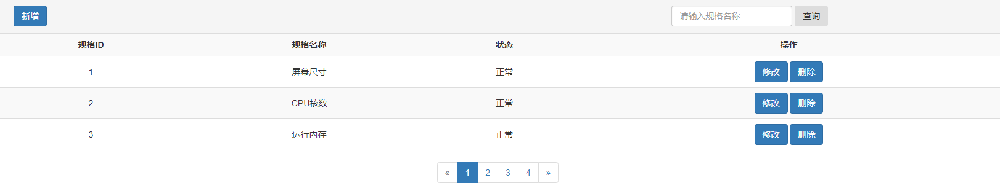

> 1. 分页列表展示：页面加载时，进行分页数据渲染

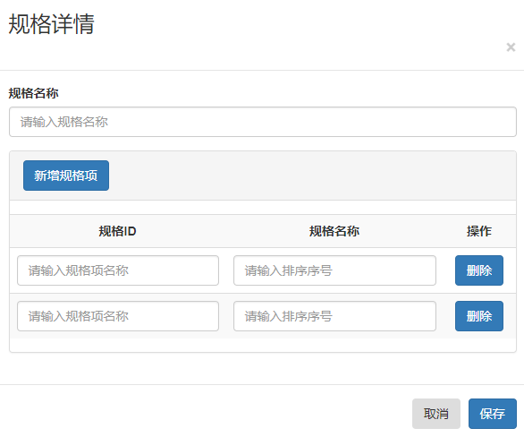

> 1. 详情录入窗口完成数据的新增录入/修改录入

### 2.2. 表结构分析

1. 规格信息(goods_spec)

| 字段名称        | 类型       | 长度 | 含义                 |
| --------------- | ---------- | ---- | -------------------- |
| `id`            | `bigint`   |      | 主键ID               |
| `name`          | `varchar`  | 50   | 规格名称             |
| `status`        | `char`     | 1    | 状态：1-删除；0-正常 |
| `create_person` | `varchar`  | 30   | 记录生成人           |
| `create_date`   | `datetime` |      | 记录生成时间         |
| `update_person` | `varchar`  | 30   | 更新人               |
| `update_date`   | `datetime` |      | 更新时间             |

1. 规格项信息(goods_spec_option)

| 字段名称        | 类型       | 长度 | 含义                 |
| --------------- | ---------- | ---- | -------------------- |
| `id`            | `bigint`   |      | 主键ID               |
| `name`          | `varchar`  | 50   | 规格项名称           |
| `spec_id`       | `bigint`   |      | 从属规格ID           |
| `sort_no`       | `int`      | 11   | 排序序号             |
| `status`        | `char`     | 1    | 状态：1-删除；0-正常 |
| `create_person` | `varchar`  | 30   | 记录生成人           |
| `create_date`   | `datetime` |      | 记录生成时间         |
| `update_person` | `varchar`  | 30   | 更新人               |
| `update_date`   | `datetime` |      | 更新时间             |

### 2.3. 规格展示列表

#### 2.3.1. 前端代码

在 `jiguangyanxuan-manager-serve/src/main/webapp/js/`目录下创建 `spec`目录，并且创建模块创建、控制器定义、服务定义相关的代码文件

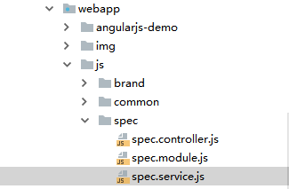

##### 2.3.1.1. `spec.module`

```javascript
angular.module("spec",[]);
```

##### 2.3.1.2. `spec.controller`

```js
// 定义specController
angular.module("spec").controller("specController", function (specService, $scope, $controller) {

    // 继承通用控制器中定义的相关内容
    $controller("baseController", {$scope: $scope});

    // 视图加载完成后,即初始化
    $scope.$on("$viewContentLoaded", function (event) {
        $scope.query();
    });

    /**
     * 定义方法
     */
    $scope.query = function(){
        // 页面初始化时$scope.name == undefined
        if($scope.name === undefined){
            $scope.name ="";
        }
        // 定义参数
        var queryParams = {
            currentPage:$scope.pageOption.currentPage,
            pageSize:$scope.pageOption.pageSize,
            name:$scope.name
        };
        // 发送请求
        specService.get(queryParams)
            .then (
                function (res) {
                    $scope.specList = res.data.result;
                    $scope.pageOption.total = res.data.total
                }
            )
    };

    $scope.save = function (){
        var response = null;
        // 如果id值未定义，则说明是保存操作；如果id值存在，则说明是修改操作
        if($scope.entity.id === undefined){
            // 新增保存
            response = specService.post($scope.entity);
        }else{
            // 修改保存
            response = specService.put($scope.entity);
        }
        // 响应结果
        response.then(
            function (res) {
                // 关闭模态窗口
                $("#newModal").modal("hide");
                // 刷新品牌列表
                $scope.query();
            }
        )
    };

    $scope.delete = function(id){
        specService.delete(id)
            .then(
                function (res) {
                    // 刷新数据
                    $scope.query();
                }
            )
    };

});
```

##### 2.3.1.3. `spec.service`

```js
angular.module("spec").service("specService", function (restService) {
    // 请求路径
    var baseUrl = "/spec";

    this.get = function (options) {
        return restService.get(baseUrl, options);
    };

    this.post = function (entity) {
        return restService.post(baseUrl, entity);
    };

    this.put = function (entity) {
        return restService.put(baseUrl, entity);
    };

    this.delete = function (id) {
        return restService.delete(baseUrl, id);
    };

});
```

##### 2.3.1.4. 相关设置

1. 引入JS文件

```html
  <script type="text/javascript" src="js/spec/spec.module.js"></script>
  <script type="text/javascript" src="js/spec/spec.controller.js"></script>
  <script type="text/javascript" src="js/spec/spec.service.js"></script>
```

2. 设置依赖模块

```js
// 系统主模块
angular.module("yanxuan", [
    "ngRoute",
    "pagination",
    "brand",
    "spec"
]);
```

3. 启用控制器

```js
	.when("/goods/spec", {
            templateUrl: "pages/goods/spec.html",
            controller :"specController"
```


##### 2.3.1.5. html页面修改

1. 查询条件

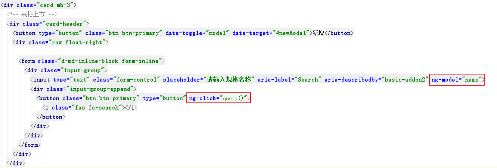

2. 列表展示

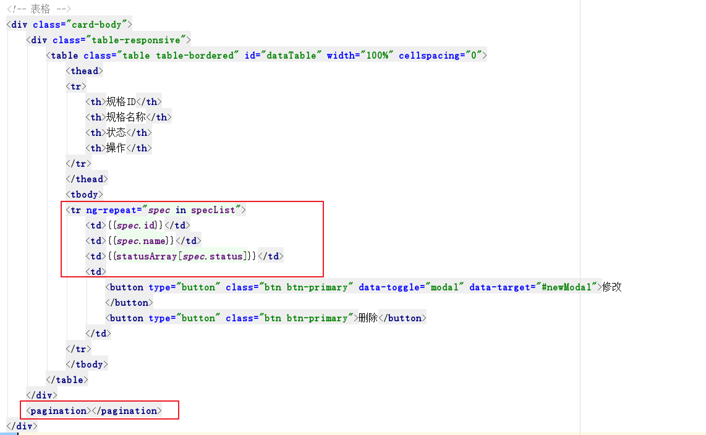

3.

#### 2.3.2. 后端代码

##### 2.3.2.1. 创建服务接口

> 在 `jiguangyanxuan-manager-api` 创建接口 `IGoodsSpecService`

```java
public interface IGoodsSpecService {

	/**
     * 多条件组合分页查询
     * @param pageNum
     * @param pageSize
     * @param goodsSpec
     * @return
     */
    public PageResult<GoodsSpec> pageQuery(Integer pageNum, Integer pageSize, GoodsSpec goodsSpec);
    
}
```

##### 2.3.2.2. 创建服务接口实现

> 在`jiguangyanxuan-manager-service`中创建服务接口实现

```java
@Service
@Transactional
public class GoodsSpecServiceImpl implements IGoodsSpecService {
    @Autowired
    private GoodsSpecMapper goodsSpecMapper;

    @Override
    public PageResult<GoodsSpec> pageQuery(Integer pageNum, Integer pageSize, 
                                           GoodsSpec goodsSpec) {
        
        // 构建查询条件
        GoodsSpecExample example = new GoodsSpecExample();
        GoodsSpecExample.Criteria criteria = example.createCriteria();
        if(goodsSpec != null){
            // 规格名称
            if(goodsSpec.getName()!=null && !"".equals(goodsSpec.getName())){
                criteria.andNameLike("%"+goodsSpec.getName()+"%");
            }
        }
		// 开启分页查询
        PageHelper.startPage(pageNum, pageSize);
        // 执行查询
        Page<GoodsSpec> pageData = (Page<GoodsSpec>)goodsSpecMapper.selectByExample(example);
        // 构建返回的分页数据
        PageResult<GoodsSpec> pageResult = new PageResult<GoodsSpec>();
        pageResult.setRows(pageData.getResult());
        pageResult.setTotal(pageData.getTotal());
        return pageResult;
    }
}
```

##### 2.3.2.3. 控制层层

> 在 `jiguangyanxuan-manager-server` 中创建 `controller`

```java
@RestController
@RequestMapping("/spec")
public class GoodsSpecController {

    @Reference
    private IGoodsSpecService goodsSpecService;

    @GetMapping
    public ResponseEntity<PageResult> query(Integer pageNum, Integer pageSize, 
                                            GoodsSpec goodsSpec){
        // 分页参数缺失，则认为是查询所有，显示第一页
        if(currentPage==null || pageSize==null){
            currentPage = 1;
            pageSize = Integer.MAX_VALUE;
        }
        
        PageResult<GoodsSpec> pageData = goodsSpecService.pageQuery(pageNum, pageSize, goodsSpec);
        return new ResponseEntity<PageResult>(pageData, HttpStatus.OK);
    }
}
```

#### 2.3.3. 运行效果

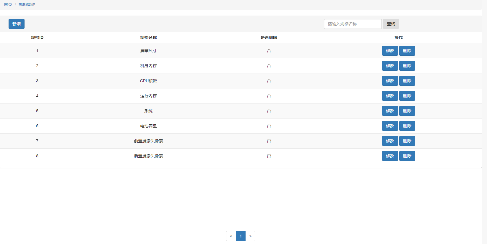


### 2.4. 新增规格信息

#### 2.4.1. 前端代码

1. html模板调整

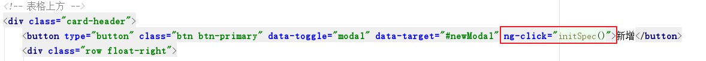

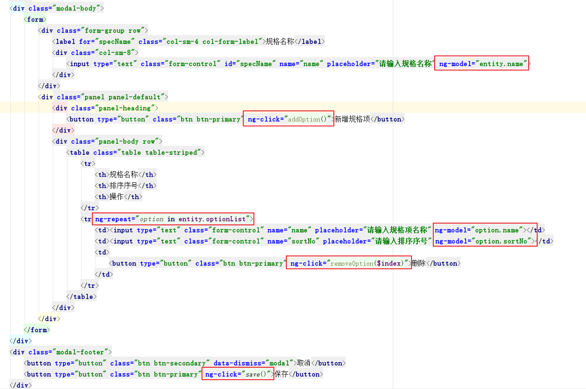

2. 控制器逻辑

```js
    // 初始化spec信息
    $scope.initSpec = function () {
        $scope.entity = {
            optionList : []
        }
    };

    $scope.addOption = function () {
        $scope.entity.optionList.push({name: "", sortNo:$scope.entity.optionList.length});
    };

    $scope.removeOption = function (index) {
        $scope.entity.optionList.splice(index,1);
        // 更新排序序号
        $scope.entity.optionList.forEach(function (value, index1) {
            value.sortNo = index1;
        })
    }
```


#### 2.4.2. 后端代码

##### 2.4.2.1. 封装实体类

```java
/**
 * 封装规格和规格项的信息
 */
public class Specification extends GoodsSpec {

    // 规格项信息
    private List<GoodsSpecOption> optionList ;

    public List<GoodsSpecOption> getOptionList() {
        return optionList;
    }

    public void setOptionList(List<GoodsSpecOption> optionList) {
        this.optionList = optionList;
    }
}
```


##### 2.4.2.1. 服务接口

```java
/**
 * 保存规格及规格项信息
 * @param specification
 * @return
 */
public Integer saveSpecification(Specification specification);
```

##### 2.4.2.2. 服务实现

```java
    @Override
    public int save(Specification specification) {
        // 设置状态为正常
        specification.setStatus("0");
        int insert = goodsSpecMapper.insert(specification);
        // 保存规格项信息
        for (GoodsSpecOption option :specification.getOptionList()) {
            // 设置规格项从属的规格ID
            option.setSpecId(specification.getId());
            // 保存规格项信息
            goodsSpecOptionMapper.insertSelective(option);
        }

        return insert;
    }
```

##### 2.4.2.3. 控制层

```java
    @PostMapping
    public ResponseEntity save(Specification specification){
        // 执行保存操作
        int result = goodsSpecService.save(specification);

        if(result>0){
            return new ResponseEntity( HttpStatus.CREATED);
        }else{
            return new ResponseEntity( HttpStatus.INTERNAL_SERVER_ERROR);
        }
    }
```


### 2.5. 删除规格信息

#### 2.5.1. 前端页面

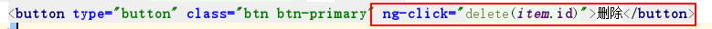

#### 2.5.2. 后端代码

##### 2.5.2.1. 服务接口

```java
    /**
     * 删除规格信息
     * @param id
     * @return
     */
    public Integer deleteSpecification(Long id);
```

##### 2.5.2.2. 服务实现

```java
    @Override
    public int deleteById(Long id) {
        GoodsSpec goodsSpec = new GoodsSpec();
        goodsSpec.setId(id);
        // 设置状态为删除
        goodsSpec.setStatus("1");
        return goodsSpecMapper.updateByPrimaryKeySelective(goodsSpec);
    }
```


##### 2.5.2.3. 控制层

```java
    @DeleteMapping("/{id}")
    public ResponseEntity delete(@PathVariable("id") Long id){
        // 执行删除操作
        int result = goodsSpecService.deleteById(id);

        if(result>0){
            return new ResponseEntity( HttpStatus.NO_CONTENT);
        }else{
            return new ResponseEntity( HttpStatus.INTERNAL_SERVER_ERROR);
        }
    }
```


### 2.6. 更新规格信息

#### 2.6.1. 数据回显

##### 2.6.1.1. 前端页面

1. 修改按钮

```html
<button type="button" class="btn btn-primary" data-toggle="modal" data-target="#newModal" ng-click="initSpec(spec.id)">修改</button>
```


2. 根据主键查询

```js
    // 初始化spec信息
    $scope.initSpec = function (id) {
        // 新增初始化
        if(id === undefined){
            $scope.entity = {
                optionList : []
            }
        }else{
            // 修改数据回显
            specService.get(id)
                .then(
                    function (res) {
                        $scope.entity = res.data;
                    }
                );
        }
    };
```


##### 2.6.1.2. 后端代码

###### 2.6.1.2.1 服务接口

```java
    /**
     * 根据主键ID查询规格及规格项信息
     * @param id
     * @return
     */
    public Specification queryById(Long id);
```

###### 2.6.1.2.2 服务实现

```java
@Override
public Specification queryById(Long id) {

    Specification specification = new Specification();
    // 查询规格信息
    GoodsSpec goodsSpec = goodsSpecMapper.selectByPrimaryKey(id);
    BeanUtils.copyProperties(goodsSpec, specification);

    // 查询规格项信息
    GoodsSpecOptionExample example = new GoodsSpecOptionExample();
    GoodsSpecOptionExample.Criteria criteria = example.createCriteria();
    criteria.andSpecIdEqualTo(specification.getId());
    List<GoodsSpecOption> optionList = goodsSpecOptionMapper.selectByExample(example);

    specification.setOptionList(optionList);
    return specification;
}
```

###### 2.6.1.2.3 控制层

```java
    @GetMapping("/{id}")
    public ResponseEntity<Specification> queryById(@PathVariable("id") Long id){
        Specification specification = goodsSpecService.queryById(id);

        return new ResponseEntity<Specification>(specification,HttpStatus.OK);
    }
```


#### 2.6.2. 保存更新后的数据

##### 2.6.2.1. 前端页面

修改保存请求逻辑

```js
    $scope.save = function (){
        var response = null;
        // 如果id值未定义，则说明是保存操作；如果id值存在，则说明是修改操作
        if($scope.entity.id === undefined){
            // 新增保存
            response = specService.post($scope.entity);
        }else{
            // 修改保存
            response = specService.put($scope.entity);
        }
        // 响应结果
        response.then(
            function (res) {
                // 关闭模态窗口
                $("#newModal").modal("hide");
                // 刷新品牌列表
                $scope.query();
            }
        )
    };
```


##### 2.6.2.2. 后端代码

###### 2.6.2.2.1 服务接口

```java
    /**
     * 更新规格及规格项信息
     * @param specification
     * @return
     */
    public int update(Specification specification);
```

###### 2.6.2.2.2 服务实现

```java
    @Override
    public int update(Specification specification) {
        // 更新规格信息
        int update = goodsSpecMapper.updateByPrimaryKeySelective(specification);
        // 删除规格项信息
        // 构建删除条件
        GoodsSpecOptionExample goodsSpecOptionExample = new GoodsSpecOptionExample();
        goodsSpecOptionExample.createCriteria().andSpecIdEqualTo(specification.getId());
        // 根据条件进行删除
        goodsSpecOptionMapper.deleteByExample(goodsSpecOptionExample);
        // 保存信息的规格项信息
        for (GoodsSpecOption option :specification.getOptionList()) {
            // 设置规格项从属的规格ID
            option.setSpecId(specification.getId());
            // 保存规格项信息
            goodsSpecOptionMapper.insertSelective(option);
        }
        return update;
    }
```


###### 2.6.2.2.3 控制层

```java
    @PutMapping
    public ResponseEntity update(@RequestBody Specification specification){

        // 执行修改操作
        int result = goodsSpecService.update(specification);

        if(result>0){
            return new ResponseEntity( HttpStatus.OK);
        }else{
            return new ResponseEntity( HttpStatus.INTERNAL_SERVER_ERROR);
        }
    }
```


## 三、 类目管理

商品种类繁多，据不完全统计，在市场上流通的商品有25万种以上。为了方便消费者购买，有利于商业部门组织商品流通，提高企业经营管理水平，须对众多的商品进行科学分类。商品分类是指为了一定目的，选择适当的分类标志，将商品集合总体科学地、系统地逐级划分为门类、大类、中类、小类、品类以至品种、花色、规格的过程称为商品分类。

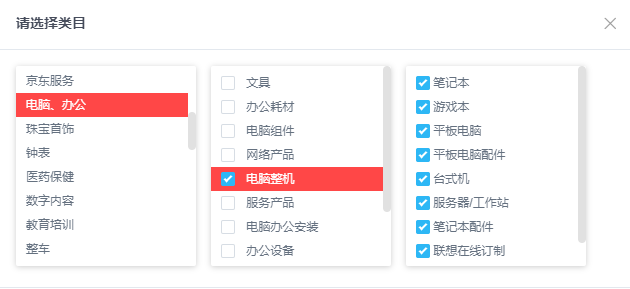

### 3.1. 需求分析

> 页面加载时，分页展示类目数据

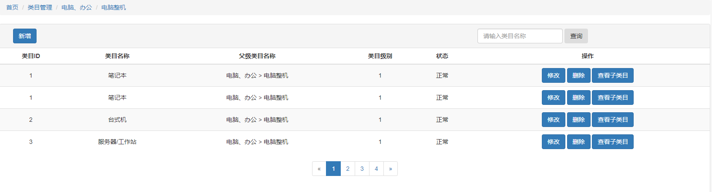


### 3.2. 表结构分析

1. 类目信息表（goods_category）

| 字段名称        | 类型       | 长度 | 含义                                                    |
| --------------- | ---------- | ---- | ------------------------------------------------------- |
| `id`            | `bigint`   |      | 主键ID                                                  |
| `name`          | `varchar`  | 50   | 类目名称                                                |
| `struct_name`   | `varchar`  | 200  | 类目结构（中文）例如：<br/>家用电器 > 生活电器 > 饮水机 |
| `level`         | `int`      | 1    | 类目级别，可选值：1、2、3                               |
| `parent_id`     | `bigint`   |      | 上级类目主键ID，若是顶级则为0                           |
| `sort_no`       | `int`      | 11   | 排序序号                                                |
| `status`        | `char`     | 1    | 状态，1-删除；2-正常                                    |
| `create_person` | `varchar`  | 30   | 创建人                                                  |
| `create_date`   | `datetime` |      | 创建时间                                                |
| `update_person` | `varchar`  | 30   | 修改人                                                  |
| `update_date`   | `datetime` |      | 修改时间                                                |

2. 类目与品牌、规格关系表（goods_category_brand_spec）

| 字段名称        | 类型       | 长度 | 含义          |
| --------------- | ---------- | ---- | ------------- |
| `id`            | `bigint`   |      | 主键ID        |
| `category_id`   | `bigint`   |      | 类目主键ID    |
| `brand_ids`     | `varchar`  | 1000 | 关联的品牌IDs |
| `spec_ids`      | `varchar`  | 1000 | 关联的规格IDs |
| `create_person` | `varchar`  | 30   | 创建人        |
| `create_date`   | `datetime` |      | 创建时间      |

### 3.3. 类目展示列表

#### 3.3.1. 前端代码

##### 3.3.1.1. category.module

```js
angular.module("category",[]);
```

##### 3.3.1.2. category.controller

```js
// 定义specController
angular.module("category").controller("categoryController", function (categoryService, $scope, $controller, brandService, specService, $routeParams) {

    // 继承通用控制器中定义的相关内容
    $controller("baseController", {$scope: $scope});

    // 视图加载完成后,即初始化
    $scope.$on("$viewContentLoaded", function (event) {
        // 查询所有的类目信息
        $scope.query();
    });
    // 状态信息
    $scope.statusArray = ["正常","删除"];
    // 导航菜单初始化
    $scope.breadcrumb = [];
    /**
     * 定义方法
     */
    $scope.query = function(entity){
        // 页面初始化时$scope.name == undefined
        if($scope.name === undefined){
            $scope.name ="";
        }
        if(entity === undefined){
            $scope.parentId = "";
        }else{
            $scope.parentId = entity.id;
            $scope.pageOption.currentPage = 1;
        }
        // 定义参数
        var queryParams = {
            currentPage:$scope.pageOption.currentPage,
            pageSize:$scope.pageOption.pageSize,
            name:$scope.name,
            parentId : $scope.parentId
        };

        // 发送请求
        categoryService.get(queryParams)
            .then (
                function (res) {
                    $scope.categoryList = res.data.result;
                    $scope.pageOption.total = res.data.total
                }
            );

        // 设置导航菜单
        if( entity !== undefined){
            // 点击的导航按钮，应该从导航菜单中移除菜单项
            var index = $scope.breadcrumb.indexOf(entity);
            if(index<0){
                // 添加
                $scope.breadcrumb.push(entity);
            }else{
                // 移除
                $scope.breadcrumb.splice(index+1, $scope.breadcrumb.length - index-1)
            }
        }else {
            $scope.breadcrumb = [];
        }

    };
    
    $scope.delete = function(id){
        categoryService.delete(id)
            .then(
                function (res) {
                    // 刷新数据
                    $scope.query();
                }
            )
    };
});
```

##### 3.3.1.3. category.service

```js
angular.module("category").service("categoryService", function (restService) {
    // 请求路径
    var baseUrl = "/category";

    this.get = function (options) {
        return restService.get(baseUrl, options);
    };

    this.post = function (entity) {
        return restService.post(baseUrl, entity);
    };

    this.put = function (entity) {
        return restService.put(baseUrl, entity);
    };

    this.delete = function (id) {
        return restService.delete(baseUrl, id);
    };

});
```

##### 3.3.1.4. 相关设置

1. 引入JS文件

```html
  <script type="text/javascript" src="js/category/category.module.js"></script>
  <script type="text/javascript" src="js/category/category.controller.js"></script>
  <script type="text/javascript" src="js/category/category.service.js"></script>
```

1. 设置依赖模块

```js
// 系统主模块
angular.module("yanxuan", [
    "ngRoute",
    "pagination",
    "brand",
    "spec",
    "category"
]);
```

1. 启用控制器

```js
	.when("/goods/category", {
            templateUrl: "pages/goods/category.html",
            controller :"categoryController"
```

##### 3.3.1.5. html代码修改

1. 查询条件

```html
<div class="row float-right">
    <form class="d-md-inline-block form-inline">
        <div class="input-group">
            <input type="text" class="form-control" placeholder="类目名称" aria-label="Search" ng-model="name"
                   aria-describedby="basic-addon2">
            <div class="input-group-append">
                <button class="btn btn-primary" type="button" ng-click="query()">
                    <i class="fas fa-search"></i>
                </button>
            </div>
        </div>
    </form>
</div>
```

2. 列表展示&分页

```html
       <!-- 代码省略。。。。 -->
		<tbody>
            <tr ng-repeat="entity in categoryList">
                <td>{{entity.id}}</td>
                <td>{{entity.name}}</td>
                <td>{{entity.structName}}</td>
                <td>{{entity.level}}</td>
                <td>{{statusArray[entity.status]}}</td>
                <td>
                    <button type="button" class="btn btn-primary" data-toggle="modal" data-target="#newModal" >修改
                    </button>
                    <button type="button" class="btn btn-primary" >删除</button>
                    <button type="button" class="btn btn-primary" ng-click="query(entity)">查看子类目</button>
                    <button type="button" class="btn btn-primary" data-toggle="modal" data-target="#newModal" >新增子类目</button>
                </td>
            </tr>

        </tbody>
     </table>
</div>
<pagination></pagination>
```


#### 3.3.2. 后端页面

3.3.2.1. 服务接口

```java
public interface IGoodsCategoryService {

    /**
     * 多条件组合分页查询
     * @param pageNum
     * @param pageSize
     * @param goodsCategory
     * @return
     */
    public PageResult<GoodsCategory> pageQuery(Integer pageNum, Integer pageSize, GoodsCategory goodsCategory);
}
```

3.3.2.2. 服务实现

```java
@Service
@Transactional
public class GoodsCategoryServiceImpl implements IGoodsCategoryService {

    @Autowired
    private GoodsCategoryMapper goodsCategoryMapper;
    
    @Override
    public PageResult<GoodsCategory> query(Integer currentPage, Integer pageSize, GoodsCategory goodsCategory) {
        // 如果没有条件信息，则查询顶级的类目信息
        if(goodsCategory!=null && goodsCategory.getParentId() ==null){
            goodsCategory.setParentId(0L);
        }
        // 构造查询条件
        GoodsCategoryExample goodsCategoryExample = new GoodsCategoryExample();
        // 根据parentId进行查询
        goodsCategoryExample.createCriteria().andParentIdEqualTo(goodsCategory.getParentId());
        // 根据名称进行查询
        if(!"".equals(goodsCategory.getName()) && goodsCategory.getName()!=null){
            goodsCategoryExample.or().andNameLike("%"+goodsCategory.getName()+"%");
        }

        // 开启分页
        PageHelper.startPage(currentPage, pageSize);
        // 执行查询
        Page<GoodsCategory> pageData = (Page<GoodsCategory>) goodsCategoryMapper.selectByExample(goodsCategoryExample);

        // 构造返回结果
        PageResult<GoodsCategory> pageResult = new PageResult<>();
        pageResult.setResult(pageData.getResult());
        pageResult.setTotal(pageData.getTotal());
        return pageResult;
    }
}
```

3.3.2.3. 控制层

```java
@RestController
@RequestMapping("/category")
public class GoodsCategoryController {

    @Autowired
    private IGoodsCategoryService goodsCategoryService;

    @GetMapping
    public ResponseEntity<PageResult<GoodsCategory>> pageQuery(Integer currentPage, Integer pageSize, GoodsCategory goodsCategory){
        // 如果没有分页信息，则查询所有
        if(currentPage==null || pageSize ==null){
            currentPage = 1;
            pageSize = Integer.MAX_VALUE;
        }

        PageResult<GoodsCategory> pageResult = goodsCategoryService.query(currentPage, pageSize, goodsCategory);

        return new ResponseEntity<>(pageResult, HttpStatus.OK);

    }
}
```


### 3.4. 新增类目信息

#### 3.4.1. 前端页面

##### 3.4.1.1. 触发新增

1. 新增顶级类目

```html
<button type="button" class="btn btn-primary" data-toggle="modal" data-target="#newModal" ng-click="initCategory()">新增顶级类目</button>
```

2. 新增子类目

```html
<button type="button" class="btn btn-primary" data-toggle="modal" data-target="#newModal" ng-click="initCategory(entity)">新增子类目</button>
```

3. 初始化逻辑

```js
    $scope.initCategory = function(entity){
        if(entity!== undefined){
            $scope.entity = {
                parentId: entity.id,
                structName : (entity.structName + ">" + entity.name).replace("->",""),
                level: entity.level +1,
                relation : {
                    brandIds: [],
                    specIds:[]
                }
            }
        }else{
            $scope.entity = {
                parentId: 0,
                structName : "-",
                level: 1,
                relation : {
                    brandIds: [],
                    specIds:[]
                }
            }
        }
    };
```

##### 3.4.1.2. 参数绑定及下拉框多选

1. 拷贝课程资料中的js插件 /资料/multiple-select/ 至工程下的 webapp/plugins/ 目录下

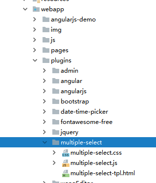

2. index.html引入相关文件

```html
<link href="plugins/multiple-select/multiple-select.css" rel="stylesheet">
<script type="text/javascript" src="plugins/multiple-select/multiple-select.js"></script>
```

3. 在app.module中添加依赖的模块

```js
// 创建系统的主模块
angular.module("yanxuan",
    [
        "ngRoute",
        "pagination",
        "multiple-select",
        "brand",
        "spec",
        "category"
    ]);

```

4. 表单设置

```html
<div class="modal-body">
    <form>
        <div class="form-group row">
            <label class="col-sm-4 col-form-label">父级类目名称:</label>
            <label class="col-sm-8 col-form-label">{{entity.structName}}</label>
        </div>
        <div class="form-group row">
            <label for="categoryName" class="col-sm-4 col-form-label">当前类目名称:</label>
            <div class="col-sm-8">
                <input type="text" class="form-control" id="categoryName" placeholder="请输入类目名称" ng-model="entity.name">
            </div>
        </div>
        <div class="form-group row">
            <label class="col-sm-4 col-form-label">关联品牌:</label>
            <div class="col-sm-8 select2-container">
                <multiple-select ng-model="entity.relation.brandIds" suggestions-arr="brandList" object-property="name" close-after-selected="true"  ></multiple-select>
</select>-->
            </div>
        </div>
        <div class="form-group row">
            <label class="col-sm-4 col-form-label">关联的规格:</label>
            <div class="col-sm-8">
                <multiple-select ng-model="entity.relation.specIds" suggestions-arr="specList" object-property="name" close-after-selected="true"  ></multiple-select>
            </div>
        </div>
    </form>
</div>
<div class="modal-footer">
    <button type="button" class="btn btn-secondary" data-dismiss="modal">取消</button>
    <button type="button" class="btn btn-primary" ng-click="save()">保存</button>
</div>
```

##### 3.4.1.3. 保存请求

```js
    $scope.save = function (){
        var response = null;
        // 删除多选数据中的 $$hashKey
        $scope.entity.relation.brandIds.forEach(function (element) {
            delete element['$$hashKey'];
        });
        $scope.entity.relation.specIds.forEach(function (element) {
            delete element['$$hashKey'];
        });
        $scope.entity.relation.brandIds = JSON.stringify($scope.entity.relation.brandIds);
        $scope.entity.relation.specIds = JSON.stringify($scope.entity.relation.specIds);
       /* $scope.entity.relation.brandIds = JSON.stringify($scope.entity.relation.brandIds);
        $scope.entity.relation.specIds = JSON.stringify($scope.entity.relation.specIds);*/
        // 如果id值未定义，则说明是保存操作；如果id值存在，则说明是修改操作
        if($scope.entity.id === undefined){
            // 新增保存
            response = categoryService.post($scope.entity);
        }else{
            // 修改保存
            response = categoryService.put($scope.entity);
        }
        // 响应结果
        response.then(
            function (res) {
                // 关闭模态窗口
                $("#newModal").modal("hide");
                // 刷新品牌列表
                $scope.query();
            }
        )
    };
```


#### 3.4.2. 后端代码

##### 3.4.2.1. 对象封装

```java

/**
 * 封装前台传递的类目信息
 */
public class Category extends GoodsCategory {

    private GoodsCategoryBrandSpec relation;

    public GoodsCategoryBrandSpec getRelation() {
        return relation;
    }

    public void setRelation(GoodsCategoryBrandSpec relation) {
        this.relation = relation;
    }
}
```


##### 3.4.2.2. 服务接口

```java
    /**
     * 保存商品类目信息及关联品牌、关联规格的信息
     * @param category
     * @return
     */
    public Category save(Category category);
```

##### 3.4.2.3. 服务实现

```java
	@Autowired
    private GoodsCategoryBrandMapper goodsCategoryBrandMapper;
    @Autowired
    private GoodsCategorySpecMapper goodsCategorySpecMapper;
    @Override
    public int save(Category category) {
        // 设置状态为正常使用
        category.setStatus("0");
        // 设置sortNo
        // 根据父ID和级别查询最大的排序号
        GoodsCategoryExample goodsCategoryExample = new GoodsCategoryExample();
        goodsCategoryExample.createCriteria().andParentIdEqualTo(category.getParentId()).andLevelEqualTo(category.getLevel());
        int sortNo = (int)goodsCategoryMapper.countByExample(goodsCategoryExample);
        category.setSortNo(sortNo+1);

        // 保存类目信息
        int insert = goodsCategoryMapper.insertSelective(category);
        // 保存关联的品牌、规格信息
        category.getRelation().setCategoryId(category.getId());
        goodsCategoryBrandSpecMapper.insert(category.getRelation());

        return insert;
    }
```


##### 3.4.2.4. 控制层

```java
    @PostMapping
    public ResponseEntity save(@RequestBody Category category){

        int result = goodsCategoryService.save(category);

        if(result>0){
            return new ResponseEntity( HttpStatus.CREATED);
        }else{
            return new ResponseEntity( HttpStatus.INTERNAL_SERVER_ERROR);
        }
    }
```


### 3.5. 删除类目信息

#### 3.5.1. 前端页面

```html
<button type="button" class="btn btn-primary" ng-click="delete(entity.id)">删除</button>
```


#### 3.5.2. 后端代码

##### 3.5.2.1. 服务接口

```java
    /**
     * 根据主键删除类目信息
     * @param id
     * @return
     */
    public Integer delete(Long id);
```

##### 3.5.2.2. 服务实现

```java
    @Override
    public Integer delete(Long id) {
        GoodsCategory goodsCategory = new GoodsCategory();
        goodsCategory.setId(id);
        goodsCategory.setStatus("1");
        // 逻辑删除类目信息
        int delete = goodsCategoryMapper.updateByPrimaryKeySelective(goodsCategory);

        return delete;
    }
```


##### 3.5.2.3. 控制层

```java
    @DeleteMapping("/{id}")
    public ResponseEntity delete(@PathVariable("id") Long id){
        int result = goodsCategoryService.deleteById(id);
        if(result>0){
            return new ResponseEntity( HttpStatus.NO_CONTENT);
        }else{
            return new ResponseEntity( HttpStatus.INTERNAL_SERVER_ERROR);
        }
    }
```


### 3.6. 更新类目信息

#### 3.6.1. 数据回显

##### 3.6.1.1. 前端页面

1. 修改触发

```html
<button type="button" class="btn btn-primary" data-toggle="modal" data-target="#newModal" ng-click="getCategory(entity.id)">修改</button>
```

2. 查询请求

```js
// 初始化类目
$scope.getCategory = function (id) {
    // 新增初始化
    if(id !== undefined){
        categoryService.get(id)
            .then(
            function (res) {
                $scope.entity = res.data;
                $scope.entity.relation.brandIds = JSON.parse($scope.entity.relation.brandIds);
                $scope.entity.relation.specIds = JSON.parse($scope.entity.relation.specIds);
            }
        )
    }
};
```


##### 3.6.1.2. 后端代码

###### 3.6.1.2.1 服务接口

```java
public Category queryById(Long id);
```

###### 3.6.1.2.2 服务实现

```java
    @Override
    public Category queryById(Long id) {
        // 查询类目信息
        GoodsCategory goodsCategory = goodsCategoryMapper.selectByPrimaryKey(id);
        // 查询关联的品牌信息
        // 构建查询条件
        GoodsCategoryBrandSpecExample goodsCategoryBrandSpecExample = new GoodsCategoryBrandSpecExample();
        goodsCategoryBrandSpecExample.createCriteria().andCategoryIdEqualTo(id);
        List<GoodsCategoryBrandSpec> goodsCategoryBrandSpecList = goodsCategoryBrandSpecMapper.selectByExample(goodsCategoryBrandSpecExample);
        // 设置返回结果
        Category category = new Category();
        BeanUtils.copyProperties(goodsCategory, category);
        if(goodsCategoryBrandSpecList.size()>0){
            category.setRelation(goodsCategoryBrandSpecList.get(0));
        }
        return category;
    }
```

###### 3.6.1.2.3 控制层

```java
    @GetMapping("/{id}")
    public ResponseEntity<Category> queryById(@PathVariable("id") Long id){
        Category category = goodsCategoryService.queryById(id);

        return new ResponseEntity<>(category, HttpStatus.OK);
    }
```

#### 3.6.2. 保存更新

##### 3.6.2.1. 前端页面

> 代码已包含在新增保存的逻辑中


##### 3.6.2.2. 后端代码

###### 3.6.2.2.1 服务接口

```java
    /**
     * 更新类目信息
     * @param category
     * @return
     */
    public Category update(Category category);
```

###### 3.6.2.2.2 服务实现

```java
    @Override
    public int update(Category category) {
        // 修改类目信息
        int update = goodsCategoryMapper.updateByPrimaryKeySelective(category);
        // 修改关联的品牌信息
        goodsCategoryBrandSpecMapper.updateByPrimaryKey(category.getRelation());
        return update;
    }
```


###### 3.6.2.2.3 控制层

```java
    @PutMapping
    public ResponseEntity update(@RequestBody Category category){
        int result = goodsCategoryService.update(category);

        if(result>0){
            return new ResponseEntity( HttpStatus.OK);
        }else{
            return new ResponseEntity( HttpStatus.INTERNAL_SERVER_ERROR);
        }
    }
```


