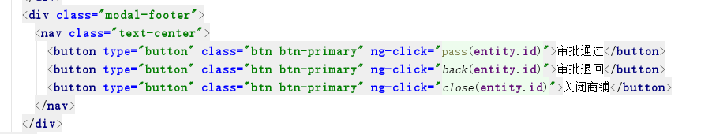

# 极光严选-第四章-SpringSecurity&运营商登录

## 课程内容

- Spring Security安全框架
  - 入门案例
  - xml配置详解
  - 个性化权限控制
- 系统功能实现
  - 运营商登录
  - 商家入驻
  - 商家审核
  - 商家系统登录


## 学习目标

- [ ] 理解和应用Spring Security的权限控制方式
- [ ] 编码完成运营商系统中的登录/注销功能
- [ ] 编码完成商家入驻的系统功能
- [ ] 编码完成运营商审核商家入驻信息的功能
- [ ] 编码完成商家系统中的登录/注销功能
- [ ] 编码完成商家首页显示商家名称功能


## 一、Spring-Security

### 1.1. 概述

#### 1.1.1. 简介


​	Spring security 是一个强大的和高度可定制的身份验证和访问控制框架。它是确保基于Spring的应用程序的标准。Spring Security 提供了基于javaEE的企业应用软件全面的安全服务。特别是支持使用Spring框架构件的项目，Spring框架是企业软件开发javaEE方案的领导者。

​	人们使用Spring Secruity的原因有很多，但大部分都发现了javaEE的Servlet规范或EJB规范中的安全功能缺乏典型企业应用场景所需的深度。提到这些规范，重要的是要认识到他们在WAR或EAR级别无法移植。因此如果你更换服务器环境，这里有典型的大量工作去重新配置你的应用程序员安全到新的目标环境。使用Spring Security 解决了这些问题，也为你提供许多其他有用的，可定制的安全功能。

​	正如你可能知道的两个应用程序的两个主要区域是“**认证**”和“**授权**”（或者访问控制）。这两个主要区域是Spring Security 的两个目标。“认证”，是建立一个他声明的主体的过程（一个“主体”一般是指用户，设备或一些可以在你的应用程序中执行动作的其他系统）。“授权”指确定一个主体是否允许在你的应用程序执行一个动作的过程。为了抵达需要授权的资源，主体的身份已经有认证过程建立。这个概念是通用的而不只在Spring Security中。

​	Spring Security在认证方面提供了多种选择，要么使用第三方的认证，要么使用Security内部的认证；在授权方面Spring Security提供了一整套授权的功能，可以完成对web应用资源的权限控制。

#### 1.1.2. 使用方式

1. 安全命名空间（XML）配置（本课程中主讲的方式）
2. Java配置

### 1.2. 开发环境准备

#### 1.2.1. pom.xml

​	参考课程资料中 `pom.xml`

```xml
<?xml version="1.0" encoding="UTF-8"?>
<project xmlns="http://maven.apache.org/POM/4.0.0"
         xmlns:xsi="http://www.w3.org/2001/XMLSchema-instance"
         xsi:schemaLocation="http://maven.apache.org/POM/4.0.0 http://maven.apache.org/xsd/maven-4.0.0.xsd">
    <modelVersion>4.0.0</modelVersion>

    <groupId>com.itjiguang</groupId>
    <artifactId>security_example</artifactId>
    <version>1.0-SNAPSHOT</version>
    <packaging>war</packaging>

    <dependencyManagement>
        <dependencies>
            <!--Spring 核心依赖管理-->
            <dependency>
                <groupId>org.springframework</groupId>
                <artifactId>spring-framework-bom</artifactId>
                <version>5.1.6.RELEASE</version>
                <type>pom</type>
                <scope>import</scope>
            </dependency>
            <!--Spring Security的依赖管理-->
            <dependency>
                <groupId>org.springframework.security</groupId>
                <artifactId>spring-security-bom</artifactId>
                <version>5.1.6.RELEASE</version>
                <type>pom</type>
                <scope>import</scope>
            </dependency>
        </dependencies>
    </dependencyManagement>

    <!--系统依赖-->
    <dependencies>
        <!--Spring 核心依赖-->
        <dependency>
            <groupId>org.springframework</groupId>
            <artifactId>spring-context</artifactId>
        </dependency>
        <!--Spring Security的依赖-->
        <dependency>
            <groupId>org.springframework.security</groupId>
            <artifactId>spring-security-web</artifactId>
        </dependency>
        <dependency>
            <groupId>org.springframework.security</groupId>
            <artifactId>spring-security-config</artifactId>
        </dependency>
        <!--servlet依赖-->
        <dependency>
            <groupId>javax.servlet</groupId>
            <artifactId>javax.servlet-api</artifactId>
            <version>3.1.0</version>
        </dependency>
    </dependencies>

    <build>
        <plugins>
            <!--Tomcat运行插件-->
            <plugin>
                <groupId>org.apache.tomcat.maven</groupId>
                <artifactId>tomcat7-maven-plugin</artifactId>
                <version>2.2</version>
                <configuration>
                    <!-- 指定端口 -->
                    <port>8081</port>
                    <!-- 请求路径 -->
                    <path>/</path>
                </configuration>
            </plugin>
        </plugins>
    </build>
</project>
```

#### 1.2.2. web.xml

​	参考课程资料中 `web.xml`

```xml
<?xml version="1.0" encoding="UTF-8"?>
<web-app xmlns:xsi="http://www.w3.org/2001/XMLSchema-instance"
	xmlns="http://java.sun.com/xml/ns/javaee"
	xsi:schemaLocation="http://java.sun.com/xml/ns/javaee http://java.sun.com/xml/ns/javaee/web-app_2_5.xsd"
	version="2.5">

    <!-- Spring配置文件路径 -->
    <context-param>
        <param-name>contextConfigLocation</param-name>
        <param-value>classpath:spring-security.xml</param-value>
    </context-param>

    <!-- ServletContext监听器 -->
    <listener>
        <listener-class>org.springframework.web.context.ContextLoaderListener</listener-class>
    </listener>

    <welcome-file-list>
        <welcome-file>index.jsp</welcome-file>
    </welcome-file-list>

</web-app>
```

#### 1.2.3. Spring的配置文件

```xml
<?xml version="1.0" encoding="UTF-8"?>
<beans xmlns="http://www.springframework.org/schema/beans"
       xmlns:xsi="http://www.w3.org/2001/XMLSchema-instance"
       xsi:schemaLocation="http://www.springframework.org/schema/beans http://www.springframework.org/schema/beans/spring-beans.xsd">

    // 待完成spring security的配置文件

</beans>
```

#### 1.2.4. 首页文件

```jsp
<%@ page contentType="text/html;charset=UTF-8" language="java" %>
<html>
<head>
    <title>首页</title>
</head>
<body>
	<h2>welcome, 这是Spring security example的首页</h2>
</body>
</html>
```


### 1.3. 入门案例

#### 1.3.1. 安全配置

```xml
<!--web安全，网页访问权限控制-->
<security:http >
    <!--所有的资源路径都需要有-->
    <security:intercept-url pattern="/**" access="hasRole('ROLE_USER')"/>
    <!--开启认证登陆表单-->
    <security:form-login />
    <!--开启注销功能, 注销的访问地址是 /logout-->
    <security:logout />
</security:http>
```

#### 1.3.2. 认证管理器

```xml
<!--认证管理器-->
<security:authentication-manager>
    <!--认证供应商-->
    <security:authentication-provider >
        <security:user-service>
            <!-- 认证用户 -->
            <security:user name="jiguang" password="{noop}jiguangpwd" authorities="ROLE_USER" />
            <security:user name="root" password="{noop}rootpwd" authorities="ROLE_ADMIN" />
        </security:user-service>
    </security:authentication-provider>
</security:authentication-manager>
```

#### 1.3.3. 安全认证过滤器

```xml
    <!-- Spring Security过滤器，放在所有过滤器之前 -->
    <filter>
        <filter-name>springSecurityFilterChain</filter-name>
        <filter-class>org.springframework.web.filter.DelegatingFilterProxy</filter-class>
    </filter>
    <filter-mapping>
        <filter-name>springSecurityFilterChain</filter-name>
        <url-pattern>/*</url-pattern>
    </filter-mapping>
```


#### 1.3.3. 系统测试

1. 访问系统资源 http://localhost:8801/index.jsp


2. 使用root/rootpwd或者jiguang/jiguangpwd进行登录认证


### 1.4. 安全命名空间配置详解

#### 1.4.1. 命名空间的设计

- *Web/HTTP Security*  最复杂的部分，设置过滤器和应用框架验证机制的相关服务bean，渲染登录和错误页面等等。
- *Business Object (Method) Security*  业务层安全选项
- *AuthenticationManager*  处理来自框架其他部分的认证请求。
- *AccessDecisionManager*  为网页和方法安全提供访问决策，会注册一个默认的但是你可以使用一个定制的来取代他，使用一般的Spring bean语法即可定义。
- *AuthenticationProvider*- 认证管理器认证用户的机制，命名空间提供多种标准选项的支持，同时使用传统语法添加自定义bean的方法。
- *UserDetailsService* - 和AuthenticationProviders密切相关，但往往也被其他bean需要。

#### 1.4.2. 网页安全配置

##### 1.4.2.1. Http详解

```xml
<!--
    pattern 资源路径
    use-expressions 是否使用表达式，影响的是intercept-url中的access属性
        默认是true， access中使用类似于 hashRole('ROLE_USER')的表达式
        如果设置为false，access中直接使用 类似于 ROLE_USER的字符串，如果多个使用英文"," 隔开，例如：ROLE_USER, ROLE_ADMIN
    security : 可设置为none，表示对pattern中设置的资源路径不启用SpringSecurity的权限控制
    -->
<security:http pattern="/index.jsp" use-expressions="false" security="none" />
```

##### 1.4.2.2. intercept-url详解

```xml
<!--
    pattern： 资源路径
    access：访问pattern中的资源路径，需要的权限验证
    filters: 只能设置为none，这将导致SpringSecurity不起作用
    method：设置访问资源路径的http请求方式，如果不设置，所有请求方式都可以执行
    requires-channel: 设置请求的http频道，可以是http/ https/ any
-->
<security:intercept-url pattern="/**" access="hasRole('ROLE_USER')"/>
```

备注：intercept-url可以配置多个， 当匹配指定的模式对传入的请求时，匹配是在声明的元素的顺序中完成的。所以最具体的匹配模式应该是第一个，最普遍的应该是最后一个。例如： `/**`只能是最后一个

##### 1.4.2.3. form-login详解

```xml
<!--
	login-page ： 自定义的登录页面的资源访问路径
	default-target-url：默认的登录成功跳转的路径
	always-use-default-target：是否一致采用默认的跳转路径；可选值：true，false
	username-parameter：登录表单中的用户名参数名， 默认值：username
	password-parameter：登录表单中的密码参数名，默认值：password
	authentication-success-forward-url：认证成功后转发的资源路径
	authentication-failure-forward-url：认证失败后转发的资源路径
	login-processing-url：认证处理的资源路径
-->
<security:form-login login-page="/login.jsp" default-target-url="/index.jsp" 
                     always-use-default-target="true"
                     password-parameter="password" username-parameter="username" 
                     authentication-success-forward-url="/index.jsp"
                     login-processing-url="/yanxuan/login" 
                     authentication-failure-forward-url="/login.jsp" />
```

##### 1.4.2.4. logout详解

```xml
<!--
	logout-url: 系统退出处理的资源路径
	logout-success-url：处理成功的资源路径
	delete-cookies：删除的cookie的名称，多个时使用英文 ","隔开
	invalidate-session：是否清空session
-->
<security:logout logout-url="/yanxuan/logout" logout-success-url="/login.jsp" 
                 delete-cookies="JSESSIONID" invalidate-session="true"/>
```

#### 1.4.3. 认证服务

认证服务中包含 `authentication-manager` 、`authentication-provider` 

```xml
<!--设置密码解析器-->
<bean id="bCryptPasswordEncoder" class="org.springframework.security.crypto.bcrypt.BCryptPasswordEncoder" />
<!--
    id: 为内部实例定义一个用于在自己的配置中使用的标识
    alias:为你自己的配置中使用的内部实例定义别名. 可以用来被引用
-->
<security:authentication-manager>
    <!--认证供应商-->
    <!--
        ref： 引用一个Spring bean实现AuthenticationProvider.
        user-service-ref：引用bean实现UserDetailsService可以创建使用标准的bean元素或自定义 user-service 元素.
        子元素：jdbc-user-service ： 使用spring security提供的JdbcUserDetailsManager; 通过jdbc查询得到用户授权信息
    -->
    <security:authentication-provider>
        <!--
            设置密码解析器
            ref：定义引用一个Spring bean 实现PasswordEncoder接口.Spring推荐使用的是 org.springframework.security.crypto.bcrypt.BCryptPasswordEncoder

        -->
        <security:password-encoder ref="bCryptPasswordEncoder" />
        <!--
            从属性文件或列表中的"user"子元素创建一个UserDetailsService内存. 内部转换为小写,允许用户名不区分大小写的查询,所以这个不应使用是否需要区分大小写.
            id: bean标识符,用于指bean在上下文的任何地方.
            properties :属性文件的位置，每一行的格式为
                username=password,grantedAuthority[,grantedAuthority][,enabled|disabled]
        -->
        <security:user-service>
            <!--
                设置系统应用中的用户信息
                name： 用户名
                password：密码，{noop} 表示明文密码
                authorities： 表示用户的角色信息
                disabled： 表示账户是否禁用，true禁用，无法使用；false启用
                locked ：表示账户是否被锁定，true锁定，无法使用
            -->
            <security:user name="jiguang" password="{noop}jiguangpwd" authorities="ROLE_USER" />
            <security:user name="root" password="{noop}rootpwd" authorities="ROLE_ADMIN" />
        </security:user-service>
    </security:authentication-provider>
</security:authentication-manager>
```

### 1.5. 个性化权限控制

#### 1.5.1. 自定义登录表单

##### 1.5.1.1. login.jsp

```jsp
<%@ page contentType="text/html;charset=UTF-8" language="java" %>
<html>
<head>
    <title>login</title>
</head>
<body>
    <form action="/login" method="post">
        <!-- 暂时name的属性值设置为 username/password -->
        <input type="text" name="username" /><br/>
        <input type="password" name="password" /><br/>
        <input type="submit" value="submit" />
    </form>
</body>
</html>

```

##### 1.5.1.2. 安全配置

```xml
<!-- security的值设置为none，表示不拦截指定的访问路径 -->
<security:http pattern="/login.jsp" security="none"/>
<security:http use-expressions="false" >
    <security:intercept-url pattern="/**" access="ROLE_USER"/>

    <security:form-login login-page="/login.jsp" authentication-failure-url="/login.jsp"/>
</security:http>
```

##### 1.5.1.3. 登录认证测试


原因说明：SpringSecurity为了防止web应用被攻击，默认开启了CSRF（Cross-site request forgery）跨站请求伪造

解决办法：关闭Spring Security对CSRF的支持，在配置文件中加入如下配置

```xml
<!-- 关闭csrf的支持 -->
<security:csrf disabled="true" />
```

#### 1.5.2. 自定义登录认证Filter

##### 1.5.2.1. 准备

1. login.html使用angularjs发送请求数据（拷贝angularjs的js文件

```html
<script type="text/javascript">
    angular.module("demo",[]).controller("demoController",function ($scope, $http) {

        $scope.login = function(){
            $http.post("/login", $scope.entity).then(
                function (value) {
                    console.log(value)
                    location.href = "/index.html"
                }
            )
        }

    })
</script>
```

2. pom中添加依赖信息

```xml
<dependency>
    <groupId>com.fasterxml.jackson.core</groupId>
    <artifactId>jackson-core</artifactId>
    <version>2.9.8</version>
</dependency>
<dependency>
    <groupId>com.fasterxml.jackson.core</groupId>
    <artifactId>jackson-databind</artifactId>
    <version>2.9.8</version>
</dependency>
```


##### 1.5.2.2. 登录认证Filter

```java
public class YanXuanAuthencationFilter extends AbstractAuthenticationProcessingFilter {

    public static final String JSON_USERNAME_KEY = "username";
    public static final String JSON_FORM_PASSWORD_KEY = "password";

    private String usernameParameter = JSON_USERNAME_KEY;
    private String passwordParameter = JSON_FORM_PASSWORD_KEY;
    private boolean postOnly = true;

    public YanXuanAuthencationFilter() {
        super(new AntPathRequestMatcher("/yanxuan/login", "POST"));
    }

    public Authentication attemptAuthentication(HttpServletRequest request, HttpServletResponse response)
            throws AuthenticationException, IOException, ServletException {

        // 判断请求方式必须是POST
        if (postOnly && !request.getMethod().equals("POST")) {
            throw new AuthenticationServiceException(
                    "Authentication method not supported: " + request.getMethod());
        }
        // 获取请求的输入流信息
        ServletInputStream inputStream = request.getInputStream();
        // 使用Jackson进行解析输入流
        ObjectMapper objectMapper = new ObjectMapper();
        JsonNode jsonNode = objectMapper.readTree(inputStream);
        // 获取用户名
        String username = jsonNode.path(usernameParameter).asText();
        // 获取密码
        String password = jsonNode.path(passwordParameter).asText();

        // 创建toKen对象
        UsernamePasswordAuthenticationToken authRequest = new UsernamePasswordAuthenticationToken( username, password);

        // 把认证信息与会话建立联系
        setDetails(request, authRequest);

        // 调用认证管理器进行认证
        return this.getAuthenticationManager().authenticate(authRequest);
    }

    protected void setDetails(HttpServletRequest request, UsernamePasswordAuthenticationToken authRequest) {
        authRequest.setDetails(authenticationDetailsSource.buildDetails(request));
    }

    public void setUsernameParameter(String usernameParameter) {
        Assert.hasText(usernameParameter, "Username parameter must not be empty or null");
        this.usernameParameter = usernameParameter;
    }

    public void setPasswordParameter(String passwordParameter) {
        Assert.hasText(passwordParameter, "Password parameter must not be empty or null");
        this.passwordParameter = passwordParameter;
    }

    public void setPostOnly(boolean postOnly) {
        this.postOnly = postOnly;
    }

    public final String getUsernameParameter() {
        return usernameParameter;
    }

    public final String getPasswordParameter() {
        return passwordParameter;
    }
}
```

##### 1.5.2.3. 配置并启用Filter

```xml
<!-- 让容器管理认证filter -->
<bean id="yanXuanAuthencationFilter" 
      class="com.itjiguang.security.web.filter.YanXuanAuthencationFilter">
    <!-- 注入认证管理器 -->
    <property name="authenticationManager" ref="authenticationManager" />
</bean>
<!-- 启用认证filter -->
<!--web安全，网页访问权限控制-->
<security:http>
    <security:custom-filter ref="yanXuanAuthencationFilter" before="FORM_LOGIN_FILTER"/>
	<!-- 其他配置。。。。 -->
</security:http>
```

#### 1.5.3. 自定义供应商

实现接口 `org.springframework.security.core.userdetails.UserDetailsService`

1. 定义供应商 userDetailsService

```java
public class UserDetailsServiceImpl implements UserDetailsService {

    private Properties properties =  new Properties();

    public UserDetailsServiceImpl() {
        properties.setProperty("jiguang", "{noop}jiguangpwd,ROLE_USER");
        properties.setProperty("root", "{noop}rootpwd,ROLE_ADMIN");
        properties.setProperty("yanxuan", "{noop}yanxuanpwd,ROLE_USER");
    }

    public UserDetails loadUserByUsername(String username) throws UsernameNotFoundException {
        // 根据名称进行查询密码
        String property = properties.getProperty(username, null);
        if(property ==null){
            return null;
        }
        // 创建toKen对象
        String[] split = property.split(",");
        String pwd = split[0];
        // 创建角色列表
        List<GrantedAuthority> list = new ArrayList<GrantedAuthority>();
        for(int i = 1; i< split.length; i++){
            list.add(new SimpleGrantedAuthority(split[i]));
        }
        return new User(username, pwd, list);
    }
}
```

2. 启用供应商

```xml

<security:authentication-manager alias="authenticationManager">
    <security:authentication-provider user-service-ref="userDetailsServiceImpl"/>
</security:authentication-manager>

<!--自定义的验证供应商-->
<bean id="userDetailsServiceImpl" class="com.itjiguang.security.service.UserDetailsServiceImpl" />
```


#### 1.5.4. 密码解码器

Spring提供的密码编码器都是实现 `org.springframework.security.crypto.password.PasswordEncoder.


其中官方推荐的是 `org.springframework.security.crypto.bcrypt.BCryptPasswordEncoder`，配置方式

```xml
<!-- 声明密码编码器 -->
<beans:bean name="bcryptEncoder"
	class="org.springframework.security.crypto.bcrypt.BCryptPasswordEncoder"/>

<authentication-manager>
    <authentication-provider>
        <!-- 启用密码加密器 -->
        <password-encoder ref="bcryptEncoder"/>
        <user-service>
            <user name="jimi" password="d7e6351eaa13189a5a3641bab846c8e8c69ba39f"
                  authorities="ROLE_USER, ROLE_ADMIN" />
            <user name="bob" password="4e7421b1b8765d8f9406d87e7cc6aa784c4ab97f"
                  authorities="ROLE_USER" />
            </user-service>
    </authentication-provider>
</authentication-manager>
```

加密示例

```java
// 生成加密密码
BCryptPasswordEncoder bCryptPasswordEncoder = new BCryptPasswordEncoder();
String bcPwd = bCryptPasswordEncoder.encode("yanxuanpwd");
System.out.println(bcPwd);
```


## 二、 运营商登录/注销

### 2.1. 需求分析

运营商的工作人员可以使用公司分配的账户/密码登录到系统，进行工作。


### 2.2. 功能实现

#### 2.2.1. 完善配置信息

1. `pom.xml`


2. web.xml

```xml
<filter>
    <filter-name>springSecurityFilterChain</filter-name>
    <filter-class>org.springframework.web.filter.DelegatingFilterProxy</filter-class>
</filter>    
<filter-mapping>
    <filter-name>springSecurityFilterChain</filter-name>
    <url-pattern>/*</url-pattern>
</filter-mapping>
```


3. spring-security.xml

```xml
<?xml version="1.0" encoding="UTF-8"?>
<beans:beans xmlns:beans="http://www.springframework.org/schema/beans"
             xmlns:xsi="http://www.w3.org/2001/XMLSchema-instance"
             xmlns="http://www.springframework.org/schema/security"
             xsi:schemaLocation="http://www.springframework.org/schema/beans http://www.springframework.org/schema/beans/spring-beans.xsd http://www.springframework.org/schema/security http://www.springframework.org/schema/security/spring-security.xsd">

    <!--设置不进行权限检查的访问路径-->
    <http security="none" pattern="/img/**" />
    <http security="none" pattern="/js/**" />
    <http security="none" pattern="/plugins/**" />
    <http security="none" pattern="/pages/**" />
    <http security="none" pattern="/login.html**" />

    <!--设置权限检查-->
    <http use-expressions="false">
        <!--所有请求都进行需要具有ROLE_ADMIN权限-->
        <intercept-url pattern="/**" access="ROLE_ADMIN" />
        <!--开启登录表单-->
        <form-login login-page="/login.html" default-target-url="/index.html" always-use-default-target="true" authentication-failure-url="/login.html" />
        <!--开启注销-->
        <logout logout-success-url="/login.html"/>
        <!--关闭csrf-->
        <csrf disabled="true" />
    </http>

    <!--认证管理器-->
    <authentication-manager>
        <authentication-provider>
            <user-service>
                <user name="root" password="{noop}root" authorities="ROLE_ADMIN"/>
            </user-service>
        </authentication-provider>
    </authentication-manager>
</beans:beans>
```


#### 2.2.2. 登录页面

```html
<form action="/login" method="post">
    <div class="form-group">
        <div class="form-label-group">
            <input type="text" id="username" class="form-control" placeholder="username"
                   name="username" required="required">
            <label for="username">用户名</label>
        </div>
    </div>
    <div class="form-group">
        <div class="form-label-group">
            <input type="password" id="password" class="form-control" placeholder="password" 
                   name="password" required="required">
            <label for="password">密码</label>
        </div>
    </div>
    <div class="form-group">
        <div class="checkbox">
            <label>
                <input type="checkbox" value="remember-me">
                记住我
            </label>
        </div>
    </div>
    <button class="btn btn-primary btn-block" type="submit">登录</button>
</form>
```


### 2.3. 系统首页显示登录人

#### 2.3.1. 后台代码

```java
@RestController
@RequestMapping("/loginAccount")
public class LoginAccount {
    
    @GetMapping
    public ResponseEntity<Map> getLoginedAccount(){
        // 从Security中获取当前登录的用户名
        String username = SecurityContextHolder.getContext().getAuthentication().getName();
        Map result = new HashMap<String,String>();
        result.put("username", username);
        // 返回用户名称
        return new ResponseEntity(result, HttpStatus.OK);
    }
}
```


#### 2.3.2. 前端页面

##### 2.3.2.1. angularjs相关


1. module

```js
// 创建模块
angular.module("loginAccount", []);
```

2. service

```js
angular.module("loginAccount").service("laService", function (restService) {

    // 定义请求的资源路径
    var baseUrl = "../../loginAccount";
    // get请求
    this.get = function(options){
        return restService.get(baseUrl, options);
    };

    // post请求
    this.post = function (entity) {
        return restService.post(baseUrl, entity);
    };

    // put请求
    this.put = function (entity) {
        return restService.put(baseUrl, entity);
    };

    // Delete请求
    this.delete = function (id) {
        return restService.delete(baseUrl, id);
    }
});
```

3. controller

```js
angular.module("yanxuan").controller("loginUserController" , function ($scope, loginUserService) {
    loginUserService.get().then(
        function (value) {
            console.log(value)
        }
    )
});
```


##### 2.3.2.2. index.html文件

```js
<script type="text/javascript" src="./js/common/loginAccount/loginAccount.module.js"></script>
<script type="text/javascript" src="./js/common/loginAccount/loginAccount.service.js"></script>
```

##### 2.3.2.3. html页面（完善form表单）

```html
<li class="nav-item dropdown no-arrow">
  <a class="nav-link dropdown-toggle" href="#" id="userDropdown" role="button" data-toggle="dropdown" aria-haspopup="true" aria-expanded="false">
    <i class="fas fa-user-circle fa-fw"></i>
    <span>{{username}}</span>
  </a>
  <div class="dropdown-menu dropdown-menu-right" aria-labelledby="userDropdown">
    <a class="dropdown-item" href="#">Settings</a>
    <a class="dropdown-item" href="#">Activity Log</a>
    <div class="dropdown-divider"></div>
    <a class="dropdown-item" href="#" data-toggle="modal" data-target="#logoutModal">Logout</a>
  </div>
</li>
```


### 2.4. 注销登录 

#### 2.4.1. spring-security配置

```xml
<!--开启注销-->
<logout logout-success-url="/login.html"/>
```


#### 2.4.2. 前端调用服务

```html
<div class="modal-body">确认退出系统</div>
<div class="modal-footer">
    <button class="btn btn-secondary" type="button" data-dismiss="modal">取消</button>
    <a class="btn btn-primary" href="/logout">退出</a>
</div>
```


## 三、商家入驻

### 3.1. 需求分析

> 商家在入驻时应该首先注册成为商城的用户，然后再发起入驻的申请，本次教学对此作了简化，用户可以直接发起入驻申请，在入住申请的同时，生成商城的账户信息
>
> 入驻流程：
>
>  	1. 填写联系人信息
>  	2. 填写公司资质
>  	3. 填写公司开户信息
>  	4. 店铺信息
>  	5. 提交申请


### 3.2. 表结构分析

账户信息（account）

| 字段名称     | 类型    | 长度 | 含义     |
| ------------ | ------- | ---- | -------- |
| `id`         | bigint  |      | 主键ID   |
| `login_name` | varchar | 40   | 登录名称 |
| `password`   | varchar | 80   | 密码     |
| `phone`      | varchar | 20   | 手机号   |
| `email`      | varchar | 50   | 电子邮箱 |
| `nick_name`  | varchar | 50   | 昵称     |
| `real_name`  | varchar | 100  | 真实姓名 |


商家信息（seller_shop）

| 字段名称          | 类型       | 长度 | 含义                                                         |
| ----------------- | :--------- | :--- | :----------------------------------------------------------- |
| `id`              | `bigint`   |      | 主键ID                                                       |
| `account_id`      | `bigint`   |      | 关联账户主键ID                                               |
| `name`            | `varchar`  | 100  | 商铺名称                                                     |
| `linkman_name`    | `varchar`  | 50   | 联系人姓名                                                   |
| `linkman_phone`   | `varchar`  | 20   | 联系人手机号                                                 |
| `linkman_email`   | `varchar`  | 40   | 联系人电子邮箱                                               |
| `linkman_qq`      | `varchar`  | 18   | 联系人QQ                                                     |
| `company_name`    | `varchar`  | 80   | 企业名称                                                     |
| `company_license` | `varchar`  | 20   | 企业营业执照                                                 |
| `company_orgcode` | `varchar`  | 20   | 企业组织机构代码                                             |
| `company_create`  | `varchar`  | 20   | 企业创建日期                                                 |
| `company_area`    | `varchar`  | 30   | 企业所在行政区域                                             |
| `company_address` | `varchar`  | 80   | 企业详细地址                                                 |
| `company_tel`     | `varchar`  | 20   | 企业联系电话                                                 |
| `company_major`   | `varchar`  | 300  | 企业主营业务                                                 |
| `legal_name`      | `varchar`  | 50   | 法人代表姓名                                                 |
| `legal_card_id`   | `varchar`  | 30   | 法人代表身份证号码                                           |
| `bank_account`    | `varchar`  | 30   | 对公结算银行账号                                             |
| `bank_name`       | `varchar`  | 30   | 开户银行名称                                                 |
| `bank_branch`     | `varchar`  | 50   | 开户支行名称                                                 |
| `category_ids`    | `varchar`  | 100  | 商铺经营类目                                                 |
| `brand_ids`       | `varchar`  | 100  | 商铺销售品牌                                                 |
| `status`          | char       | 1    | 状态：0-待审核；<br />1-审核通过；<br />2-审核退回；<br />3-已关闭 |
| `create_date`     | datetime   |      | 提交申请的时间                                               |
| `update_date`     | `datetime` |      | 信息修改时间                                                 |

### 3.3. 准备工作

1. 创建 `jiguangyanxuan_seller_server`工程

2. 复制极光商城门户静态原型中 merchant.html 、 css、js、images文件至 `jiguangyanxuan-seller-server`工程中


3. 前端js模块准备

   参照 `jiguangyanxuan_manager_server`工程

4. 后端环境

   参照 `jiguangyanxuan_manager_server`工程

### 3.4. 前端代码

#### 3.4.1. angularjs相关

1. module

```js
// 创建模块
angular.module("seller", []);
```

2. controller

```js
// 定义Controller
angular.module("seller").controller("sellerController", function ( $scope,$http) {

     // 保存商铺信息
    $scope.save = function () {
        sellerService.post($scope.entity).then(
            function (res) {
                alert("已提交审核，审核通过后会有客户经理与您联系");
            },
            function (reason) {
                console.log(reason)
            }
        )
    }
});
```

#### 3.4.3. merchant.html

1. 引入js文件

```html
<script type="text/javascript" src="js/common/seller/seller.module.js"></script>
<script type="text/javascript" src="js/common/seller/seller.controller.js"></script>
```

2. 设置angular应用

```html
<body ng-app="seller" ng-controller="sellerController">
```

3. 绑定参数


### 3.5. 后台代码

#### 3.5.1. 实体类

```java
public class SellerDetail extends SellerShop {

    private String loginName;
    private String password;

    public String getLoginName() {
        return loginName;
    }

    public void setLoginName(String loginName) {
        this.loginName = loginName;
    }

    public String getPassword() {
        return password;
    }

    public void setPassword(String password) {
        this.password = password;
    }
}
```


#### 3.5.2. 服务接口

> 在 `jiguangyanxuan-manager-api`中创建接口 `ISellerShopService`

```java
    /**
     * 保存商家信息
     * @param sellerDetail
     * @return
     */
    public Long save(SellerDetail sellerDetail);
```


#### 3.5.3. 服务实现

> 在 `jiguangyanxuan-manager-service`中创建服务实现 `SellerShopServiceImpl`

```java
    @Autowired
    private SellerShopMapper sellerShopMapper;
    @Autowired
    private AccountMapper accountMapper;

    @Override
    public Long save(SellerDetail sellerDetail) {
        // 生成账户信息
        Account account = new Account();
        account.setLoginName(sellerDetail.getLoginName());
         // 密码加密
        BCryptPasswordEncoder bCryptPasswordEncoder = new BCryptPasswordEncoder();
        String bcPwd = bCryptPasswordEncoder.encode(sellerDetail.getPassword());
        account.setPassword(bcPwd);
        account.setEmail(sellerDetail.getLinkmanEmail());
        account.setPhone(sellerDetail.getLinkmanPhone());
        account.setCreateDate(new Date());
        accountMapper.insertSelective(account);

        // 关联商家和账户信息
        sellerDetail.setAccountId(account.getId());
        SellerShop sellerShop = new SellerShop();
        BeanUtils.copyProperties(sellerDetail, sellerShop);
        // 保存商家信息
        sellerShopMapper.insertSelective(sellerShop);
        return sellerShop.getId();
    }
```


#### 3.5.4. 控制层

> 在 `jiguagnyanxuan-seller-server`中创建 `SellerShopController`

```java
@RestController
@RequestMapping("/seller")
public class SellerShopController {

    @Reference
    private ISellerShopService sellerShopService;

    @PostMapping
    public ResponseEntity<SellerShop> save(@RequestBody SellerDetail sellerDetail){
        Long id = sellerShopService.save(sellerDetail);
        sellerDetail.setId(id);

        return new ResponseEntity<>(sellerDetail,HttpStatus.OK);
    }
```


## 四、商家审核

运营商对入住的商家需要进行审核，主要审核的是数据的真实以及资料的齐全性、相关资质是否和要求。

### 4.1. 需求分析

> 1. 列表展示：展示所有待审核的商家信息
> 2. 商家详情：显示商家入驻的信息
> 3. 商家审核：审批通过、审批退回、关闭商家


### 4.2. 商家待审核列表

#### 4.2.1. 前端代码

##### 4.2.1.1. AngularJS相关

1. module

```js
// 创建模块
angular.module("seller", []);
```

2. controller

```js
// 定义brandController
angular.module("seller").controller("sellerController", function ( $scope, sellerService, $controller) {

    // 监听视图内容是否加载完毕，加载完毕后触发回调函数
    $scope.$on("$viewContentLoaded", function (event) {
        $scope.pageQuery();
    });

    // 继承其他的controller， baseController
    $controller("baseController", {$scope : $scope});

    // 发送分页的请求
    $scope.pageQuery = function(){
        // 页面初始化时$scope.name == undefined
        if($scope.name === undefined){
            $scope.name ="";
        }
        // 定义查询参数
        var queryParams = {
                currentPage: $scope.pageOption.currentPage,
                pageSize: $scope.pageOption.pageSize,
                name : $scope.name
            };
        // 查询
        sellerService.get(queryParams).then(
            function (res) {
                // 总记录数
                $scope.pageOption.total = value.data.total;
                // 当前页显示的数据
                $scope.sellerList = value.data.result;
            }
        );
    };

});
```

3. service

```js
angular.module("seller").service("sellerService", function (restService) {

    // 定义请求的资源路径
    var baseUrl = "../../seller";
    // get请求
    this.get = function(options){
        return restService.get(baseUrl, options);
    };

    // post请求
    this.post = function (entity) {
        return restService.post(baseUrl, entity);
    };

    // put请求
    this.put = function (entity) {
        return restService.put(baseUrl, entity);
    };

    // Delete请求
    this.delete = function (id) {
        return restService.delete(baseUrl, id);
    }
});
```

##### 4.2.1.2. 主模块及文件引入

1. 主模块依赖

```js
// 创建系统的主模块
angular.module("yanxuan",
    [
        "ngRoute",
        "pagination",
        "multipleSelect",
        "brand",
        "spec",
        "category",
		"seller"
    ]);
```

2. 路由配置

```js
// angular路由设置
angular.module("yanxuan").config(["$routeProvider", function ($routeProvider) {
    $routeProvider.when("/", {
        templateUrl: "home.html"
    }).when("/goods/brand", {
        templateUrl: "pages/goods/brand.html",
        controller: "brandController"
    }).when("/goods/spec", {
        templateUrl: "pages/goods/spec.html",
        controller: "specController"
    }).when("/goods/category/:pId", {
        templateUrl: "pages/goods/category.html",
        controller: "categoryController"
    }).when("/goods/audit", {
        templateUrl: "pages/goods/audit.html"
    }).when("/seller/audit", {
        templateUrl: "pages/seller/audit.html",
        controller: "sellerController"
    }).when("/seller/manage", {
        templateUrl: "pages/seller/manage.html"
    }).when("/ad/type", {
        templateUrl: "pages/ad/type.html"
    }).when("/ad/content", {
        templateUrl: "pages/ad/content.html"
    }).when("/ad/edit/", {
        templateUrl: "pages/ad/edit.html"
    }).when("/ad/edit/:id", {
        templateUrl: "pages/ad/edit.html"
    }).otherwise({redirectTo: '/'});
}]);
```

3. index.html文件引入

```html
  <script type="text/javascript" src="./js/common/seller/seller.module.js"></script>
  <script type="text/javascript" src="./js/common/seller/seller.controller.js"></script>
  <script type="text/javascript" src="./js/common/seller/seller.service.js"></script>
```

##### 4.2.1.3.  audit.html页面

```html
<div class="card-body">
    <div class="table-responsive">
        <table class="table table-striped">
            <thead>
                <tr>
                    <th>商家ID</th>
                    <th>公司名称</th>
                    <th>店铺名称</th>
                    <th>联系人姓名</th>
                    <th>公司电话</th>
                    <th>操作</th>
                </tr>
            </thead>
            <tbody>
                <tr ng-repeat="seller in sellerList">
                    <td>{{seller.id}}</td>
                    <td>{{seller.companyName}}</td>
                    <td>{{seller.name}}</td>
                    <td>{{seller.linkmanName}}</td>
                    <td>{{seller.companyTel}}</td>
                    <td>
                        <button type="button" class="btn btn-primary" data-toggle="modal" data-target="#newModal">详情</button>
                    </td>
                </tr>
            </tbody>
        </table>
    </div>
    <pagination></pagination>
</div>
```


#### 4.2.2. 后台代码

##### 4.2.2.1. 服务接口

```java
    /**
     * 根据查询条件，分页查询商家信息
     * @param pageNum
     * @param pageSize
     * @param sellerShop
     * @return
     */
    public PageResult<SellerShop> pageQuery(Integer pageNum, Integer pageSize, SellerShop sellerShop);
```


##### 4.2.2.2. 服务实现

```java
    @Override
    public PageResult<SellerShop> pageQuery(Integer pageNum, Integer pageSize, SellerShop sellerShop) {

        PageResult<SellerShop> pageResult = new PageResult<SellerShop>();

        Page<SellerShop> pageData = new Page<SellerShop>();
        // 开启分页
        PageHelper.startPage(pageNum, pageSize);
        
        SellerShopExample example = this.makeCondition(sellerShop);
        pageData = (Page<SellerShop>)sellerShopMapper.selectByExample(example);

        pageResult.setRows(pageData.getResult());
        pageResult.setTotal(pageData.getTotal());

        return pageResult;
    }

    /**
     * 构造查询条件
     * @param sellerShop
     * @return
     */
    private SellerShopExample makeCondition(SellerShop sellerShop){
        SellerShopExample example = new SellerShopExample();
        SellerShopExample.Criteria criteria = example.createCriteria();
        if(sellerShop !=null){}
            if(sellerShop.getName()!=null && !"".equals(sellerShop.getName())){
                criteria.andNameLike("%"+sellerShop.getName()+"%");
            }

            if(sellerShop.getStatus()!=null && !"".equals(sellerShop.getStatus())){
                criteria.andStatusEqualTo(sellerShop.getStatus());
            }
   		}

        return example;
    }
```


##### 4.2.2.3. 控制层

```java
    @GetMapping
    public ResponseEntity<PageResult> query(Integer pageNum, Integer pageSize, SellerShop sellerShop){
        PageResult<SellerShop> pageResult = new PageResult<SellerShop>();
        if(pageNum == null || pageSize == null){
            pageNum = 1;
            pageSize = Integer.MAX_VALUE;
        }
        pageResult = sellerShopService.pageQuery(pageNum, pageSize,sellerShop);

        return new ResponseEntity<PageResult>(pageResult, HttpStatus.OK);
    }
```


### 4.3. 商家详情

#### 4.3.3.1. 详情按钮


#### 4.3.3.2. 数据显示


### 4.4. 商家审核

##### 4.4.4.1. 前端代码

1. 点击按钮



2. js

```JavaScript
// 审核通过
    $scope.pass = function (id){
        var entity = {
            id: id,
            status: 1
        }
        service.put($scope.crtName, entity).then(
            function (res) {
                if(res.status === 200){
                    // 保存成功，关闭模态窗口，并且提示保存成功，刷新列表
                    $('#newModal').modal('hide');
                    alert("商家信息审批通过！");
                    $scope.pageQuery();
                }
            }
        )
    }

    // 审核退回
    $scope.back = function (id){
        var entity = {
            id: id,
            status: 2
        }
        service.put($scope.crtName, entity).then(
            function (res) {
                if(res.status === 200){
                    // 保存成功，关闭模态窗口，并且提示保存成功，刷新列表
                    $('#newModal').modal('hide');
                    alert("商家信息审核退回！");
                    $scope.pageQuery();
                }
            }
        )
    }

    // 审核关闭
    $scope.close = function (id){
        var entity = {
            id: id,
            status: 3
        }
        service.put($scope.crtName, entity).then(
            function (res) {
                if(res.status === 200){
                    // 保存成功，关闭模态窗口，并且提示保存成功，刷新列表
                    $('#newModal').modal('hide');
                    alert("商家关闭！");
                    $scope.pageQuery();
                }
            }
        )
    }
```

##### 4.4.4.2. 后台代码

1. 服务接口

```java
    /**
     * 更新商家信息
     * @param sellerShop
     * @return
     */
    public SellerShop update(SellerShop sellerShop);
```

2. 服务实现

```java
	@Override
    public SellerShop update(SellerShop sellerShop) {
        sellerShop.setUpdateDate(new Date());
        sellerShopMapper.updateByPrimaryKeySelective(sellerShop);
        return sellerShop;
    }
```

3. 控制层

```java
    @PutMapping
    public ResponseEntity<SellerShop> update(@RequestBody SellerShop sellerShop){

        sellerShop = sellerShopService.update(sellerShop);

        return new ResponseEntity<SellerShop>(sellerShop, HttpStatus.OK);
    }
```


## 五、商家系统登录

### 5.1. 需求分析

​	商家入驻信息提交，审核通过之后，就可以登录商家后台系统

### 5.2. 自定义UserDetailsService

#### 5.2.1. 准备工作

> 可参照 运营商后台系统

1. pom.xml
2. web.xml
3. login.html

#### 5.2.2. 认证服务

> 在 `jiguangyanxuan-seller-server`中创建 `AccountDetailServiceImpl`，并实现 `UserDetailService`接口

```java

/**
 * 用户认证
 *  在用户登录后，根据用户名和角色名称进行相应的逻辑
 */

public class AccountDetailServiceImpl implements UserDetailsService {
    private IAccountService accountService;
    public void setAccountService(IAccountService accountService){
        this.accountService = accountService;
    }

    public UserDetails loadUserByUsername(String username) throws UsernameNotFoundException {
        // 验证登录账户
        Account account = accountService.queryByLoginName(username);
        if(account == null){
            return null;
        }
        // 构建角色集合
        List<GrantedAuthority> list = new ArrayList<GrantedAuthority>();
        list.add(new SimpleGrantedAuthority("ROLE_USER"));
        return new User(account.getLoginName(), account.getPassword(), list);
    }
}
```

```java
@Service
@Transactional
public class AccountServiceImpl implements IAccountService {
    @Autowired
    private AccountMapper accountMapper;
    @Autowired
    private SellerShopMapper sellerShopMapper;
    @Override
    public Account queryByLoginName(String loginName) {
        // 查询登录者的账户信息
        AccountExample accountExample = new AccountExample();
        AccountExample.Criteria criteria = accountExample.createCriteria();
        criteria.andLoginNameEqualTo(loginName);
        List<Account> accounts = accountMapper.selectByExample(accountExample);
        // 查询账户是否存在关联的商铺信息
        for (Account account : accounts) {
            SellerShopExample example = new SellerShopExample();
            example.createCriteria().andAccountIdEqualTo(account.getId());
            List<SellerShop> sellerShops = sellerShopMapper.selectByExample(example);

            if(sellerShops!=null && sellerShops.size()>0){
                return account;
            }
        }
        return null;
    }
}
```


#### 5.2.3. 配置权限（applicationContext-security.xml)

```xml
<?xml version="1.0" encoding="UTF-8"?>
<beans:beans xmlns="http://www.springframework.org/schema/security"
             xmlns:beans="http://www.springframework.org/schema/beans"
             xmlns:xsi="http://www.w3.org/2001/XMLSchema-instance"
             xmlns:dubbo="http://code.alibabatech.com/schema/dubbo"
             xsi:schemaLocation="http://www.springframework.org/schema/beans
		http://www.springframework.org/schema/beans/spring-beans-3.0.xsd
		http://www.springframework.org/schema/security
		http://www.springframework.org/schema/security/spring-security.xsd http://code.alibabatech.com/schema/dubbo http://code.alibabatech.com/schema/dubbo/dubbo.xsd">

    <!-- 设置非拦截路径 -->
    <http pattern="/login.html" security="none"/>
    <http pattern="/img/**" security="none"/>
    <http pattern="/css/**" security="none"/>
    <http pattern="/js/**" security="none"/>
    <http pattern="/plugins/**" security="none"/>
    <!-- 上级入驻的相关资源路径不需要拦截 -->
    <http pattern="/merchant.html" security="none"/>
    <http pattern="/seller**" security="none"/>


    <!-- 权限控制信息 -->
    <http use-expressions="false" >
        <!-- 所有的请求都需要进行权限验证 -->
        <intercept-url pattern="/**" access="ROLE_USER" />
        <!-- 开启表单登录 -->
        <form-login login-page="/login.html" default-target-url="/index.html"
                    authentication-failure-url="/login.html"
                    always-use-default-target="true"/>
        <csrf disabled="true"/>
        <!-- 开启退出
            自动生成url ： login
         -->
        <logout  logout-success-url="/login.html"/>
    </http>

    <!-- 认证信息管理器 -->
    <authentication-manager>
        <!-- 认证信息供应商 -->
        <authentication-provider user-service-ref="accountDetailService">
            <!-- 密码编码器 -->
            <password-encoder ref="passwordEncoder"/>
        </authentication-provider>
    </authentication-manager>

    <!-- 配置自定义的认证类 -->
    <beans:bean id="accountDetailService" class="cc.jgxy.yanxuan.account.service.AccountDetailServiceImpl">
        <beans:property name="accountService" ref="accountServiceImpl"/>
    </beans:bean>
    <!-- 远程服务引用 -->
    <dubbo:reference id="accountServiceImpl" interface="cc.jgxy.yanxuan.manager.api.IAccountService"/>

    <!-- 密码编码器 -->
    <beans:bean id="passwordEncoder" class="org.springframework.security.crypto.bcrypt.BCryptPasswordEncoder"/>
</beans:beans>
```


### 5.3. 显示登录名

> 参照运营商后台

### 5.4. 注销登录

> 参照运营商后台