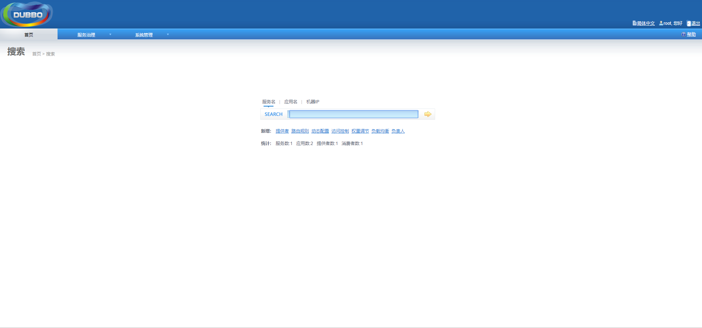

# 极光严选-电商系统-第一章

# 搭建分布式架构

## 课程内容

- 电商行业、经营模式的介绍
- 极光严选简介及架构设计思想
- Dubbox的入门使用
- Zookeeper的安装操作
- Dubbox的运行原理分析
- 极光严选框架搭建和数据库环境搭建
- 品牌列表数据查询

## 学习目标

- [ ] 了解电商行业的特点和经营模式
- [ ] 了解极光严选的架构设计思想
- [ ] 理解Dubbox的运行原理
- [ ] 能够完成基于Dubbox&SSM完成分布式应用框架的搭建
- [ ] 完成数据库环境搭建，及理清数据库表关系
- [ ] 能够完成品牌信息的查询


## 一、 电商行业

### 1.1. 电商行业介绍

“电商”一词是业内人士对电子商务的简称。
在直观概念上，业界将电商划分为狭义与广义，狭义电商（E-Commerce）是指实现整个贸易过程中各阶段贸易活动的电子化，而广义电商（E-Business）是指利用网络实现所有商务活动业务流程的电子化。前者集中于基于互联网的电子交易，强调企业利用互联网与外部发生交易与合作；而后者则把涵盖范围扩大了很多，指企业使用各种电子工具从事商务活动。


### 1.2. 电商的经营模式

#### 1.2.1. B2B（企业-企业）


​	B2B 是指进行电子商务交易的供需双方都是商家（或企业、公司），她（他）们使用了互联网的技术或各种商务网络平台，完成商务交易的过程。电子商务是现代 B2B marketing的一种具体主要的表现形式。

典型代表：阿里巴巴

#### 1.2.2. B2C（企业-消费者）


​	B2C是Business-to-Customer的缩写，而其中文简称为“商对客”。“商对客”是电子商务的一种模式，也就是通常说的商业零售，直接面向消费者销售产品和服务。

典型代表：京东自主品牌、小米商城、华为商城

#### 1.2.3. C2C（消费者-消费者）

​	C2C的意思就是消费者个人间的电子商务行为。比如一个消费者有一台电脑，通过网络进行交易，把它出售给另外一个消费者，此种交易类型就称为C2C电子商务。

典型代表：淘宝、瓜子二手车

#### 1.2.4. O2O（线上到线下）

​	O2O即Online To Offline，是指将线下的商务机会与互联网结合，让互联网成为线下交易的前台，这个概念最早来源于美国。O2O的概念非常广泛，只要产业链中既可涉及到线上，又可涉及到线下，就可通称为O2O。

典型代表：餐饮服务类、租车、租房

#### 1.2.5. B2B2C

​	所谓B2B2C是一种新的网络通信销售方式，是英文“business to business to Customer”的简称。

​	第一个B指广义的卖方（即成品、半成品、材料提供商等），

​	第二个B指交易平台，即提供卖方与买方的联系平台，同时提供优质的附加服务，

​	C即指买方消费者。

### 1.3. 选择电商的原因

1. 互联网项目中典型性
2. 业务熟悉度较高
3. 技术稳定、更新快


## 二、 极光严选-系统设计

> 极光严选电子商务网站是一个综合性的B2B2C平台，类似于京东商城、苏宁易购、天猫商城等。网站中有自营商家、也有第三方商家。第三方商家入驻后，可以在后台系统中管理自家的商品，商品审核上架后，可以供用户选购。
>
> 极光严选电子商务网站主要分为自营运营商后台系统、第三方商家后台系统、商城门户系统、会员中心四个子系统。

### 2.1. 子系统简介

#### 2.1.1. 运营商后台系统


> 该系统是运营人员的管理后台系统，主要包含
>
> - 商家管理
> - 商品相关信息管理
> - 广告相关信息管理
> - 订单相关信息管理
> - 投诉建议相关信息管理

#### 2.1.2. 商家后台系统


> 商家后台系统是为已经入住的商家用来管理店铺运营相关信息的系统。系统功能主要有：
>
> - 商品管理
> - 订单管理
> - 评价管理
> - 快递信息管理
> - 售后服务
> - 账户管理

#### 2.1.3. 商城门户系统


> 这也是大多数人熟知的系统，在该系统中，用户可以浏览商品、搜索商品、购买商品（下单+支付）、售后服务、参加促销活动等等。

#### 2.1.4. 会员中心


> 用户可以在该系统中维护个人的信息、查看订单信息、售后服务信息、收藏信息、收货地址等等。


### 2.2. 系统架构

#### 2.2.1. SOA架构

> 面向服务的架构（Service-Oriented Architecture）.他是一种设计方法，其中包含多个服务， 服务之间通过相互依赖最终提供一系列的功能。一个服务 通常以独立的形式存在与操作系统进程中。各个服务之间 通过网络调用。
>
> SOA的概念并非什么新东西，SOA不同于现有的分布式技术之处在于大多数软件商接受它并有可以实现SOA的平台或应用程序。SOA伴随着无处不在的标准，为企业的现有资产或投资带来了更好的重用性。SOA能够在最新的和现有的应用之上创建应用；SOA能够使客户或服务消费者免予服务实现的改变所带来的影响；SOA能够升级单个服务或服务消费者而无需重写整个应用，也无需保留已经不再适用于新需求的现有系统。总而言之，SOA以借助现有的应用来组合产生新服务的敏捷方式，提供给企业更好的灵活性来构建应用程序和业务流程。

#### 2.2.2. 极光严选架构设计


#### 2.2.3. 技术架构


## 三、分布式服务框架

### 3.1. Dubbox简介

​	Dubbo是一个分布式服务框架，致力于提供高性能和透明化的RPC远程服务调用方案，以及SOA服务治理方案。

​	简单的说，dubbo就是个服务框架，如果没有分布式的需求，其实是不需要用的，只有在分布式的时候，才有dubbo这样的分布式服务框架的需求，并且本质上是个服务调用的东东，说白了就是个远程服务调用的分布式框架（告别Web Service模式中的WSdl，以服务者与消费者的方式在dubbo上注册）。

​	由于阿里巴巴在一段时间内停止了对Dubbo的更新、维护，当当网便在Dubbo的基础之上进行了优化，并继续维护，并命名为Dubbo eXtensions，简称为Dubbox。

官网：http://dubbo.apache.org/zh-cn/

### 3.2. 架构设计

#### 3.2.1. 架构设计图


#### 3.2.2. 节点说明

| 节点        | 角色说明                               |
| ----------- | -------------------------------------- |
| `Provider`  | 暴露服务的服务提供方                   |
| `Consumer`  | 调用远程服务的服务消费方               |
| `Registry`  | 服务注册与发现的注册中心               |
| `Monitor`   | 统计服务的调用次数和调用时间的监控中心 |
| `Container` | 服务运行容器                           |

#### 3.2.3. 调用关系说明

0. 服务容器负责启动，加载，运行服务提供者。
1. 服务提供者在启动时，向注册中心注册自己提供的服务。
2. 服务消费者在启动时，向注册中心订阅自己所需的服务。
3. 注册中心返回服务提供者地址列表给消费者，如果有变更，注册中心将基于长连接推送变更数据给消费者。
4. 服务消费者，从提供者地址列表中，基于软负载均衡算法，选一台提供者进行调用，如果调用失败，再选另一台调用。
5. 服务消费者和提供者，在内存中累计调用次数和调用时间，定时每分钟发送一次统计数据到监控中心

### 3.3. 注册中心

#### 3.3.1. Zookeeper介绍

​	ZooKeeper是一种分布式协调服务，用于管理大型主机。在分布式环境中协调和管理服务是一个复杂的过程。ZooKeeper通过其简单的架构和API解决了这个问题。ZooKeeper允许开发人员专注于核心应用程序逻辑，而不必担心应用程序的分布式特性。

​	ZooKeeper框架最初是在“Yahoo!"上构建的，用于以简单而稳健的方式访问他们的应用程序。 后来，Apache ZooKeeper成为Hadoop，HBase和其他分布式框架使用的有组织服务的标准。 例如，Apache HBase使用ZooKeeper跟踪分布式数据的状态。

​	Zookeeper 是 Apacahe Hadoop 的子项目，是一个**树型的目录服务**，支持变更推送，适合作为 Dubbo 服务的注册中心，工业强度较高，可用于生产环境，并推荐使用 。


#### 3.3.2. Zookeeper安装

##### 3.3.2.1. 安装JDK

```shell
# 安装上传文件工具
yum install lrzsz
# 使用rz命令执行上传
# 解压jdk的安装包
tar -zxvf jdk-8u101-linux-x64.tar.gz -C /usr
# 切换目录至/usr
cd /usr
# 重命名解压后的文件
mv jdk1.8.0_101/ jdk
# 修改配置文件/etc/profile
vi /etc/profile
# 在该文件最后添加三行内容
# JAVA_HOME=/usr/jdk
# CLASSPATH=$JAVA_HOME/lib/
# export PATH=$PATH:$JAVA_HOME/bin
# 重新加载配置文件
source /etc/profile
# 使用java命令测试安装结果
java -version
```

显示以下内容，则证明jdk安装成功


##### 3.3.2.2. 上传安装包并解压

```shell
# 下载zookeeper安装包
wget http://archive.apache.org/dist/zookeeper/zookeeper-3.4.14/zookeeper-3.4.14.tar.gz
# 解压zookeeper到 /usr/local/目录下
tar zxvf zookeeper-3.4.14.tar.gz -C /usr/local/
# 切换目录至zookeeper下
cd zookeeper-3.4.14
# 复制配置文件，并命名为 zoo.cfg
cp conf/zoo_sample.cfg conf/zoo.cfg
```

##### 3.3.2.3. 修改配置文件

```
# 编辑zoo.cfg文件
vi conf/zoo.cfg
```

修改`dataDir`的值


##### 3.3.2.4. 创建data目录

```
# 切换目录至
cd /usr/local/zookeeper-3.4.14/
# 创建data目录
mkdir data
```

##### 3.3.2.5. 启动/关闭/查看状态

| 操作     | 指令                       |
| -------- | -------------------------- |
| 启动     | `./bin/zkServer.sh start`  |
| 关闭     | `./bin/zkServer.sh stop`   |
| 查看状态 | `./bin/zkServer.sh status` |


#### 3.3.3. 关闭防火墙

> 需要进行服务注册，所以需要关闭防火墙

```shell
systemctl stop firewalld
或
firewall-cmd --zone=public --add-port=2181/tcp --permanent
systemctl restart firewalld
```

### 3.4. 入门案例

#### 3.4.1. 服务提供者

1. 创建Maven工程 `dubbo-service`，并配置相关依赖信息

   参考资料中的配置文件

2. 配置`web.xml`

   参考资料中的配置文件

3. 编写接口类

```java
package cc.jgxy.dubbo.service;

/**
 * 接口API
 */
public interface IAccountService {

    public String getName();
}
```

4. 编写接口实现类

```java
package cc.jgxy.dubbo.service.impl;

import cc.jgxy.dubbo.service.IAccountService;
import com.alibaba.dubbo.config.annotation.Service;
// 当前实现要暴露成dubbo服务，所以使用dubbo的service注解
@Service
public class AccountServiceImpl implements IAccountService {
    public String getName() {
        return "hello jgxy-dubbo";
    }
}
```

5. 在`applicationContext-service.xml`中配置dubbo服务

   参考资料中的配置文件

6. 启动服务

```
tomcat7:run
```

#### 3.4.2. 服务消费者

1. 创建maven工程 `dubbo-consumer`，并配置依赖信息（同服务提供者的依赖，但要修改端口号）

   参考资料中的配置文件

2. 配置 `web.xml`中的相关信息

   参考资料中的配置文件

3. 复制服务接口类到 `dubbo-consumer`消费者工程

```java
package cc.jgxy.dubbo.service;

/**
 * 接口API
 */
public interface IAccountService {

    public String getName();
}
```

4. 编写控制层访问类

```java
package cc.jgxy.dubbo.consumer.controller;

import cc.jgxy.dubbo.service.IAccountService;
import com.alibaba.dubbo.config.annotation.Reference;
import org.springframework.stereotype.Controller;
import org.springframework.web.bind.annotation.RequestMapping;
import org.springframework.web.bind.annotation.ResponseBody;

@Controller
@RequestMapping("/account")
public class AccountController {

    // 注入服务端的实例
    @Reference
    private IAccountService accountService;

    @ResponseBody
    @RequestMapping("/getName")
    public String getName(){
        return accountService.getName();
    }
}
```

5. 在 `applicationContext-consumer.xml`中配置相关信息

   参考资料中的配置文件

6. 运行

```
tomcat7:run
```

#### 3.4.3. 测试方式和结果

1. 在浏览器的地址栏中输入 http://localhost:8002/account/getName
2. 浏览器展示出 `hello jgxy-dubbo`


### 3.5. 管理中心

​	在实际开发过程中，会有很多服务注册到服务注册中心，为了方便查看和测试，我们可以部署一个管理中心，通过管理中心查看注册到服务注册中心的服务有哪些。其实管理就是一个web应用，部署到tomcat中即可。

#### 3.5.1. 编译代码生成war包

解压`dubbox-master`包，并且切换到 dubbox-admin目录下，执行以下命令进行打包

```shell
mvn package -Dmaven.skip.test=true
```

显示如下信息，则表明打包成功


生成的文件


#### 3.5.2. 部署war包

1. 在linux服务器上安装tomcat服务器
2. 把生成的war包（在target目录下）上传至tomcat目录下的webapps目录下（可以把war的名称修改为**dubbo-admin**，方便访问）


#### 3.5.3. 启动tomcat服务

```
# 切换目录至 /opt/apache-tomcat-7.0.93
cd /opt/apache-tomcat-7.0.93
# 执行启动tomcat的命令
./bin/startup.sh &
```

#### 3.5.4. 浏览器进行访问

1. 在浏览器中输入 http://192.168.253.130:8080/dubbo-admin-2.8.4

> **注意：**
>
> 1. 如果上传的war包名称修改成了 dubbox-admin，那么访问地址为http://192.168.253.130:8080/dubbox-admin
> 2. 访问地址中 `192.168.253.130`是linux服务器的地址
>
> 那么访问地址为http://192.168.253.130:8080/dubbo-admin

2. 浏览器中会要求输入用户名和密码。

> 用户名和密码都是 **root**

3. 展示页面



4. 查看注册的服务列表


5. 点击具体服务查看服务详情


6. 查看消费者信息


## 四、项目工程搭建

### 4.1. 工程名称约定

| 工程名称                     | 工程说明           |
| ---------------------------- | ------------------ |
| jiguangyanxuan-parent        | 父工程，聚合工程   |
| jiguangyanxuan-model         | 通用的数据模型工程 |
| jiguangyanxuan-dao           | 通用的数据访问工程 |
| jiguangyanxuan-common        | 通用的工具类工程   |
| jiguangyanxuan-XXXXX-api     | 某服务的接口工程   |
| jiguangyanxuan-XXXXX-service | 某服务的实现工程   |
| jiguangyanxuan-XXXXX-server  | 某服务的web工程    |

### 4.2. 服务模块约定

| 服务名称   | 英文名称    |
| ---------- | ----------- |
| 运营商后台 | manager     |
| 商家后台   | seller      |
| 商品搜索   | search      |
| 商品详情   | detail_page |
| 添加购物车 | cart        |
| 订单处理   | order       |
| 秒杀服务   | second_kill |
| 支付服务   | pay         |
| 个人中心   | personal    |

### 4.3. 数据库环境准备

1. 执行数据库脚本文件 `/资料/数据库相关/yanxuan_db_script.sql`

### 4.4. 搭建开发环境

#### 4.4.1. 创建父工程 

1. 填写工程信息

> **GroupId：**cc.jgxy.yanxuan
>
> **ArtifactId：**jiguangyanxuan-parent


2. 工程存放路径


3. 配置依赖信息

> 使用资料中的父工程pom文件


备注：以下模块都继承自该父工程


#### 4.4.2 创建通用数据模型工程

> idea创建路径 ：File-Project Structure-Modules-+

1. 进入Project Structure页面


2. 选择Maven工程


3. 设置工程信息


#### 4.4.3. 创建通用数据访问工程

1. 参照 `jiguangyanxuan-model`的创建方式创建 `jiguangyanxuan-dao`工程
2. 配置依赖信息

> 备注：可以 直接把 资源/配置文件/环境搭建/数据访问工程/pom.xml复制到工程下

```xml
<dependencies>
    <!-- MySql -->
    <dependency>
        <groupId>mysql</groupId>
        <artifactId>mysql-connector-java</artifactId>
    </dependency>
    <!-- 连接池 -->
    <dependency>
        <groupId>com.alibaba</groupId>
        <artifactId>druid</artifactId>
    </dependency>
    <!-- Mybatis -->
    <dependency>
        <groupId>org.mybatis</groupId>
        <artifactId>mybatis</artifactId>
    </dependency>
    <!-- mybatis和Spring的整合 -->
    <dependency>
        <groupId>org.mybatis</groupId>
        <artifactId>mybatis-spring</artifactId>
    </dependency>
    <!-- mybaits分页查询 -->
    <dependency>
        <groupId>com.github.pagehelper</groupId>
        <artifactId>pagehelper</artifactId>
    </dependency>
</dependencies>
```


#### 4.4.4. 创建通用工具类工程

1. 参照 `jiguangyanxuan-model`的创建方式创建 `jiguangyanxuan-common`工程

#### 4.4.5. 创建运营商后台服务API工程

参照 `jiguangyanxuan-model`的创建方式创建 `jiguangyanxuan-manager-api`工程

##### 4.4.5.1. 完善依赖信息

> 备注：可以 直接把 资源/配置文件/环境搭建/数据访问工程/pom.xml复制到工程下

```xml
<?xml version="1.0" encoding="UTF-8"?>
<project xmlns="http://maven.apache.org/POM/4.0.0"
         xmlns:xsi="http://www.w3.org/2001/XMLSchema-instance"
         xsi:schemaLocation="http://maven.apache.org/POM/4.0.0 http://maven.apache.org/xsd/maven-4.0.0.xsd">
    <parent>
        <artifactId>jiguangyanxuan-parent</artifactId>
        <groupId>cc.jgxy.yanxuan</groupId>
        <version>1.0-SNAPSHOT</version>
    </parent>
    <modelVersion>4.0.0</modelVersion>

    <artifactId>jiguangyanxuan-manager-api</artifactId>

    <dependencies>
        <dependency>
            <groupId>cc.jgxy.yanxuan</groupId>
            <artifactId>jiguangyanxuan-model</artifactId>
            <version>1.0-SNAPSHOT</version>
        </dependency>
    </dependencies>

</project>
```


#### 4.4.6. 创建运营商后台服务service工程

参照 `jiguangyanxuan-model`的创建方式创建 `jiguangyanxuan-manager-service`工程

##### 4.4.6.1. 完善依赖信息

> 备注：可以 直接把 资源/配置文件/环境搭建/数据访问工程/pom.xml复制到工程下


##### 4.4.6.2. 完善Spring的配置信息

​	参照工程搭建的配置文件

##### 4.4.6.3. 完善 `web.xml`信息

```xml
<!-- 加载spring容器 -->
<context-param>
    <param-name>contextConfigLocation</param-name>
    <param-value>classpath*:spring/applicationContext*.xml</param-value>
</context-param>
<listener>
    <listener-class>org.springframework.web.context.ContextLoaderListener</listener-class>
</listener>
```


#### 4.4.7. 创建运营商后台web工程

参照 `jiguangyanxuan-model`的创建方式创建 `jiguangyanxuan-manager-web`工程

##### 4.4.7.1. 完善依赖信息

> 备注：可以 直接把 资源/配置文件/环境搭建/数据访问工程/pom.xml复制到工程下

​	参照工程搭建的配置文件

##### 4.4.7.2. 完善 `web.xml`配置文件

​	参照工程搭建的配置文件

##### 4.4.7.3. 完善Spring MVC的配置信息

​	参照工程搭建的配置文件

##### 4.4.7.4. 创建基础包路径


### 4.5. 代码完善

#### 4.5.1. 生成数据模型和数据访问代码

> 使用 `mybatis-generator`逆向工程生成 数据模型类和数据访问的相关文件

#### 4.5.2. 拷贝代码

1. 把`cc.jgxy.yanxuan.model`包拷贝到 `jiguangyanxuan-model`工程的 `src/main/java`下
2. 把 `cc.jgxy.yanxuan.mapper`包拷贝到 `jiguangyanxuan-dao`工程的 `src/main/java`下
3. 把 resources下的 `cc.jgxy.yanxuan.mapper`拷贝到 `jiguangyanxuan-dao`工程的 `src/main/resources`下

#### 4.5.3. 修改代码

1. 修改数据模型类，使其实现 `java.io.Serializable`接口
2. 修改mapper.xml文件中insert 方法中主键生成的 order设置成 `AFTER`


## 五、品牌列表

### 5.1. 需求分析


### 5.2. 品牌信息表（goods_brand）结构

| 字段名称        | 字段含义         | 字段类型 | 字段长度 |
| --------------- | ---------------- | -------- | -------- |
| `id`            | 主键ID           | bigint   | 20       |
| `name`          | 品牌名称（中文） | varchar  | 50       |
| `english_name`  | 品牌名称（英文） | varchar  | 50       |
| `website`       | 品牌网址         | varchar  | 200      |
| `pic_logo`      | 品牌logo         | varchar  | 500      |
| `first_char`    | 品牌名称首字母   | char     | 1        |
| `is_delete`     | 是否停用         | char     | 1        |
| `create_person` | 创建人           | varchar  | 50       |
| `create_date`   | 创建时间         | datetime |          |
| `update_person` | 修改人           | varchar  | 50       |
| `update_date`   | 修改时间         | datetime |          |

### 5.3. 编写代码

#### 5.3.1. 编写服务接口

在 `jiguangyanxuan-manager-api`中创建接口 `IGoodsBrandService`.

```java
package cc.jgxy.yanxuan.manager.api;

import cc.jgxy.yanxuan.model.GoodsBrand;

import java.util.List;

/**
 * 品牌信息服务接口
 */
public interface IGoodsBrandService {

    /**
     * 查询所有的品牌信息
     * @return
     */
    public List<GoodsBrand> queryAll();
}

```

#### 5.3.2. 编写服务接口实现

在 `jiguangyanxuan-manager-service`中创建服务接口的实现类

```java
package cc.jgxy.yanxuan.manager.service;

import cc.jgxy.yanxuan.manager.api.IGoodsBrandService;
import cc.jgxy.yanxuan.mapper.GoodsBrandMapper;
import cc.jgxy.yanxuan.model.GoodsBrand;
import com.alibaba.dubbo.config.annotation.Service;
import org.springframework.beans.factory.annotation.Autowired;
import org.springframework.transaction.annotation.Transactional;

import java.util.List;

/**
 * 品牌信息服务实现
 */
@Service
@Transactional
public class GoodsBrandServiceImpl implements IGoodsBrandService {

    @Autowired
    private GoodsBrandMapper goodsBrandMapper;

    @Override
    public List<GoodsBrand> queryAll() {
        return goodsBrandMapper.selectByExample(null);
    }
}

```

> 注意：
>
> 1. `@Serivce`注解使用的是 dubbox中提供的，因为要暴露成dubbo的服务

#### 5.3.3. 编写控制层代码

在 `jiguangyanxuan-manager-server`中创建controller

```java
package cc.jgxy.yanxuan.manager.controller;

import cc.jgxy.yanxuan.manager.api.IGoodsBrandService;
import cc.jgxy.yanxuan.model.GoodsBrand;
import com.alibaba.dubbo.config.annotation.Reference;
import org.springframework.web.bind.annotation.RequestMapping;
import org.springframework.web.bind.annotation.RestController;

import java.util.List;

@RestController
@RequestMapping("/brand")
public class GoodsBrandController {

    @Reference
    private IGoodsBrandService goodsBrandService;

    @RequestMapping("/queryAll")
    public List<GoodsBrand> queryAll(){
        return goodsBrandService.queryAll();
    }
}
```

#### 5.3.4. 测试服务

1. 启动service工程 `jiguangyanxuan-manager-service`
2. 启动web工程 `jiguangyanxuan-manager-server`
3. 浏览器中输入地址 `http://localhost:9901/brand/queryAll`
4. 展示数据


