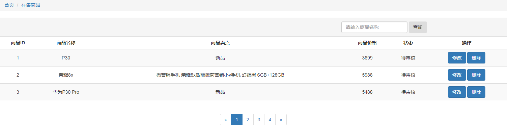
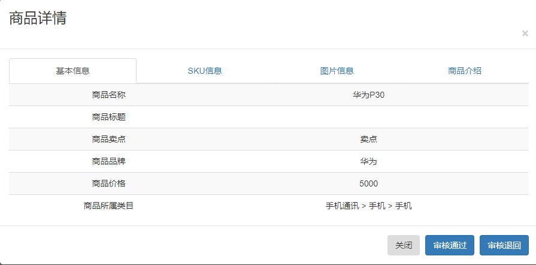
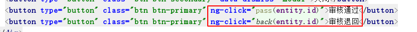
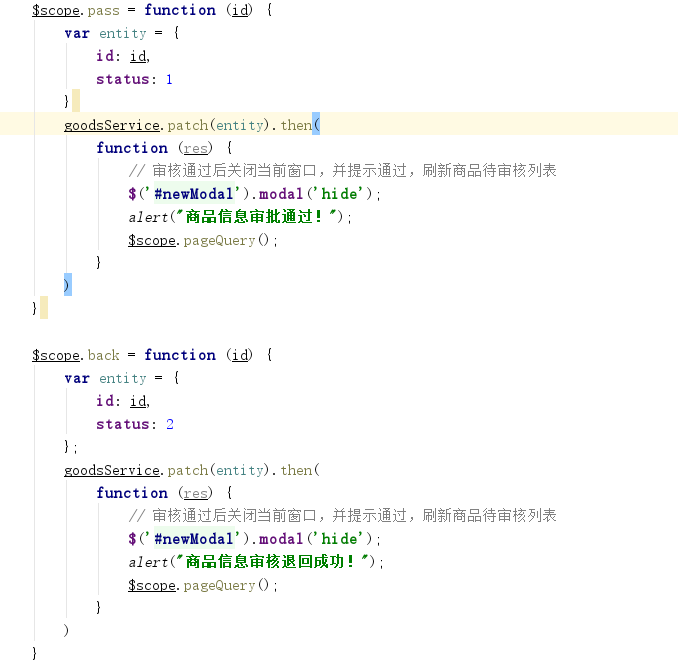

#  极光严选-第七章-商品修改&商品审核

## 课程内容

- 商品管理功能
  - 分页列表展示
  - 商品修改
  - 商品删除
  - 商品上下架操作
- 运营商审核商品


## 学习目标

- [ ] 编码实现商品的分页列表展示，并可条件查询
- [ ] 编码实现商家后台系统中的修改商品
- [ ] 编码实现运营后台系统中的审核商品
- [ ] 编码实现商品删除功能
- [ ] 编码实现商品上/下架功能


## 一、 商家后台-商品列表

### 1.1. 需求分析

> 在商家后台系统显示登录商家添加的商品列表



### 1.2. 前端代码

#### 1.2.1.  系统模块设置

1. 路由配置

```js
// angular路由设置
app.config(["$routeProvider", function ($routeProvider) {
    $routeProvider
        .when("/",{
            templateUrl: "home.html"
        })
        .when("/goods/edit",{
                templateUrl: "pages/goods/edit.html",
                controller: "goodsController"
            })
        .when("/goods/manage",{
                templateUrl: "pages/goods/manage.html",
        		controller: "goodsController"
            })
        .when("/account/detail",{
                templateUrl: "pages/account/detail.html"
            })
        .when("/account/security",{
                templateUrl: "pages/account/security.html"
            })
        .otherwise({redirectTo: '/'});
}])
```


#### 1.2.2. 前端发起请求

新建`goods.manage.controller.js`文件，并且在`index.html`中引入该文件

```js
angular.module("goods").controller("manageController", function ($scope, $controller, goodsService) {

    // 监听视图内容是否加载完毕，加载完毕后触发回调函数
    $scope.$on("$viewContentLoaded", function (event) {
        // 查询数据
        $scope.pageQuery();
    });

    // 继承其他的controller， baseController
    $controller("baseController", {$scope : $scope});

    //分页查询
    $scope.pageQuery = function () {
        var options = {
            pageNum: $scope.pageOption.currentPage,
            pageSize: $scope.pageOption.pageSize,
            name: $scope.name
        };
        // 调用get请求
        goodsService.get(options).then(
            function (res){
                $scope.dataList = res.data.rows;
                $scope.pageOption.total = res.data.total;
            },
            function (reason) {
                console.log(reason);
            }
        )
    };

});
```

#### 1.2.3. html代码调整

1. 数据展示

```html
<table class="table table-striped text-center">
    <thead>
        <tr>
            <th>商品ID</th>
            <th>商品名称</th>
            <th>商品卖点</th>
            <th>商品价格</th>
            <th>品牌</th>
            <th>所属类目</th>
            <th>状态</th>
            <th>操作</th>
        </tr>
    </thead>
    <tbody>
        <tr ng-repeat="goods in dataList">
            <td>{{goods.id}}</td>
            <td>{{goods.name}}</td>
            <td>{{goods.sellPoint}}</td>
            <td>{{goods.price}}</td>
            <td>{{goods.brandName}}</td>
            <td>{{goods.categoryName}}</td>
            <td>{{goodsStatus[goods.status]}}</td>
            <td>
                <a type="button" class="btn btn-primary" href="#/goods/edit">修改</a>
                <button type="button" class="btn btn-primary" data-toggle="modal" 
                        data-target="#newModal" >详情
                </button>
                <button type="button" class="btn btn-primary">删除</button>
            </td>
        </tr>

    </tbody>
</table>
```

2. 查询条件

```html
<form class="form-inline">
    <input class="form-control" type="search" placeholder="请输入商品名称"
           aria-label="Search" ng-model="name">
    <button class="btn btn-outline-success" type="submit" 
            ng-click="pageQuery()">查询</button>
</form>
```


### 1.3. 后端代码

#### 1.3.1. Controller

```java
@GetMapping
public ResponseEntity<PageResult> pageQuery(Integer pageNum ,Integer pageSize, 
                                            GoodsInfo goodsInfo){
    // 处理请求参数
    if(currentPage == null || pageNum == null){
        currentPage = 1;
        pageNum = Integer.MAX_VALUE;
    }
    // 获取当前的登录人用户名
    String username = SecurityContextHolder.getContext().getAuthentication().getName();
    // 设置到goodsSpu中的createPerson属性中
    goodsSpu.setCreatePerson(username);
    // 执行分页查询
    PageResult<GoodsSpu> pageResult = goodsInfoService.pageQuery(pageNum, pageSize, goodsInfo);
    return new ResponseEntity<>(pageResult,HttpStatus.OK);
}
```

#### 1.3.2. 服务接口

```java
    /**
     * 根据查询条件进行分页查询
     * @param pageNum
     * @param pageSize
     * @param goodsInfo
     * @return
     */
    public PageResult pageQuery(Integer pageNum, Integer pageSize, GoodsInfo goodsInfo);
```

#### 1.3.3. 服务实现

```java
@Service
@Transactional
public class GoodsInfoServiceImpl implements IGoodsInfoService {

    @Autowired
    private AccountMapper accountMapper;
    @Autowired
    private SellerShopMapper sellerShopMapper;
    @Autowired
    private GoodsSpuMapper goodsSpuMapper;
    @Autowired
    private GoodsSkuMapper goodsSkuMapper;
    @Autowired
    private GoodsBrandMapper goodsBrandMapper;
    @Autowired
    private GoodsCategoryMapper goodsCategoryMapper;
    @Override
    public int save(GoodsInfo goodsInfo) {

        String username = goodsInfo.getCreatePerson();
        SellerShop sellerShop = this.getSellerShop(username);
        // 设置店铺信息
        goodsInfo.setSellerId(sellerShop.getId());
        goodsInfo.setSellerName(sellerShop.getName());
        goodsInfo.setStatus("0");
        // 保存商品的信息
        int insert = goodsSpuMapper.insert(goodsInfo);

        // 查询品牌的名称
        GoodsBrand goodsBrand = goodsBrandMapper.selectByPrimaryKey(goodsInfo.getBrandId());
        // 查询类目的信息
        GoodsCategory goodsCategory = goodsCategoryMapper.selectByPrimaryKey(goodsInfo.getCategory3Id());


        // 获取SKU的信息
        List<GoodsSku> skuList = goodsInfo.getSkuList();
        for (GoodsSku sku: skuList ) {
            // 设置goodsId
            sku.setGoodsId(goodsInfo.getId());
            // 设置标题
            sku.setLabel(goodsInfo.getLabel());
            // 设置品牌的名称
            sku.setBrandName(goodsBrand.getName());
            // 设置类目的名称
            sku.setCategoryName(goodsCategory.getStructName()+"<"+goodsCategory.getName());
            // 设置商铺的信息
            sku.setSellerId(sellerShop.getId());
            sku.setSellerName(sellerShop.getName());
            // 设置状态
            sku.setOnSale("0");
            sku.setStatus("0");
            goodsSkuMapper.insert(sku);
        }
        return insert;
    }

    public PageResult pageQuery(Integer pageNum, Integer pageSize, GoodsInfo goodsInfo) {

        // 查询当前登录店铺的信息
        SellerShop sellerShop = this.getSellerShop(goodsInfo.getCreatePerson());
        // 构建查询条件
        GoodsSpuExample example = new GoodsSpuExample();
        GoodsSpuExample.Criteria criteria = example.createCriteria();
        // 根据店铺的id进行查询
        if(sellerShop!=null){
            criteria.andSellerIdEqualTo(sellerShop.getId());
        }
        // 根据商品的名称进行查询
        if(goodsInfo.getName()!=null && !"".equals(goodsInfo.getName()) ){
            criteria.andNameLike("%"+goodsInfo.getName()+"%");
        }
        // 开启分页
        PageHelper.startPage(pageNum, pageSize);
        // 执行查询
        Page<GoodsSpu> pageData = (Page<GoodsSpu>)goodsSpuMapper.selectByExample(example);
        // 设置返回值
        PageResult<GoodsSpu> pageResult = new PageResult<>();
        pageResult.setResult(pageData.getResult());
        pageResult.setTotal(pageData.getTotal());
        return pageResult;
    }

    // 提取单独的方法进行商铺信息的查询
    private SellerShop getSellerShop(String username){
        // 根据登录人的用户名获取得到店铺的信息
        AccountExample accountExample = new AccountExample();
        accountExample.createCriteria().andLoginNameEqualTo(username);
        List<Account> accountList = accountMapper.selectByExample(accountExample);
        Account account = null;
        if(accountList!=null && accountList.size()>0){
            account = accountList.get(0);
        }
        // 查询店铺的信息
        SellerShopExample sellerShopExample = new SellerShopExample();
        sellerShopExample.createCriteria().andAccountIdEqualTo(account.getId());
        List<SellerShop> shopList = sellerShopMapper.selectByExample(sellerShopExample);
        SellerShop sellerShop = null;
        if(shopList!=null && shopList.size()>0){
            sellerShop = shopList.get(0);
        }
        return sellerShop;
    }
}
```


### 1.4. 根据状态进行查询

#### 1.4.1. html页面添加状态选择框

```html
<select class="form-control" ng-model="status" 
        ng-options="$index as status for ($index,status) in goodsStatus" >
</select>
```

#### 1.4.2. 请求中添加查询条件

```js
    //分页查询
    $scope.pageQuery = function () {
        var options = {
            pageNum: $scope.pageOption.currentPage,
            pageSize: $scope.pageOption.pageSize,
            name: $scope.name,
            status: $scope.status
        };
        // 调用get请求
        goodsService.get(options).then(
            function (res){
                $scope.dataList = res.data.rows;
                $scope.pageOption.total = res.data.total;
            },
            function (reason) {
                console.log(reason);
            }
        )
    };
```

#### 1.4.3. 商品查询服务中添加查询条件

```java
    public PageResult pageQuery(Integer pageNum, Integer pageSize, GoodsInfo goodsInfo) {

        // 查询当前登录店铺的信息
        SellerShop sellerShop = this.getSellerShop(goodsInfo.getCreatePerson());
        // 构建查询条件
        GoodsSpuExample example = new GoodsSpuExample();
        GoodsSpuExample.Criteria criteria = example.createCriteria();
        // 根据店铺的id进行查询
        if(sellerShop!=null){
            criteria.andSellerIdEqualTo(sellerShop.getId());
        }
        // 根据商品的名称进行查询
        if(goodsInfo.getName()!=null && !"".equals(goodsInfo.getName()) ){
            criteria.andNameLike("%"+goodsInfo.getName()+"%");
        }
        // 添加根据status进行查询的条件
        if(goodsInfo.getStatus()!=null && !"".equals(goodsInfo.getStatus())){
            criteria.andStatusEqualTo(goodsInfo.getStatus());
        }

        // 开启分页
        PageHelper.startPage(pageNum, pageSize);
        // 执行查询
        Page<GoodsSpu> pageData = (Page<GoodsSpu>)goodsSpuMapper.selectByExample(example);
        // 设置返回值
        PageResult<GoodsSpu> pageResult = new PageResult<>();
        pageResult.setResult(pageData.getResult());
        pageResult.setTotal(pageData.getTotal());
        return pageResult;
    }
```

### 1.5. 修改SPU信息中没有保存品牌名称和规格名称的问题

#### 1.5.1. 数据库增加字段

```sql
ALTER TABLE `yanxuan_db`.`goods_spu` 
ADD COLUMN `category_name` varchar(100) NULL COMMENT '类目结构名称' AFTER `category3_id`,
ADD COLUMN `brand_name` varchar(80) NULL COMMENT '品牌名称' AFTER `brand_id`;
```

#### 1.5.2. 重新生成Model、Mapper、Mapper.xml文件

使用`mybatis-generator`工程生成相关文件，并拷贝至对应的系统工程中，并修改Model和xml文件

1. model

```java
public class GoodsSpu implements Serializable {
	// 属性及setter、getter方法
}
```

2. `Mapper.xml`

```xml
<insert id="insert" parameterType="com.itjiguang.yanxuan.model.GoodsSpu">
    <selectKey keyProperty="id" order="AFTER" resultType="java.lang.Long">
        SELECT LAST_INSERT_ID()
    </selectKey>
    <!-- sql语句 -->
</insert>
<insert id="insertSelective" parameterType="com.itjiguang.yanxuan.model.GoodsSpu">
    <selectKey keyProperty="id" order="AFTER" resultType="java.lang.Long">
        SELECT LAST_INSERT_ID()
    </selectKey>
    <!-- 动态SQL语句 -->
</insert>
```

#### 1.5.3. 基础工程安装到本地仓库

​	`jiguangyanxuan_model`和 `jiguangyanxuan_dao` 执行 `mvn install` 指令

#### 1.5.4. 增加品牌名称和规格名称的保存

```java
@Override
public int save(GoodsInfo goodsInfo) {

    String username = goodsInfo.getCreatePerson();
    SellerShop sellerShop = this.getSellerShop(username);
    // 设置店铺信息
    goodsInfo.setSellerId(sellerShop.getId());
    goodsInfo.setSellerName(sellerShop.getName());
    goodsInfo.setOnSale("0");
    goodsInfo.setStatus("0");
    
    // 查询品牌的名称
    GoodsBrand goodsBrand = goodsBrandMapper.selectByPrimaryKey(goodsInfo.getBrandId());
    // 查询类目的信息
    GoodsCategory goodsCategory = goodsCategoryMapper.selectByPrimaryKey(goodsInfo.getCategory3Id());
    goodsInfo.setBrandName(goodsBrand.getName());
    goodsInfo.setCategoryName(goodsCategory.getStructName()+"<"+goodsCategory.getName());
    
    // 保存商品的信息
    int insert = goodsSpuMapper.insert(goodsInfo);

    // 其他代码。。。。。
}
```


## 二、 商家后台-商品修改

### 2.1. 需求分析

> 在商品列表页面点击每件商品后面的修改按钮，进入商品编辑页面，并把原始数据展示出来，在此基础上完成修改，然后数据保存到数据
>
> 1. 页面跳转
> 2. 获取原始数据
> 3. 展示原始数据


### 2.2. 页面跳转

#### 2.2.1. 跳转触发

```html
<a type="button" class="btn btn-primary" href="#/goods/edit/{{item.id}}">修改</a>
```

>利用url把当前商品的id传入到编辑页面

#### 2.2.2. 修改路由配置

```js
// angular路由设置
app.config(["$routeProvider", function ($routeProvider) {
    $routeProvider
        .when("/",{
            templateUrl: "home.html"
        })
        .when("/goods/edit", {
                templateUrl: "pages/goods/edit.html",
                controller: "goodsController"
            })
        .when("/goods/edit/:id",{
                templateUrl: "pages/goods/edit.html",
                controller: "goodsController"
            })
        .when("/goods/manage",{
                templateUrl: "pages/goods/manage.html",
                controller: "manageController"
            })
        .when("/account/detail",{
                templateUrl: "pages/account/detail.html"
            })
        .when("/account/security",{
                templateUrl: "pages/account/security.html"
            })
        .otherwise({redirectTo: '/'});
}])
```


### 2.3. 获取原始数据

> 获取主键ID值，并根据主键查询数

#### 2.3.1. 获取主键ID

> 需要使用到$location服务，所以需要注入到Controller中

```js
angular.module("goods").controller("goodsController", function ( $scope, goodsService, $controller, categoryService, $routeParams) {

    // 监听视图内容是否加载完毕，加载完毕后触发回调函数
    $scope.$on("$viewContentLoaded", function (event) {
        // 获取url中的id的参数值
        var id = $routeParams.id;
        // 根据id是否undefined判断是否是新增操作，还是修改操作
        if(id !==undefined){
            // 修改操作，查询原始信息
            $scope.getGoodsInfoById(id);
        }
        $scope.querycategory1();
    });
    
    /**
    	其他的代码逻辑
    **/
});

```


#### 2.3.2. 获取原始数据

```JavaScript
// 根据主键ID进行查询
$scope.getGoodsInfoById = function(id){
    goodsService.get(id).then(
        function (res) {
            $scope.entity = res.data;
            // 处理特殊的属性：把字符串转换成json
            // 把$scope.entity.picUrl
            $scope.entity.picUrl = JSON.parse($scope.entity.picUrl);
            // 转换的是sku信息中的内容
            $scope.entity.skuList.forEach(function (sku) {
                sku.picUrl = JSON.parse(sku.picUrl);
                sku.specs = JSON.parse(sku.specs);
            });
            // 选中的规格项
            $scope.entity.specCheckedList = JSON.parse($scope.entity.specCheckedList);
            // 设置详情内容
            editor.txt.html($scope.entity.detail);
        }
    );
};
```

#### 2.3.3. 后台代码

1. Controller 

```java
@GetMapping("/{id}")
public ResponseEntity<GoodsInfo> queryById(@PathVariable("id") Long id){

    GoodsInfo goodsInfo = goodsInfoService.queryById(id);

    return new ResponseEntity<>(goodsInfo, HttpStatus.OK);
}
```

2. 服务接口

```java
    /**
     * 根据主键进行查询商品的详细信息
     * @param id
     * @return
     */
    GoodsInfo queryById(Long id);
```

3. 服务实现

```java
    @Override
    public GoodsInfo queryById(Long id) {
        // 根据主键查询SPU信息
        GoodsSpu goodsSpu = goodsSpuMapper.selectByPrimaryKey(id);
        // 根据条件查询SKU信息
        GoodsSkuExample goodsSkuExample = new GoodsSkuExample();
        goodsSkuExample.createCriteria().andGoodsIdEqualTo(id);
        List<GoodsSku> skuList = goodsSkuMapper.selectByExample(goodsSkuExample);
        // 构建返回结果
        GoodsInfo goodsInfo = new GoodsInfo();
        BeanUtils.copyProperties(goodsSpu, goodsInfo);
        goodsInfo.setSkuList(skuList);

        return goodsInfo;
    }
```


### 2.4.  显示选中的规格项

> 发现之前选中的规格信息，未进行选中，则需要单独设置
>
> 选中的规格信息在 entity.specCheckedList 中,则只要判断只要存在其中就设置ckecked

```JavaScript
//判断规格项是否是被选中
$scope.checkSpecOption = function (specName, optionName) {
    var checkedList = $scope.entity.specCheckedList;
    var resObject = $scope.queryObject(checkedList,"specName",specName);
    if(resObject === null){
        return false
    }
    if(resObject.optionValue.indexOf(optionName)>-1){
        return true
    }else{
        return false
    }
}
```

html页面渲染规格项信息时，调用该方法

```html
<div class="row">
    <table class="table">
        <tr ng-repeat="item in specList">
            <th class="text-center">{{item.name}}</th>
            <td>
                <span ng-repeat="option in item.optionList">
                    <input type="checkbox" 
                           ng-click="getSpecCheckedList($event,item.name, option.name)" 
                           ng-checked="checkSpecOptioin(item.name, option.name)"/>{{option.name}}
                </span>
            </td>
        </tr>
    </table>
</div>
```


### 2.5. 保存修改数据

#### 2.5.1. 前端发起数据更新请求

```js
    $scope.save = function () {
        // 设置富文本编辑器中的内容到entity中
        $scope.entity.detail = editor.txt.html();
        // 把$scope.entity.picUrl 转换成字符串进行传递
        $scope.entity.picUrl = JSON.stringify($scope.entity.picUrl);
        // 转换的是sku信息中的内容
        $scope.entity.skuList.forEach(function (sku) {
            sku.picUrl = JSON.stringify(sku.picUrl);
            sku.specs = JSON.stringify(sku.specs);
        });
        // 选中的规格项
        $scope.entity.specCheckedList = JSON.stringify($scope.entity.specCheckedList);
        if($scope.entity.id === undefined){
            // 发送请求，传递entity
            goodsService.post($scope.entity).then(
                function (res) {
                    alert("商品增加成功");
                    // 跳转到商品列表页面
                    window.location="#/goods/manage";
                }
            );
        }else{
            goodsService.put($scope.entity).then(
                function (res) {
                    alert("商品修改成功");
                    window.location = "#/goods/manage";
                }
            );
        }
    };
```

#### 2.5.2. Controller

```java
@PutMapping
public ResponseEntity update(@RequestBody GoodsInfo goodsInfo){
    int result = goodsInfoService.update(goodsInfo);
    if(result>0){
        return new ResponseEntity(HttpStatus.OK);
    }else{
        return new ResponseEntity(HttpStatus.INTERNAL_SERVER_ERROR);
    }
    
}
```


#### 2.5.1. 服务接口

```java
    /**
     * 更新商品信息
     * @param goodsInfo
     * @return
     */
    public int update(GoodsInfo goodsInfo);
```

#### 2.5.2. 服务实现

```java
    /**
     * 先更新SPU信息，然后删除原有的SKU信息，然后再保存SKU信息
     * @param goodsInfo
     * @return
     */
    public int update (GoodsInfo goodsInfo){
        //更新商品SPU信息
        int update = goodsSpuMapper.updateByPrimaryKey(goodsInfo);
        // 删除商品SKU信息
        GoodsSkuExample example = new GoodsSkuExample();
        example.createCriteria().andGoodsIdEqualTo(goodsInfo.getId());
        goodsSkuMapper.deleteByExample(example);

        // 保存SKU信息
        this.saveSkuList(goodsInfo);

        return update;
    }

    /**
     * 保存SKU信息
     * @param goodsInfo
     */
    private void saveSkuList (GoodsInfo goodsInfo){
        List<GoodsSku> skuList = goodsInfo.getSkuList();
        for (GoodsSku sku: skuList ) {
            // 设置goodsId
            sku.setGoodsId(goodsInfo.getId());
            // 设置标题
            sku.setLabel(goodsInfo.getLabel());
            // 设置品牌的名称
            sku.setBrandName(goodsInfo.getBrandName());
            // 设置类目的名称
            sku.setCategoryName(goodsInfo.getCategoryName());
            // 设置商铺的信息
            sku.setSellerId(goodsInfo.getSellerId());
            sku.setSellerName(goodsInfo.getSellerName());
            // 设置状态
            sku.setOnSale(goodsInfo.getOnSale());
            sku.setStatus(goodsInfo.getStatus());
            goodsSkuMapper.insert(sku);
        }
    }
```


## 三、 运营商-商品审核

### 3.1. 待审核列表

> 参照商家后台的商品列表，展示待审核的商品
>
> ​	查询条件中直接添加商品状态为待审核

#### 3.1.1. 前端代码

##### 3.1.1.1. 业务模块

1. module

```JavaScript
// 创建品牌信息管理模块
angular.module("goods", []);
```

2. Service

```js
angular.module("goods").service("goodsService", function (restService) {

    // 定义请求的资源路径
    var baseUrl = "../../goods";
    // get请求
    this.get = function(options){
        return restService.get(baseUrl, options);
    };

    // post请求
    this.post = function (entity) {
        return restService.post(baseUrl, entity);
    };

    // put请求
    this.put = function (entity) {
        return restService.put(baseUrl, entity);
    };

    // Delete请求
    this.delete = function (id) {
        return restService.delete(baseUrl, id);
    }
});
```

3. Controller

```js
// 定义brandController
angular.module("goods").controller("goodsController", function ( $scope, $controller, goodsService) {

    // 监听视图内容是否加载完毕，加载完毕后触发回调函数
    $scope.$on("$viewContentLoaded", function (event) {
        $scope.pageQuery();

    });

    // 继承其他的controller， baseController
    $controller("baseController", {$scope : $scope});

    // 发送分页的请求
    $scope.pageQuery = function(){
        // 页面初始化时$scope.name == undefined
        if($scope.name === undefined){
            $scope.name ="";
        }

        // 定义查询参数
        var queryParams = {
            currentPage: $scope.pageOption.currentPage,
            pageSize: $scope.pageOption.pageSize,
            name : $scope.name,
            status: "0"
        };

        goodsService.get(queryParams).then(
            function (value) {
                // 总记录数
                $scope.pageOption.total = value.data.total;
                // 当前页显示的数据
                $scope.goodsList = value.data.result;
            }
        );
    };

});
```

4. 在`index.html`页面引入业务模块js文件

```html
<script type="text/javascript" src="./js/common/goods/goods.module.js"></script>
<script type="text/javascript" src="./js/common/goods/goods.controller.js"></script>
<script type="text/javascript" src="./js/common/goods/goods.service.js"></script>
```

##### 3.1.1.2. 系统主模块

1. 主模块依赖

```js
angular.module("yanxuan",
    [
        "ngRoute",
        "pagination",
        "multipleSelect",
        "brand",
        "spec",
        "category",
        "loginUser",
        "seller",
        "goods"
    ]);
```

2. 路由配置

```js
// angular路由设置
angular.module("yanxuan").config(["$routeProvider", function ($routeProvider) {
    $routeProvider.when("/", {
        templateUrl: "home.html"
    }).when("/goods/brand", {
        templateUrl: "pages/goods/brand.html",
        controller: "brandController"
    }).when("/goods/spec", {
        templateUrl: "pages/goods/spec.html",
        controller: "specController"
    }).when("/goods/category/:pId", {
        templateUrl: "pages/goods/category.html",
        controller: "categoryController"
    }).when("/goods/audit", {
        templateUrl: "pages/goods/audit.html",
        controller: "goodsController"
    }).when("/seller/audit", {
        templateUrl: "pages/seller/audit.html",
        controller: "sellerController"
    }).when("/seller/manage", {
        templateUrl: "pages/seller/manage.html"
    }).when("/ad/type", {
        templateUrl: "pages/ad/type.html"
    }).when("/ad/content", {
        templateUrl: "pages/ad/content.html"
    }).when("/ad/edit/", {
        templateUrl: "pages/ad/edit.html"
    }).when("/ad/edit/:id", {
        templateUrl: "pages/ad/edit.html"
    }).otherwise({redirectTo: '/'});
}]);
```


#### 3.1.2. 后台代码

1. Controller

```java
@GetMapping
public ResponseEntity<PageResult> query(Integer currentyPage, Integer pageSize,
                                        GoodsSpu goodsSpu){
    // 处理分页参数
    if(currentPage ==null || pageSize ==null){
        currentPage = 1;
        pageSize = Integer.MAX_VALUE;
    }

    PageResult<GoodsSpu> pageResult = goodsInfoService.query(currentPage, pageSize, goodsSpu);

    return new ResponseEntity<>(pageResult, HttpStatus.OK);
}
```

#### 3.1.3. html代码调整

1. 列表数据展示

```html
<table class="table table-striped text-center">
    <thead>
        <tr>
            <th>商品ID</th>
            <th>商品名称</th>
            <th>商品卖点</th>
            <th>商品价格</th>
            <th>品牌</th>
            <th>所属类目</th>
            <th>状态</th>
            <th>操作</th>
        </tr>
    </thead>
    <tbody>
        <tr ng-repeat="goods in dataList">
            <td>{{goods.id}}</td>
            <td>{{goods.name}}</td>
            <td>{{goods.sellPoint}}</td>
            <td>{{goods.price}}</td>
            <td>{{goods.brandName}}</td>
            <td>{{goods.categoryName}}</td>
            <td>{{goodsStatus[goods.status]}}</td>
            <td>
                <a type="button" class="btn btn-primary" href="#/goods/edit">修改</a>
                <button type="button" class="btn btn-primary" data-toggle="modal" 
                        data-target="#newModal" >详情
                </button>
                <button type="button" class="btn btn-primary">删除</button>
            </td>
        </tr>

    </tbody>
</table>
```

2. 设置查询条件

```
<form class="form-inline">
    <input class="form-control" type="search" placeholder="请输入商品名称"
           aria-label="Search" ng-model="name">
    <button class="btn btn-outline-success" type="submit" 
            ng-click="pageQuery()">查询</button>
</form>
```


### 3.2. 商品详情展示

> 点击商品后面的详情按钮展示，商品详情（只做展示）

#### 3.2.1. 前端发起请求并展示数据

1. 前端请求

```js
// 根据主键ID进行查询
$scope.getGoodsInfoById = function(id){
    goodsService.get(id).then(
        function (res) {
            $scope.entity = res.data;
            // 处理特殊的属性：把字符串转换成json
            // 把$scope.entity.picUrl
            $scope.entity.picUrl = JSON.parse($scope.entity.picUrl);
            // 转换的是sku信息中的内容
            $scope.entity.skuList.forEach(function (sku) {
                sku.picUrl = JSON.parse(sku.picUrl);
                sku.specs = JSON.parse(sku.specs);
            });
            // 选中的规格项
            $scope.entity.specCheckedList = JSON.parse($scope.entity.specCheckedList);
            // 设置详情内容
            $("#detial").html($scope.entity.detail);
        }
    );
};
```

2. 详情按钮调用

```html
<button type="button" class="btn btn-primary" data-toggle="modal" 
        data-target="#newModal" ng-click="getGoodsInfoById(item.id)">详情</button>
```

3. html展示

```html
<div class="modal-body">
    <!-- 商品信息 -->
    <ul class="nav nav-tabs" role="tablist">
        <li role="presentation" class="nav-item active">
            <a class="nav-link" data-target="#base" id="base-tab" role="tab" data-toggle="tab"
               aria-controls="base" aria-selected="false">基本信息</a>
        </li>
        <li role="presentation" class="nav-item">
            <a class="nav-link" data-target="#spec" id="spec-tab" role="tab" data-toggle="tab"
               aria-controls="spec" aria-selected="false">SKU信息</a>
        </li>
        <li role="presentation" class="nav-item">
            <a class="nav-link" data-target="#pic" id="pic-tab" role="tab" data-toggle="tab"
               aria-controls="pic" aria-selected="false">图片信息</a>
        </li>
        <li role="presentation" class="nav-item">
            <a class="nav-link" data-target="#detail" id="detail-tab" role="tab" data-toggle="tab"
               aria-controls="detail" aria-selected="false">商品介绍</a>
        </li>
    </ul>
    <div class="tab-content">
        <!-- 基本信息 -->
        <div role="tabpanel" class="tab-pane fade show active" id="base" aria-labelledby="base-tab">
            <table class="table table-striped">
                <tr>
                    <th>商品名称</th>
                    <td>{{entity.name}}</td>
                </tr>
                <tr>
                    <th>商品标题</th>
                    <td>{{entity.label}}</td>
                </tr>
                <tr>
                    <th>商品卖点</th>
                    <td>{{entity.sellPoint}}</td>
                </tr>
                <tr>
                    <th>商品品牌</th>
                    <td>{{entity.brandName}}</td>
                </tr>
                <tr>
                    <th>商品价格</th>
                    <td>{{entity.price}}</td>
                </tr>
                <tr>
                    <th>商品类目</th>
                    <td>{{entity.categoryName}}</td>
                </tr>
            </table>
        </div>
        <!-- 商品规格信息 -->
        <div role="tabpanel" class="tab-pane fade" id="spec" aria-labelledby="spec-tab">
            <table class="table table-striped tile" >
                <thead>
                    <th ng-repeat="item in entity.specCheckedList track by $index">{{item.specName}}</th>
                    <th>价格</th>
                    <th>库存量</th>
                </thead>
                <tbody>
                    <tr ng-repeat="sku in entity.skuList">
                        <td ng-repeat="item in entity.specCheckedList track by $index">{{sku.specs[item.specName]}}</td>
                        <td>{{sku.price}}</td>
                        <td>{{sku.stockCount}}</td>
                    </tr>
                </tbody>
            </table>
        </div>
        <!-- 图片信息 -->
        <div role="tabpanel" class="tab-pane fade" id="pic" aria-labelledby="pic-tab">
            <div class="row" style="margin-top: 5px">
                <div class="col-xs-3 col-md-2" ng-repeat="pic in entity.picUrl">
                    
                </div>
            </div>
        </div>
        <!-- 商品介绍 -->
        <div role="tabpanel" class="tab-pane fade" id="detail" aria-labelledby="detail-tab">
            <div id="detial">
            </div>
        </div>
    </div>
</div>
```

#### 3.2.2. 后台Controller

```java
    @GetMapping("/{id}")
    public ResponseEntity<GoodsInfo> queryById(@PathVariable("id") Long id){

        GoodsInfo goodsInfo = goodsInfoService.queryById(id);

        return new ResponseEntity<>(goodsInfo, HttpStatus.OK);
    }
```

5. 控制层

```java
    @GetMapping("/{id}")
    public ResponseEntity<GoodsInfo> queryById(@PathVariable("id") Long id){
        GoodsInfo goodsInfo = goodsInfoService.queryById(id);

        return new ResponseEntity<>(goodsInfo,HttpStatus.OK);
    }
```

6. 运行效果



### 3.3. 审批通过/退回

> 只需更改商品的状态信息即可，所以不能使用之前的全量更新，否则可能会把sku信息删除掉，那么需要使用到新的请求，进行部分更新

#### 3.3.1. 前端代码

##### 3.3.1.1. 部分数据更新请求service

1. `app.service.js`

```js
    /**
     * 部分数据更新请求
     * @param url
     * @param entity
     * @returns {HttpPromise}
     */
    this.patch = function (url, entity) {
        return $http.patch(url, entity);
    }
```

2. `goods.service.js`

```js
    // Patch
    this.patch = function (entity) {
        return restService.patch(baseUrl, entity);
    }
```

##### 3.3.1.2. 请求发送

1. 请求触发



2. 请求发送逻辑



#### 3.3.2. 后台代码

1. Controller

```java
@PatchMapping
public ResponseEntity<GoodsInfo> update(@RequestBody GoodsInfo goodsInfo){
    int result = goodsInfoService.updateStatus(goodsInfo);

    if(result>0){
        return new ResponseEntity(HttpStatus.OK);
    }else{
        return new ResponseEntity(HttStatus.INTERNAL_SERVER_ERROR);
    }
}
```

2. 服务接口

```java
    /**
     * 更新商品的状态
     * @param goodsSpu
     * @return
     */
    public int updateStatus(GoodsSpu goodsSpu);
```

3. 服务实现

```java
    @Override
    public int updateStatus(GoodsSpu goodsSpu) {
        // 更新SPU信息的状态
        int update = goodsSpuMapper.updateByPrimaryKeySelective(goodsSpu);
        // 更新SKU信息的状态
        GoodsSku goodsSku = new GoodsSku();
        goodsSku.setStatus("1");
        // 创建更新条件
        GoodsSkuExample goodsSkuExample = new GoodsSkuExample();
        goodsSkuExample.createCriteria().andGoodsIdEqualTo(goodsSpu.getId());
        goodsSkuMapper.updateByExampleSelective(goodsSkuExample);

        return update;
    }
```


## 四、 商家删除商品

### 4.1. 需求分析

> 在商品列表中，点击删除按钮，删除对应的商品，
>
> 但在后台删除的操作使用逻辑删除，而不是物理删除。
>
> 删除之后的商品，不应该出现在商品列表中

### 4.2. 学生自主实现


## 五、 商家设置商品上架/下架

### 5.1. 概念介绍

> 上架/下架同样时商品的状态，但是不同于待审核、审核通过、审核退回。
>
> 更准确的说上下架是对审核通过的商品进行再设置的过程。
>
> 上架：在线下实体商店摆上货架，供顾客购买
>
> 下架：从货架上取下来，顾客无法购买
>
> 总结：上架表示商品可以正常销售，下架表示商品暂停销售

### 5.2. 需求分析

> 查询得到已审核通过，但尚未商家的商品，设置其状态为已上架。