# 极光严选-第九章-海量搜索解决方案

## 课程内容

- 全文搜索服务
  - Solr环境准备
  - Solr的基本使用
  - SolrJ的基本使用
  - SpringDataSolr的基本使用
- 批量导入商品数据
- 商品搜索功能


## 学习目标

- [ ] 能够理解Solr的主要概念
- [ ] 能够完成Solr全文搜索服务器的环境搭建
- [ ] 能够使用SolrJ操作Solr服务器中的数据
- [ ] 能够使用SpringDataSolr操作Solr服务器中的数据
- [ ] 能够完成商品数据的批量导入
- [ ] 能够完成根据关键词查询商品信息的功能


## 一、全文搜索技术概述

### 1.1. 简介

​	**全文检索技术**以各类数据如文本、声音、图像等为对象，提供按数据的内容而不是外在特征来进行的信息检索，其特点是能对海量的数据进行有效管理和快速检索。它是搜索引擎的核心技术，同时也是电子商务网站的支撑技术。全文检索技术可应用于企业信息网站、媒体网站、政府站点、商业网站、数字图书馆和搜索引擎中。

### 1.2. 技术选型

#### 1.2.1. Lucene

Lucene是apache下的一个开放源代码的全文检索引擎工具包（提供了Jar包，实现全文检索的类库）。它提供了完整的查询引擎和索引引擎，部分文本分析引擎。Lucene的目的是为软件开发人员提供一个简单易用的工具包，以方便地在目标系统中实现全文检索的功能。 

**注意：**Lucene只是一个引擎，只是一个工具包，如果使用Lucene开发全文检索功能，要记住**Lucene是不能单独运行的**。

#### 1.2.2. Solr

Apache Solr是一个基于名为Lucene的Java库构建的开源搜索平台。它以用户友好的方式提供Apache Lucene的搜索功能。作为一个行业参与者近十年，它是一个成熟的产品，拥有强大而广泛的用户社区。它提供分布式索引，复制，负载平衡查询以及自动故障转移和恢复。如果它被正确部署然后管理得好，它就能够成为一个高度可靠，可扩展且容错的搜索引擎。很多互联网巨头，如Netflix，eBay，Instagram和亚马逊（CloudSearch）都使用Solr，因为它能够索引和搜索多个站点。

#### 1.2.3. ElasticSearch

Elasticsearch是一个开源（Apache 2许可证），是一个基于Apache Lucene库构建的RESTful搜索引擎。

Elasticsearch是在Solr之后几年推出的。它提供了一个分布式，多租户能力的全文搜索引擎，具有HTTP Web界面（REST）和无架构JSON文档。Elasticsearch的官方客户端库提供Java，Groovy，PHP，Ruby，Perl，Python，.NET和Javascript。

分布式搜索引擎包括可以划分为分片的索引，并且每个分片可以具有多个副本。每个Elasticsearch节点都可以有一个或多个分片，其引擎也可以充当协调器，将操作委派给正确的分片。

Elasticsearch可通过近实时搜索进行扩展。其主要功能之一是多租户。


## 二、Solr搜索引擎

### 2.1. 与Tomcat集成安装

#### 2.1.1. 必要环境准备

1. 安装JDK
2. 安装Tomcat

#### 2.1.2. 解压Solr

> 略

#### 2.1.3. 把Solr部署到Tomcat中,并解压

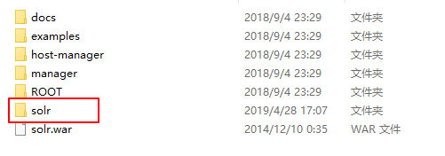

#### 2.1.4. 复制solr源文件解压目录下的`solr-4.10.3\example\lib\ext`

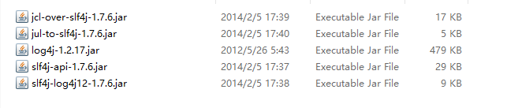

拷贝至tomcat下的`webapps/solr/WEB-INF/lib`下

#### 2.1.5. 创建solrhome

> 复制源文件中的 example/solr 至 d:/SoftWare 下

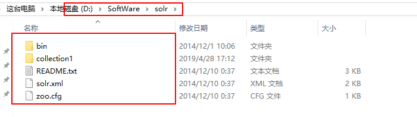

#### 2.1.6. 关联solrhome，修改tomcat中的solr下的web.xml文件

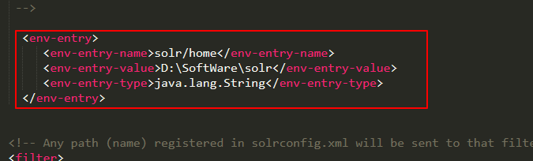

```xml
<env-entry>
	<env-entry-name>solr/home</env-entry-name>
    <env-entry-value>D:\SoftWare\solr</env-entry-value>
    <env-entry-type>java.lang.String</env-entry-type>
</env-entry>
```


#### 2.1.7. 启动Tomcat

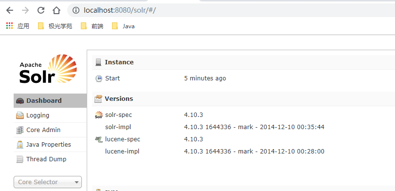


### 2.2. 主要概念

#### 2.2.1. collection和core

collection和core其实可以看成功一个概念，都是同一种数据格式的集合，可以对照数据库中的一张表。

在solr集群的情况下，我们称这张表叫collection，在单机的情况下，我们叫它core。

#### 2.2.2. `Document`

一组字段及其值。文档是集合中数据的基本单位。文档被分配给使用标准哈希的分片，或者指定在文档 ID 中指定一个分片。文档在每次写入操作后进行版本控制。

可以把一个商品的对象看作是一个Document，数据库的一条记录也可看做是一个文档。

#### 2.2.3. `Field`

filed从字面就能看出它的含义，就是字段，或者称为域，可理解为数据库中的一张表中的字段，对象中的每一个属性可以看作是一个Field。

我们在存储数据时，为每个filed赋值，可对照数据库insert时，为每个字段插入值。

```xml
<field name="id" type="string" indexed="true" stored="true" required="true" multiValued="false" />
```

| 属性名        | 含义                               | 可取值                                                       |
| ------------- | ---------------------------------- | ------------------------------------------------------------ |
| `name`        | filed的名称                        | 任意设置                                                     |
| `type`        | field的数据类型                    | `int`、 `string`、 `strings`、 `long`等                      |
| `indexed`     | 是否构建索引                       | true：可以通过该字段查询；<br />false：不能根据该字段查询    |
| `stored`      | 是否存储                           | true：查询结果时返回该字段的值；<br />false：不会存储该字段的值，查询到结果时也不会返回该字段的值 |
| `required`    | 是否必填                           | true：该字段的值不能为空<br />false：该字段的值可以为空      |
| `multiValued` | 是否可以存储多个值，例如list或数组 | true：可以存储多个值；<br />false：只能存储单个值            |

#### 2.2.4. `copyField`

其作用是将一个field中的数据复制到另一个域中

```xml
<copyField source="url" dest="text"/>
```


#### 2.2.5. `dynamicField`

动态字段允许 Solr 对您在架构中未明确定义的字段进行索引。动态字段就像一个常规的字段，除了它有一个带有通配符的名字。在作为索引文档时，与任何明确定义的字段都不匹配的字段可以与动态字段匹配。

```xml
<dynamicField name="*_i" type="int" indexed="true"  stored="true"/>
```

### 2.3. 控制台基本使用

#### 2.3.1. 新增文档

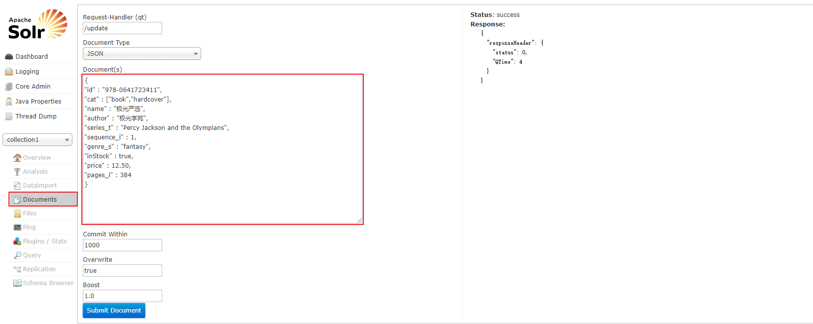

#### 2.3.2. 查询文档

1. 查询所有

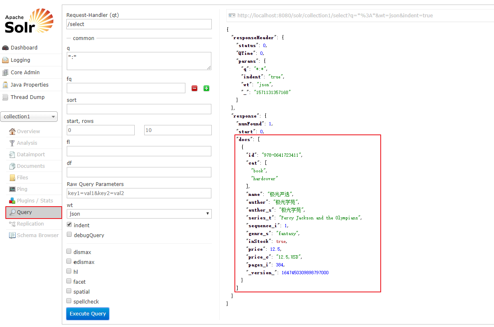

| 标识符       | 说明                                                         |
| ------------ | ------------------------------------------------------------ |
| `q`          | 查询条件，例如： \*:\* 、`title:'Solr'`                      |
| `fq`         | 过滤查询filter query，例如： `price:[12 TO 15]`,根据条件查询得到数据的集合后进行过滤 |
| `sort`       | 排序，例如：`price desc`或者 `price asc`                     |
| `start`      | 分页开始索引                                                 |
| `rows`       | 要查询的记录数                                               |
| `fl`         | 设置返回的field，多个用 `,`隔开                              |
| `df`         | 默认查询的field                                              |
| `wt`         | 指定输出格式，可以有 xml, json, php, phps。                  |
| `indent`     | 是否进行格式化返回结果                                       |
| `debugQuery` | 在返回结果是否显示Debug信息                                  |
| `dismax`     | 对条件进行加权查询                                           |
| `edismax`    | 也是对查询条件进行加权查询，dismax的加强版                   |
| `hl`         | 高亮查询，<br />`hl.fl`:高亮显示的field<br />`hl.simple.pre`:高亮显示的前缀<br />`hl.simple.post`:高亮显示的后缀 |
| `facet`      | 是否开启统计查询<br />`facet.query`：`统计的条件`<br />`facet.field`：统计的field |

| 条件符 | 说明                                               |
| ------ | -------------------------------------------------- |
| `:`    | 等值查询，例如：`author:'极光'`                    |
| `~`    | 模糊查询，例如：`author~'极光'`                    |
| `?`    | 匹配单个字符，例如：`author:?`                     |
| `*`    | 匹配多个字符，例如：`author:*`                     |
| `||`   | 条件或者的关系，例如： `author:'极光'||'jiguang'`  |
| `AND`  | 条件或者的关系，例如： `author:'极光'AND'jiguang'` |
| `[]`   | 范围查询，例如：`price:[10 TO 200]`                |


### 2.4. 中文分词器

#### 2.4.1. IK Analyzer简介

​	IK Analyzer 是一个开源的，基亍 java 语言开发的轻量级的中文分词工具包。从 2006年 12 月推出 1.0 版开始， IKAnalyzer 已经推出了 4 个大版本。最初，它是以开源项目Luence 为应用主体的，结合词典分词和文法分析算法的中文分词组件。从 3.0 版本开始，IK 发展为面向 Java 的公用分词组件，独立亍 Lucene 项目，同时提供了对 Lucene 的默认
优化实现。在 2012 版本中， IK 实现了简单的分词歧义排除算法，标志着 IK 分词器从单纯的词典分词向模拟语义分词衍化 。


#### 2.4.2. IK Analyzer配置

1. 把IkAnalyzer 的jar包添加到solr工程的lib目录下
2. 把IKAanlyzer下的classes拷贝到solr工程的WEB-INF目录下

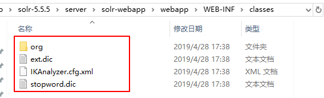

3. 修改 `solrhome/collection1/conf/schema.xml`，在其中添加FiledType

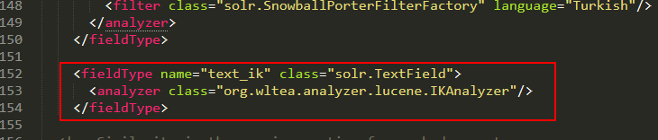

```xml
<fieldType name="text_ik" class="solr.TextField">  
   <!-- 索引时候的分词器 -->
   <analyzer type="index" isMaxWordLength="false" class="org.wltea.analyzer.lucene.IKAnalyzer"/>   
   <!-- 查询时候的分词器 -->
   <analyzer type="query" isMaxWordLength="true" class="org.wltea.analyzer.lucene.IKAnalyzer"/>   
</fieldType>
```


#### 2.4.3. 测试

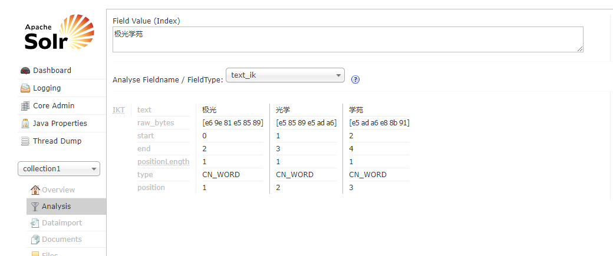

## 三、Solr数据访问

### 3.1. SolrJ的基本使用

#### 3.1.1. 配置Field

```xml
<field name="book_cat" type="text_general" indexed="true" stored="true"/>
<field name="book_name" type="text_ik" indexed="true" stored="true"/>
<field name="book_author" type="text_ik" indexed="true" stored="true"/>
<field name="book_inStock" type="text_ik" indexed="true" stored="true"/>
<field name="book_price" type="double" indexed="true" stored="true"/>
<field name="book_keywords" type="text_general" indexed="true" stored="true"  multiValued="true"/>

<copyField source="book_name" dest="book_keywords"/>
<copyField source="book_author" dest="book_keywords"/>
```


#### 3.1.2. 创建Maven工程

> 略

#### 3.1.3. 完善依赖

```xml
	<dependencies>
        <dependency>
            <groupId>org.apache.solr</groupId>
            <artifactId>solr-solrj</artifactId>
            <version>5.5.0</version>
        </dependency>
        <dependency>
            <groupId>junit</groupId>
            <artifactId>junit</artifactId>
            <version>4.12</version>
        </dependency>

    </dependencies>
```

#### 3.1.4. 测试程序

```java
public class SolrClientTest {

    /**
     * 测试保存操作
     */
    @Test
    public void testUpdate() throws Exception{
        // 创建Solr服务器客户端
        HttpSolrClient client = new HttpSolrClient("http://localhost:8080/solr/");
        // 创建文档
        SolrInputDocument solrInputDocument = new SolrInputDocument();
        // 设置文档的数据
        solrInputDocument.addField("id", "solrClient");
        solrInputDocument.addField("book_cat", "book_cat");
        solrInputDocument.addField("book_name", "极光严选");
        solrInputDocument.addField("book_author", "极光学苑");
        solrInputDocument.addField("book_inStock", true);
        solrInputDocument.addField("book_price", 200.05);
        // 保存文档
        UpdateResponse response = client.add("book", solrInputDocument);

        System.out.println(response.toString());

        // 提交
        client.commit("book");
    }

    @Test
    public void testGetById() throws Exception{
        // 创建Solr服务器客户端
        HttpSolrClient client = new HttpSolrClient("http://localhost:8080/solr/");
        // 根据主键进行查询
        SolrDocument solrDocument = client.getById("book", "bean00001");
        System.out.println(solrDocument);
    }

    @Test
    public void testQueryByExample() throws Exception{
        // 创建Solr服务器客户端
        HttpSolrClient client = new HttpSolrClient("http://localhost:8080/solr/");
        // 创建查询条件
        SolrQuery solrQuery = new SolrQuery("book_author:'极光'");
        // 执行查询
        QueryResponse queryResponse = client.query("book", solrQuery);

        SolrDocumentList results = queryResponse.getResults();

        System.out.println(results.get(0));
    }
}

```

### 3.2. SpringDataSolr的使用

#### 3.2.1. Spring Data Solr 简介

> 使用SolrJ是最基本的操作方式，例如操作MySQL使用的JDBC，而在实际的应用中往往都会对其再封装，以使用更加方便，Spring Data Solr即是对SolrJ的封装，其目的是更好的继承到Spring应用中。

#### 3.2.2. Spring Data Solr的基本使用

1. 创建Maven工程

> 略

2. 完善依赖信息

```xml
	<dependencies>
        <dependency>
            <groupId>org.apache.solr</groupId>
            <artifactId>solr-solrj</artifactId>
            <version>5.5.0</version>
        </dependency>
        <dependency>
            <groupId>junit</groupId>
            <artifactId>junit</artifactId>
            <version>4.12</version>
        </dependency>
        <dependency>
            <groupId>org.springframework.data</groupId>
            <artifactId>spring-data-solr</artifactId>
            <version>2.0.1.RELEASE</version>
        </dependency>
        <dependency>
            <groupId>org.springframework</groupId>
            <artifactId>spring-test</artifactId>
            <version>4.3.6.RELEASE</version>
        </dependency>

    </dependencies>
```

3. 完善Spring Data Solr配置信息

```xml
<?xml version="1.0" encoding="UTF-8"?>
<beans xmlns="http://www.springframework.org/schema/beans"
       xmlns:xsi="http://www.w3.org/2001/XMLSchema-instance"
       xmlns:solr="http://www.springframework.org/schema/data/solr"
       xsi:schemaLocation="http://www.springframework.org/schema/beans
    http://www.springframework.org/schema/beans/spring-beans.xsd
    http://www.springframework.org/schema/data/solr
    http://www.springframework.org/schema/data/solr/spring-solr.xsd">

    <!-- 配置Solr服务地址 -->
    <solr:solr-client id="solrClient" url="http://localhost:8983/solr/demo" />

    <!-- 配置可用的SolrTemplate -->
    <bean id="solrTemplate" class="org.springframework.data.solr.core.SolrTemplate">
        <constructor-arg ref="solrClient" />
    </bean>
</beans>
```

4. Solr的Document

```java
public class BookInfo {

    @Field("id")
    private String id;
    @Field("book_name")
    private String name;
    @Field("book_author")
    private String author;
    @Field("book_series_t")
    private String series;
    @Field("book_inStock")
    private Boolean inStock;
    @Field("book_price")
    private double price;
    @Field("book_pages_i")
    private Integer pages;


    // getter/setter方法 toString方法
}
```

5. 测试程序

```java
@ContextConfiguration(locations = {"classpath:spring/applicationContext-solr.xml"})
@RunWith(SpringJUnit4ClassRunner.class)
public class SolrTemplateTest {

    @Autowired
    private SolrTemplate solrTemplate;

    @Test
    public void testUpdate(){

        // 创建文档
        SolrInputDocument solrInputDocument = new SolrInputDocument();
        // 设置文档的数据
        solrInputDocument.addField("id", "solrTemplate");
        solrInputDocument.addField("book_cat", "book_cat");
        solrInputDocument.addField("book_name", "极光严选");
        solrInputDocument.addField("book_author", "极光学苑");
        solrInputDocument.addField("book_inStock", true);
        solrInputDocument.addField("book_price", 200.05);

        solrTemplate.saveDocument(solrInputDocument);

        solrTemplate.commit();
    }
    
    @Test
    public void testSaveBean(){
        // 创建对象并且设置对象的属性值
        BookInfo bookInfo = new BookInfo();
        bookInfo.setId("bean00001");
        bookInfo.setName("bean极光严选");
        bookInfo.setAuthor("bean极光学苑");
        bookInfo.setCat("goods_cat");
        bookInfo.setInStock(true);
        bookInfo.setPrice(1000.10);
        // 保存
        solrTemplate.saveBean(bookInfo);

        solrTemplate.commit();
    }

    @Test
    public void testGetById(){
        BookInfo bookInfo = solrTemplate.getById(new String("solrTemplate"), BookInfo.class);

        System.out.println(bookInfo);
    }

    @Test
    public void testBatchUpdate(){
        List list = new ArrayList<BookInfo>();
        for(int i = 1; i<=100; i++){
            BookInfo bookInfo = new BookInfo();
            bookInfo.setId("book_0000"+i);
            bookInfo.setName("bean极光严选"+i);
            bookInfo.setAuthor("bean极光学苑");
            bookInfo.setCat("goods_cat");
            bookInfo.setInStock(true);
            bookInfo.setPrice(1000.10+i);

            list.add(bookInfo);
        }

        solrTemplate.saveBeans(list);
        solrTemplate.commit();
    }

    @Test
    public void testQueryPage(){

        // 构建查询条件
        SimpleQuery query = new SimpleQuery("book_name:'极光'");

        // 设置分页信息
        query.setPageRequest(new PageRequest(0,10));

        // 执行查询
        ScoredPage<BookInfo> page = solrTemplate.queryForPage(query, BookInfo.class);

        // 总记录数+分页数据
        System.out.println(page.getTotalElements());
        System.out.println(page.getContent());
    }

    @Test
    public void testQueryByCriteria(){
        // 构建查询条件
        Query query = new SimpleQuery();
        Criteria criteria = new Criteria("book_name").contains("4");
        query.addCriteria(criteria);

        ScoredPage<BookInfo> page = solrTemplate.queryForPage(query,BookInfo.class);
        System.out.println(page.getContent());
    }
    @Test
    public void testDeleteById(){
        // 根据主键删除
        UpdateResponse response = solrTemplate.deleteById("solrTemplate");
        System.out.println(response.getStatus());
    }


    @Test
    public void deleteAll(){
        solrTemplate.delete(new SimpleQuery("*:*"));
        solrTemplate.commit();
    }
}
```


## 四、商品数据批量导入

### 4.1. 需求分析

> 商品的海量数据查询，需要从Solr系统中查询得到，而现在商品数据存储在MySQL数据库中，所以需要先把商品数据导入到Solr系统中，步骤：
>
> 1. 从MySQL数据库中查询得到所有审核通过的商品
> 2. 把商品数据存入Solr系统中


### 4.2. 准备工作

#### 4.2.1. 配置Field

```xml
<field name="goods_name" type="text_ik" indexed="true" stored="true" />
<field name="goods_label" type="text_ik" indexed="true" stored="true" />
<field name="goods_sellpoint" type="text_ik" indexed="true" stored="true" />
<field name="goods_price" type="double" indexed="true" stored="true" />
<field name="goods_picUrl" type="string" indexed="true" stored="true" />
<field name="goods_seller" type="text_ik" indexed="true" stored="true" />
<field name="goods_brand" type="string" indexed="true" stored="true" />
<field name="goods_category" type="string" indexed="true" stored="true" />
```

```xml
<field name="goods_keywords" type="text_ik" indexed="true" stored="false"  multiValued="true"/>
<copyField source="goods_name" dest="goods_keywords" />
<copyField source="goods_label" dest="goods_keywords" />
<copyField source="goods_sellpoint" dest="goods_keywords" />
<copyField source="goods_seller" dest="goods_keywords" />
<copyField source="goods_brand" dest="goods_keywords" />
<copyField source="goods_category" dest="goods_keywords" />
```

#### 4.2.1. 设置Document类

> 添加 `@Field` 注解

```java
public class GoodsSpu implements Serializable {
    @Field
    private Long id;
    @Field("goods_name")
    private String name;
    @Field("goods_seller")
    private String sellerName;

    private Long sellerId;
    @Field("goods_label")
    private String label;
    @Field("goods_sellPoint")
    private String sellPoint;

    private Long category1Id;

    private Long category2Id;

    private Long category3Id;
    @Field("goods_category")
    private String categoryName;

    private Long brandId;
    @Field("goods_brand")
    private String brandName;
    @Field("goods_price")
    private BigDecimal price;
    @Field("goods_picUrl")
    private String picUrl;
    
 	// 其他属性 getter /setter方法   
}
```

#### 4.2.3. 创建数据导入工程

1. 创建 `jiguangyanxuan-util-solr` ，并完成相关依赖
   1. Spring的相关依赖
   2. Solr的相关依赖
2. 完善相关配置信息
   1. Spring的相关配置
   2. Solr的相关配置

### 4.3. 查询商品数据

```java
 	@Autowired
    private GoodsSpuMapper goodsSpuMapper;

    //查询审核通过的商品列表
    private List<GoodsSpu> queryGoodsSpu(){
        GoodsSpuExample example = new GoodsSpuExample();
        // 商品状态是审核通过的
        example.createCriteria().andStatusEqualTo("1");

        // 执行查询
        List<GoodsSpu> goodsList = goodsSpuMapper.selectByExample(example);

        return goodsList;
    }
```

### 4.4. 导入到Solr库中

#### 4.4.1. 导入数据

```java
    @Autowired
    private SolrTemplate solrTemplate;

    public void impotToSolr(){
        // 查询商品
        List<GoodsSpu> goodsSpus = queryGoodsSpu();

        // 导入到Solr库
        solrTemplate.saveBeans(goodsSpus);

        solrTemplate.commit();
    }
```

#### 4.4.1. BigDecimal类型转换问题解决

1. 自定义`CustomConverter`

```java
@WritingConverter
public class CustomConverter implements Converter<BigDecimal, Double> {

    public Double convert(BigDecimal source) {
    	if(source == null){
            retrn null;
    	}
        return source.doubleValue();
    }
}
```

2. 启用自定义的`CustomConverter`

```xml
<!-- 启用自定义的类型转换器 -->
<bean id="customConversions" class="org.springframework.data.solr.core.convert.CustomConversions">
    <constructor-arg>
        <list>
            <bean class="com.itjiguang.solr.format.CustomConversionService" />
        </list>
    </constructor-arg>
</bean>

<!-- SolrDocument的转换器 -->
<bean id="mappingSolrConverter" class="org.springframework.data.solr.core.convert.MappingSolrConverter">
    <constructor-arg>
        <bean class="org.springframework.data.solr.core.mapping.SimpleSolrMappingContext"/>
    </constructor-arg>
    <property name="customConversions" ref="customConversions"/>
</bean>

<bean class="org.springframework.data.solr.core.SolrTemplate" >
    <constructor-arg ref="solrClient" />
    <property name="solrCore" value="goods" />
    <!-- 在solrTemplate中启用MappingSolrConverter -->
    <property name="solrConverter" ref="mappingSolrConverter" />
</bean>
```


## 五、 关键词搜索

### 5.1. 需求分析


> 在首页的输入框中输入内容，点击搜索，完成根据关键词搜索商品数据

### 5.2.  准备工作

#### 5.2.1. 创建服务接口工程

> 创建 `jiguangyanxuan-search-api`,
>
> 完善依赖信息

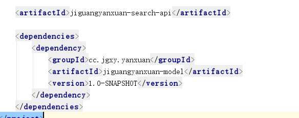

#### 5.2.2. 创建服务实现工程

> 创建 `jiguangyanxuan-search-service`
>
> 完善依赖信息
>
> web.xml
>
> Spring相关配置
>
> Dubbox相关信息

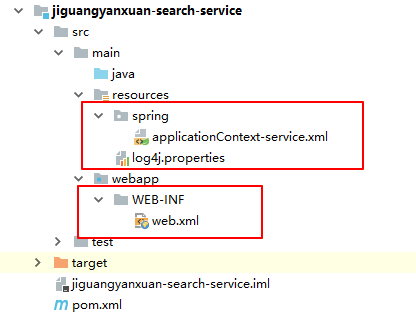

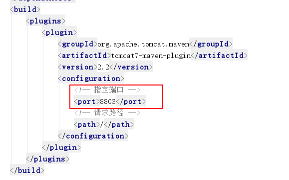

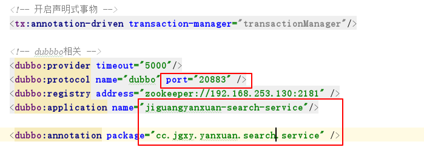

#### 5.2.3. 创建web工程

> 创建 `jiguangyanxuan-search-server`工程
>
> 完善依赖信息
>
> web.xml信息
>
> Spring相关配置
>
> Dubbox相关配置

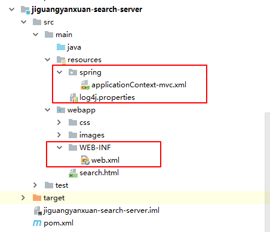

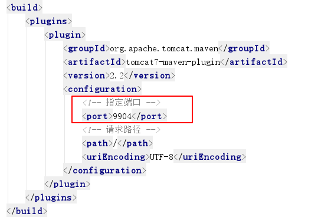

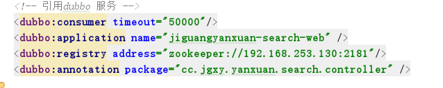


### 5.3. 后台代码

#### 5.3.1. 服务接口

```java
public interface IGoodsSearchService {

    /**
     * 根据关键词进行商品搜索
     * @param keyWords
     * @return
     */
    public Map<String, Object> query(Map keyWords);
}
```


#### 5.3.2. 服务实现

```java
    @Autowired
    private SolrTemplate solrTemplate;

    @Override
    public Map<String, Object> query(Map map) {
        // 获取查询关键字
        String keyword = (String)map.get("keywords");

        // 根据关键字进行查询solr库
        // 构建查询条件
        Criteria criteria = new Criteria("goods_keywords").contains(keyword);
        SimpleQuery query = new SimpleQuery(criteria);

        // 执行查询
        ScoredPage<GoodsInfo> pageData = solrTemplate.queryForPage(query, GoodsInfo.class);

        HashMap<String, Object> resultMap = new HashMap<>();
        resultMap.put("keywords",keyword);
        resultMap.put("rows",pageData.getContent());
        resultMap.put("total",pageData.getTotalElements());

        return resultMap;
    }
```


#### 5.3.3. 控制层

```java
@RestController
@RequestMapping("/search")
public class GoodsSearchController {

    @Reference
    private IGoodsSearchService goodsSearchService;

    @GetMapping
    public ResponseEntity<Map> query(@RequestParam Map params){
        Map<String, Object> resultMap = goodsSearchService.query(params);
        return new ResponseEntity<>(resultMap, HttpStatus.OK);
    }
}
```


### 5.4. 前端代码

添加angular的相关js文件

#### 5.4.1. 系统模块

```js
angular.module("yanxuan", []);
```

#### 5.4.2. service

```js
angular.module("yanxuan").service("searchService", function ($http) {
    
    url = "/search";

    this.get = function(url, options){
        // 如果是根据主键ID进行查询，那么需要修改资源路径
        if(options !== undefined && typeof options !== "object"){
            url = url + "/"+ options;
        }
        // 完成的是分页条件查询
        return $http.get(url, {params: options});
    };
});
```

#### 5.4.3. Controller

```js
// 定义brandController
angular.module("yanxuan").controller("searchController", function ( $scope, searchService) {

    $scope.search = function () {
        searchService.get($scope.params).then(
            function (res) {
                $scope.result = res.data;
            }
        )
    }

});
```


#### 5.4.4. html页面

1. 引入js文件

```html
<script type="text/javascript" src="plugins/angular/angular.min.js"></script>
<script type="text/javascript" src="js/custom/app.module.js"></script>
<script type="text/javascript" src="js/custom/app.service.js"></script>
<script type="text/javascript" src="js/custom/app.controller.js"></script>
```

2. 设置angular应用

```html
<body ng-app="yanxuan" ng-controller="searchController">
```

3. 修改搜索框

```html
<form class="top">
    <input type="search" placeholder="请输入您感兴趣的商品、品牌" class="search_box" ng-model="params.keywords">
    <input type="submit" value="搜索" class="btn" ng-click="search()">
</form>
```

4. 展示查询得到的商品列表

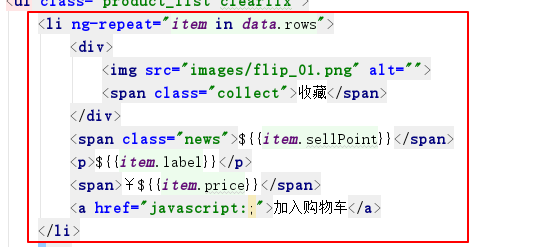