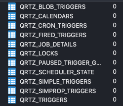

# 极光严选-第二十章-定时调度&项目总结

## 课程内容

- 定时调度
  - 简介
  - Quartz框架详解
- 系统功能
  - 秒杀商品定时更新
  - 订单延迟短信通知
- 项目总结


## 学习目标

- [ ] 了解流行的定时任务调度框架
- [ ] 能够记忆Quartz框架中的核心类及关系
- [ ] 能够使用Quartz完成`SimpleTrigger`的任务调度
- [ ] 能够使用Quartz完成`CronTrigger`的任务调度
- [ ] 能够使用Quartz完成任务的持久化操作
- [ ] 能够完成秒杀商品定时缓存的系统功能
- [ ] 能够完成订单未支付短信通知的系统功能
- [ ] 能够梳理项目中使用到的主要技术


## 一、 定时调度

定时任务调度是指基于给定**时间点**，给定**时间间隔**或者给定执行次数自动**执行任务**。

1. 支付系统每天凌晨1点跑批，进行一天清算，每月1号进行上个月清算；

2. 12306购票系统，超过30分钟没有成功支付订单的，进行回收处理；

   

### 1.1. 技术选型

- 传统架构
  - `Timer`：是一个定时器类，通过该类可以为指定的定时任务进行配置。`TimerTask`类是一个定时任务类，该类实现了Runnable接口，缺点异常未检查会中止线程；
  - `ScheduledExecutorService`：相对延迟或者周期作为定时任务调度，缺点没有绝对的日期或者时间；
  - `spring task`：配置简单功能较多，如果系统使用单机的话可以优先考虑spring定时器。
- 分布式架构
  - `Quartz`：Java事实上的定时任务标准。Quartz是一个开源的作业调度框架，它完全由Java写成，并设计用于J2SE和J2EE应用中。它提供了巨大的灵 活性而不牺牲简单性。你能够用它来为执行一个作业而创建简单的或复杂的调度。它有很多特征，如：数据库支持，集群，插件，EJB作业预构 建，JavaMail及其它，支持cron-like表达式等等。
  - `TBSchedule`：阿里早期开源的分布式任务调度系统。代码略陈旧，使用timer而非线程池执行任务调度。众所周知，timer在处理异常状况时是有缺陷的。而且`TBSchedule`作业类型较为单一，只能是获取/处理数据一种模式。还有就是文档缺失比较严重
  - `elastic-job`：当当开发的弹性分布式任务调度系统，功能丰富强大，采用`zookeeper`实现分布式协调，实现任务高可用以及分片。
  - `xxl-job`: 是大众点评员工徐雪里于2015年发布的分布式任务调度平台，是一个轻量级分布式任务调度框架，其核心设计目标是开发迅速、学习简单、轻量级、易扩展。

### 1.2. `Quartz`的基本使用

官网下载地址：http://www.quartz-scheduler.org/downloads/

#### 1.2.1. 核心概念

| 名称        | 描述                                                         |
| ----------- | ------------------------------------------------------------ |
| `Job`       | 要执行的业务逻辑，实现了`org.quartz.Job`接口的类；           |
| `JobDetail` | 定义了一个任务的相关属性，包括要执行的业务逻辑（Job）、任务的标识（名称）、任务在没有Trigger关联的时候是否自动删除、任务在执行过程中会用到的一些属性等； |
| `Trigger`   | 触发器，定义了一个触发策略，如：多久执行一次、执行几次，什么时间点执行。用于关联到`JobDetail`，一个`JobDetail`可以关联多个Trigger； |
| `Scheduler` | 调度器，是Quartz中的核心组件，它负责任务的调度、`JobDetail`、Trigger的管理，它包含了和定时调度相关的所有属性和操作。一般一个程序中就定义一个Scheduler组件。 |

#### 1.2.2. 入门案例

1. 创建Maven工程，并添加依赖信息

```xml
<dependencies>
  <!--Quartz的核心依赖-->
  <dependency>
    <groupId>org.quartz-scheduler</groupId>
    <artifactId>quartz</artifactId>
    <version>2.3.0</version>
  </dependency>
  <!--Junit单元测试依赖-->
  <dependency>
    <groupId>junit</groupId>
    <artifactId>junit</artifactId>
    <version>4.12</version>
  </dependency>
</dependencies>
```

2. 创建`Job`的实现类`HelloJob`

```java
public class HelloJob implements Job {

    public void execute(JobExecutionContext jobExecutionContext) throws JobExecutionException {
        System.out.println("this is quartz say: hello!");
    }
}
```

3. 编写测试程序，执行`HelloJob`

```java
public class DemoTest {

    @Test
    public void test(){

        try {
            // 1. 创建调度工厂，创建调度器
            StdSchedulerFactory factory = new StdSchedulerFactory();
            Scheduler scheduler = factory.getScheduler();

            // 2. 创建执行的任务
            JobDetail helloJob = JobBuilder.newJob(HelloJob.class).withIdentity("job1", "group1").build();

            // 3. 创建触发器
            Trigger trigger = TriggerBuilder.newTrigger().withIdentity("job1", "group1").startNow().build();

            // 4. 设置任务和触发器到调度器
            scheduler.scheduleJob(helloJob, trigger);

            // 5. 调度器执行任务
            scheduler.start();
            System.out.println("任务已启动");

            Thread.sleep(6000L);

            // 6. 停止调度器
            scheduler.shutdown(true);

        } catch (SchedulerException e) {
            e.printStackTrace();
        } catch (InterruptedException e) {
            e.printStackTrace();
        }
    }
}
```

#### 1.2.3. 核心接口

| 接口                        | 描述                                |
| --------------------------- | ----------------------------------- |
| `org.quartz.Scheduler`      | 完成任务的调度，执行                |
| `org.quartz.Job`            | 要执行的业务逻辑                    |
| `org.quartz.JobDetail`      | 任务执行时的Job实例，包含了业务参数 |
| `org.quartz.Trigger`        | 触发器，定义了Job的执行策略         |
| `org.quartz.JobBuilder`     | 用来根据Job创建`JobDetail`的实例    |
| `org.quartz.TriggerBuilder` | 用来创建触发器实例                  |

### 1.3. Trigger

​	Quartz提供的调度策略主要分为两种情况：

- `SimpleTrigger`
  - 在一个指定时间段内执行一次作业任务或是在指定的时间间隔内多次执行作业任务，例如：在首次执行之后，每间隔10秒执行一次，一共执行10次。
- `CronTrigger`
  - 当需要一个基于日历般时刻进行任务调度时，而不是指定精确的间隔时间和执行次数，就需要使用`CronTrigger`进行设置任务调度策略，例如：每个月的第一天上午8点，甚至每个月的第一天上午8点至9点之间每个5分钟执行一次。

#### 1.3.1. `SimpleTrigger`

1. 定义Job

```java
public class SimpleJob implements Job {

    public void execute(JobExecutionContext jobExecutionContext) throws JobExecutionException {
      // 获取JobKey，即 groypname.jobname
      JobKey key = jobExecutionContext.getJobDetail().getKey();  
      System.out.println(key +", this is simple job say: hello! " + new Date());
    }
}
```

2. 使用已提供的api完成任务制定策略的设置。

```java
public class SimpleTriggerTest {

  @Test
  public void test() throws Exception{
    // 1. 创建调度器
    StdSchedulerFactory factory = new StdSchedulerFactory();
    Scheduler scheduler = factory.getScheduler();

    // 2. 创建JobDetail
    JobDetail jobDetail = JobBuilder.newJob(HelloJob.class)
      .withIdentity("helloJob", "group1").build();

    // 3. 创建Triiger
    SimpleTrigger simpleTrigger = (SimpleTrigger)TriggerBuilder.newTrigger()
      .withIdentity("simpleTrigger", "group1")
      .startNow()
      .withSchedule(SimpleScheduleBuilder.simpleSchedule()
                    .withIntervalInSeconds(3) // 每隔3秒执行一次
                    .withRepeatCount(3)) // 重复执行3次
      .forJob(jobDetail)
      .build();

    // 4. 加入到调度器中，等待被执行
    scheduler.scheduleJob(jobDetail, simpleTrigger);

    scheduler.start();

    Thread.sleep(10000L);
		
    scheduler.shutdown(true);
  }
}
```

#### 1.3.2. `CronTrigger`

1. 定义Job

```java
public class CronJob implements Job {

    public void execute(JobExecutionContext jobExecutionContext) throws JobExecutionException {
      // 获取JobKey，即 groypname.jobname
      JobKey key = jobExecutionContext.getJobDetail().getKey();  
      System.out.println(key +", this is cron job say: hello! " + new Date());  
    }
}
```

2. 使用`Cron`表达式指定执行策略

```java
public class CronTriggerTest {

  @Test
  public void test() throws Exception {
    // 获取调度器
    Scheduler scheduler = new StdSchedulerFactory().getScheduler();

    // 创建JobDetail实例
    JobDetail jobDetail = JobBuilder.newJob(HelloJob.class).withIdentity("helloJob", "cron").build();

    // 创建触发器
    CronTrigger trigger = TriggerBuilder.newTrigger().startNow().forJob(jobDetail).withIdentity("helloJob", "cron")
      .withSchedule(CronScheduleBuilder
                    .cronSchedule("59 * * * * ? *")) // 时间只要一到59秒就执行一次，即每分钟执行一次
      .build();

		// 把任务和触发器添加到调度器，准备执行
    scheduler.scheduleJob(jobDetail, trigger);
		// 执行调度器中任务
    scheduler.start();

    Thread.sleep(100000L);

    scheduler.shutdown(true);
  }
}
```

#### 1.3.3. `Cron`表达式的使用

##### 1.3.3.1. 格式说明

Quartz提供的`cron`表达式由七个元素组成，其格式是：

```
[Seconds] [Minutes] [Hours] [Day-of-Month] [Month] [Day-of-Week] [Year]
```

| 名称         | 是否必须 | 允许的值           | 特殊字符      |
| ------------ | -------- | ------------------ | ------------- |
| Seconds      | 是       | 0-59               | , - * /       |
| Minutes      | 是       | 0-59               | , - * /       |
| Hours        | 是       | 0-23               | , - * /       |
| Day-of-Month | 是       | 1-31               | , - * ? / L W |
| Month        | 是       | 0-11               | , - * /       |
| Day-of-Week  | 是       | 1-7（1代表星期天） | , - * ? / L # |
| Year         | 否       |                    | , - * /       |

##### 1.3.3.2. 特殊字符说明

| 字符 | 描述                                                         | 示例                                                         |
| ---- | ------------------------------------------------------------ | ------------------------------------------------------------ |
| ,    | 表示列出枚举值                                               | `0,20,40 * * * * ?` 每到0秒、20秒、40秒执行任务，即每分钟执行3次 |
| -    | 表示范围                                                     | `* 5-20 * * * ?` 每小时的5分到20分每秒执行一次               |
| *    | 表示任意值                                                   | `* * * * * ?` 每秒执行一次                                   |
| /    | 表示首次执行后，每隔固定时间执行一次                         | `*/5 * * * * ?`每隔5秒钟执行一次                             |
| L    | 表示最后的，应用在日或星期域中                               | `* * * L * ?` 每个月最后一天，每秒执行一次                   |
| W    | 表示有效工作日                                               | `* * * LW * ?`每个月的最后一个工作日<br />`* * * 15W * ?` 这里的15表示每个月的15日，会找到距离15日最近的工作日执行任务 |
| ？   | 表示没有设置具体的值，常用在`Day-of-Month` `Day-of-Week`两个域中 | 例如之前的示例                                               |
| #    | 用在`Day-of-Week`表示每个月的第几个周                        | `* * * ？ * 6#3`表示每个月的第三个周五                       |

⚠️ Day-of-Month 和 Day-of-Week不能同时设置具体的值，如果其中一个值设置了具体的值，另一个值就需要使用 ? 。

##### 1.3.3.3. 常用示例

| 表达式                 | 含义                                |
| ---------------------- | ----------------------------------- |
| `*/5 * * * * ?`        | 每隔5秒执行一次                     |
| `0 */1 * * * ?`        | 每隔一分钟执行一次                  |
| `0 0 23 * * ?`         | 每天23点执行一次                    |
| `0 0 1 * * ?`          | 每天凌晨一点执行一次                |
| `0 0 1 1 * ?`          | 每个月1号凌晨1点执行一次            |
| `0 0 23 L * ?`         | 每个月最后一天的23点执行一次        |
| `0 0 1 ? * L`          | 每周星期天凌晨1点执行一次           |
| `0 26,29,33 * * * ?`   | 在26、29、33分时执行一次            |
| `0 0 0,13,18,21 * * ?` | 每天0点、13点、18点、21点都执行一次 |

### 1.4. Job和`JobDetail`

Job是开发者根据业务逻辑编写的任务执行程序，其中会进行数据处理，在任务调度的过程中是把Job实例化的到`JobDetail`，业务数据就需要传递到`JobDetail`中，简介传递到Job的处理方法中。

#### 1.4.1. 传递参数

1. 通过`JobDetail`传递参数

```java
// 传递普通类型的参数
JobDetail helloJob = JobBuilder.newJob(HelloJob.class)
  .withIdentity("job1", "group1")
  .usingJobData("stringKey", "jiguang") // 设置String类型参数
  .build();

// 创建参数对象
JobDataMap jobDataMap = new JobDataMap();
jobDataMap.put("name", "itjiguang");
// 实例化JobDetail
JobDetail helloJob = JobBuilder.newJob(HelloJob.class)
  .withIdentity("job1", "group1")
  .usingJobData(jobDataMap)  // 传递参数对象
  .build();

```

2. 通过Trigger传递参数

```java
TriggerBuilder.newTrigger().withIdentity("trigger1", "group1")
    .forJob(jobDetail)
    .usingJobData("name", "itjiguang")
    .startNow().build();
```


#### 1.4.2. 参数接收

```java
public void execute(JobExecutionContext jobExecutionContext) throws JobExecutionException {

  // 通过JobDetail中的参数对象，根据key值获取到相应的参数
  String stringKey = jobExecutionContext.getMergedJobDataMap().getString("stringKey");
  System.out.println(stringKey);

  JobKey key = jobExecutionContext.getJobDetail().getKey();
  System.out.println("this is quartz say: hello!"+key+"--- date:"+new Date());
}
```

### 1.5. 数据存储

#### 1.5.1. 存储方式

Quartz提供的存储方式有两种：`RAM`（存储在内存中）和`JDBC`（存储到数据库中）。

1. `RAMJobStore`

   这是官方默认的方式，把任务调度过程中的数据保存到内存中，非常快，轻量级，但是当应用程序重启后这些信息会丢失掉；。

   其配置方式为：

```properties
org.quartz.jobStore.class = org.quartz.simpl.RAMJobStore
```

2. `JDBC-JobStore`

   把任务调度过程中的数据通过jdbc保存到关系型数据库中，根据事务的行为，可以有两种选择：

| 存储方式      | 说明                                                      |
| ------------- | --------------------------------------------------------- |
| `JobStoreTX`  | 由Quartz自身进行管理事务，每个操作后都执行提交或者回滚。  |
| `JobStoreCMT` | 由使用Quartz的应用程序进行管理事务，且已经开启的JTA事务。 |

配置方式

```properties
org.quartz.jobStore.class = org.quartz.impl.jdbcjobstore.JobStoreTX
# 或者
org.quartz.jobStore.class = org.quartz.impl.jdbcjobstore.JobStoreCMT
```

#### 1.5.2. 其他配置

​	本课程中采用的`JobStoreTX`，在该情况下主要配置的项：

```properties
# 【必须】驱动的授权类，根据不同的数据库进行对应的配置，可以在org.quartz.impl.jdbcjobstore包下进行查找
org.quartz.jobStore.driverDelegateClass = org.quartz.impl.jdbcjobstore.StdJDBCDelegate

# 【必须】数据源的别名，与配置的数据源要能够匹配
org.quartz.jobStore.dataSource = myDS

# 【非必须】数据库中表名的前缀，官方提供的默认是以QRTZ_开头
org.quartz.jobStore.tablePrefix = QRTZ_

# 【非必须】设置为TRUE不会出现序列化非字符串类到 BLOB 时产生的类版本问题
org.quartz.jobStore.useProperties = true

# 允许作业延迟的最大时间
org.quartz.jobStore.misfireThreshold = 60000

```

#### 1.5.3. 数据源配置

```properties
# 一下配置中的 myDS 是数据源的名称
org.quartz.dataSource.myDS.driver = com.mysql.jdbc.Driver
org.quartz.dataSource.myDS.URL = jdbc:mysql://localhost:3306/quartz_demo?useUnicode=true&characterEncoding=utf-8
org.quartz.dataSource.myDS.user = root
org.quartz.dataSource.myDS.password = 123456
org.quartz.dataSource.myDS.maxConnections = 30
```

#### 1.5.4. 数据库表

从下载的quartz软件包中`src/org/quartz/impl/jobstroe/` 下找到适合`MySQL`的`sql`脚本文件，在数据库中执行，即可看到官方提供的数据库表结构



表说明

| 表名                        | 说明                                                         |
| --------------------------- | ------------------------------------------------------------ |
| `qrtz_blob_triggers`        | 自定义的触发器以Blob的方式存储                               |
| `qrtz_calendars`            | 存放日历信息                                                 |
| `qrtz_cron_triggers`        | 存放`Cron`类型的触发器                                       |
| `qrtz_fired_triggers`       | 存放已触发的触发器                                           |
| `qrtz_job_details`          | 存放`JobDetail`的信息                                        |
| `qrtz_locks`                | 存储任务调度过程中使用的锁                                   |
| `qrtz_paused_trigger_graps` | 存放暂停执行的触发器                                         |
| `qrtz_scheduler_state`      | 存储调度器的状态信息                                         |
| `qrtz_simple_triggers`      | 存放Simple类型的触发器                                       |
| `qrtz_simprop_triggers`     | 存储`CalendarIntervalTrigger`和`DailyTimeIntervalTrigger`两种类型的触发器 |
| `qrtz_triggers`             | 存放触发器的基本信息                                         |

#### 1.5.5. 测试程序

1. 在工程中添加数据库的依赖

```xml
<dependency>
  <groupId>mysql</groupId>
  <artifactId>mysql-connector-java</artifactId>
  <version>5.1.47</version>
</dependency>
```

2. 保存任务、触发器、调度器信息

```java
public void testSaveJob(){
  // 获取当前的调度器
  Scheduler scheduler = new StdSchedulerFactory().getScheduler();

  // 创建执行任务
  JobDetail jobDetail = JobBuilder.newJob(HelloJob.class)
    .withIdentity("helloJob", "cron").build();

  // 创建触发器
  CronTrigger trigger = TriggerBuilder.newTrigger().startNow().forJob(jobDetail)
    .withIdentity("helloJob", "cron")
    .withSchedule(CronScheduleBuilder.cronSchedule("*/5 * * * * ? *")) // 每5秒执行一次
    .build();

  // 添加任务、触发器到调度器，会自动保存的数据库中
  scheduler.scheduleJob(jobDetail, trigger);
}

```

3. 任务调用

```java
public void testActionJob(){
	// 获取调度器
	Scheduler scheduler = new StdSchedulerFactory().getScheduler();
	// 启动调度器中任务,会从数据库中读取到任务和触发器的信息，再执行
	scheduler.start();
	
	Thread.sleep(100000L);

	// 关闭调度器
	scheduler.shutdown(true);
	
}
```


## 二、 Spring整合Quartz

### 2.1. 整合流程

#### 2.1.1. 完善依赖信息

```xml
<dependencies>
  <!--Quartz的核心依赖-->
  <dependency>
    <groupId>org.quartz-scheduler</groupId>
    <artifactId>quartz</artifactId>
    <version>2.3.0</version>
  </dependency>
  <!--Spring依赖-->
  <dependency>
    <groupId>org.springframework</groupId>
    <artifactId>spring-context-support</artifactId>
    <version>5.0.15.RELEASE</version>
  </dependency>
  <dependency>
    <groupId>org.springframework</groupId>
    <artifactId>spring-jdbc</artifactId>
    <version>5.0.15.RELEASE</version>
  </dependency>
  <!--Junit单元测试-->
  <dependency>
    <groupId>org.springframework</groupId>
    <artifactId>spring-test</artifactId>
    <version>5.0.15.RELEASE</version>
  </dependency>
  <dependency>
    <groupId>junit</groupId>
    <artifactId>junit</artifactId>
    <version>4.12</version>
  </dependency>
  <!--数据库驱动-->
  <dependency>
    <groupId>mysql</groupId>
    <artifactId>mysql-connector-java</artifactId>
    <version>5.1.47</version>
  </dependency>
</dependencies>
```

#### 2.1.2. 创建Job任务

1. `SimpleJob`

```java
public class SimpleJob implements Job {

    public void execute(JobExecutionContext context) throws JobExecutionException {

        JobKey key = context.getJobDetail().getKey();

        System.out.println("这是Spring整合Quartz之后的SimpleJob："+ new Date());
    }
}
```

2. `CronJob`

```java
public class CronJob implements Job {

    public void execute(JobExecutionContext context) throws JobExecutionException {
        JobKey key = context.getJobDetail().getKey();

        System.out.println("这是Spring整合Quartz后的CronJob："+ new Date());
    }
}
```

#### 2.1.3. 整合`SimpleTrigger`

1. 配置信息

```xml
<?xml version="1.0" encoding="UTF-8"?>
<beans xmlns="http://www.springframework.org/schema/beans"
       xmlns:xsi="http://www.w3.org/2001/XMLSchema-instance"
       xsi:schemaLocation="http://www.springframework.org/schema/beans http://www.springframework.org/schema/beans/spring-beans.xsd">

  <!--JobDetail-->
  <bean id="simpleJobDetail" class="org.springframework.scheduling.quartz.JobDetailFactoryBean">
    <property name="group" value="simepleGroup" />
    <property name="name" value="simpleJobDetail" />
    <property name="jobClass" value="com.itjiguang.quartz.job.SimpleJob" />
  </bean>

  <!--SimpleTrigger-->
  <bean id="simpleTrigger" class="org.springframework.scheduling.quartz.SimpleTriggerFactoryBean">
    <property name="group" value="simpleGroup" />
    <property name="jobDetail" ref="simpleJobDetail" />
    <property name="name" value="simepleTrigger" />
    <!--延迟5秒执行-->
    <property name="startDelay" value="5000" />
    <!--优先级-->
    <property name="priority" value="5" />
    <!--每间隔5秒执行一次-->
    <property name="repeatInterval" value="5000" />
    <!--首次执行后，执行10次-->
    <property name="repeatCount" value="10" />
  </bean>


  <bean class="org.springframework.scheduling.quartz.SchedulerFactoryBean" >
    <property name="triggers">
      <list >
        <ref bean="simpleTrigger"/>
      </list>
    </property>
  </bean>
</beans>
```

2. 测试程序

```java
@ContextConfiguration(locations = {"classpath:spring-quartz-simple.xml"})
@RunWith(SpringJUnit4ClassRunner.class)
public class SimpleJobTest {

    @Test
    public void test() throws Exception{
        while (true){

        }
    }
}
```

#### 2.1.4. 整合`CronTrigger`

1. 配置信息

```xml
<?xml version="1.0" encoding="UTF-8"?>
<beans xmlns="http://www.springframework.org/schema/beans"
       xmlns:xsi="http://www.w3.org/2001/XMLSchema-instance"
       xsi:schemaLocation="http://www.springframework.org/schema/beans http://www.springframework.org/schema/beans/spring-beans.xsd">


  <!--JobDetail-->
  <bean id="cronJobDetail" class="org.springframework.scheduling.quartz.JobDetailFactoryBean">
    <property name="group" value="cron" />
    <property name="name" value="cronJobDetail" />
    <property name="jobClass" value="com.itjiguang.quartz.job.CronJob" />
  </bean>

  <!--CronTrigger-->
  <bean id="cronTrigger" class="org.springframework.scheduling.quartz.CronTriggerFactoryBean">
    <property name="group" value="cron" />
    <property name="name" value="cronTrigger" />
    <property name="jobDetail" ref="cronJobDetail" />
    <property name="startDelay" value="5000" />
    <property name="cronExpression" value="*/5 * * * * ?" />
  </bean>

  <!--Scheduler-->
  <bean class="org.springframework.scheduling.quartz.SchedulerFactoryBean">
    <property name="triggers">
      <list>
        <ref bean="cronTrigger" />
      </list>
    </property>
  </bean>
</beans>
```

2. 测试程序

```java
@ContextConfiguration(locations = {"classpath:spring-quartz-cron.xml"})
@RunWith(SpringJUnit4ClassRunner.class)
public class CronJobTest {

    @Test
    public void test(){
        System.out.println(new Date());
        while (true){

        }
    }
}
```

### 2.2. 数据持久化

#### 2.2.1. 完善quartz配置

1. 在 resources 目录下创建 `quartz.properties` 文件
2. 参照之前的配置内容进行配置

#### 2.2.2. 启用配置信息

```xml
<bean class="org.springframework.scheduling.quartz.SchedulerFactoryBean" >
  <property name="triggers">
    <list >
      <ref bean="simpleTrigger"/>
    </list>
  </property>
  <property name="configLocation" value="classpath:quartz.properties" />
</bean>
```

### 2.3. 依赖注入的问题

#### 2.3.1. 测试

1. 编写实体类

```java
public class UserService{
	public void doSomeThing("user do some thing ....");
}
```

2. Spring管理实体类

```java
<bean class="com.itjiguang.entity.UserService" />
```

3. 在Job实体类中注入`UserService`，并调用

```java
public class SimpleJob extends QuartzJobBean {

	@Autowired
  private UserSerivce userService;

  public void execute(JobExecutionContext context) throws JobExecutionException {

    JobKey key = context.getJobDetail().getKey();
    
    userSerivce.doSomeThing();

    System.out.println("这是Spring整合Quartz之后的SimpleJob："+ new Date());
  }
}
```

4. 说明

   此时在执行任务调度时，会在控制台上包出`NullPointerException`的错误，出现的原因是Quartz在执行任务时不是通过`SimpleJob`进行执行，而是创建`JobDetail`再执行，而`JobDetail`是由`JobDetailFactory`创建的，是不被Spring进行管理的，向一个不被Spring管理的实例中进行依赖注入，显然是会失败的。

#### 2.3.2. 解决问题

1. Job实例的创建

让不被Spring管理的对象可以进行依赖注入就需要在创建Job的实例对象时给其赋予可以被注入的权限。Spring整合Quartz后默认是通过调用：`org.springframework.scheduling.quartz.AdaptableJobFactory` 中的`newJob()`方法进行创建实例

```java
public class AdaptableJobFactory implements JobFactory {

  @Override
  public Job newJob(TriggerFiredBundle bundle, Scheduler scheduler) throws SchedulerException {
    try {
      Object jobObject = createJobInstance(bundle);
      return adaptJob(jobObject);
    }
    catch (Throwable ex) {
      throw new SchedulerException("Job instantiation failed", ex);
    }
  }
}
```

2. 不被Spring容器管理的对象可以注入的方式

   `org.springframework.beans.factory.config.AutowireCapableBeanFactory` 接口中的 `autowireBean()`方法可以向一个对象中根据注入的注解完成依赖注入。

3. 自定义Job实例化工厂

```java
public class CustomJobFactory extends AdaptableJobFactory {

    @Autowired
    private AutowireCapableBeanFactory capableBeanFactory;

    @Override
    protected Object createJobInstance(TriggerFiredBundle bundle) throws Exception {
        Object jobInstance = super.createJobInstance(bundle);

        // 让实例中的属性可以被注入
        capableBeanFactory.autowireBean(jobInstance);

        return jobInstance;
    }
}
```

4. 启用自定义的工厂

```xml
<bean class="org.springframework.scheduling.quartz.SchedulerFactoryBean" >
  <property name="jobFactory" >
    <bean class="com.itjiguang.quartz.job.CustomJobFactory" />
  </property>
  <property name="triggers">
    <list >
      <ref bean="simpleTrigger"/>
    </list>
  </property>
  <property name="configLocation" value="classpath:quartz.properties" />
</bean>
```


## 三、系统功能

### 3.1. 定时缓存秒杀商品

#### 3.1.1. 需求分析

在电商网站中一般都会按照时段进行秒杀活动，在每个时段都会有特定的信息，那就需要定时把商品的信息从数据库读取到`Redis`数据库中。

#### 3.1.2. 准备工作

1. 创建`jiguangyanxuan-quartz-service` 工程
2. 完善依赖信息，包含：Spring、Quartz、Dao、Common等。
3. 完善`web.xml`

#### 3.1.3. 功能实现

1. 创建Job

```java
/**
 * 每次执行都需要从数据库中读取数据，保存到Redis中
 */
public class SecKillGoodsJob extends QuartzJobBean {

    @Autowired
    private SecondKillGoodsMapper secondKillGoodsMapper;
    @Autowired
    private GoodsSpuMapper goodsSpuMapper;
    @Autowired
    private GoodsSkuMapper goodsSkuMapper;

    @Autowired
    private RedisTemplate redisTemplate;

    /**
     * 假设页面中展示当前时段和后面4个时段的秒杀商品，那么再执行时就更新后面第五个时段的秒杀商品信息
     *  即当前时9点，那么展示的是 8-10、10-12、12-14、14-16、16-18
     *  到10点时，8-10时段结束，应该把18-20时段的商品更新到Redis中。
     * @param context
     * @throws JobExecutionException
     */
    @Override
    protected void executeInternal(JobExecutionContext context) throws JobExecutionException {
        System.out.println("更新数据到Redis中，任务开始执行。。。。。");

        // 1. 创建条件
        SecondKillGoodsExample secondKillGoodsExample = new SecondKillGoodsExample();
        // 本次执行的时间，那么更新的数据就是当前时间之后的8小时开始10小时结束的商品信息
        Date fireTime = context.getFireTime();
        Calendar calendar = Calendar.getInstance();
        calendar.setTime(fireTime);
        calendar.add(Calendar.HOUR, 8);
        Date startTime = calendar.getTime();
        calendar.add(Calendar.HOUR, 2);
        Date endDate = calendar.getTime();
        // 开始时间>= 18; 结束时间<=20;审核状态为通过
        secondKillGoodsExample.createCriteria()
                .andStartDateGreaterThanOrEqualTo(startTime)
                .andEndDateLessThanOrEqualTo(endDate)
                .andStatusEqualTo("1");

        // 2. 执行查询
        List<SecondKillGoods> secKillGoodsList = secondKillGoodsMapper.selectByExample(secondKillGoodsExample);

        // 3. 查询关联的信息，并组装成一个对象
        Map<String, SecKillGoodsInfo> goodsInfoMap = new HashMap<>();
        Map<String, Integer> countStockMap = new HashMap<>();
        for (SecondKillGoods secondKillGoods : secKillGoodsList) {
            SecKillGoodsInfo goodsInfo = new SecKillGoodsInfo();

            GoodsSpu goodsSpu = goodsSpuMapper.selectByPrimaryKey(secondKillGoods.getGoodsId());
            GoodsSku goodsSku = goodsSkuMapper.selectByPrimaryKey(secondKillGoods.getSkuId());

            BeanUtils.copyProperties(secondKillGoods, goodsInfo);
            goodsInfo.setGoodsSpu(goodsSpu);
            goodsInfo.setGoodsSku(goodsSku);

            goodsInfoMap.put(goodsInfo.getId().toString(), goodsInfo);
            countStockMap.put(goodsInfo.getId().toString(), goodsInfo.getStockCount());
        }
        // 缓存商品信息
        redisTemplate.boundHashOps("seckillGoods").putAll(goodsInfoMap);
        // 缓存库存信息
        redisTemplate.boundHashOps("secKillGoods_stock").putAll(countStockMap);
    }
}
```

2. 配置定时任务

```xml
<!--JobDetail-->
<bean id="db_2_redis_job" class="org.springframework.scheduling.quartz.JobDetailFactoryBean">
    <property name="group" value="second_kill_goods"/>
    <property name="name" value="db_2_redis_job" />
    <property name="jobClass" value="com.itjiguang.yanxuan.quartz.job.SecKillGoodsJob" />
</bean>

<!--CronTrigger-->
<bean id="db_2_redis_trigger" class="org.springframework.scheduling.quartz.CronTriggerFactoryBean">
    <property name="group" value="second_kill_goods"/>
    <property name="name" value="db_2_redis_trigger"/>
    <property name="jobDetail" ref="db_2_redis_job" />
    <property name="cronExpression" value="0 59 23-15/2 * * ?" />
</bean>

<!--Scheduler-->
<bean class="org.springframework.scheduling.quartz.SchedulerFactoryBean" >
    <property name="jobFactory">
        <bean class="com.itjiguang.yanxuan.quartz.factory.CustomJobFactory" />
    </property>
    <property name="configLocation" value="classpath:quartz.properties" />
    <property name="triggers">
        <list>
            <ref bean="db_2_redis_trigger" />
        </list>
    </property>
</bean>
```

3. 添加自定义的`JobFactory`


### 3.2. 订单支付通知

#### 3.2.1. 需求分析

当订单确认之后30分钟没有支付，就需要向用户发送短信，进行通知。

而之前创建了独立的短信平台，是通过接收`ActiveMQ`中的消息，根据接收到的信息进行发送短信，那么只要在Job中完成向`ActibeMQ`发送消息即可。针对不同用户的订单提醒对于系统来说都是向`ActiveMQ`发送消息，执行的逻辑上没有任何区别，区别在于向谁发送消息，什么时候发送消息。

什么时候发送消息，需要由触发器控制，所以针对不同的订单创建相对应的触发器；

向谁发送消息，那就需要获取订单的用户信息，获取到其手机号，传递给Job，这就需要用到`JobDataMap`传递参数。


#### 3.2.2. 功能实现

1. 创建Job

```java
/**
 * 订单确认之后超过30分钟没有支付那么就发送短信进行提醒
 */
public class OrderReminderJob extends QuartzJobBean {

    @Autowired
    private JmsTemplate jmsTemplate;
    @Value("${sms.signName}")
    private String signName;
    @Value("${sms.templateCode}")
    private String templateCode;

    @Override
    protected void executeInternal(JobExecutionContext context) throws JobExecutionException {
        // 通过context获取订单的编号，及用户的手机号
        String orderNO = context.getMergedJobDataMap().getString("orderNO");
        String phoneNum = context.getMergedJobDataMap().getString("phoneNum");

        // 发送消息至MQ
        jmsTemplate.send(new MessageCreator() {
            @Override
            public Message createMessage(Session session) throws JMSException {
                MapMessage mapMessage = session.createMapMessage();
                mapMessage.setString("PhoneNumbers", phoneNum);
                mapMessage.setString("SignName", signName);
                mapMessage.setString("TemplateCode", templateCode);
                mapMessage.setString("TemplateParam", "{\"code\":\""+orderNO+"\"}");

                return mapMessage;
            }
        });

    }
}
```

2. 配置`JobDetail`，并添加到调度器中

```xml
<!--JobDetail-->
    <bean id="order_reminder_job" class="org.springframework.scheduling.quartz.JobDetailFactoryBean">
        <property name="group" value="order_reminder_group"/>
        <property name="name" value="order_reminder_job" />
        <property name="jobClass" value="com.itjiguang.yanxuan.quartz.job.OrderReminderJob" />
        <!--设置该JobDetail进行持久化-->
        <property name="durability" value="true" />
    </bean>

    <!--Scheduler-->
    <bean class="org.springframework.scheduling.quartz.SchedulerFactoryBean" >
        <property name="schedulerName" value="DefaultQuartzScheduler" />
        <property name="jobFactory">
            <bean class="com.itjiguang.yanxuan.quartz.factory.CustomJobFactory" />
        </property>
        <property name="configLocation" value="classpath:quartz.properties" />
        <property name="jobDetails">
            <list>
                <ref bean="order_reminder_job" />
            </list>
        </property>
        <property name="triggers">
            <list>
                <ref bean="db_2_redis_trigger" />
            </list>
        </property>
    </bean>
```

3. 添加 `spring-jms.xml` 配置文件
4. 模拟测试

```java
public class OrderReminderJobTest {

    @Test
    public void test() throws SchedulerException {

        // 发送短信需要的参数
        String phoneNum = "13112344321";
        String orderNo = "99955566332255662";
        // 使用当前时间，模拟订单时间
        Date date = new Date();
        // 计算短信发送的时间
        Calendar calendar = Calendar.getInstance();
        calendar.setTime(date);
        calendar.add(Calendar.MINUTE, 30);
        Date startTime = calendar.getTime();

        // 获取调度器
        Scheduler scheduler = new StdSchedulerFactory().getScheduler();
        // 检查JobDetail的信息是否存储
        JobKey jobKey = new JobKey("order_reminder_job", "order_reminder_group");
        JobDetail jobDetail = null;
        if(scheduler.checkExists(jobKey)){
            jobDetail = scheduler.getJobDetail(jobKey);
        }else{
            jobDetail = JobBuilder.newJob(OrderReminderJob.class)
                    .withIdentity("order_reminder_job", "order_reminder_group")
                    .storeDurably()
                    .build();
        }

        TriggerKey triggerKey = new TriggerKey("order_reminder_trigger_"+phoneNum, "order_reminder_group");
        // Job执行需要的参数
        JobDataMap jobDataMap = new JobDataMap();
        jobDataMap.put("phoneNum", phoneNum);
        jobDataMap.put("orderNo", orderNo);

        // 创建Trigger
        Trigger trigger = TriggerBuilder.newTrigger().withIdentity(triggerKey).
            forJob(jobDetail)
            .startAt(startTime)
            .usingJobData(jobDataMap)
            .build();

        // 把触发器添加到调度器中
        scheduler.scheduleJob(trigger);
    }

}
```


## 四、项目总结

### 4.1. 系统功能

​	参照系统实现工程代码

### 4.2. 技术栈

​	参照 资料/极光严选_总结 相关文档。

