# 极光严选-第五章-商品录入

## 课程内容

- 商品属性

  - SPU/SKU
  - 数据库表结构

- 新增商品功能

  - 类目选择
  - 基本信息保存
  - 商品图片


## 学习目标

- [ ] 理解商品的SPU、SKU属性
- [ ] 能够完成商品所属类目的选择
- [ ] 能够完成商品基本信息的保存
- [ ] 能够使用工具类把文件上传到FastDFS服务器
- [ ] 能够完成商品图片的上传保存


## 一、 商品属性及表结构分析

### 1.1. 商品属性

#### 1.1.1. SPU

全称：（Standard Product Unit)标准化产品单元

是商品信息聚合的最小单位，是一组可复用、易检索的标准化信息的集合，该集合描述了一个产品的特性。

通俗点讲，属性值、特性相同的商品就可以称为一个SPU。

例如：

Iphone X就是一个商品的SPU属性，标识一款商品


#### 1.1.2. SKU

Stock Keeping Unit（库存量单位），也成为销售属性

即库存进出计量的基本单元，可以是以件，盒，托盘等为单位。

SKU这是对于大型连锁超市DC（配送中心）物流管理的一个必要的方法。现在已经被引申为产品统一编号的简称，每种产品均对应有唯一的SKU号。

例如：

IphoneX有64G、128G、黑色、红色属性之分，不同属性的价格不同，库存的数量也不同，所以内存、颜色就是IphoneX的SKU属性


### 1.2. 表结构

#### 1.2.1. SPU信息表

| 字段名称            | 字段类型   | 类型长度 | 含义                                                      |
| ------------------- | ---------- | -------- | --------------------------------------------------------- |
| `id`                | `bigint`   |          | 主键ID                                                    |
| `name`              | `varchar`  | 100      | 商品名称                                                  |
| `seller_id`         | `bigint`   |          | 商家编号                                                  |
| `label`             | `varchar`  | 100      | 标题                                                      |
| `sell_point`        | `varchar`  | 100      | 卖点                                                      |
| `category1_id`      | `bigint`   |          | 一级类目编号                                              |
| `category2_id`      | `bigint`   |          | 二级类目编号                                              |
| `category3_id`      | `bigint`   |          | 三级类目编号                                              |
| `brand_id`          | `bigint`   |          | 品牌编号                                                  |
| `price`             | `decimal`  | 20，2    | 价格                                                      |
| `pic_url`           | `varchar`  | 1000     | 商铺图片,格式： ['','']                                   |
| `detail`            | `varchar`  | 1000     | 商品介绍                                                  |
| `package_list`      | `varchar`  | 1000     | 包装清单                                                  |
| `sell_service`      | `varchar`  | 1000     | 售后服务                                                  |
| `spec_checked_list` | `varchar`  | 1000     | 商品包含的规格                                            |
| `status`            | `varchar`  | 1        | 商品状态：0-新增<br/>1-审核通过<br/>2-审核退回<br/>3-删除 |
| `on_sale`           | `varchar`  | 1        | 是否上架0-下架；1-上架                                    |
| `create_person`     | `varchar`  | 30       | 创建人姓名                                                |
| `create_date`       | `datetime` |          | 创建时间                                                  |
| `update_person`     | `varchar`  | 30       | 修改人姓名                                                |
| `update_date`       | `datetime` |          | 修改时间                                                  |


#### 1.2.2. SKU信息表

| 字段名称        | 字段类型   | 类型长度 | 含义                                                      |
| --------------- | ---------- | -------- | --------------------------------------------------------- |
| `id`            | `bigint`   |          | 主键ID                                                    |
| `goods_id`      | `bigint`   |          | 商品编号                                                  |
| `specs`         | `varchar`  | 200      | 规格信息                                                  |
| `price`         | `decimal`  | 20,2     | 价格                                                      |
| `stock_count`   | `int`      |          | 库存量                                                    |
| `pic_url`       | `varchar`  | 1000     | 图片                                                      |
| `label`         | `varchar`  | 100      | 标题                                                      |
| `seller_id`     | `bigint`   |          | 商家编号                                                  |
| `category_name` | `varchar`  | 60       | 类目名称                                                  |
| `brand_name`    | `varchar`  | 50       | 品牌名称                                                  |
| `seller_name`   | `varchar`  | 50       | 商铺名称                                                  |
| `status`        | `varchar`  | 1        | 商品状态：0-新增<br/>1-审核通过<br/>2-审核退回<br/>3-删除 |
| `on_sale`       | `varchar`  | 1        | 是否上架0-下架；1-上架                                    |
| `create_person` | `varchar`  | 30       | 创建人姓名                                                |
| `create_date`   | `datetime` |          | 创建时间                                                  |
| `update_person` | `varchar`  | 30       | 修改人姓名                                                |
| `update_date`   | `datetime` |          | 修改时间                                                  |


## 二、准备工作

### 2.1. 需求分析

> 商品信息的录入
>
>  	1. 商品所属类目信息
>  	2. 商品基本信息
>  	3. 商品sku信息
>  	5. 商品介绍

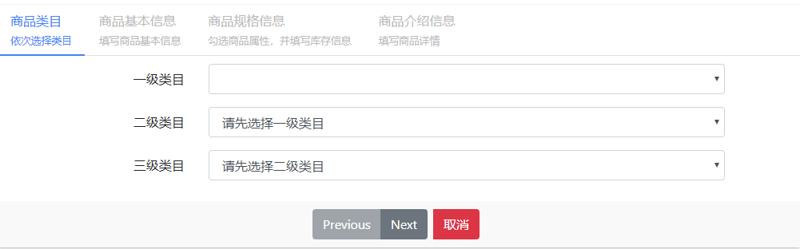

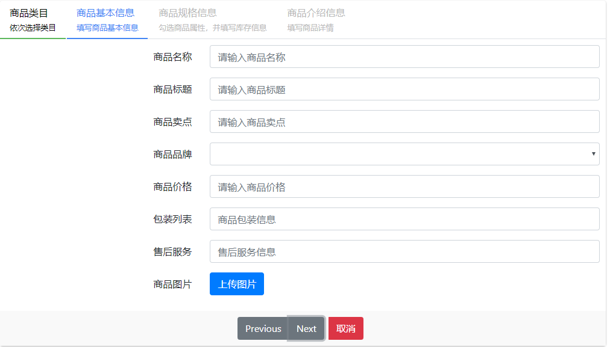

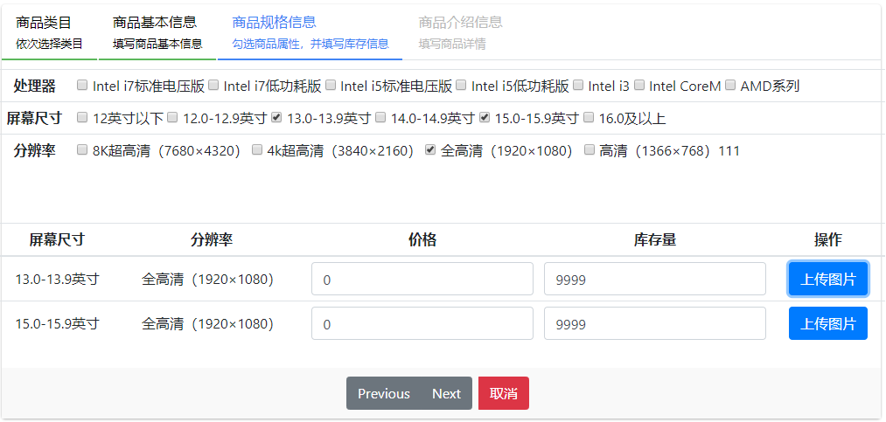

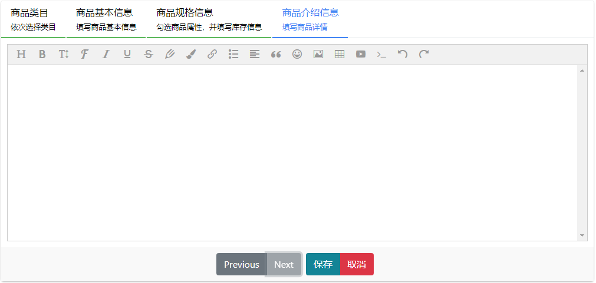


### 2.2. 后台准备工作

#### 2.2.1. 定义业务实体类

> 用来完成前端业务数据的封装

```java

/*
    商品业务实体类
 */
public class GoodsInfo extends GoodsSpu {

    // 商品sku列表
    private List<GoodsSku> skuList;

    public List<GoodsSku> getSkuList() {
        return skuList;
    }

    public void setSkuList(List<GoodsSku> skuList) {
        this.skuList = skuList;
    }
}

```

#### 2.2.2. 服务接口

```java

public interface IGoodsInfoService {

    /**
     * 保存商品，并返回主键ID
     * @param goodsInfo
     * @return
     */
    public int save(GoodsInfo goodsInfo);
}

```

#### 2.2.3. 服务实现

```java

@Service
@Transactional
public class GoodsInfoServiceImpl implements IGoodsInfoService {

    
}
```

#### 2.2.4. 控制层

```java
@RestController
@RequestMapping("/goodsInfo")
public class GoodsInfoController {

    
}
```


### 2.3. 前端准备工作

#### 2.3.1. module

```javascript
// 创建模块
angular.module("goods", []);
```

 

#### 2.3.2. controller

```javascript
// 定义goodsController
angular.module("goods").controller("goodsController", function ( $scope, goodsService, $controller) {

    // 监听视图内容是否加载完毕，加载完毕后触发回调函数
    $scope.$on("$viewContentLoaded", function (event) {
        
    });

    // 继承其他的controller， baseController
    $controller("baseController", {$scope : $scope});

});
```

#### 2.3.3. service

```js
angular.module("goods").service("goodsService", function (restService) {

    // 定义请求的资源路径
    var baseUrl = "../../goods";
    // get请求
    this.get = function(options){
        return restService.get(baseUrl, options);
    };

    // post请求
    this.post = function (entity) {
        return restService.post(baseUrl, entity);
    };

    // put请求
    this.put = function (entity) {
        return restService.put(baseUrl, entity);
    };

    // Delete请求
    this.delete = function (id) {
        return restService.delete(baseUrl, id);
    }
});
```

#### 2.3.3. 主模块添加依赖

```js
angular.module("yanxuan",
    [
        "ngRoute",
        "pagination",
        "goods"
    ]);
```


#### 2.3.4. index.html引入js文件

```html
<script type="text/javascript" src="../../js/common/goods/goods.module.js"></script>
<script type="text/javascript" src="../../js/common/goods/goods.controller.js"></script>
<script type="text/javascript" src="../../js/common/goods/goods.service.js"></script>
```


## 三、类目选择

### 3.1. 需求分析

> 添加商品时，先选择商品对应的类目信息


1. 页面初始化时加载一级类目的数据
2. 当一级类目选择之后，获取远程的二级类目数据，并渲染
3. 当二级类目选择之后，获取远程的三级类目数据，并渲染


### 3.2. 前端代码

#### 3.2.1. service

参考 `jiguangyanxuan_manager_server`中的`category.service.js`

并在 `index.html`中引入js文件

```html
<script type="text/javascript" src="../../js/commmon/category/category.Service.js"></script>
```


#### 3.2.2. controller

1. 添加 `categoryService`的依赖

```javascript
// 业务控制层，并且注入依赖
// 定义goodsController
angular.module("goods").controller("goodsController", function ( $scope, goodsService, $controller, categoryService) {

    // 监听视图内容是否加载完毕，加载完毕后触发回调函数
    $scope.$on("$viewContentLoaded", function (event) {
        
    });

    // 继承其他的controller， baseController
    $controller("baseController", {$scope : $scope});

});
```

2. 查询类目的逻辑方法

```javascript
	// 页面初始时，加载一级类目信息
    $scope.queryCategory = function (pId) {
        // 根据parentId查询所有的类目信息,一级类目的parentId=0
        categoryService.get({parentId: pId}).then(
            function (res) {
                $scope.categoryFirstList = res.data.result;
            }
        )
    };

    // 监听一级类目的选择，加载二级类目信息
    $scope.$watch("entity.category1Id",function (newVal) {
        if(newVal === undefined){
            $scope.categorySecondList = [];
            return ;
        }
        // 根据parentId查询所有的类目信息
        categoryService.get({parentId: newVal}).then(
            function (res) {
                $scope.categorySecondList = res.data.result;
            }
        )
    });
    // 监听二级类目的选择，加载三级类目信息
    $scope.$watch("entity.category2Id",function (newVal) {
        if(newVal === undefined){
            $scope.categoryThirdList = [];
            return ;
        }
        // 根据parentId查询所有的类目信息
        categoryService.get({parentId: newVal}).then(
            function (res) {
                $scope.categoryThirdList = res.data.result;
            }
        )
    });
```

#### 3.2.3. 页面

html显示类目信息

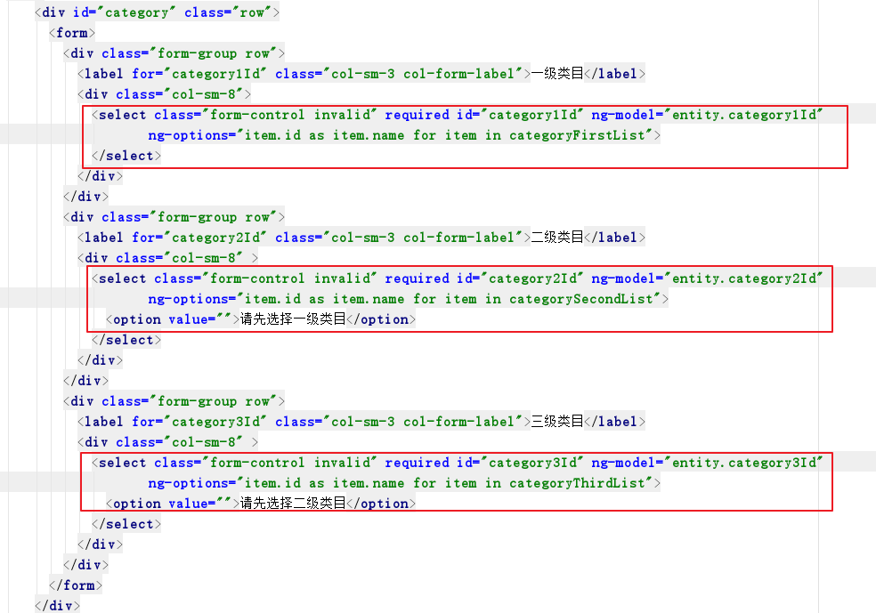

> 在angular中提供了ng-options指令，可以用来生成<select>中的选项
>
> 用法：[item.id] as [item.name] for item in dataList
>
> item 是从data数组中遍历出的对象
>
> as 前面的值 是用来作为 <option> 中的value属性的值
>
> as 后面的值 是用来作为<option></option>中间的text值

### 3.3. 后台代码

#### 3.3.1. 控制层

> 在 `jiguangyanxuan-seller-server`中创建 `CategoryController`

```java
@RestController
@RequestMapping("/category")
public class CategoryController {

    @Reference
    private IGoodsCategoryService categoryService;

    @GetMapping
    public ResponseEntity<PageResult<GoodsCategory>> query(Integer currentPage, Integer pageSize,
                                                           GoodsCategory goodsCategory){
        // 处理分页参数
        if(currentPage ==null || pageSize == null){
            currentPage = 1;
            pageSize = Integer.MAX_VALUE;
        }
        // 调用远程服务完成分页查询
        PageResult<GoodsCategory> pageResult = goodsCategoryService.pageQuery(currentPage,
                                                                              pageSize,
                                                                              goodsCategory);

        return new ResponseEntity<>(pageResult, HttpStatus.OK);
    }
}
```

### 3.4. 品牌信息展示

#### 2.4.1. 前端js代码

```js
    // 根据选择的类目信息查找对应的品牌、规格信息
    $scope.$watch("entity.category3Id",function (newVal) {
        if(newVal === undefined){
            return ;
        }
        categoryService.get(newVal).then(
            function (res) {
                $scope.brandList = JSON.parse(res.data.relation.brandIds);
                $scope.specList = res.data.optionList;
            }
        )
    });
```

#### 2.4.2. 前端html代码

```html
<div class="form-group row">
    <label for="goodsBrand" class="col-sm-4 col-form-label">商品品牌</label>
    <div class="col-sm-8">
        <select ng-model="entity.brandId" id="goodsBrand" class="form-control" 
                ng-model="entity.brandId" ng-options="item.id as item.text for item in brandList">		</select>
    </div>
</div>
```

2.4.3. 后端代码

```java
    @GetMapping("/{id}")
    public ResponseEntity<Category> queryById(@PathVariable("id") Long id){
        // 根据主键进行查询
        Category category = goodsCategoryService.queryById(id);

        return new ResponseEntity<>(category, HttpStatus.OK);
    }
```


## 四、商品基本信息

### 4.1. 需求分析


填写商品的基本信息，并且上传商品的图片

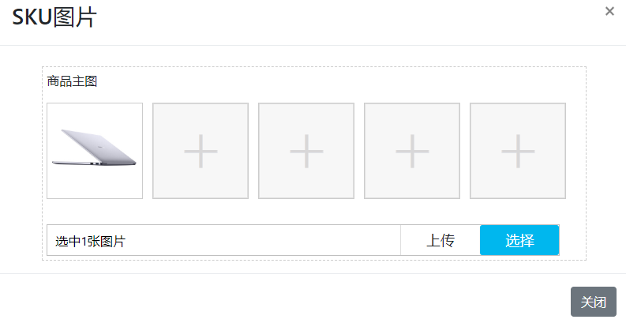

### 4.2. 前端代码

#### 4.2.1. html绑定参数

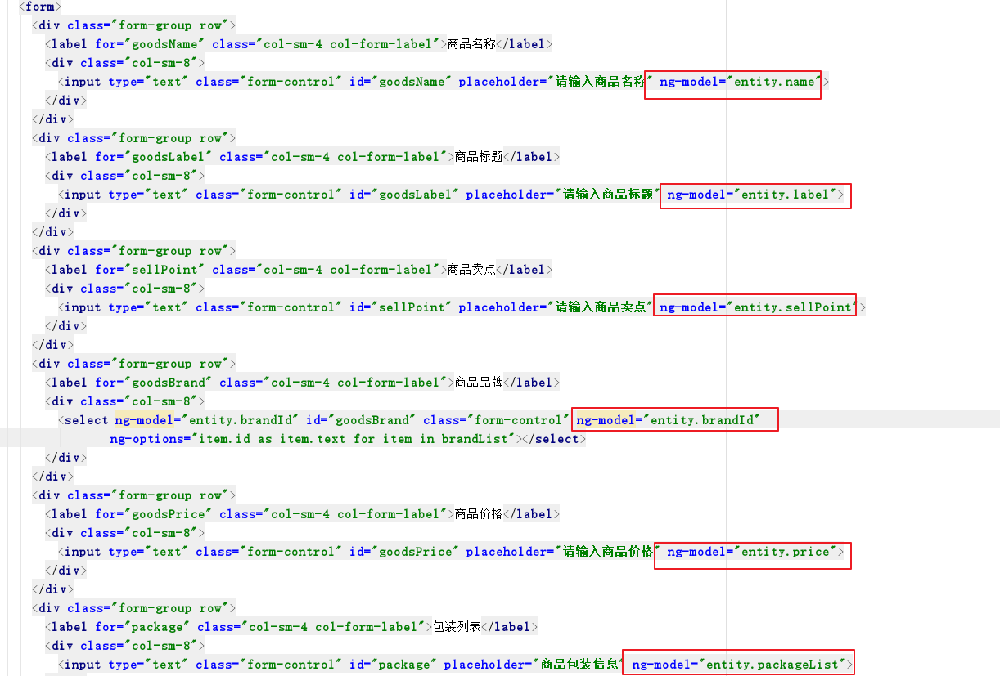

#### 4.2.2. controller

```javascript
// 保存
    $scope.save = function () {
        // 调用service发送post请求
        var response = goodsService.post( $scope.entity);
        
        response.then(
            function (res) {
                // 保存成功，提示保存成功，刷新列表
                if(res.status === 201){
                    alert("商品保存成功！");
                }
                $scope.pageQuery();
            },
            function (reason) {
                console.log(reason)
            }
        )
    };
```

### 4.3. 后台代码

#### 4.3.1. 服务实现

```java
public Long save(GoodsInfo goodsInfo) {
    // 登陆用户
    SellerShop sellerShop = this.getSellerShop(goodsInfo.getCreatePerson());
    goodsInfo.setSellerId(sellerShop.getId());
    goodsInfo.setSellerName(sellerShop.getName());
    // 保存商品SPU信息
    goodsSpuMapper.insertSelective(goodsInfo);

    return goodsInfo.getId();
}

@Autowired
private AccountMapper accountMapper;
@Autowired
private SellerShopMapper sellerShopMapper;

private SellerShop getSellerShop(String loginName){
    // 构造查询账户信息的条件
    AccountExample accountExample = new AccountExample();
    accountExample.createCriteria().andLoginNameEqualTo(loginName);
    List<Account> accounts = accountMapper.selectByExample(accountExample);

    if(accounts!=null && accounts.size()>0){
        // 构造查询商铺信息的条件
        SellerShopExample example = new SellerShopExample();
        SellerShopExample.Criteria criteria = example.createCriteria().andAccountIdEqualTo(accounts.get(0).getId());
        // 查询商铺信息
        List<SellerShop> sellerShops = sellerShopMapper.selectByExample(example);
        if(sellerShops!=null && sellerShops.size()>0) {
            // 返回查询结果中的第一项
            return sellerShops.get(0);
        }
    }
    return null;
}
```

#### 4.3.2. 控制层

```java
@Reference
private IGoodsInfoService goodsInfoService;

@PostMapping
public ResponseEntity<GoodsInfo> save(@RequestBody GoodsInfo goodsInfo){

    // 登陆人姓名
    String loginName = SecurityContextHolder.getContext().getAuthentication().getName();
    // 设置当前修改人
    goodsInfo.setCreatePerson(loginName);
    // 保存商品信息
    Long id = goodsInfoService.save(goodsInfo);
    goodsInfo.setId(id);

    // post请求返回响应码 201-created
    return new ResponseEntity<>(goodsInfo, HttpStatus.CREATED);
}
```

### 4.4. 上传图片

点击 `上传图片` 按钮，在弹出框中选择上传的图片，并点击上传。

图片选择插件是定义的好的，使用时只需要初始化就可以了。

可以查看  plugins/upload/t_upload.js 、 plugins/upload/ajaxfileupload.js

#### 4.4.1. 初始化弹出框

1. 按钮点击事件触发

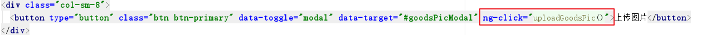

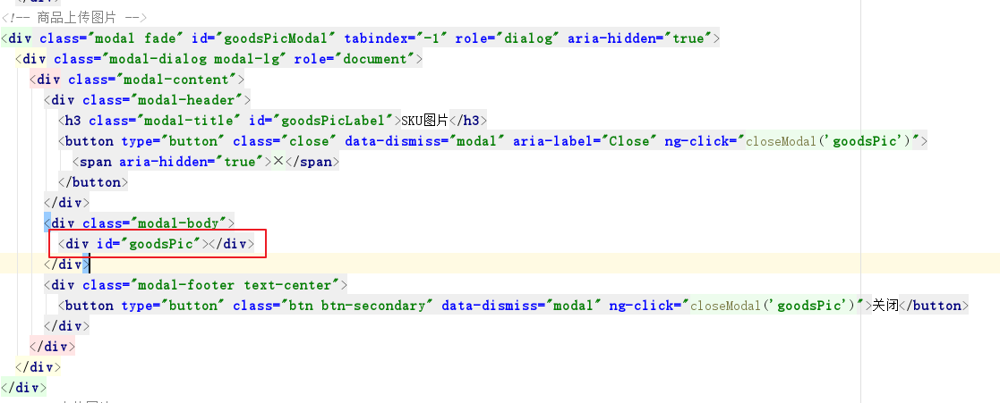

2. js处理逻辑

```javascript
    // 上传产品主图
    $scope.uploadGoodsPic = function () {
        var goodsPic = $scope.entity.picUrl;
        $.Tupload.init({
            url: "../../upload",// 上传地址
            title: "商品主图",
            fileNum: 5, // 上传文件数量
            divId:'goodsPic',// 
            accept: "image/jpeg,image/x-png",
            preViewData: goodsPic,
            onSuccess: function(data) {
                // TODO 上传之后的逻辑处理
            }
        });
    };

	// 关闭窗口时销毁图片选择插件
    $scope.closeModal = function (divId) {
        $.Tupload.destroy({
            divId : divId
        });
    };
```


## 五、图片服务器（FastDFS）

### 5.1. FastDFS 介绍

​	FastDFS是一个开源的轻量级分布式文件系统，它对文件进行管理，功能包括：文件存储、文件同步、文件访问（文件上传、文件下载）等，解决了大容量存储和负载均衡的问题。特别适合以文件为载体的在线服务，如相册网站、视频网站等等。

​	FastDFS为互联网量身定制，充分考虑了冗余备份、负载均衡、线性扩容等机制，并注重高可用、高性能等指标，使用FastDFS很容易搭建一套高性能的文件服务器集群提供文件上传、下载等服务。

​	FastDFS服务端有两个角色：跟踪器（tracker）和存储节点（storage）。

#### 5.1.1. tracker server

​	跟踪服务器，主要做调度工作，起负载均衡的作用。在内存中记录集群中所有存储组和存储服务器的状态信息，是客户端和数据服务器交互的枢纽。


#### 5.1.2. storage server

​	存储服务器（又称：存储节点或数据服务器），文件和文件属性（meta data）都保存到存储服务器上。Storage server直接利用OS的文件系统调用管理文件。


### 5.2. 架构和流程说明

#### 5.2.1. 架构说明

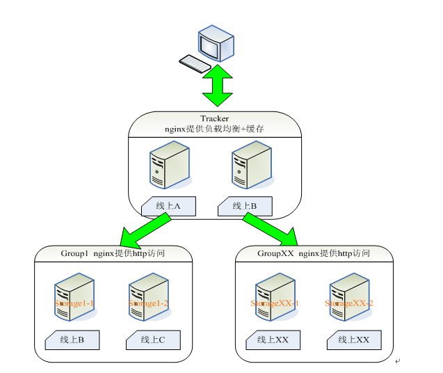

#### 5.2.2. 写入流程

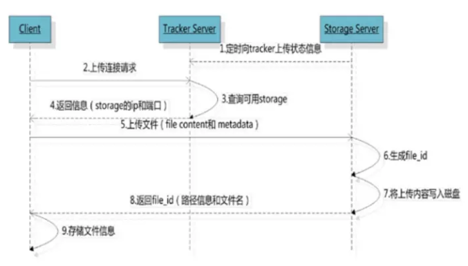

#### 5.2.3.  读取流程

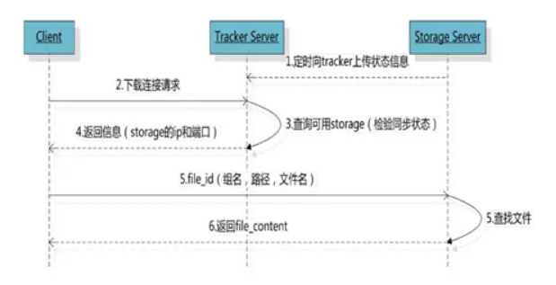

### 5.3. 搭建FastDFS图片服务器

> 请参照 `资料/FastDFS/`目录下的安装手册


### 5.4. 上传案例

#### 5.4.1. FastDFS图片服务器配置信息

在 `test/resources` 下创建 `fdfs_client.properties`

```properties
connect_timeout = 2
network_timeout = 30
charset = UTF-8
# tracker Http端口
http.tracker_http_port = 8801
http.anti_steal_token = no
http.secret_key = FastDFS1234567890
# tracker Server地址信息
tracker_server = 192.168.142.128:22122
```

#### 5.4.2. 编写测试程序

```java
public static void main(String[] args) throws IOException, MyException {
        String confFileName = "D:\\idea_workspace\\jiguang-project\\yanxuan_parent\\yanxuan_seller_server\\src\\main\\resources\\fastdfs\\client.properties";
        // 加载配置文件
        ClientGlobal.init(confFileName);
        // 创建TrackerClient
        TrackerClient trackerClient = new TrackerClient();
        // 创建连接，得到TrackerServer
        TrackerServer trackerServer = trackerClient.getConnection();
        // 获取StorageServer
        StorageServer storageServer = trackerClient.getStoreStorage(trackerServer);
        // 创建StorageCLient
        StorageClient storageClient = new StorageClient(trackerServer, storageServer);
        // 上传文件
        /**
         * 第一个参数：文件的本地访问路径
         * 第二个参数：文件的扩展名
         * 第三个参数：文件的描述信息
         */
        String[] strings = storageClient.upload_file("C:\\Users\\SCHOLAR\\Desktop\\极光学苑\\极光严选\\day05-商品录入\\资料\\素材/4c477d6b297e9512.jpg", "jpg", null);
        for (String result : strings ) {
            System.out.println(result);
        }
    }
```

#### 5.4.2. 输出结果

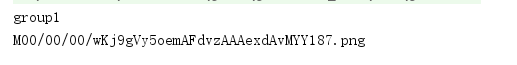


## 六、图片上传

### 6.1. 完善依赖信息

> 在 `jiguangyanxuan-common` 的 pom.xml中添加依赖

```xml
<dependency>
    <groupId>commons-fileupload</groupId>
    <artifactId>commons-fileupload</artifactId>
</dependency>
<dependency>
    <groupId>org.csource</groupId>
    <artifactId>fastdfs-client-java</artifactId>
</dependency>
```

### 6.2. 配置FastDFS信息

> 在 `jiguangyanxuan-common`中创建 `fdfs_client.properties`

```properties
connect_timeout = 2
network_timeout = 30
charset = UTF-8
# tracker Http端口
http.tracker_http_port = 8801
http.anti_steal_token = no
http.secret_key = FastDFS1234567890
# tracker Server地址信息,
# 根据自己的实际填写ip
tracker_server = 192.168.142.128:22122
```

### 6.3. 工具类

> 在 `jiguangyanxuan-common`中创建 `FastDFSClient` 工具类

```java
package com.itjiguang.yanxuan.common.utils;

import org.csource.common.MyException;
import org.csource.common.NameValuePair;
import org.csource.fastdfs.*;

import java.io.IOException;

/**
 * FastDFS文件存储工具类
 */
public class FastDFSClient {
    private TrackerClient trackerClient = null;
    private TrackerServer trackerServer = null;
    private StorageServer storageServer = null;
    private StorageClient1 storageClient = null;
    private String hostName = null;

    public FastDFSClient(String conf) {
        // 处理配置文件的路径
        if (conf.contains("classpath:")) {
            conf = conf.replace("classpath:", this.getClass().getResource("/").getPath());
        }

        try {
            // 加载配置信息
            ClientGlobal.init(conf);
            // 创建TrackerClient
            trackerClient = new TrackerClient();
            // 建立连接，获取TrackerServer
            trackerServer = trackerClient.getConnection();
            // 根据TrackerServer获取StorageServer
            storageServer = trackerClient.getStoreStorage(trackerServer);
            // 设置hostname
            hostName = storageServer.getInetSocketAddress().getHostName();
        } catch (MyException e) {
            e.printStackTrace();
        }catch (IOException e) {
            e.printStackTrace();
        }
        // 根据TrackerServer和StorageServer获取StorageClient，可以用来完成文件的上传
        storageClient = new StorageClient1(trackerServer, storageServer);
    }

    /**
     * 上传文件
     * @param fileName 文件全路径
     * @param extName 文件扩展名
     * @param metas 文件扩展信息
     * @return
     */
    public String uploadFile(String fileName, String extName, NameValuePair[] metas) {
        String result=null;
        try {
            result = storageClient.upload_file1(fileName, extName, metas);


        } catch (Exception e) {
            e.printStackTrace();
        }
        return "http://"+hostName+"/"+result;
    }

    public String uploadFile(String fileName){
        return uploadFile(fileName, null, null);
    }

    public String uploadFile(String fileName, String extName) {
        return uploadFile(fileName, extName, null);
    }

    /**
     * 上传文件
     * @param fileContent 文件内容，字节数组
     * @param extName 文件扩展名
     * @param metas 文件扩展信息
     * @return
     */
    public String uploadFile(byte[] fileContent, String extName, NameValuePair[] metas){

        String result = null;
        try {
            result = storageClient.upload_file1(fileContent, extName, metas);
        } catch (Exception e) {
            e.printStackTrace();
        }
        return "http://"+hostName+"/"+result;
    }

    public String uploadFile(byte[] fileContent) {
        return uploadFile(fileContent, null, null);
    }

    public String uploadFile(byte[] fileContent, String extName) {
        return uploadFile(fileContent, extName, null);
    }
}
```

### 6.4. 配置SpringMVC接收文件

```xml
<!-- 配置多媒体解析器 -->
<bean id="multipartResolver" class="org.springframework.web.multipart.commons.CommonsMultipartResolver">
    <property name="defaultEncoding" value="UTF-8"></property>
    <!-- 设定文件上传的最大值5MB，5*1024*1024 -->
    <property name="maxUploadSize" value="5242880"></property>
</bean>
```

### 6.5.  控制层

> 在 `jiguangyanxuan-seller-server`中创建 `UploadController`

```java
@RestController
@RequestMapping("/upload")
public class UploadController {

    @PostMapping
    public ResponseEntity<Map> uploadFile(MultipartFile[] file){
        // 接收多个文件
        try {
            Map<String,Object> map = new HashMap<>();
            List<String> pathList = new ArrayList<String>();
            // 创建FastDFS客户端
            FastDFSClient client = new FastDFSClient("classpath:properties/fdfs_client.properties");
            // 遍历文件，并上传
            for(MultipartFile orginFile : file){
                // 获取待上传文件路径信息
                String fileName = orginFile.getOriginalFilename();
                // 获得文件的扩展名
                String extName = fileName.substring( fileName.lastIndexOf(".")+1 );
                // 上传到fastDFS服务器之后返回的路径
                String urlPath = client.uploadFile(orginFile.getBytes(), extName);

                pathList.add(urlPath);
            }

            map.put("data",pathList);
            return new ResponseEntity<>(map, HttpStatus.OK);
        } catch (IOException e) {
            e.printStackTrace();
            return new ResponseEntity<>(null, HttpStatus.INTERNAL_SERVER_ERROR);
        }
    }
}
```

### 6.6. 设置图片的地址信息

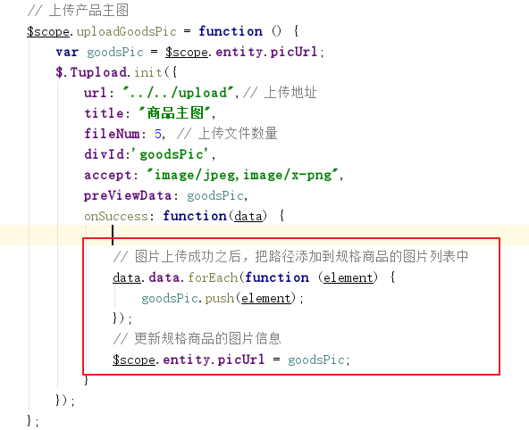


