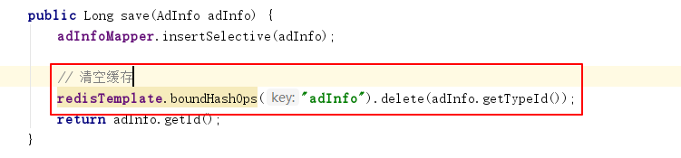

# 极光严选-第八章-广告&缓存解决方案

## 课程内容

- 广告管理
  - 广告类型管理
  - 广告内容管理
- 商城门户系统中的广告展示功能
- 缓存解决方案
  - Redis的基本使用
  - Redis中数据的访问
  - 系统中广告信息缓存功能


## 学习目标

- [ ] 能够编码完成广告类型的管理功能
- [ ] 能够编码完成广告内容的管理功能
- [ ] 能够搭建门户首页工程
- [ ] 能够在门户首页中展示轮播图广告
- [ ] 能够掌握Redis基本数据类型的操作
- [ ] 能够使用SpringDataRedis操作Redis中的数据
- [ ] 理解广告数据缓存的解决思路
- [ ] 能够编码完成广告数据的缓存操作


## 一、广告信息模块

### 1.1. 页面概述


### 1.2. 门户网站首页广告

1. 首页轮播广告
2. 首页顶部广告
3. 个性推荐广告
4. 频道广告
5. 热点推荐广告

### 1.3. 数据表结构

#### 1.3.1. 广告类型表（ad_type）

| 字段名称     | 字段类型  | 字段长度 | 含义                             |
| ------------ | --------- | -------- | -------------------------------- |
| `id`         | `bigint`  |          | 主键ID自增                       |
| `name`       | `varchar` | 50       | 类型名称                         |
| `media_type` | `char`    | 1        | 媒体类型：1-图片；2-文字；3-代码 |
| `type_desc`  | `varchar` | 1000     | 类型说明                         |

#### 1.3.2. 广告信息表（ad_info）

| 字段名称     | 字段类型   | 字段长度 | 含义                 |
| ------------ | ---------- | -------- | -------------------- |
| `id`         | `bigint`   |          | 主键ID               |
| `name`       | `varchar`  | 50       | 广告名称             |
| `type_id`    | `bigint`   |          | 广告类型             |
| `url`        | `varchar`  | 100      | 链接                 |
| `content`    | `varchar`  | 1000     | 广告内容             |
| `start_time` | `datetime` |          | 开始时间             |
| `ent_time`   | `datetime` |          | 结束时间             |
| `status`     | `char`     | 1        | 状态：0-有效；1-失效 |

## 二、运营商后台-广告管理

> 由系统业务人员在运营商后台中进行广告类型的维护、广告内容的维护

### 2.1. 搭建基础工程

#### 2.1.1. 服务接口工程

参照 `jiguangyanxuan_manager_api` 搭建 `jiguangyanxuan_ad_api`工程

#### 2.1.2. 服务实现工程

参照 `jiguangyanxuan_manager_service` 搭建 `jiguangyanxuan_ad_service`工程


### 2.2. 广告类型管理

#### 2.2.1. 服务接口

```java
public interface IAdTypeService {

    /**
     * 保存广告类型信息
     * @param adType
     */
    public int save(AdType adType);

    /**
     * 分页查询广告类型
     * @param pageNum
     * @param PageSize
     * @return
     */
    public PageResult<AdType> pageQuery(Integer pageNum, Integer PageSize, AdType adType);

    /**
     * 更新广告类型数据
     * @param adType
     */
    public int update(AdType adType);

    /**
     * 根据主键ID停用广告类型数
     * @param id
     */
    public int delete(Long id);
}
```

#### 2.2.2. 服务实现

```java
@Service
@Transactional
public class AdTypeServiceImpl implements IAdTypeService {

    @Autowired
    private AdTypeMapper adTypeMapper;
    @Override
    public int save(AdType adType) {
        return adTypeMapper.insertSelective(adType);
    }

    @Override
    public PageResult<AdType> pageQuery(Integer pageNum, Integer PageSize, AdType adType) {
        //开启分页
        PageHelper.startPage(pageNum,PageSize);

        AdTypeExample example = this.createCriteria(adType);

        Page<AdType> pageData = (Page<AdType>)adTypeMapper.selectByExample(example);
        // 构建返回结果
        PageResult<AdType> pageResult = new PageResult<>();
        pageResult.setTotal(pageData.getTotal());
        pageResult.setRows(pageData.getResult());

        return pageResult;
    }

    @Override
    public int update(AdType adType) {
        return adTypeMapper.updateByPrimaryKeySelective(adType);
    }

    @Override
    public int delete(Long id) {
        return adTypeMapper.deleteByPrimaryKey(id);
    }


    private AdTypeExample createCriteria(AdType adType){
        // 构建查询条件
        AdTypeExample example = new AdTypeExample();
        AdTypeExample.Criteria criteria = example.createCriteria();
        if(adType!=null){
            if(adType.getName()!=null && !"".equals(adType.getName())){
                criteria.andNameLike("%"+adType.getName()+"%");
            }
        }
        return example;
    }
}
```

#### 2.2.3. 控制层

> 在 `jiguangyanxuan-manager-server`创建 `AdTypeController`

```java
@RestController
@RequestMapping("/adType")
public class AdTypeController {

    @Reference
    private IAdTypeService adTypeService;

    @PostMapping
    public ResponseEntity save(@RequestBody AdType adType){
        int result = adTypeService.save(adType);
        if(result>0){
            return new ResponseEntity(HttpStatus.CREATED);
        }else{
            return new ResponseEntity(HttpStatus.INTERNAL_SERVER_ERROR);
        }
        
    }

    @GetMapping
    public ResponseEntity<PageResult> query(Integer pageNum, Integer pageSize, AdType adType){
        if(pageNum==null || pageSize==null){
            pageNum = 1;
            pageSize=Integer.MAX_VALUE;
        }
        
        PageResult<AdType> pageResult  = adTypeService.pageQuery(pageNum, pageSize, adType);
        
        return new ResponseEntity<>(pageResult,HttpStatus.OK);
    }

    @PutMapping
    public ResponseEntity update(@RequestBody AdType adType){
        int result = adTypeService.update(adType);

        if(result>0){
            return new ResponseEntity(HttpStatus.OK);
        }else{
            return new ResponseEntity(HttpStatus.INTERNAL_SERVER_ERROR);
        }
    }

    @DeleteMapping
    public ResponseEntity delete(Long id){
        int result = adTypeService.delete(id);

        if(result>0){
            return new ResponseEntity(HttpStatus.OK);
        }else{
            return new ResponseEntity(HttpStatus.INTERNAL_SERVER_ERROR);
        }
    }
}
```

#### 2.2.4. 创建前端业务模块

1. `module`

```js
angular.module("adType", []);
```

2. `service`

```js
angular.module("adType").service("adTypeService", function (restService) {

    // 定义请求的资源路径
    var baseUrl = "../../adType";
    // get请求
    this.get = function(options){
        return restService.get(baseUrl, options);
    };

    // post请求
    this.post = function (entity) {
        return restService.post(baseUrl, entity);
    };

    // put请求
    this.put = function (entity) {
        return restService.put(baseUrl, entity);
    };

    // Delete请求
    this.delete = function (id) {
        return restService.delete(baseUrl, id);
    }
});
```

3. `controller`

```js
// 定义brandController
angular.module("adType").controller("adTypeController", function ( $scope, adTypeService, $controller) {

    // 监听视图内容是否加载完毕，加载完毕后触发回调函数
    $scope.$on("$viewContentLoaded", function (event) {
        $scope.pageQuery();
    });

    // 继承其他的controller， baseController
    $controller("baseController", {$scope : $scope});

    // 发送分页的请求
    $scope.pageQuery = function(){
        // 页面初始化时$scope.name == undefined
        if($scope.name === undefined){
            $scope.name ="";
        }
        // 定义查询参数
        var queryParams = {
                currentPage: $scope.pageOption.currentPage,
                pageSize: $scope.pageOption.pageSize,
                name : $scope.name
            };
        adTypeService.get(queryParams)
            .then(
                function (value) {
                    // 总记录数
                    $scope.pageOption.total = value.data.total;
                    // 当前页显示的数据
                    $scope.typeList = value.data.result;
                }
            );
    };


    // 执行保存的方法
    $scope.save = function () {
        var response = null;
        // 判断操作的类型
        if($scope.entity.id === undefined){
            // 新增保存
            response = adTypeService.post($scope.entity);
        }else{
            // 修改保存
            response = adTypeService.put($scope.entity)
        }
        // 抽取优化
        response.then(
            function (value) {
                // 关闭模态窗口
                $("#newModal").modal("hide");
                // 刷新品牌列表
                $scope.pageQuery();
            },
            function (reason) {
                console.log(reason)
            }
        )

    };

    // 修改初始化
    $scope.initData = function (entity) {
        $scope.entity = entity;
    }

    $scope.delete = function (id) {
        // 发送请求删除
        // $http.delete("../../brand/"+id)
        adTypeService.delete(id)
            .then(
            function (value) {
                // 刷新数据
                $scope.pageQuery();
            }
        )
    }
});
```

4. 引入业务模块

```html
<script type="text/javascript" src="./js/common/adType/adType.module.js"></script>
<script type="text/javascript" src="./js/common/adType/adType.controller.js"></script>
<script type="text/javascript" src="./js/common/adType/adType.service.js"></script>
```

#### 2.2.5 完善系统主模块

1. `module`

```js
// 创建系统的主模块
angular.module("yanxuan",
    [
        "ngRoute",
        "pagination",
        "multipleSelect",
        "brand",
        "spec",
        "category",
        "loginUser",
        "seller",
        "goods",
        "adType"
    ]);

```

2. `config`

```js
angular.module("yanxuan").config(["$routeProvider", function ($routeProvider) {
    $routeProvider.when("/", {
        templateUrl: "home.html"
    }).when("/goods/brand", {
        templateUrl: "pages/goods/brand.html",
        controller: "brandController"
    }).when("/goods/spec", {
        templateUrl: "pages/goods/spec.html",
        controller: "specController"
    }).when("/goods/category/:pId", {
        templateUrl: "pages/goods/category.html",
        controller: "categoryController"
    }).when("/goods/audit", {
        templateUrl: "pages/goods/audit.html",
        controller: "goodsController"
    }).when("/seller/audit", {
        templateUrl: "pages/seller/audit.html",
        controller: "sellerController"
    }).when("/seller/manage", {
        templateUrl: "pages/seller/manage.html"
    }).when("/ad/type", {
        templateUrl: "pages/ad/type.html",
        controller:"adTypeController"
    }).when("/ad/content", {
        templateUrl: "pages/ad/content.html"
    }).when("/ad/edit/", {
        templateUrl: "pages/ad/edit.html"
    }).when("/ad/edit/:id", {
        templateUrl: "pages/ad/edit.html"
    }).otherwise({redirectTo: '/'});
}]);
```


#### 2.2.6. 页面数据展示

1. 分页数据展示

```html
<div class="card-body">
        <div class="table-responsive text-center">
            <table class="table table-bordered" id="dataTable" width="100%" cellspacing="0">
                <thead>
                <tr>
                    <th>ID</th>
                    <th>类型名称</th>
                    <th>媒体类型</th>
                    <th>类型说明</th>
                    <th>操作</th>
                </tr>
                </thead>
                <tbody>
                <tr ng-repeat="type in typeList">
                    <td>{{type.id}}</td>
                    <td>{{type.name}}</td>
                    <td>{{mediaTypeArr[type.mediaType]}}</td>
                    <td>{{type.typeDesc}}</td>
                    <td>
                        <button type="button" class="btn btn-primary" data-toggle="modal" data-target="#newModal">修改
                        </button>
                        <button type="button" class="btn btn-primary">删除</button>
                    </td>
                </tr>
                </tbody>
            </table>
        </div>
        <pagination></pagination>
    </div>
```

2. 查询条件设置

```html
<form class="d-md-inline-block form-inline">
    <div class="input-group">
        <input type="text" class="form-control" placeholder="类型名称" aria-label="Search" 
               ng-model="name" aria-describedby="basic-addon2">
        <div class="input-group-append">
            <button class="btn btn-primary" type="button" ng-click="pageQuery()">
                <i class="fas fa-search"></i>
            </button>
        </div>
    </div>
</form>
```

3. 数据编辑窗口

```html
<div class="modal-body">
    <form>
        <div class="form-group row">
            <label for="typeName" class="col-sm-4 col-form-label">广告类型名称</label>
            <div class="col-sm-8">
                <input type="text" class="form-control" id="typeName" placeholder="请输入广告类型名称" ng-model="entity.name">
            </div>
        </div>
        <div class="form-group row">
            <label for="mediaType" class="col-sm-4 col-form-label">媒体类型</label>
            <div class="col-sm-8">
                <select class="form-control" id="mediaType" ng-model="entity.mediaType">
                    <option value="1">图片</option>
                    <option value="2">文字</option>
                    <option value="3">代码</option>
                </select>
            </div>
        </div>
        <div class="form-group row">
            <label for="typeDesc" class="col-sm-4 col-form-label">广告类型介绍</label>
            <div class="col-sm-8">
                <textarea type="text" class="form-control" id="typeDesc" rows="3"
                          placeholder="请输入广告类型介绍" ng-model="entity.typeDesc"></textarea>
            </div>
        </div>
    </form>
</div>
<div class="modal-footer">
    <button type="button" class="btn btn-secondary" data-dismiss="modal">取消</button>
    <button type="button" class="btn btn-primary" ng-click="save()">保存</button>
</div>
```

4. 修改和删除

```html
<td>
    <button type="button" class="btn btn-primary" data-toggle="modal" data-target="#newModal" 
            ng-click="initData(type)">修改
    </button>
    <button type="button" class="btn btn-primary" ng-click="delete(type.id)">删除</button>
</td>
```


### 2.3. 广告内容管理

#### 2.3.1. 服务接口

```java
public interface IAdInfoService {

    /**
     * 保存广告信息
     * @param adInfo
     * @return
     */
    public int save(AdInfo adInfo);

    /**
     * 根据条件进行分页查询
     * @param pageNum
     * @param pageSize
     * @param adInfo
     * @return
     */
    public PageResult<AdInfo> pageQuery(Integer pageNum, Integer pageSize, AdInfo adInfo);

    /**
     * 更新广告信息
     * @param adInfo
     */
    public int update(AdInfo adInfo);

    /**
     * 停用广告信息
     * @param id
     */
    public int delete(Long id);
}
```

#### 2.3.2. 服务实现

```java
@Service
@Transactional
public class AdInfoServiceImpl implements IAdInfoService {

    @Autowired
    private AdInfoMapper adInfoMapper;

    @Override
    public int save(AdInfo adInfo) {
        return adInfoMapper.insertSelective(adInfo);
    }

    @Override
    public PageResult<AdInfo> pageQuery(Integer pageNum, Integer pageSize, AdInfo adInfo) {
        // 开启分页查询
        PageHelper.startPage(pageNum, pageSize);
        // 构建查询条件
        AdInfoExample example = createCriteria(adInfo);
        // 执行分页查询
        Page<AdInfo> pageData = (Page<AdInfo>)adInfoMapper.selectByExample(example);
        // 构建返回结果
        PageResult<AdInfo> pageResult = new PageResult<>();
        pageResult.setTotal(pageData.getTotal());
        pageResult.setRows(pageData.getResult());
        return pageResult;
    }

    @Override
    public int update(AdInfo adInfo) {
        return adInfoMapper.updateByPrimaryKeySelective(adInfo);
    }

    @Override
    public int delete(Long id) {
        // 执行逻辑删除
        AdInfo adInfo = new AdInfo();
        adInfo.setId(id);
        adInfo.setStatus("1");
        return adInfoMapper.updateByPrimaryKeySelective(adInfo);
    }

    private AdInfoExample createCriteria(AdInfo adInfo){
        AdInfoExample example = new AdInfoExample();
        AdInfoExample.Criteria criteria = example.createCriteria();
        if(adInfo!=null){
            if(adInfo.getName()!=null && !"".equals(adInfo.getName())){
                criteria.andNameLike("%"+adInfo.getName()+"%");
            }
        }

        return example;
    }
}
```

#### 2.3.3. 控制层

```java
@RestController
@RequestMapping("/adInfo")
public class AdInfoController {

    @Reference
    private IAdInfoService adInfoService;

    @GetMapping
    public ResponseEntity<PageResult> query(Integer pageNum, Integer pageSize, AdInfo adInfo){
        if(pageNum==null || pageSize==null){
            pageNum = 1;
            pageSize=Integer.MAX_VALUE;
        }
        
        PageResult<AdInfo> pageResult = adInfoService.pageQuery(pageNum, pageSize, adInfo);

        return new ResponseEntity<>(pageResult, HttpStatus.OK);
    }

    @PostMapping
    public ResponseEntity<AdInfo> save(@RequestBody AdInfo adInfo){
        int result = adInfoService.save(adInfo);

        return new ResponseEntity<>(adInfo, HttpStatus.CREATED);
    }

    @PutMapping
    public ResponseEntity<AdInfo> update(@RequestBody AdInfo adInfo){
        adInfoService.update(adInfo);
		if(result>0){
            return new ResponseEntity(HttpStatus.OK);
        }else{
            return new ResponseEntity(HttpStatus.INTERNAL_SERVER_ERROR);
        }
    }

    @DeleteMapping("/{id}")
    public ResponseEntity delete(@PathVariable("id") Long id){
        int result = adInfoService.delete(id);
        if(result>0){
            return new ResponseEntity(HttpStatus.OK);
        }else{
            return new ResponseEntity(HttpStatus.INTERNAL_SERVER_ERROR);
        }
    }
}
```

#### 2.3.4. 创建前端业务模块

1. `module`

```js
angular.module("adInfo",[]);
```

2. `service`

```js
angular.module("adInfo").service("adInfoService", function (restService) {

    // 定义请求的资源路径
    var baseUrl = "../../adInfo";
    // get请求
    this.get = function(options){
        return restService.get(baseUrl, options);
    };

    // post请求
    this.post = function (entity) {
        return restService.post(baseUrl, entity);
    };

    // put请求
    this.put = function (entity) {
        return restService.put(baseUrl, entity);
    };

    // Delete请求
    this.delete = function (id) {
        return restService.delete(baseUrl, id);
    }
});
```

3. `controller`

```js
// 业务控制层，并且注入依赖
angular.module("adInfo").controller("adInfoController",function ($scope, $controller, adInfoService, adTypeService) {
    // 继承baseController
    $controller("baseController",{$scope: $scope});

    // 视图加载完成后的操作，相当于初始化方法
    $scope.$on("$viewContentLoaded",function (event, args) {
        // 进行分页查询
        $scope.pageQuery();
    });
    
    // 状态
    $scope.adStatusArray = ['有效','失效'];

    // 分页查询
    $scope.pageQuery = function () {
        var options = {
            pageNum: $scope.pageOption.currentPage,
            pageSize: $scope.pageOption.pageSize,
            name: $scope.name
        };
        // 调用get请求
        adInfoService.get(options).then(
            function (res){
                if (res.status === 200 ){
                    $scope.dataList = res.data.rows;
                    $scope.pageOption.total = res.data.total;
                }
            },
            function (reason) {
                console.log(reason);
            }
        )
    };


    // 删除
    $scope.delete = function (id) {
        adInfoService.delete(id).then(
            function (res) {
                // 删除，并且提示保存成功，刷新列表
                alert("广告信息删除修改成功！");
                $scope.pageQuery();
            },
            function (reason) {
                console.log(reason)
            }
        )
    }
});
```

```js
// 业务控制层，并且注入依赖
angular.module("adInfo").controller("adInfoEditController",function ($scope, $controller, adInfoService, adTypeService, $routeParams) {
    // 继承baseController
    $controller("baseController",{$scope: $scope});

    // 视图加载完成后的操作，相当于初始化方法
    $scope.$on("$viewContentLoaded",function (event, args) {
        var id = $routeParams.id;
        if(id !== undefined){
            $scope.queryById(id);
        }
        // 进行分页查询
        $scope.queryAdType();
    });
    
    // 状态
    $scope.adStatusArray = ['有效','失效'];
    
    // 查询广告类型
    $scope.queryAdType = function(){
        adTypeService.get().then(
            function(res){
                $scope.typeList = res.data.result;
            }
        );
    }

    // 保存
    $scope.save = function () {
        var response;
        if($scope.entity.id === undefined){
            response = adInfoService.post( $scope.entity)
        } else {
            response = adInfoService.put( $scope.entity)
        }
        response.then(
            function (res) {
                // 保存成功，关闭模态窗口，并且提示保存成功，刷新列表
                $('#newModal').modal('hide');
                $scope.pageQuery();
            },
            function (reason) {
                console.log(reason)
            }
        )
    };
    
    // 根据id查询广告信息
    $scope.queryById = function(id){
        adInfoService.get(id).then(
            function(res){
                $scope.entity = res.data;
            }
        );
    }

});
```


4. 引入业务模块

```html
<script type="text/javascript" src="./js/common/adInfo/adInfo.module.js"></script>
<script type="text/javascript" src="./js/common/adInfo/adInfo.controller.js"></script>
<script type="text/javascript" src="./js/common/adInfo/adInfo.service.js"></script>
```

#### 2.3.5. 完善系统主模块

1. `module`

```js
// 创建系统的主模块
angular.module("yanxuan",
    [
        "ngRoute",
        "pagination",
        "multipleSelect",
        "brand",
        "spec",
        "category",
        "loginUser",
        "seller",
        "goods",
        "adType",
        "adInfo"
    ]);

```

2. `config`

```js
angular.module("yanxuan").config(["$routeProvider", function ($routeProvider) {
    $routeProvider.when("/", {
        templateUrl: "home.html"
    }).when("/goods/brand", {
        templateUrl: "pages/goods/brand.html",
        controller: "brandController"
    }).when("/goods/spec", {
        templateUrl: "pages/goods/spec.html",
        controller: "specController"
    }).when("/goods/category/:pId", {
        templateUrl: "pages/goods/category.html",
        controller: "categoryController"
    }).when("/goods/audit", {
        templateUrl: "pages/goods/audit.html",
        controller: "goodsController"
    }).when("/seller/audit", {
        templateUrl: "pages/seller/audit.html",
        controller: "sellerController"
    }).when("/seller/manage", {
        templateUrl: "pages/seller/manage.html"
    }).when("/ad/type", {
        templateUrl: "pages/ad/type.html",
        controller:"adTypeController"
    }).when("/ad/content", {
        templateUrl: "pages/ad/content.html",
        controller: "adInfoController"
    }).when("/ad/edit/", {
        templateUrl: "pages/ad/edit.html",
        controller: "adInfoEditController"
    }).when("/ad/edit/:id", {
        templateUrl: "pages/ad/edit.html",
        controller: "adInfoEditController"
    }).otherwise({redirectTo: '/'});
}]);
```

#### 2.3.6. 前端html

1. 分页数据展示

```html
<div class="card-body">
    <div class="table-responsive text-center">
        <table class="table table-bordered" id="dataTable" width="100%" cellspacing="0">
            <thead>
                <tr>
                    <th>ID</th>
                    <th>广告标题</th>
                    <th>URL</th>
                    <th>图片</th>
                    <th>状态</th>
                    <th>操作</th>
                </tr>
            </thead>
            <tbody>
                <tr ng-repeat="item in dataList">
                    <td>{{item.id}}</td>
                    <td>{{item.name}}</td>
                    <td>{{item.url}}</td>
                    <td ng-bind-html="item.content|to_trusted"></td>
                    <td>{{adStatusArray[item.status]}}</td>
                    <td>
                        <button type="button" class="btn btn-primary">修改</button>
                        <button type="button" class="btn btn-primary">停用</button>
                    </td>
                </tr>
            </tbody>
        </table>
    </div>
    <pagination></pagination>
</div>
```

2. 查询条件设置

```html
<form class="d-md-inline-block form-inline">
    <div class="input-group">
        <input type="text" class="form-control" placeholder="标题名称" aria-label="Search" ng-model="name"
               aria-describedby="basic-addon2">
        <div class="input-group-append">
            <button class="btn btn-primary" type="button" ng-click="pageQuery()">
                <i class="fas fa-search"></i>
            </button>
        </div>
    </div>
</form>
```

3. 新增修改和停用

```html
<a type="button" class="btn btn-primary" href="#/ad/edit">新增</a>
```

```html
<td>
    <a class="btn btn-primary" href="#/ad/edit/{{item.id}}" >修改</a>
    <button type="button" class="btn btn-primary" ng-click="delete(item.id)">停用</button>
</td>
```

4. 数据编辑

```html
<form>
    <div class="form-group row">
        <label for="adType" class="col-sm-2 col-form-label">广告类型</label>
        <div class="col-sm-10">
            <select class="form-control" id="adType" name="typeId" ng-model="typeId" ng-options="item.id as item.name for item in typeList" >

            </select>
        </div>
    </div>
    <div class="form-group row">
        <label for="adName" class="col-sm-2 col-form-label">广告标题</label>
        <div class="col-sm-10">
            <input type="text" class="form-control" id="adName" ng-model="entity.name" placeholder="请输入广告标题" ng-required>
        </div>
    </div>
    <div class="form-group row">
        <label for="url" class="col-sm-2 col-form-label">URL</label>
        <div class="input-group mb-3 col-sm-10">
            <div class="input-group-prepend">
                <span class="input-group-text" id="basic-addon3">http://</span>
            </div>
            <input type="text" class="form-control" id="url" ng-model="entity.url" aria-describedby="basic-addon3">
        </div>
    </div>
    <div class="form-group row">
        <label for="content" class="col-sm-2 col-form-label">内容</label>
        <div class="input-group mb-3 col-sm-10" id="content">
            <div id="editor">
            </div>
        </div>
    </div>
    <div class="form-group row">
        <label for="start-end" class="col-sm-2 col-form-label">有效时间</label>
        <div class="input-group mb-3 col-sm-10" id="start-end">
            <!-- <input class="form-control col-sm-4" ng-model="entity.startTime" datetime-picker date-format="yyyy-MM-dd HH:mm:ss"/> -->
            <div class="input-group date form_datetime col-md-5" data-date-format="yyyy-MM-dd HH:mm:ss" data-link-field="dtp_input1">
                <input class="form-control" size="16" type="text" value="" readonly>
                <span class="input-group-addon"><span class="glyphicon glyphicon-remove"></span></span>
                <span class="input-group-addon"><span class="glyphicon glyphicon-th"></span></span>
            </div>
            <div class="input-group-text"> -- </div>
            <div class="input-group date form_datetime col-md-5"  data-date-format="yyyy-MM-dd HH:mm:ss" data-link-field="dtp_input1">
                <input class="form-control" size="16" type="text" value="" readonly>
                <span class="input-group-addon"><span class="glyphicon glyphicon-remove"></span></span>
                <span class="input-group-addon"><span class="glyphicon glyphicon-th"></span></span>
            </div>
            <!-- <input class="form-control col-sm-4" ng-model="entity.endTime" datetime-picker date-format="yyyy-MM-dd HH:mm:ss" /> -->
        </div>
    </div>
    <div class="form-group row">
        <label for="status" class="col-sm-2 col-form-label">状态</label>
        <div class="col-sm-10 input-group" id="status">
            <div class="form-check">
                <input class="form-check-input" type="radio" name="status" id="inuse" value="0" checked ng-model="entity.status">
                <label class="form-check-label" for="inuse">
                    启用
                </label>
            </div>
            <div class="form-check">
                <input class="form-check-input" type="radio" name="status" id="nouse" value="1" ng-model="entity.status">
                <label class="form-check-label" for="nouse">
                    停用
                </label>
            </div>
        </div>
    </div>
</form>
<div class="text-center">
    <a type="button" class="btn btn-secondary" href="#/ad/content">取消</a>
    <button type="button" class="btn btn-primary" ng-click="save()">保存</button>
</div>
```

#### 2.3.7. 功能测试

1. 完善系统中文件上传的功能

   参照 `jiguangyanxuan-seller-server`中的相关代码

2. 修改日期参数绑定出现的问题

   1. 在model工程中添加 jackson的注解依赖

   ```xml
       <dependencies>
           <dependency>
               <groupId>com.fasterxml.jackson.core</groupId>
               <artifactId>jackson-annotations</artifactId>
           </dependency>
       </dependencies>
   ```

   2. 在实体中使用 `@JsonFormat`注解设置格式

   ```java
       @JsonFormat(pattern = "yyyy-MM-dd HH:mm:ss")
       private Date startTime;
   
       @JsonFormat(pattern = "yyyy-MM-dd HH:mm:ss")
       private Date endTime;
   ```


## 三、商城门户首页轮播广告

### 3.1. 搭建商城门户首页工程

1. 创建工程

参照 `jiguangyanxuan_manager_server` 创建 `jiguangyanxuan_portal_server`工程

**备注**：首页不需要进行认证就可以登录，所以在搭建首页工程时去掉SpringSecurity相关的配置信息

2. 完善页面信息

从 `静态模型/商城门户/`目录下找到首页相关的html、css、js文件拷贝至首页工程中的 `webapp/`目录下

3. 完善配置信息
   1. web.xml
   2. spring的配置文件

### 3.2. 后台代码

#### 3.2.1. 服务接口

> 采用已有的`com.itjiguang.yanxuan.ad.api.IAdInfoService#pageQuery`服务接口

#### 3.2.2. 服务实现

> 采用已有的 `com.itjiguang.yanxuan.ad.service.AdInfoServiceImpl#pageQuery`服务实现

### 3.2.3. 控制层

> 在 `jiguangyanxuan-portal-server`工程下创建 `AdInfoController`，并编写方法

```java
@RestController
@RequestMapping("/adInfo")
public class AdInfoController {

    @Reference
    private IAdInfoService adInfoService;

    @GetMapping
    public ResponseEntity<PageResult<AdInfo>> query(AdInfo adInfo){
        Integer currentPage = 1;
        Integer pageSize = Integer.MAX_VALUE;
        
        PageResult<AdInfo> pageResult = adInfoService.pageQuery(currentPage, pageSize, adInfo);

        return new ResponseEntity<>(pageResult, HttpStatus.OK);
    }
}
```

### 3.3. 前端代码

#### 3.3.1. 业务模块

1. 参照运营商后台系统中的广告信息业务模块


#### 3.3.3. html页面

1. 引入js文件

```html
<!-- 引入相关依赖js文件 -->
<script type="text/javascript" src="plugins/angular/angular.min.js"></script>
<script type="text/javascript" src="js/custom/app.js"></script>
<script type="text/javascript" src="js/custom/app.service.js"></script>
<script type="text/javascript" src="js/ad/adInfo.Controller.js"></script>
<script type="text/javascript" src="js/ad/adInfo.Service.js"></script>
```

2. 设置angular应用

```html
<body ng-app="yanxuan"  ng-controller="adInfoController" ng-init="loadAdInfo()">
```

3. 修改轮播代码


4. 问题解决

> 延迟加载轮播图设置的js文件

```html
<script type="text/javascript">
    $.getScript("js/ad/adInfo.Controller.js",function(){//回调函数，成功获取文件后执行的函数
        loadjsAfterOnload();
    });
	function loadjsAfterOnload() {
		var element = document.createElement("script");
		element.src = "js/carousel.js";
		document.body.appendChild(element);
	}
</script>
```


## 四、广告缓存解决方案

### 4.1. Redis介绍

​	Redis 是一个开源（BSD许可）的，内存中的数据结构存储系统，它可以用作数据库、缓存和消息中间件。

#### 4.1.1. 初识Redis

​	Redis是一种基于键值对（key-value）的**NoSQL数据库**，与很多键值对 数据库不同的是，Redis中的值可以是由string（字符串）、hash（哈希）、 list（列表）、set（集合）、zset（有序集合）、Bitmaps（位图）、 HyperLogLog、GEO（地理信息定位）等多种数据结构和算法组成，因此 Redis可以满足很多的应用场景，而且因为Redis会将所有数据都存放在内存 中，所以它的读写性能非常惊人。不仅如此，Redis还可以将内存的数据利 用快照和日志的形式保存到硬盘上，这样在发生类似断电或者机器故障的时 候，内存中的数据不会“丢失”。除了上述功能以外，Redis还提供了键过 期、发布订阅、事务、流水线、Lua脚本等附加功能。

#### 4.1.2. Redis特性

1. 速度快
2. 基于键值对的数据结构服务器
3. 简单稳定
4. 客户端语言多
5. 持久化
6. 主从复制
7. 高可用和分布式

#### 4.1.3. 全局命令

| 命令     | 描述                                                         |
| -------- | ------------------------------------------------------------ |
| `select` | 切换数据库                                                   |
| `keys`   | 输出所有的键值                                               |
| `dbsize` | 输出键的总数                                                 |
| `exists` | 检查键值是否存在                                             |
| `del`    | 删除键                                                       |
| `expire` | 设置键的过期时间， `expire key seconds`                      |
| `ttl`    | 输出键值的剩余有效时间：<br />大于等于0的整数：键剩余的过期时间。<br />-1：没有设置过期时间<br />-2：键不存在 |
| `type`   | 键的数据类型结构，如果键不存在，输出 `none`                  |

#### 4.1.4. 数据类型

##### 4.1.4.1. 字符串类型

1. 常用命令

| 命令                                                   | 描述                                                         |
| ------------------------------------------------------ | ------------------------------------------------------------ |
| `set key value [ex seconds] [px milliseconds] [nx|xx]` | ex seconds: 设置秒级过期时间 `setex`进行简化<br />px milliseconds：设置毫秒级过期时间<br />nx：键不存在时才能设置成功，用于新增，等同于 `setnx`<br />xx：键存在时才能设置成功，用于更新 |
| `get key`                                              | 输出键对应的value值                                          |
| `incr key`                                             | 值自增，用于计数，要求value值必须时整数                      |

##### 4.1.4.2. 哈希类型

1. 常用命令

| 命令                         | 描述                         |
| ---------------------------- | ---------------------------- |
| `hset key field value`       | 设置成功会返回1，反之会返回0 |
| `hget key field`             | 输出键对应的value值          |
| `hdel key field [field ...]` | 删除field                    |
| `hexists key field`          | 判断field是否存在            |
| `hkeys key`                  | 获取所有的field              |


##### 4.1.4.3. 列表

1. 常用命令

| 命令                                    | 描述                                                     |
| --------------------------------------- | -------------------------------------------------------- |
| `rpush key value [value ...]`           | 从右边插入元素                                           |
| `lpush key value [value ...]`           | 从左边插入元素                                           |
| `linsert key before |after pivot value` | 向某个元素前或后插入元素                                 |
| `lrange key start end`                  | 获取指定范围内的元素列表                                 |
| `lindex key index`                      | 获取列表指定索引下标的元素                               |
| `llen key`                              | 获取列表长度                                             |
| `lpop key`                              | 从列表左侧弹出元素                                       |
| `rpop key`                              | 从列表右侧弹出                                           |
| `lrem key count value`                  | 删除指定元素，value用来完成定位，count用来设置删除的个数 |
| `lset key index newValue`               | 修改指定索引下标的元素                                   |

##### 4.1.4.4. 集合

1. 常用命令

| 命令                             | 描述                 |
| -------------------------------- | -------------------- |
| `sadd key element [element ...]` | 添加元素             |
| `srem key element [element ...]` | `删除元素`           |
| `scard key`                      | 计算元素个数         |
| `sismember key element`          | 判断元素是否在集合中 |
| `smembers key`                   | 输出所有的元素       |

##### 4.1.4.5. 有序集合

1. 常用命令

| 命令                                       | 描述                     |
| ------------------------------------------ | ------------------------ |
| `zadd key score member [score member ...]` | 添加成员                 |
| `zcard key`                                | 计算成员个数             |
| `zscore key member`                        | 计算某个成员的分数       |
| `zrank key member`                         | 计算成员的排名，从低到高 |
| `zrevrank key member`                      | 计算成员的排名，从高到低 |
| `zrem key member [member ...]`             | 删除成员                 |
| `zincrby key increment member`             | 增加成员的分数           |


### 4.2. Java程序中访问Redis数据

#### 4.2.1. Jedis

​	Redis官方提供了各种开发语言的客户端，其中java的有多种：


其中Jedis是常用的一种，因为其非常的轻量。其使用方式也很简单，只需加入其依赖文件

```xml
<dependency>
    <groupId>redis.clients</groupId>
    <artifactId>jedis</artifactId>
    <version>2.10.2</version>
    <type>jar</type>
    <scope>compile</scope>
</dependency>
```

就可以操作reids中的数据，例如：

```java
Jedis jedis = new Jedis("localhost");
jedis.set("name", "jgxy");
String value = jedis.get("name");
```


#### 4.2.2. Spring Data Redis

​	Spring Data Redis是Spring官方提供的的一套框架，提供了在Spring应用中通过简单的配置，即可完成访问Redis，其实现方式是对Redis底层开发包进行了封装。RedisTemplate提供了redis各种操作、异常处理及序列化，支持发布订阅，并对spring 3.1 cache进行了实现。

spring-data-redis针对jedis提供了如下功能： 

1. 连接池自动管理，提供了一个高度封装的“RedisTemplate”类
2. 针对jedis客户端中大量api进行了归类封装,将同一类型操作封装为operation接口
   - ValueOperations：简单K-V操作
   - SetOperations：set类型数据操作
   - ZSetOperations：zset类型数据操作
   - HashOperations：针对map类型的数据操作
   - ListOperations：针对list类型的数据操作


### 4.3. Spring Data Redis 入门使用

#### 4.3.1. 准备工作

1. 创建Maven工程，SpringDataRedis-demo
2. 引入Spring相关依赖，Junit相关依赖

```xml
<!-- Spring -->
        <dependency>
            <groupId>org.springframework</groupId>
            <artifactId>spring-context</artifactId>
            <version>4.3.6.RELEASE</version>
        </dependency>
        <dependency>
            <groupId>org.springframework</groupId>
            <artifactId>spring-context-support</artifactId>
            <version>4.3.6.RELEASE</version>
        </dependency>
        <!-- Spring 整合Junit测试 -->
        <dependency>
            <groupId>org.springframework</groupId>
            <artifactId>spring-test</artifactId>
            <version>4.3.6.RELEASE</version>
        </dependency>
        <dependency>
            <groupId>junit</groupId>
            <artifactId>junit</artifactId>
            <version>4.12</version>
        </dependency>

```


3. 引入Jedis和SpringDataRedis

```xml
        <!-- redis -->
        <dependency>
            <groupId>redis.clients</groupId>
            <artifactId>jedis</artifactId>
            <version>2.10.2</version>
        </dependency>
        <dependency>
            <groupId>org.springframework.data</groupId>
            <artifactId>spring-data-redis</artifactId>
            <version>1.7.2.RELEASE</version>
        </dependency>
```

#### 4.3.2. 配置Redis、Spring环境

> 创建`redis.properties`用来配置reids服务的信息

```properties
redis.host=127.0.0.1
redis.port=6379
redis.password=
redis.database=0
## 最大空闲数
redis.maxIdle=300
# 连接时最大等待时间
redis.maxWait=3000
# 提前验证redis实例
redis.testOnBorrow=true
```

> 配置SpringDataRedis信息

```xml
<?xml version="1.0" encoding="UTF-8"?>
<beans xmlns="http://www.springframework.org/schema/beans"
       xmlns:xsi="http://www.w3.org/2001/XMLSchema-instance"
       xmlns:p="http://www.springframework.org/schema/p" xmlns:context="http://www.springframework.org/schema/context"
       xsi:schemaLocation="http://www.springframework.org/schema/beans http://www.springframework.org/schema/beans/spring-beans.xsd
       http://www.springframework.org/schema/context http://www.springframework.org/schema/context/spring-context.xsd">

    <!-- 加载reidis的配置信息 -->
    <context:property-placeholder location="redis.properties"></context:property-placeholder>

    <bean id="jedisPoolConfig" class="redis.clients.jedis.JedisPoolConfig">
        <property name="maxIdle" value="${redis.maxIdle}"></property>
        <property name="maxWaitMillis" value="${redis.maxWait}"></property>
        <property name="testOnBorrow" value="${redis.testOnBorrow}"></property>
    </bean>

    <!-- reids连接工厂 -->
    <bean id="jedisConnectionFactory" class="org.springframework.data.redis.connection.jedis.JedisConnectionFactory"
          p:hostName="${redis.host}"
          p:port="${redis.port}"
          p:password="${redis.password}"
          p:poolConfig-ref="jedisPoolConfig"/>

    <!-- redis template definition -->
    <bean id="redisTemplate" 
          class="org.springframework.data.redis.core.RedisTemplate"
          p:connection-factory-ref="jedisConnectionFactory"/>

</beans>
```

#### 4.3.3. String类型数据操作

```java
@ContextConfiguration(locations = {"classpath:applicationContext-redis.xml"})
@RunWith(SpringJUnit4ClassRunner.class)
public class StringTest {

    @Autowired
    private RedisTemplate redisTemplate;

    // 设置值
    @Test
    public void testSave(){
        redisTemplate.boundValueOps("name").set("jgxy");
    }

    @Test
    public void testGet(){
        Object name = redisTemplate.boundValueOps("name").get();

        System.out.println(name);
        Assert.assertEquals("jgxy",name);
    }

    @Test
    public void testDelete(){
        redisTemplate.delete("name");

        Object name = redisTemplate.boundValueOps("name").get();
        Assert.assertEquals(null,name);
    }
}

```

#### 4.2.4. Set类型操作

```java
@ContextConfiguration(locations = {"classpath:applicationContext-redis.xml"})
@RunWith(SpringJUnit4ClassRunner.class)
public class SetTest {

    @Autowired
    private RedisTemplate redisTemplate;

    // 设置值
    @Test
    public void testSave(){
        redisTemplate.boundSetOps("nameSet").add("jgxy","baidu","huawei");
    }

    @Test
    public void testGet(){
        Set nameSet = redisTemplate.boundSetOps("nameSet").members();

        System.out.println(nameSet);
        Assert.assertEquals(nameSet.contains("jgxy"),true);
    }

    @Test
    public void testDeleteAll(){
        redisTemplate.delete("nameSet");

        Object name = redisTemplate.boundValueOps("nameSet").get();
        Assert.assertEquals(null,name);
    }

    @Test
    public void testDelete(){
        redisTemplate.boundSetOps("nameSet").remove("baidu");

        Set nameSet = redisTemplate.boundSetOps("nameSet").members();
        System.out.println(nameSet);
    }
}

```


#### 4.2.5. List集合操作

```java
@ContextConfiguration(locations = {"classpath:applicationContext-redis.xml"})
@RunWith(SpringJUnit4ClassRunner.class)
public class ListTest {

    @Autowired
    private RedisTemplate redisTemplate;

    // 设置值
    @Test
    public void testSave(){
        redisTemplate.boundListOps("nameList").leftPush("jgxy");
        redisTemplate.boundListOps("nameList").leftPush("jgxy_left");
        redisTemplate.boundListOps("nameList").rightPush("jgxy_right");
    }

    @Test
    public void testGet(){
        List nameList = redisTemplate.boundListOps("nameList").range(0, 2);
        System.out.println(nameList);
    }

    @Test
    public void testDelete(){
       //redisTemplate.delete("nameList");

        //Object nameList = redisTemplate.boundListOps("nameList").rightPop();
        Object nameList = redisTemplate.boundListOps("nameList").leftPop();
        System.out.println(nameList);
    }
}

```


#### 4.2.6. Hash集合操作

```java
@ContextConfiguration(locations = {"classpath:applicationContext-redis.xml"})
@RunWith(SpringJUnit4ClassRunner.class)
public class HashTest {

    @Autowired
    private RedisTemplate redisTemplate;

    // 设置值
    @Test
    public void testSave(){
        redisTemplate.boundHashOps("nameHash").put("name","张三丰");
        redisTemplate.boundHashOps("nameHash").put("age",18);
        redisTemplate.boundHashOps("nameHash").put("money",1000);
    }

    @Test
    public void testGet(){
        Set nameKeys = redisTemplate.boundHashOps("nameHash").keys();
        System.out.println(nameKeys);

        Object name = redisTemplate.boundHashOps("nameHash").get("name");
        System.out.println(name);


        Map map = redisTemplate.boundHashOps("nameHash").entries();
        System.out.println(map);
    }

    @Test
    public void testDeleteAll(){
        redisTemplate.delete("nameHash");
    }

    @Test
    public void testDelete(){
        redisTemplate.boundHashOps("nameHash").delete("name");

        Map map = redisTemplate.boundHashOps("nameHash").entries();
        System.out.println(map);
    }
}

```

4.2.7. ZSet操作

```java
@ContextConfiguration(locations = {"classpath:applicationContext-redis.xml"})
@RunWith(SpringJUnit4ClassRunner.class)
public class ZSetTest {

    @Autowired
    private RedisTemplate redisTemplate;

    // 设置值
    @Test
    public void testSave(){
        redisTemplate.boundZSetOps("nameZSet").add("a",1);
        redisTemplate.boundZSetOps("nameZSet").add("b",2);
        redisTemplate.boundZSetOps("nameZSet").add("c",3);
        redisTemplate.boundZSetOps("nameZSet").add("d",4);
        redisTemplate.boundZSetOps("nameZSet").add("e",5);
    }

    @Test
    public void testGet(){

        Set nameZSet = redisTemplate.boundZSetOps("nameZSet").rangeByScore(2, 5);
        System.out.println(nameZSet);
    }

    @Test
    public void testDelete(){
        redisTemplate.boundZSetOps("nameZSet").removeRangeByScore(1,3);

        Set nameZSet = redisTemplate.boundZSetOps("nameZSet").rangeByScore(2, 5);
        System.out.println(nameZSet);
    }
}
```


## 五、 商城门户-缓存广告数据

### 5.1. 配置通用组件

> 不仅仅是广告数据需要缓存，其他的很多数据也需要缓存起来，所以在 `jiguangyanxuan-common`工程中配置Spring Data Redis的相关信息，并在其他工程中引入，供使用

#### 5.1.1. 完善依赖信息


#### 5.1.2. 完善Redis配置信息


### 5.2. 后端服务层

> 修改 `jiguangyanxuan-ad-service`工程中的查询服务实现

5.2.1. 查询时缓存广告信息

#### 5.2.2. 新增时清空缓存的广告数据




#### 5.2.3. 修改时清空缓存的广告数据


#### 5.2.4. 删除时清空缓存的广告数据

