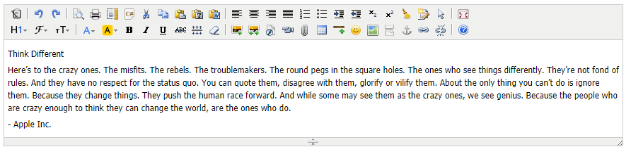
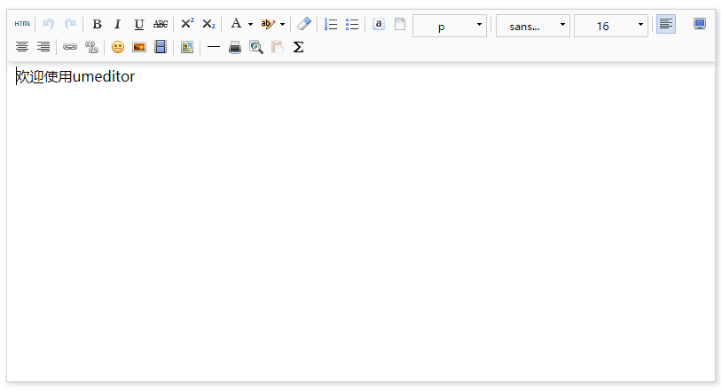
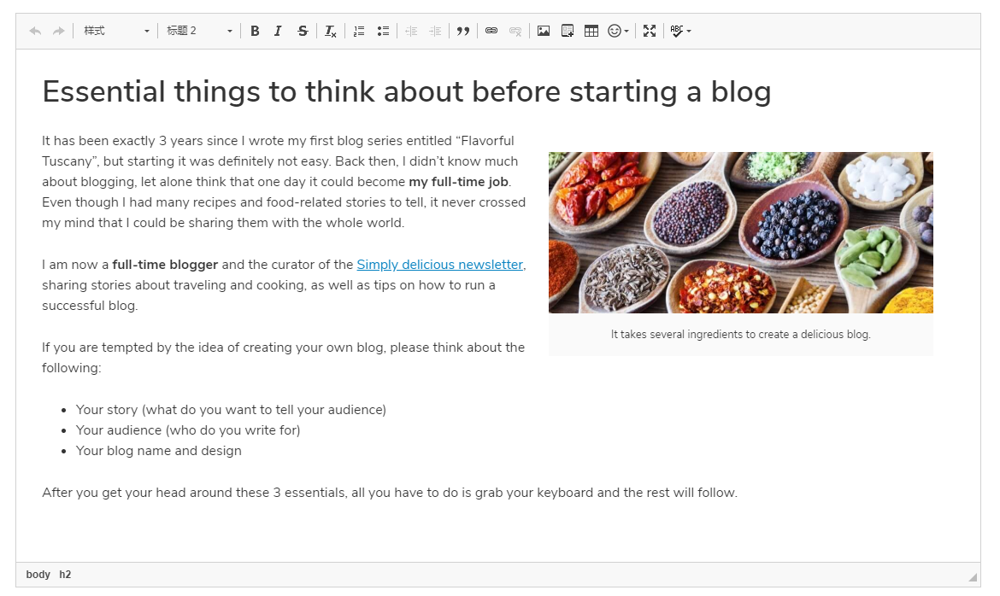
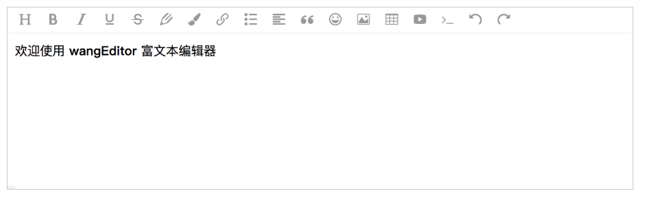
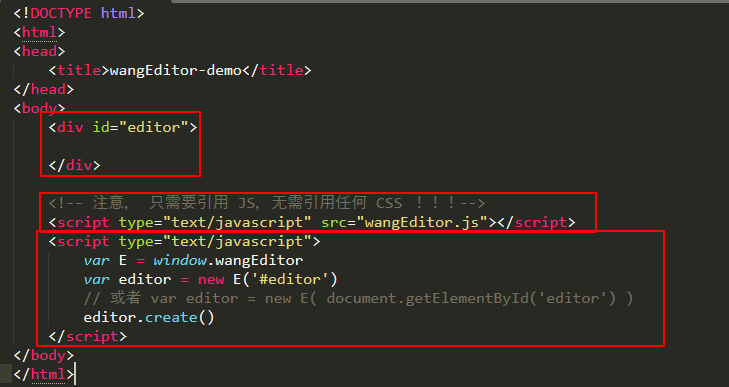
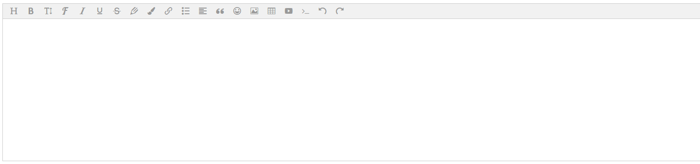
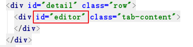
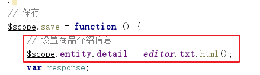
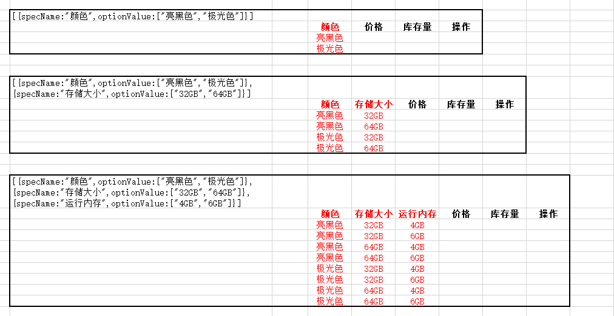

# 极光严选-第六章-商品详情&SKU

## 课程内容

- 商品详情的功能实现
  - 富文本编辑器的技术选型
  - WangEditor的入门使用
  - WangEditor的基本操作
  - WangEditor的图片上传
- 商品SKU信息
  - 规格项展示
  - SKU信息生成
  - 商品信息的保存


## 学习目标

- [ ] 能够了解富文本编辑器的常用技术
- [ ] 能够了解wangEditor的基本使用
- [ ] 能够完成商品详情信息的设置功能
- [ ] 能够完成规格信息的展示功能
- [ ] 能够完成根据选中的规格项生成SKU信息的功能
- [ ] 能够完成商品信息（SKU）的保存功能


## 一、 商品详情

### 1.1. 需求分析

> 商品详情的介绍是多样化的，美观的，使用普通的输入框、文本域是不行的，所以就需要使用到富文本编辑器
>
> 富文本编辑器，Rich Text Editor, 简称 RTE, 是一种可内嵌于浏览器，所见即所得的文本编辑器


### 1.2. 技术选型

#### 1.2.1. kindeditor

​	http://kindeditor.net/demo.php



#### 1.2.2. UMeditor

​	由百度团队开发：http://ueditor.baidu.com/website/umeditor.html



#### 1.2.3. CKEditor

​	http://ckeditor.com，文档都是英文的。



#### 1.2.4. WangEditor

官网：http://www.wangeditor.com/



### 1.3. 入门案例

#### 1.3.1. 代码



#### 1.3.2. 运行效果



### 1.4. 常用操作

#### 1.4.1. 设置内容

| 操作         | 方式                                         |
| ------------ | -------------------------------------------- |
| html设置内容 | 直接在`<div></div>`中设置内容即可            |
| js设置内容   | `editor.txt.html('<p>用 JS 设置的内容</p>')` |
| 追加内容     | `editor.txt.append('<p>追加的内容</p>')`     |
| 清空内容     | `editor.txt.clear()`                         |

#### 1.4.2. 获取内容

```js
editor.txt.html();
editor.txt.text();
```

#### 1.4.3. 图片上传

1. 设置上传地址

```javascript
// 上传文件请求地址
editor.customConfig.uploadImgServer = '/upload';
// 上传文件的name属性值
editor.customConfig.uploadFileName = "file";
```

2. 服务器响应结果示例

```json
{
    // errno 即错误代码，0 表示没有错误。
    //       如果有错误，errno != 0，可通过下文中的监听函数 fail 拿到该错误码进行自定义处理
    "errno": 0,

    // data 是一个数组，返回若干图片的线上地址
    "data": [
        "图片1地址",
        "图片2地址",
        ......
    ]
}
```

3. 自定义上传图片事件

```javascript
editor.customConfig.customUploadImg = function (files, insert) {
    // files 是 input 中选中的文件列表
    // insert 是获取图片 url 后，插入到编辑器的方法

    // 上传代码返回结果之后，将图片插入到编辑器中
    insert(imgUrl)
}
```

### 1.5. 商品介绍页面改造

#### 1.5.1. 引入js文件

```
<script type="text/javascript" src="../../plugins/wangEditor/wangEditor.min.js"></script>
```

#### 1.5.2. html代码

```html
<div id="detail" class="row">
    <div id="editor" class="tab-content">
    </div>
</div>
```



#### 1.5.3. js代码

```html
<script type="text/javascript">

	// 富文本编辑相关
	var E = window.wangEditor;
    var editor = new E('#editor');
    editor.customConfig.uploadImgServer = '/upload';
    editor.customConfig.showLinkImg = false;
	// 上传图片的name属性
    editor.customConfig.uploadFileName = 'file';
    editor.create();
</script>
```


### 1.6. 保存时提交详细内容




## 二、 商品SKU信息

### 2.1. 显示类目关联的规格信息

#### 2.1.1. 根据类目信息查询规格信息

##### 2.1.1.1. 数据封装

```java
public class Category extends GoodsCategory{

    // 关联的品牌、规格信息
    private GoodsCategoryBrandSpec relation;
    // 关联的规格信息{id:,name:,options:[]}
    private List<Map> optionList;

    public List<Map> getOptionList() {
        return optionList;
    }

    public void setOptionList(List<Map> optionList) {
        this.optionList = optionList;
    }

    public GoodsCategoryBrandSpec getRelation() {
        return relation;
    }
    public void setRelation(GoodsCategoryBrandSpec relation) {
        this.relation = relation;
    }
}
```

##### 2.1.1.2. 修改根据类目主键查询的逻辑

```java
	@Override
    public Category queryById(Long id) {
        Category category = new Category();
        // 查询类目信息
        GoodsCategory goodsCategory = goodsCategoryMapper.selectByPrimaryKey(id);
        BeanUtils.copyProperties(goodsCategory, category);
        // 查询关联的品牌、规格信息
        GoodsCategoryBrandSpecExample example = new GoodsCategoryBrandSpecExample();
        example.createCriteria().andCategoryIdEqualTo(id);
        List<GoodsCategoryBrandSpec> relationList = relationalMapper.selectByExample(example);
        if(relationList.size()>0){
            // 取查询得到的第一个
            category.setRelation(relationList.get(0));
            String specIds = relationList.get(0).getSpecIds();
            // 查询规格项信息
            List<Map> list = JSON.parseArray(specIds, Map.class);
            for ( Map map : list) {
                // 构造查询条件
                GoodsSpecOptionExample optionExample = new GoodsSpecOptionExample();
                optionExample.createCriteria().andSpecIdEqualTo(new Long((Integer)map.get("id")));

                List<GoodsSpecOption> optionList = specOptionMapper.selectByExample(optionExample);
                map.put("optionList", optionList);
            }
            category.setOptionList(list);
        }

        return category;
    }
```

##### 2.1.1.3. 页面请求和数据展示

1. 修改监听三级类目的选择的逻辑

```js
	// 根据选择的类目信息查找对应的品牌、规格信息
    $scope.$watch("entity.category3Id",function (newVal) {
        if(newVal === undefined){
            return ;
        }
        categoryService.get(newVal).then(
            function (res) {
                $scope.brandList = JSON.parse(res.data.relation.brandIds);
                $scope.specList = res.data.optionList;
            }
        )
    });
```

2. 数据展示

```html
<tr ng-repeat="item in specList">
    <th class="text-center">{{item.name}}</th>
    <td>
        <span ng-repeat="option in item.optionList">
            <input type="checkbox" /> {{option.name}}
        </span>
    </td>
</tr>
```


### 2.2. 设置选中的规格信息

#### 2.2.1. 添加选中的事件

```html
<tr ng-repeat="item in specList">
    <th class="text-center">{{item.name}}</th>
    <td>
        <span ng-repeat="option in item.optionList">
            <input type="checkbox" ng-click="getCheckedOption($event,item.text,option.name)"/> 				{{option.name}}
        </span>
    </td>
</tr>
```

#### 2.2.2. 处理逻辑

```js
// [
//  {
//      "specNme:'屏幕尺寸',
//      optionVlaue:["5.5-5.1英寸","5.0-4.6英寸"]}
//  {
//      "specName":"机身内存",
//      optionVlaue:["1TB","512GB"]}
// ]
// 获取选中的规格项
$scope.getCheckedOption = function (event,specName,optionValue) {
    // 从已选中的项中查找当前点击项
    var resultObj = $scope.queryObject($scope.entity.specCheckedList,"specName",specName);
    if(resultObj !== null){
        if(event.target.checked){
            resultObj.optionValue.push(optionValue)
        }else{
            // 从集合中移除
            resultObj.optionValue.splice(resultObj.optionValue.indexOf(optionValue),1)
            // 如果移除之后，没有其他规格项，则本规格则移除
            if(resultObj.optionValue.length === 0){
                var resultIdx = $scope.entity.specCheckedList.indexOf(resultObj);
                $scope.entity.specCheckedList.splice(resultIdx,1);
            }
        }
    }else{
        // 集合中不存在，则直接加入集合
        $scope.entity.specCheckedList.push({"specName":specName, "optionValue":[optionValue]});
    }
};

// 检查是已经选中规格项
// 从集合中根据指定属性的值查询
$scope.queryObject = function (list, key, value) {
    var result = null;
    list.forEach(function (element) {
        if(element[key] === value){
            result =  element;
        }
    });
    return result;
}
```


### 2.3. 根据选中的规格信息生成sku列表

#### 2.3.1. 实现分析



生成的数据格式为：

```json
[
    {sku: {"颜色":"亮黑色","存储大小":"32GB","运行内存":"4GB"}, price:0, stockCount:999},
    {sku: {"颜色":"亮黑色","存储大小":"32GB","运行内存":"6GB"}, price:0, stockCount:999},
    {sku: {"颜色":"亮黑色","存储大小":"64GB","运行内存":"4GB"}, price:0, stockCount:999},
    {sku: {"颜色":"亮黑色","存储大小":"64GB","运行内存":"6GB"}, price:0, stockCount:999},
    {sku: {"颜色":"极光色","存储大小":"32GB","运行内存":"4GB"}, price:0, stockCount:999},
    {sku: {"颜色":"极光色","存储大小":"32GB","运行内存":"6GB"}, price:0, stockCount:999},
    {sku: {"颜色":"极光色","存储大小":"64GB","运行内存":"4GB"}, price:0, stockCount:999},
    {sku: {"颜色":"极光色","存储大小":"64GB","运行内存":"6GB"}, price:0, stockCount:999}
]
```


#### 2.3.2. 逻辑实现

```js
$scope.createSkuList = function () {
    // 初始化基础数据:
    $scope.entity.skuList = [{sku:{},price:0,stockCount:9999,picUrl:[]}];
    var items = $scope.entity.specCheckedList;
    for(var i=0;i<items.length;i++){
        // 生成SKU信息
        $scope.entity.skuList = addColumn($scope.entity.skuList,items[i].specName,items[i].optionValue);
    }
}

// 根据选中的信息生成新的sku列表
addColumn = function(list,columnName,columnValues){
    // 定义一个集合用于保存生成的每行的数据:
    var newList = [];
    // 遍历该集合的数据:
    for(var i=0;i<list.length;i++){
        var oldRow = list[i];
        for(var j=0;j<columnValues.length;j++){
            // 对oldRow数据进行克隆:
            var newRow = JSON.parse( JSON.stringify(oldRow) );
            newRow.sku[columnName]=columnValues[j];
            // 将newRow存入到newList中
            newList.push(newRow);
        }
    }
    return newList;
}
```

#### 2.3.3. 触发生成sku列表

```js
$scope.getCheckedOption = function (event,specName,optionValue) {
    // 从已选中的项中查找当前点击项
    var resultObj = $scope.queryObject($scope.entity.specCheckedList,"specName",specName);
    if(resultObj !== null){
        if(event.target.checked){
            resultObj.optionValue.push(optionValue)
        }else{
            // 从集合中移除
            resultObj.optionValue.splice(resultObj.optionValue.indexOf(optionValue),1)
            // 如果移除之后，没有其他规格项，则本规格则移除
            if(resultObj.optionValue.length === 0){
                var resultIdx = $scope.entity.specCheckedList.indexOf(resultObj);
                $scope.entity.specCheckedList.splice(resultIdx,1);
            }
        }
    }else{
        // 集合中不存在，则直接加入集合
        $scope.entity.specCheckedList.push({"specName":specName, "optionValue":[optionValue]});
    }
    
    // 每次更新选中的规格项信息时都需要重新生成sku列表
    $scope.createSkuList();
};
```

2.3.4. 页面展示生成的SKU列表

```html
<!-- 商品SKU信息 -->
<table class="table text-center">
    <thead>
        <tr>
            <th ng-repeat="item in entity.specCheckedList">{{item.specName}}</th>
            <th>价格</th>
            <th>库存量</th>
            <th>操作</th>
        </tr>
    </thead>
    <tbody>
        <tr ng-repeat="item in entity.skuList">
            <td ng-repeat="option in entity.specCheckedList">{{item.sku[option.specName]}}</td>
            <td>
                <input type="text" ng-model="item.price" class="form-control" />
            </td>
            <td>
                <input type="text" ng-model="item.stockCount" class="form-control" />
            </td>
            <td>
                <button type="button" class="btn btn-primary" data-toggle="modal" data-target="#skuPicModal">上传图片</button>
            </td>
        </tr>
    </tbody>
</table>
```

### 2.4. 上传SKU的商品图片

#### 2.4.1. 初始图片选择插件

```html
<tbody>
    <tr ng-repeat="item in entity.skuList">
        <td ng-repeat="option in entity.specCheckedList">{{item.sku[option.specName]}}</td>
        <td>
            <input type="text" ng-model="item.price" class="form-control" />
        </td>
        <td>
            <input type="text" ng-model="item.stockCount" class="form-control" />
        </td>
        <td>
            <button type="button" class="btn btn-primary" data-toggle="modal" 
                    data-target="#skuPicModal" ng-click="uploadSkuPic($index)">上传图片</button>
        </td>
    </tr>
</tbody>
```

```js
// 上传规格商品的图片信息
$scope.uploadSkuPic = function (index) {
    $.Tupload.init({
        url: "/upload",// 上传地址
        title: "请上传该规格商品的图片",
        fileNum: 5, // 上传文件数量
        divId: "skuPic", // div  id
        accept: "image/jpeg,image/x-png",
        onSuccess: function(data) {
            // 更新规格商品的图片信息
            $scope.entity.skuList[index].picUrl = skuPic;
        }
    });
}


```

#### 2.4.2. 关闭时销毁upload插件

1. 处理逻辑

```js
// 关闭窗口时销毁upload插件
$scope.closeModal = function (divId) {
    $.Tupload.destroy({
        divId : divId
    });
};
```

2. 触发时机

```html
<!-- 商品上传图片 -->
<div class="modal fade" id="goodsPicModal" tabindex="-1" role="dialog" aria-hidden="true">
  <div class="modal-dialog modal-lg" role="document">
    <div class="modal-content">
      <div class="modal-header">
        <h3 class="modal-title" id="goodsPicLabel">SKU图片</h3>
        <button type="button" class="close" data-dismiss="modal" aria-label="Close" 
                ng-click="closeModal('goodsPic')">
          <span aria-hidden="true">&times;</span>
        </button>
      </div>
      <div class="modal-body">
        <div id="goodsPic"></div>
      </div>
      <div class="modal-footer text-center">
        <button type="button" class="btn btn-secondary" data-dismiss="modal" 
                ng-click="closeModal('goodsPic')">关闭</button>
      </div>
    </div>
  </div>
</div>
<!-- sku上传图片 -->
<div class="modal fade" id="skuPicModal" tabindex="-1" role="dialog" aria-hidden="true">
  <div class="modal-dialog modal-lg" role="document">
    <div class="modal-content">
      <div class="modal-header">
        <h3 class="modal-title" id="newModalLabel">SKU图片</h3>
        <button type="button" class="close" data-dismiss="modal" aria-label="Close" 
                ng-click="closeModal('skuPic')">
          <span aria-hidden="true">&times;</span>
        </button>
      </div>
      <div class="modal-body">
        <div id="skuPic"></div>
      </div>
      <div class="modal-footer text-center">
        <button type="button" class="btn btn-secondary" data-dismiss="modal" 
                ng-click="closeModal('skuPic')">关闭</button>
      </div>
    </div>
  </div>
</div>
```


## 三、商品信息保存

### 3.1. 前端请求

```js
$scope.save = function () {
    // 设置商品介绍信息
    $scope.entity.detail = editor.txt.html();
    // 把$scope.entity.picUrl 转换成字符串进行传递
    $scope.entity.picUrl = JSON.stringify($scope.entity.picUrl);
    // 把$scope.entity.specCheckedList 转换成字符串进行传递
    $scope.entity.specCheckedList = JSON.stringify($scope.entity.specCheckedList);
    // 把sku中的picUrl转换成字符串进行传递
    $scope.entity.skuList.ForEach(function(element){
        element.picUrl = JSON.stringify(element.picUrl);
    })
    // 发送请求，传递entity
    goodsService.post($scope.entity).then(
        function (res) {
            alert("商品增加成功");
        }
    );
};
```

### 3.2. 后端逻辑处理

```java
public int save(GoodsInfo goodsInfo) {
    // 登陆用户
    SellerShop sellerShop = this.getSellerShop(goodsInfo.getCreatePerson());
    goodsInfo.setSellerId(sellerShop.getId());
    goodsInfo.setSellerName(sellerShop.getName());
    // 保存商品SPU信息
    goodsSpuMapper.insertSelective(goodsInfo);

    // 保存商品sku信息
    for (GoodsSku goodsSku : goodsInfo.getSkuList()) {
        // 设置关联主键ID的值
        goodsSku.setGoodsId(goodsInfo.getId());
        // 设置标题
        this.createLabel(goodsInfo.getLabel(), goodsSku);
        // 品牌信息
        GoodsBrand goodsBrand = goodsBrandMapper.selectByPrimaryKey(goodsInfo.getBrandId());
        goodsSku.setBrandName(goodsBrand.getName());
        // 类目信息
        GoodsCategory goodsCategory = goodsCategoryMapper.selectByPrimaryKey(goodsInfo.getCategory3Id());
        goodsSku.setCategoryName(goodsCategory.getStructName()+">"+goodsCategory.getName());
        // 商家信息
        goodsSku.setSellerId(sellerShop.getId());
        goodsSku.setSellerName(sellerShop.getName());
        // 保存商品sku信息
        goodsSkuMapper.insertSelective(goodsSku);
    }
    return goodsInfo.getId();
}


/**
 * 设置规格商品的标题
 * @param label
 * @param goodsSku
*/
private void createLabel(String label, GoodsSku goodsSku){
    // 获取规格商品的规格信息
    Map specMap = JSON.parseObject(goodsSku.getSpecs(), Map.class);
    Collection collection = specMap.values();

    Iterator iterator = collection.iterator();
    while (iterator.hasNext()){
        label += iterator.next().toString();
    }
   // 非常火爆的手机 128GB 8GB 天空之境
    goodsSku.setLabel(label);
}
```


