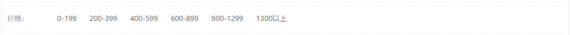
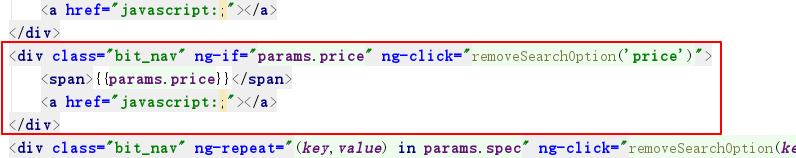
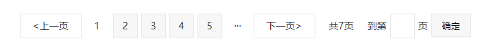
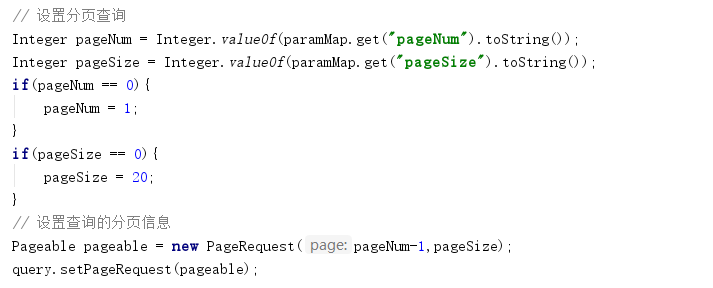
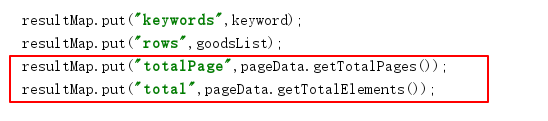
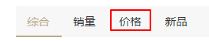
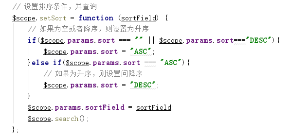
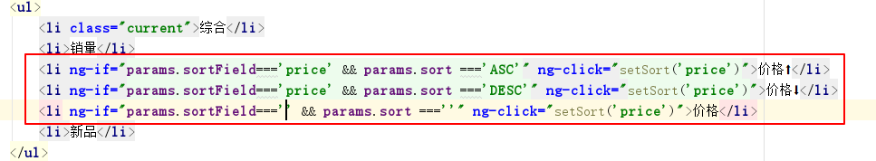
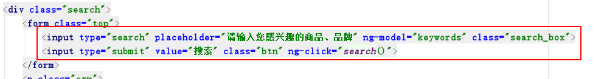
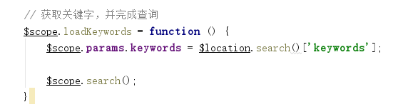

# 极光严选-第十一章-商品搜索解决方案

## 课程内容

- 系统功能
  - 按照价格区间筛选商品
  - 分页展示商品列表
  - 多关键子搜索商品
  - 商品列表排序
  - 门户首页和搜索页关联

- Solr全文搜索
  - 搜索结果排序
  - 多条件逻辑组合方式
  - Solr请求处理器


## 学习目标

- [ ] 能够完成根据价格区间进行筛选商品的功能
- [ ] 能够完成商品列表分页展示功能
- [ ] 能够理解多关键词搜索的规则和完成多关键字搜索功能
- [ ] 能够完成根据价格对商品列表进行排序的功能
- [ ] 能够根据关键词隐藏商品品牌条件面板的功能
- [ ] 能够关联门户首页和商品搜索页面


## 一、按照价格区间筛选

### 1.1. 需求分析



> 价格是一个区间值，跟之前的规格项不同，不能使用等值判断，需要进行区间值判断

### 1.2. 前端代码

#### 1.2.1. html代码

```html
<li>
    <h6>价格：</h6>
    <div>
        <a href="#" ng-click="addSearchOption('price','0-699')">0-699</a>
        <a href="#" ng-click="addSearchOption('price','700-1299')">700-1299</a>
        <a href="#" ng-click="addSearchOption('price','1300-1899')">1300-1899</a>
        <a href="#" ng-click="addSearchOption('price','1900-2599')">1900-2599</a>
        <a href="#" ng-click="addSearchOption('price','2666-*')">2666以上</a>
    </div>
</li>
```



#### 1.2.2. js代码

```js
    //添加搜索项
    $scope.addSearchOption = function (key, value) {
        if(key === "category" || key === "brand" || key ==="price"){
            $scope.params[key] = value;
        }else{
            $scope.params.spec[key]=value;
        }
        // 发起查询请求
        $scope.search();
    };
    
    // 移除搜索项
    $scope.removeSearchOption = function (key) {
        if(key === "category" || key === "brand" || key ==="price"){
            $scope.params[key] = "";
        }else{
            delete $scope.params.spec[key];
        }
        // 发起查询请求
        $scope.search();
    }
```


### 1.3. 后台代码

#### 1.3.1. 服务实现代码修改

```java
// 过滤条件-price
if(queryParams.get("price")!=null && !"".equals(queryParams.get("price"))){
    // 原始价格区间字符串
    String price = queryParams.get("price").toString();
    // 切割得到价格区间数组
    String[] priceArray = price.split("-");
    // 设置价格下限值
    Criteria goods_price_greater = new Criteria("goods_price_d").greaterThanEqual(priceArray[0]);
    SimpleFilterQuery simpleFilterQuery = new SimpleFilterQuery(goods_price_greater);
    highlightQuery.addFilterQuery(simpleFilterQuery);

    // 当价格区间中包含 -* 时不需要设置上限，反之需要设置上限
    if(!price.contains("-*")){
        Criteria goods_price_less = new Criteria("goods_price_d").lessThanEqual(priceArray[1]);
        SimpleFilterQuery lessFilterQuery = new SimpleFilterQuery(goods_price_less);
        highlightQuery.addFilterQuery(lessFilterQuery);
    }
}
```

#### 1.3.2. 问题修改

1. 修改solr中的schema.xml文件

```xml
<field name="goods_price_d" type="double" indexed="true" stored="true" />
<copyField source="goods_price" dest="goods_price_d" />
```

2. 执行批量导入程序，重新导入数据

 

## 二、搜索结果分页

### 2.1. 需求分析



> 查询得到的结果可能会非常多，页面加载较慢，同时为了更好的展示结果，我们采取分页的方式进行展示

### 2.2. 前端代码

#### 2.2.1. 参数初始化

```js
$scope.queryParams = {
    pageNum : 1, // 当前页码值
    pageSize : 4 // 每页显示的商品数量
}
```

#### 2.2.2. 请求并接收分页结果

```js
// 发送分页的请求
    $scope.search = function(){
        searchService.get($scope.params)
            .then(
                function (value) {
                    // 当前页显示的商品数据
                    $scope.dataList = value.data.result;
                    $scope.dataList.forEach(
                        function(element){
                            element.picUrl = JSON.parse(element.picUrl);
                        }
                    );
                    // 类目信息
                    $scope.categoryList = value.data.category;
                    // 品牌信息
                    $scope.brandList = value.data.brandList;
                    // 规格信息
                    $scope.specList = value.data.specList;
                    // 总记录数
                    $scope.total = value.data.total;
                    // 总页码数
                    $scope.totalPage = value.data.totalPage;
                }
            );
    };
```

#### 2.2.3. 构建分页数据

```js
// 构建分页栏
$scope.buildPage = function () {
    // 初始化分页栏
    $scope.pageLabel=[];
    // 设置省略号显示标识为不显示
    $scope.startFlag = false;
    $scope.endFlag = false;
    // 总页码数
    var totalPage = $scope.result.totalPage;
    // 开始页码
    var startPage = 1;
    // 结束页码
    var endPage = totalPage;
    // 如果总页码数超过7，则显示部分页码
    if($scope.totalPage > 5){
        if($scope.queryParams.pageNum <= 3){
            end = 5;
        }else if($scope.totalPage-$scope.queryParams.pageNum < 3){
            start = $scope.totalPage - 4;
        }else{
            start = $scope.queryParams.pageNum - 2;
            end = $scope.queryParams.pageNum +2;
        }
    }

    // 判断是否显示省略号
    if(startPage!== 1){
        $scope.startFlag = true;
    }
    if(endPage !== totalPage){
        $scope.endFlag = true;
    }

    // 生成分页栏的页码
    for(var i = startPage; i<= endPage; i++){
        $scope.pageLabel.push(i);
    }
}
```

#### 2.2.4. 分页条展示

```html
<div class="page_swit">
    <a href="javascript:;" class="last_page" ng-click="queryByPage(params.pageNum-1)">&lt;上一页</a>
    <span ng-if="startFlag">···</span>
    <span ng-repeat="item in pageLabel" class="page_num" ng-click="queryByPage(item)">
        <a href="#" class="page_num" ng-class="item == params.pageNum?'current':''">{{item}}</a>
    </span>
    <span ng-if="endFlag">···</span>
    <a href="javascript:;" class="next_page" ng-click="queryByPage(params.pageNum+1)">下一页&gt;</a>
    <span>共{{result.totalPage}}页</span>
    <span>到第</span>
    <input type="text" ng-model="params.pageNum">
    <span>页</span>
    <button ng-click="queryByPage(params.pageNum)">确定</button>
</div>
```

#### 2.2.5. 查询指定页码的数据 

```js
    // 根据页码进行查询
    $scope.queryByPage = function (pageNum) {
        if(pageNum<1 || pageNum > $scope.result.totalPage){
            return false;
        }
        $scope.params.pageNum = pageNum;
        $scope.search();
    }
```


### 2.3. 后端代码

> 修改服务实现 `jiguangyanxuan-search-service`






## 三、多关键字搜索

### 3.1. 多关键字搜索规则

​	在搜索时可以输入多个关键字，而多个关键字之间的关系可以是并且、或者的关系，这两种关系所达到的查询效果是存在区别的：

- 并且：搜索的结果中包含所有的关键字，这样搜索到的商品更加精准
- 或者：搜索的结果中只要包含一个关键字，这样所搜索到的商品更加的广泛

```java
enum Operator {
		AND("AND"), OR("OR"), NONE("");

		private String operator;

		private Operator(String operator) {
			this.operator = operator;
		}

		public String asQueryStringRepresentation() {
			return this.operator;
		}

		@Override
		public String toString() {
			return asQueryStringRepresentation();
		}
	}
```

```java
// 设置多关键字之间的逻辑关系
highlightQuery.setDefaultOperator(Query.Operator.AND);
```


### 3.2. 空格搜索不到的问题

```java
// 把关键字中的控制替换掉
keywords = keywords.replaceAll(" ","");
```


## 四、搜索结果排序

### 4.1. 按照价格排序

> 当点击页面上的"价格"时，按照价格进行升序或者降序



#### 4.1.1. 后台代码

```java
String fieldName = "";
Sort sort = null;
// 设置最终的排序方式
if(queryParams.get("sortField")!=null && "price".equals(queryParams.get("sortField"))){
    fieldName = "goods_price_d";
}
if(queryParams.get("sortType")!=null && "DESC".equals(queryParams.get("sortType"))){
    sort = new Sort(new Sort.Order(Sort.Direction.DESC, fieldName));
}
if(queryParams.get("sortType")!=null && "ASC".equals(queryParams.get("sortType"))){
    sort = new Sort(new Sort.Order(Sort.Direction.ASC, fieldName));
}
if(sort!=null){
    highlightQuery.addSort(sort);
}
```


#### 4.1.2. 前端代码

1. js代码



2. html代码




### 4.2. 按照新品排序

> 即按照上架的时间，进行排序，这就需要在solr索引库中存在上架的时间，
>
> 1. 设置上架时间的索引域
> 2. 按照上架时间进行排序

### 4.3. 按照销量排序

> 在solr索引库中建立商品近期销量的的域，根据值的大小进行排序即可。销量的值需要根据订单中数量进行统计，销量排序的实时性要求并不高，可以采用定时统计销量的方式进行，定时任务会在后续课程中讲解。


### 4.4. 按照评价排序

> 在solr索引库中建立商品评价的域，但需要注意：
>
> 该域的值不能是评价数量的总和，因为评价有好评、中评、差评，评价星数之分，所以在保存该域的值时，应该是加权后的值，比如使用评价星数总和。

```xml
  <field name="book_high" type="int" indexed="true" stored="true"/>
  <field name="book_middle" type="int" indexed="true" stored="true"/>
  <field name="book_low" type="int" indexed="true" stored="true"/>
```


```java

// 根据solr函数计算的值进行排序
Sort sort = new Sort(Sort.Direction.DESC,
                     "sum(product(book_high,3.0),book_middle,product(book_low,-1))");
```

#### 4.4.1. Solr常用函数

| 函数            | 说明                                 | 举例                                       |
| --------------- | ------------------------------------ | ------------------------------------------ |
| `abs(x)`        | 返回绝对值                           | abs(-5)                                    |
| `constant`      | 指定一个浮点数                       | 1.5                                        |
| `div(x,y)`      | 除法,x除以y                          | div(1,5)                                   |
| `dist`          | 计算两点之间的距离                   | dist(2, x, y, 0, 0)                        |
| `if`            | if(test,value1,value2)               | if(termfreq (title,’solr’), popularity,42) |
| `linear(x,m,c)` | 就是m*x+c，等同于sum(product(m,x),c) | linear(1,2,4)=1x2+4=6                      |
| `max(x,y,…)`    | 返回最大值                           | max(2,3,0)                                 |
| `min(x,y,…)`    | 返回最小值                           | min(2,3,0)                                 |
| `log(x)`        | 以10为底，x的对数                    | log(sum(x,100))                            |
| `pow(x,y)`      | 返回x的y次方                         | pow(x,log(y))                              |
| `product(x,y)`  | 返回多个值的乘机                     | product(x,2)                               |
| `scale`         | 返回一个在最大值和最小值之间的值     | scale(x,1,2)                               |
| `sqrt`          | 返回指定值的平方根                   | sqrt(x)sqrt(100)                           |
| `sum(x,y)`      | 返回指定值的和                       | sum(x,y,…)                                 |
| `sub`           | 返回x-y                              | sub(myfield,myfield2)                      |

#### 4.4.2. 配置RequestHandler

```xml
  <requestHandler name="/evaluate" class="solr.SearchHandler">
      <lst name="defaults">
        <str name="defType">edismax</str>
        <str name="bf">
          sum(product(book_high,3.0),book_middle,product(book_low,-1))
       </str>
       <str name="df">text</str>
       <str name="mm">100%</str>
       <str name="echoParams">explicit</str>
       <int name="rows">10</int>
      </lst>
  </requestHandler>

```

```java
// 指定请求的映射地址
simpleQuery.setRequestHandler("/evaluate");
```

**备注**：综合排序的方式与评价排序的方式比较类似，但是涉及到的维度比较广，例如：销量（10%）、好评率（20%）、收藏量（20%）、转化率（20%）、回购率（20%）、商家服务评级（10%）


## 五、 隐藏品牌搜索条件面板

### 5.1. 需求分析

当输入的关键字是商品品牌时，在搜索条件面板处不再显示商品的品牌搜索条件。

### 5.2. 逻辑判断

```js
    $scope.isBrand = function(){
        // 关键字
        var keywords = $scope.queryParams.keywords;
        // 品牌列表
        if($scope.brandList === undefined){
            return false;
        }
        var flag = true;// 是否显示搜索面板
        $scope.brandList.forEach(
            function (element) {
                // 如果关键字是品牌列表中的一项，那么就不展示品牌搜索条件
                if(element.name === keywords){
                    // 设置查询条件中的brand是关键字
                    $scope.queryParams.brand = keywords;
                    flag = false;
                }
            }
        );
        return flag;
    };
```

### 5.3. 页面展示

```html
<li ng-if="brandList !== undefined && queryParams.brand === undefined && isBrand()">
    <h6>品牌：</h6>
    <div>
        <a href="javascript:;" ng-repeat="brand in brandList" 
           ng-click="addSearchOption('brand',brand.name)">
            {{brand.name}}
        </a>
    </div>
    <a href="javascript:;" class="more">更多</a>
</li>
```


## 六、 搜索页与首页关联

### 6.1. 需求分析

> 用户可以在首页的输入框中输入关键字，点击搜索按钮后，跳转到搜索页面并显示搜索结果


### 6.2. 功能实现

#### 6.2.1. 首页传递关键字

> 修改 门户工程中的controller

```JavaScript
// 向搜索页传递关键字
$scope.search = function () {
    location.href="http://localhost:9904/search.html#?keywords="+$scope.keywords;
}
```



#### 6.2.2. 接收关键字

> 使用angularjs中的$location服务用来接收关键字



