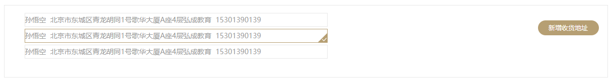

# 极光严选-第十七章-订单确认

## 课程内容

- 下订单
  - 选取购物车中商品
  - 订单确认页面显示商品
- 收货地址管理

- 订单确认
  - 选择收货地址
  - 选择支付方式
  - 保存订单信息


## 学习目标

- [ ] 能够完成从购物车中选取商品
- [ ] 能够完成订单确认页面的商品清单展示
- [ ] 能够完成收货地址的管理功能
- [ ] 能够完成订单确认页面的收货地址选择
- [ ] 能够完成订单确认页面的支付方式选择
- [ ] 能够完成订单数据的保存


## 一、选择购物车中的商品

### 1.1. 需求分析

添加到购物车中的商品不一定是要购买的，在进行下订单时可以选择购物车中的部分商品；所以在系统中要提供选择购物车中的商品，并计算数量和总价格的逻辑处理。

1. 添加静态页面 goods_cart_submit.html 至 `jiguangyanxuan-cart-server`工程

### 1.2. 逻辑实现

#### 1.2.1. 页面触发

```html
<ul class="cart_list">
    <li ng-repeat="goods in item.goodsList">
        <input type="checkbox" name="goods_check" ng-click="selectGoods($event, goods, item)">
        <div>
            </div>
        <span>{{goods.goodsLabel}}</span>
        <span>{{goods.goodsPrice}}</span>
        <div class="number">
            <span class="minus" ng-click="addCart(goods.skuId, -1,goods.count)">-</span>
            <input type="text" ng-model="goods.count" />
            <span class="plus" ng-click="addCart(goods.skuId, 1,goods.count)">+</span>
        </div>
        <span>{{goods.totalFee}}</span>
        <span>
            <a href="javascript:;" class="del" ng-click="addCart(goods.skuId, -goods.count)">
                删除
            </a>
            <a href="javascript:;" class="add_coll">加入收藏</a>
        </span>
    </li>
</ul>
```

#### 1.2.2. 处理逻辑

1. 选择商品的逻辑

```js
$scope.selectedGoods = [];
$scope.selectGoods = function (event, goods, item) {
    var target = queryObj(item.sellerId);
    // 根据选中的结果进行对应的操作
    if(event.target.checked){
        if(target ===null){
            // 构建数组元素对象
            var element = {
                sellerId: item.sellerId,
                sellerName : item.sellerName,
                goodsList: []
            };
            // 把当前商品添加到列表中
            element.goodsList.push(goods);
            // 添加元素到 selectedGoods中
            $scope.selectedGoods.push(element);
        }else{
            target.goodsList.push(goods);
        }
    }else{
        // 未选中移除元素
        var index = target.goodsList.indexOf(goods);
        target.goodsList.splice(index, 1);
        if(target.goodsList.length <=0){
            index = $scope.selectedGoods.indexOf(target);
            $scope.selectedGoods.splice(index, 1);
        }
    }
    console.log($scope.selectedGoods);
};

// 根据商家的编号，从已选中的商品列表中查找
queryObj = function (sellerId) {
    for(var i =0 ;i<$scope.selectedGoods.length; i++){
        if($scope.selectedGoods[i].sellerId === sellerId){
            return $scope.selectedGoods[i];
        }
    }
    return null;
};
```

2. 计算数量和总价格（在选择商品的逻辑中调用）

```js
// 总个数初始化
$scope.totalCount = 0;
// 总价初始化
$scope.totalFee = 0;

// 计算商品总数量、商品总价
getSum = function () {
    // 总个数初始化
    $scope.totalCount = 0;
    // 总价初始化
    $scope.totalFee = 0;
    // 遍历购物车的所有商家
    $scope.selectedGoods.forEach(function (element) {
        // 遍历所有商品
        element.goodsList.forEach(function (goods) {
            $scope.totalCount += goods.count;
            $scope.totalFee += goods.totalFee;
        })
    })
};
```

### 1.3. 保存已选择的商品

```js
$scope.goSubmit = function () {
    localStorage.setItem("selectedGoods",JSON.stringify($scope.selectedGoods));

    location.href="./orderInfo.html";
};
```

### 1.4. 订单确认页面展示数据

#### 1.4.1. 前端业务模块

1. module

```js
angular.module("order", []);
```

2. controller

```js
angular.module("order").controller("orderController", function($scope){
    
});
```

#### 1.4.2. 启用业务模块

1. 引入js文件

```html
<script type="text/javascript" src="js/order/order.module.js"></script>
<script type="text/javascript" src="js/order/order.controller.js"></script>
```

2. 设置controller

```html
<body ng-app="order" ng-controller="orderController">
```

#### 1.4.3. 展示商品清单

1. 数据读取

```js
// 加载选中的商品信息
var selectedGoods = localStorage.getItem("selectedGoods");
if(selectedGoods !== null && selectedGoods !== undefined){
    $scope.selectedGoods = JSON.parse(selectedGoods);
}
```

2. 数据展示

```html
<h3 class="list_tit">商品列表</h3>
<ul class="cart_tit_order">
    <li>商品信息</li>
    <li>单价</li>
    <li>数量</li>
    <li>小计</li>
</ul>
<div ng-repeat="item in selectedGoods">
    <ul class="cart_nav">
        <li>
            {{item.sellerName}}
        </li>
    </ul>
    <ul class="cart_list">
        <li ng-repeat="goods in item.goodsList">
            <div>
                </div>
            <span>{{goods.goodsLabel}}</span>
            <span>{{goods.goodsPrice}}</span>
            <div class="number">
                {{goods.count}}
            </div>
            <span>{{goods.totalFee}}</span>
        </li>
    </ul>
</div>
```

#### 1.4.4. 商品数量和总价格

1. 计算逻辑

```js
// 加载选中的商品信息
var selectedGoods = localStorage.getItem("selectedGoods");
if(selectedGoods !== null && selectedGoods!== undefined){
    $scope.selectedGoods = JSON.parse(selectedGoods);
    // 总个数初始化
    $scope.totalCount = 0;
    // 总价初始化
    $scope.totalFee = 0;
    // 遍历选择的所有的商品信息
    $scope.selectedGoods.forEach(function (element) {
        // 遍历所有商品
        element.goodsList.forEach(function (goods) {
            $scope.totalCount += goods.count;
            $scope.totalFee += goods.totalFee;
        })
    })
}
```

2. 数据展示

```html
<div class="cart_foot">
    <span>
        合计（不含运费）：
        <b>￥{{totalFee}}</b>
    </span>
    <span>
        共有商品
        <b>{{count}}</b>
        件
    </span>
</div>
```

```html
<div class="pay_btn">
    <p>
        商品总价：
        <span>￥{{totalFee}}</span>
        +
        配送费用：
        <span>￥0</span>
    </p>
    <p>
        <strong>应付金额：</strong>
        <strong>￥{{totalFee}}</strong>
    </p>
    <a href="javascript:;">确认订单</a>
</div>
```


## 二、 收货地址管理

### 2.1. 数据库表结构和准备工作

#### 2.1.1. 数据库表结构

| 字段名称           | 字段类型  | 字段长度 | 含义                      |
| ------------------ | --------- | -------- | ------------------------- |
| `id`               | `bigint`  |          | 主键ID                    |
| `account_id`       | `bigint`  |          | 账户编号                  |
| `area_province_id` | `int`     |          | 省份编号                  |
| `area_city_id`     | `int`     |          | 城市编号                  |
| `area_town_id`     | `int`     |          | 区域编号                  |
| `detail_address`   | `varchar` | 100      | 详细地址                  |
| `receiver`         | `varchar` | 50       | 收货人姓名                |
| `phone_num`        | `varchar` | 15       | 收货人手机号              |
| `postal_code`      | `varchar` | 7        | 邮政编码                  |
| `is_default`       | `char`    | 1        | 是否默认地址： 0-否，1-是 |
| `alias`            | `varchar` | 40       | 别名，例如：公司、家      |

#### 2.1.2. 准备工作

1. 完善 jiguangyanxuan-account-server 工程的依赖信息

```xml
<!-- spring 相关 -->
<dependency>
    <groupId>org.springframework</groupId>
    <artifactId>spring-context-support</artifactId>
</dependency>		
<!-- 加密相关 -->
<dependency>
    <groupId>commons-codec</groupId>
    <artifactId>commons-codec</artifactId>
</dependency>
<!-- dubbo 相关 -->
<dependency>
    <groupId>com.alibaba</groupId>
    <artifactId>dubbo</artifactId>
</dependency>
<dependency>
    <groupId>org.apache.zookeeper</groupId>
    <artifactId>zookeeper</artifactId>
</dependency>
<dependency>
    <groupId>com.github.sgroschupf</groupId>
    <artifactId>zkclient</artifactId>
</dependency>
<dependency>
    <groupId>javassist</groupId>
    <artifactId>javassist</artifactId>
</dependency>
<!-- spring aspects -->
<dependency>
    <groupId>org.springframework</groupId>
    <artifactId>spring-aspects</artifactId>
</dependency>
<!-- json相关 -->
<dependency>
    <groupId>com.alibaba</groupId>
    <artifactId>fastjson</artifactId>
</dependency>

<dependency>
    <groupId>com.itjiguang</groupId>
    <artifactId>yanxuan_account_api</artifactId>
    <version>1.0-SNAPSHOT</version>
</dependency>
```

2. 完善dubbo的配置

```xml
    <!-- 引用dubbo 服务 -->
    <dubbo:application name="yanxuan_account_server" />
    <dubbo:registry address="zookeeper://192.168.142.129:2181" timeout="50000"/>
    <dubbo:annotation package="com.itjiguang.yanxuan" />
```


### 2.2. 新增收货地址需求分析

1. 页面初始化时加载省的信息；根据选择的省的信息，加载市的信息；根据市的信息加载区域的信息。
2. 用户输入完整的收货地址信息后执行保存的操作。

#### 2.2.1. 初始化加载省的信息

##### 2.2.1.1. 前端业务模块

1. module

```js
angular.module("address",[]);
```

2. service

```js
angular.module("address").service("provinceService", function(restService){
    // 定义请求的资源路径
    var baseUrl = "../../province";
    // get请求
    this.get = function(options){
        return restService.get(baseUrl, options);
    };
});
```

3. controller

```js
angular.module("address").controller("addressController",function($scope, provinceService) {

	// 页面初始化
	$scope.$on("$viewContentLoaded", function (event) {
        $scope.queryProvince();
    });
    
    // 查询省的信息
    $scope.queryProvince = function(){
        provinceService.get().then(
        	function(res){
                $scope.provinces = res.data;
        	}
        );
    }
});
```

##### 2.2.1.2. 启用业务模块

1. 引入js文件

```html
<script type="text/javascript" src="js/personal/address/address.module.js"></script>
<script type="text/javascript" src="js/personal/address/province.service.js"></script>
<script type="text/javascript" src="js/personal/address/address.controller.js"></script>
```

2. 设置到主模块

```js
angular.module("personal",["ngRoute","address"]);
```

3. 设置路由视图的controller

```js
// angular路由设置
angular.module("personal").config(["$routeProvider",function($routeProvider){
    $routeProvider.when("/",{
        templateUrl: "personal_info.html"
    }).when("/order",{
        templateUrl: "personal_order.html"
    }).when("/info",{
        templateUrl: "personal_info.html"
    }).when("/addr",{
        templateUrl: "personal_addr.html",
        controller: "addressController"
    }).when("/advise",{
        templateUrl: "personal_advise.html"
    }).when("/focus",{
        templateUrl: "personal_focus.html"
    }).when("/account",{
        templateUrl: "personal_account.html"
    }).otherwise({redirectTo:'/'});
}]);
```

##### 2.2.1.3. 页面显示数据

```html
<select ng-model="entity.areaProvinceId" ng-options="item.id as item.name for item in provinces"></select>
```

##### 2.2.1.4. 服务端实现

1. 控制层

```java
@RestController
@RequsetMapping("/province")
public class SysProvinceController{
 
    @Reference
    private ISysProvinceService provinceService;
    
    @GetMapping
    public ResponseEntity<List> get(){
        List<SysProvince> provinceList = provinceService.get();
        
        return new ResponseEntity(provinceList, HttpStatus.OK);
    }
}
```

2. service接口

```html
public interface ISysProvinceService{
    
    List<SysProvince> get();
}
```

3. service实现

```java
@Service
public class SysProvinceServiceImpl implements ISysProvinceService {
    
    @Autowired
    private SysProvinceMapper provinceMapper;
	
    public List<SysProvince> get(){
        return provinceMapper.selectByExample(null);
    }
}
```


#### 2.2.2. 显示市的信息

#### 2.2.2.1. 业务模块

1. service

```js
angular.module("address").service("cityService", function(restService){
    // 定义请求的资源路径
    var baseUrl = "../../city";
    // get请求
    this.get = function(options){
        return restService.get(baseUrl, options);
    };
});
```

2. controller

```js
angular.module("address").controller("addressController",function($scope, provinceService, cityService) {

	$scope.$watch("entity.province", function(newVal){
        if(newVal === undefined){
            $scope.citys = [];
            return ;
        }
        // 根据省的编号，查询市的信息
        cityService.get({provinceId: newVal}).then(
            function(res){
                $scope.citys = res.data;
            }
        );
	})
});
```

##### 2.2.2.2. 启用service

```html
<script type="text/javascript" src="js/personal/address/city.service.js"></script>
```

##### 2.2.2.3. 页面展示数据

```html
<select ng-model="entity.areacityId" ng-options="item.id as item.name for item in citys"></select>
```

#### 2.2.2.4. 后台服务实现

1. 控制层

```java
@RestController
@RequestMapping("/city")
public class SysCityController{
    @Reference
    private ISysCityService cityService;
    
    @GetMapping
    public ResponseEntity<List> getByProvince(String provinceId){
        List cityList = cityService.getByProvince(provinceId);
        
        return new ResponseEntity(cityList, HttpStatus.OK);
    }
}
```

2. service接口

```java
public interface ISysCityService{
    
    List getByProvince(String provinceId);
}
```

3. service实现

```java
@Service
public class SysCityService implements ISysCityService{
    
    @Autowired
    private SysCityMapper cityMapper;
    
    public List getByProvince(String provinceId){
    	SysCityExample sysCityExample = new SysCityExample();
        sysCityExample.createCriteria().andProvinceIdEqualTo(provinceId);
        
        return cityMapper.selectByExample(sysCityExample);
    }
}
```

#### 2.2.3. 显示区域信息

#### 2.2.3.1. 业务模块

1. service

```js
angular.module("address").service("areaService", function(restService){
    // 定义请求的资源路径
    var baseUrl = "../../area";
    // get请求
    this.get = function(options){
        return restService.get(baseUrl, options);
    };
});
```

1. controller

```js
angular.module("address").controller("addressController",function($scope, provinceService, cityService, areaService) {

	$scope.$watch("entity.city", function(newVal){
        if(newVal === undefined){
            $scope.areas = [];
            return ;
        }
        // 根据省的编号，查询市的信息
        areaService.get({cityId: newVal}).then(
            function(res){
                $scope.areas = res.data;
            }
        );
	})
});
```

##### 2.2.3.2. 启用service

```html
<script type="text/javascript" src="js/personal/address/area.service.js"></script>
```

##### 2.2.3.3. 页面展示数据

```html
<select ng-model="entity.areaTownId" ng-options="item.id as item.name for item in areas"></select>
```

#### 2.2.3.4. 后台服务实现

1. 控制层

```java
@RestController
@RequestMapping("/area")
public class SysAreaController{
    @Reference
    private ISysAreaService areaService;
    
    @GetMapping
    public ResponseEntity<List> getByProvince(String cityId){
        List areaList = areaService.getByCity(cityId);
        
        return new ResponseEntity(areaList, HttpStatus.OK);
    }
}
```

1. service接口

```java
public interface ISysAreaService{
    
    List getByCity(String cityId);
}
```

1. service实现

```java
@Service
public class SysAreaServiceImpl implements ISysAreaService(){
 
    @Autowired
    private SysAreaMapper areaMapper;
    
    public List getByCity(String cityId){
        SysAreaExample sysAreaExample = new SysAreaExample();
        sysAreaExample.createCriteria().andCityIdEqualTo(cityId);
        
        return areaMapper.selectByExample(sysAreaExample);
    }
}
```


### 2.3. 新增收货地址

#### 2.3.1. 前端业务模块

1. service

```js
angular.module("address").service("addressService", function(restService){
    // 定义请求的资源路径
    var baseUrl = "../../address";
    // get请求
    this.get = function(options){
        return restService.get(baseUrl, options);
    };

    // post请求
    this.post = function (entity) {
        return restService.post(baseUrl, entity);
    };

    // put请求
    this.put = function (entity) {
        return restService.put(baseUrl, entity);
    };

    // Delete请求
    this.delete = function (id) {
        return restService.delete(baseUrl, id);
    }
});
```

3. controller

```js
angular.module("address").controller("addressController", function ($scope, provinceService, cityService, areaService, addressService) {

    $scope.save = function(){
        // 判断是否设置为默认地址
        if($scope.entity.isDefault === undefined){
            $scope.entity.isDefault = "0";
        }
        addressService.post($scope.entity).then(
            function(res){
                alert("新增地址成功！");
            }
        );
    }
});
```

#### 2.2.2. 启用业务模块

1. 引入js文件

```html
<script type="text/javascript" src="js/personal/address/address.service.js"></script>
```

#### 2.2.3. 页面参数绑定

```html
<form action="" class="site_info">
    <ul>
        <li class="clearfix">
            <p>
                <span class="red">*</span>地址信息
            </p>
            <div class="wrap">
                <select ng-model="entity.areaProvinceId" 
                        ng-options="item.id as item.name for item in provinces"></select>/
                <select ng-model="entity.areacityId" 
                        ng-options="item.id as item.name for item in citys"></select>/
                <select ng-model="entity.areaTownId" 
                        ng-options="item.id as item.name for item in areas"></select>
            </div>
        </li>
        <li class="clearfix">
            <p>
                <span class="red">*</span>详细地址
            </p>
            <div class="xiangxi">
                <textarea name="" id="" cols="30" rows="10" ng-model="entity.detailAddress"
                          placeholder="请具体的门牌号，例如：一号楼一单元1001"></textarea>
            </div>
        </li>
        <li class="clearfix">
            <p>
                <span class="red"></span>邮政编码
            </p>
            <div class="post_code">
                <input type="text" placeholder="请填写邮编" ng-model="entity.postalCode">
            </div>
        </li>
        <li class="clearfix">
            <p>
                <span class="red">*</span>收货人姓名
            </p>
            <div class="post_code">
                <input type="text" placeholder="请填写姓名" ng-model="entity.receiver">
            </div>
        </li>
        <li class="clearfix">
            <p>
                <span class="red">*</span>手机号码
            </p>
            <div class="post_code">
                <input type="text" id="txt_ide" list="ide" class="code_input"
                       placeholder="中国大陆+86" />
                <datalist id="ide">
                    <option value="中国大陆+86" />
                </datalist>
                <input type="text" placeholder="请填写手机号码" class="phone_num" ng-model="entity.phoneNum">
            </div>
        </li>
    </ul>
    <p>
        <input type="radio" value="1" ng-model="entity.isDefault">设为默认地址
    </p>
    <input type="button" value="保存" class="preserve" ng-click="save()">
</form>
```

#### 2.2.4. 后台服务实现

1. 控制层

```java
@RestController
@RequestMapping("/address")
public class AccountAddressController{
    @Reference
    private IAccountAddressService addressService;
    
    @PostMapping
    public ResponseEntity save(@RequestBody AccountAddress accountAddress){
        // 获取登录的用户名
        String loginName = SecurityContextHolder.getContext().getAuthencation().getName();
        
        int result = addressService.save(loginName, accountAddress);
        if(result>0){
            return new ResponseEntity(HttpStatus.CREATED);
        }else{
            return new ResponseEntity(HttpStatus.INTERAL_SERVER_ERROR);
        }
    }
}
```

2. Service接口

```java
public interface IAccountAddresService{
    
    int save(String loginName, AccountAddress accountAddress);
}
```

3. service实现

```java
@Service
public class AccountAddressServiceImpl implements IAccountAddressService{
    @Autowired
    private AccountAddressMapper addressMapper;
    @Autowired
    private AccountMapper accountMapper;
    
    public int save(String loginName, AccountAddress accountAddress){
        // 查询账户信息
        AccountExample accountExample = new AccountExample();
        accountExample.createCriteria().andLoginNameEqualTo(loginName);
        List<Account> accountList = accountMapper.selectByExample(accountExample);
        // 初始化账户信息
        Account account = null;
        if(accountList.size()>0){
            account = accountList.get(0);
        }else{
            throw new RuntimeException("账户信息不存在");
        }
                                                                 
    	// 判断
    	if("1".equals(accountAddress.getIsDefault)){
    		// 把数据现存的数据修改为非默认
    		AccountAddressExample accountAddressExample = new AccountAddressExample();
         	accountAddressExample.createCriteria()
                .andAccountIdEqualTo(account.getId())
                .andIsDefaultEqualTo("1");
            // 更新默认为非默认即 isDefault=0
            AccountAddress accountAddress = new AccountAddress();
            accountAddress.setIsDefault("0");
            addressMapper.updateByExampleSelective(accountAddress, accountAddressExample);
    	}
        // 把存新的收货地址
        addressMapper.insert(accountAddress)
    }
}
```


## 三、订单确认-收货地址

### 3.1. 需求分析

当用户从购物车中选择了商品进行订单确认时需要选择收货地址，也可以采用默认的收货地址，所以需要把收货地址展示出来供用户进行选择。



### 3.2. 页面展示收货地址列表

#### 3.2.1. 前端业务模块

1. address.service

```js
angular.module("order").service("addressService", function($http){
    // get请求
    this.get = function(options){
        return $http.get("/address", options);
    };

    // post请求
    this.post = function (entity) {
        return $http.post("/address", entity);
    };
});
```

2. controller

```js
angular.module("order").controller("orderController", function($scope, addressService){
    
    // 查询用户的收货地址
    $scope.queryAddressList = function () {
        addressService.get().then(
            function (res) {
                $scope.addrList = res.data;
            }
        )
    };
});
```

#### 3.2.2. html页面

1. 引入js文件

```html
<script type="text/javascript" src="js/order/address.service.js"></script>
```

2. 数据展示

```html
<h3 class="take_tit">收货信息</h3>
<div class="take_info">
    <dl class="saga_info">
        <dd ng-repeat="item in addrList">
            <a href="#" class="current">
                {{item.receiver}}&nbsp;{{item.detailAddress}}&nbsp;{{item.phoneNum}}
            </a>
        </dd>
    </dl>
    <div class="info_btn clearfix">
        <a href="#" class="add_take addres_btn" id="addAddr">新增收货地址</a>
    </div>
</div>
```

#### 3.2.3. 服务端实现

1. 添加 `jiguangyanxuan-account-api` 的依赖

2. 控制器

```java
@RestController
@RequestMapping("/address")
public class AccountAddressController {

    @Reference
    private IAccountAddressService addressService;

    @GetMapping
    public ResponseEntity<List> queryByAccount(){
        // 获取当前登录用户信息
        String loginName = SecurityContextHolder.getContext().getAuthentication().getName();

        // 查询当前用户的所有收货地址
        List<AccountAddress> addressList = addressService.queryByLoginName(loginName);

        return new ResponseEntity(addressList, HttpStatus.OK);
    }
}
```

3. service接口

```java
List<AccountAddress> queryByLoginName(String loginName);
```

4. service实现

```java
@Service
public class AccountAddressServiceImpl implements IAccountAddressService {

    @Autowired
    private AccountMapper accountMapper;
    @Autowired
    private AccountAddressMapper addressMapper;
    @Override
    public List<AccountAddress> queryByLoginName(String loginName) {
        // 查询用户的编号
        AccountExample accountExample = new AccountExample();
        AccountExample.Criteria loginNameEqualTo = accountExample.createCriteria().andLoginNameEqualTo(loginName);
        List<Account> accountList = accountMapper.selectByExample(accountExample);

        Account loginAccount = null;
        if(accountList!=null){
            loginAccount = accountList.get(0);
        }

        // 构建查询条件
        AccountAddressExample example = new AccountAddressExample();
        AccountAddressExample.Criteria criteria = example.createCriteria().andAccountIdEqualTo(loginAccount.getId());

        return addressMapper.selectByExample(example);
    }
}
```

### 3.3. 设置默认选中的地址

#### 3.3.1. 实现逻辑

1. 获取默认地址

```js
// 查询用户的收货地址
$scope.queryAddressList = function () {
    addrService.get().then(
        function (res) {
            $scope.addrList = res.data;
            // 默认地址设置为选中地址
            $scope.addrList.forEach(function (address) {
                if(address.isDefault ==='1'){
                    $scope.selectedAddr =address;
                }
            })
        }
    )
};
```

2. 地址是否选中的判断逻辑

```js
// 判断地址是否选中
$scope.isSelected = function (address) {
    if($scope.selectedAddr === address){
        return true;
    }else{
        return false;
    }
};
```

#### 3.3.2. 展示效果

```html
<h3 class="take_tit">收货信息</h3>
<div class="take_info">
    <dl class="saga_info">
        <dd ng-repeat="item in addrList">
            <a href="#" ng-class="isSelected(item)?'current':''">
                {{item.receiver}}&nbsp;{{item.detailAddress}}&nbsp;{{item.phoneNum}}
            </a>
        </dd>
    </dl>
    <div class="info_btn clearfix">
        <a href="#" class="add_take addres_btn" id="addAddr">新增收货地址</a>
    </div>
</div>
```

### 3.4. 选择地址

#### 3.4.1. 页面触发

```html
<h3 class="take_tit">收货信息</h3>
<div class="take_info">
    <dl class="saga_info">
        <dd ng-repeat="item in addrList">
            <a href="#" ng-click="selectAddress(item)" ng-class="isSelected(item)?'current':''">
                {{item.receiver}}&nbsp;{{item.detailAddress}}&nbsp;{{item.phoneNum}}
            </a>
        </dd>
    </dl>
    <div class="info_btn clearfix">
        <a href="#" class="add_take addres_btn" id="addAddr">新增收货地址</a>
    </div>
</div>
```

#### 3.4.2. 选择逻辑

```js
// 设置选中地址
$scope.selectAddress = function (address) {
    $scope.selectedAddr =address;
};
```


## 四、订单确认-支付方式

### 4.1. 需求分析

> 支付方式有多中，极光严选中支持货到付款和支付宝

### 4.2. 支付方式选择

#### 4.2.1. 前端控制层

```js
$scope.payType = "0";
// 选择支付方式
$scope.selectPayType = function (type) {
    $scope.payType = type;
};
```

#### 4.2.2. 页面

```html
<h5>支付方式：</h5>
<ul class="mode clearfix">
    <li ng-class="payType==='0'?'current':''" ng-click="selectPayType('0')">支付宝</li>
    <li ng-class="payType==='1'?'current':''" ng-click="selectPayType('1')">货到付款</li>
</ul>
```


## 五、订单确认-保存订单

### 5.1. 需求分析和数据结构

#### 5.1.1. 需求分析

​	点击订单确认页面中的“提交订单”按钮，保存订单信息，并把购物车中的商品信息保存到订单商品信息表中，同时把订单中的商品信息从购物车中移除。

​	前端向后台发送请求，包含的数据有收货地址信息、商品列表、总数量、总价值、留言、支付方式；

​	商品列表中可能包含多个商家的商品，那么在服务端针对每一个商家生成一个订单，并关联相应的商品列表。

#### 5.1.2. 数据结构

| 字段名称          | 字段类型   | 字段长度 | 字段含义                                                     |
| ----------------- | ---------- | -------- | ------------------------------------------------------------ |
| `id`              | `bigint`   |          | 主键ID                                                       |
| `order_no`        | `bigint`   |          | 订单编号                                                     |
| `account_id`      | `bigint`   |          | 用户编号                                                     |
| `seller_id`       | `bigint`   |          | 商家编号                                                     |
| `goods_fee`       | `decimal`  | 20，2    | 商品金额                                                     |
| `pay_type`        | `char`     | 1        | 支付方式                                                     |
| `fare_fee`        | `decimal`  | 20，2    | 运费金额                                                     |
| `receiver`        | `varchar`  | 50       | 收货人                                                       |
| `phone_num`       | `varchar`  | 15       | 收货电话                                                     |
| `detail_address`  | `varchar`  | 100      | 收货地址（包含省市区）                                       |
| `total_fee`       | `decimal`  | 20，2    | 支付总金额（商品金额+运费金额）                              |
| `message`         | `varchar`  | 100      | 买家留言                                                     |
| `express_company` | `varchar`  | 50       | 快递公司                                                     |
| `express_no`      | `varchar`  | 30       | 快递编号                                                     |
| `create_date`     | `datetime` |          | 下单时间                                                     |
| `pay_date`        | `datetime` |          | 支付时间                                                     |
| `delivery_date`   | `datetime` |          | 发货时间                                                     |
| `receive_date`    | `datetime` |          | 收货时间                                                     |
| `close_date`      | `datetime` |          | 交易关闭时间                                                 |
| `status`          | `varchar`  | 1        | 订单状态：1-未付款，2-待发货，3-待签收，4-已签收，5-交易关闭 |

### 5.2. 前端发送保存订单的请求

#### 5.2.1. 业务模块

1. order.service

```js
angular.module("order").service("orderService", function($http){
    // get请求
    this.get = function(options){
        return $http.get("/order", options);
    };

    // post请求
    this.post = function (entity) {
        return $http.post("/order", entity);
    };
});
```

2. 引入js文件

```html
<script type="text/javascript" src="js/order/order.service.js"></script>
```

3. 注入controller

```js
angular.module("order").controller("orderController",function($scope,addressService, orderService){
    
});
```


#### 5.2.1. 页面触发

```html
<a href="javascript:;" ng-click="submitOrder()">确认订单</a>
```

#### 5.2.2. js逻辑

```js
// 提交订单信息
$scope.submitOrder = function () {

    // 订单信息
    $scope.order = {
        receiver:$scope.selectedAddr.receiver,
        detailAddress:$scope.selectedAddr.detailAddress,
        phoneNum:$scope.selectedAddr.phoneNum,
        fareFee:0,
        goodsFee:$scope.totalFee,
        totalFee:$scope.totalFee,
        payType: $scope.payType,
        message: $scope.message,
        cartList: $scope.selectedGoods
    };
	// post请求发送订单信息
    orderService.post($scope.order).then(
        function (res) {
            // 清空 localStorage
            localStorage.setItem("selectedGoods","");
            alert("成功提交订单");
        })
};
```

### 5.3. 服务端准备与接收请求

#### 5.3.1. 准备工程环境

1. 创建服务接口工程 `jiguangyanxuan-order-api`
2. 创建服务实现工程 `jiguangyanxuan-order-service`
3. 在 `jiguangyanxuan-cart-server`工程中添加 `jiguangyanxuan-order-api`的依赖信息
4. 在 `jiguangyanxuan-model`工程中创建前端订单信息的封装类

```java
/**
 * 用来接收用户提交订单的数据
 */
public class OrderViewModel extends OrderInfo{

    private List<CartInfo> cartList ;

    public List<CartInfo> getCartList() {
        return cartList;
    }

    public void setCartList(List<CartInfo> cartList) {
        this.cartList = cartList;
    }
}
```


#### 5.3.2. server接收请求

1. controller

```java
@Reference
private IOrderService orderService;

@PostMapping
public ResponseEntity saveOrder(@RequestBody OrderViewModel orderViewModel){
    // 获取当前登陆人的名称
    String loginName = SecurityContextHolder.getContext().getAuthentication().getName();

    // 保存订单信息
    orderService.saveOrderInfo(orderViewModel, loginName);

    return new ResponseEntity(HttpStatus.CREATED);
}
```

2. 创建服务接口 `OrderService`

```java

```


### 5.4. 订单号生成方案

> 订单号在电商系统中必须是唯一的，现在的电商系统是采用分布式的架构，保证不同服务器生成的订单号是唯一的就是需要解决的首要问题，
>
> 本课程中采用twitter开源的分布式ID生成方案-**snowflake方案**

#### 5.4.1.简介

​	snowflake是twitter开源的分布式ID生成系统。 Twitter每秒有数十万条消息的请求，每条消息都必须分配一条唯一的id，这些id还需要一些大致的顺序（方便客户端排序），并且在分布式系统中不同机器产生的id必须不同。

#### 5.4.2. 数据结构

> snowflake生成的ID是一个64bit大小的整数，结构如下图：


 结构说明：

 - `1位`，不用。二进制中最高位为1的都是负数，但是我们生成的id一般都使用整数，所以这个最高位固定是0

 - `41位`，用来记录时间戳（毫秒）。
   - 41位可以表示$2^{41}-1$个数字，
   - 如果只用来表示正整数（计算机中正数包含0），可以表示的数值范围是：0 至 2^{41}-1，减1是因为可表示的数值范围是从0开始算的，而不是1。
   - 也就是说41位可以表示 2^{41}-1个毫秒的值，转化成单位年则是(2^{41}-1) / (1000 * 60 * 60 * 24 * 365) = 69年

 - `10位`，用来记录工作机器id。
   - 可以部署在2^{10} = 1024个节点，包括`5位datacenterId`和`5位workerId`
   - `5位（bit）`可以表示的最大正整数是$2^{5}-1 = 31$，即可以用0、1、2、3、....31这32个数字，来表示不同的datecenterId或workerId
 - `12位`，序列号，用来记录同毫秒内产生的不同id。
   - `12位（bit）`可以表示的最大正整数是2^{12}-1 = 4095，即可以用0、1、2、3、....4094这4095个数字，来表示同一机器同一时间截（毫秒)内产生的4095个ID序号

 由于在Java中64bit的整数是long类型，所以在Java中SnowFlake算法生成的id就是long来存储的。

#### 5.4.3. 项目准备

> 1. 拷贝工具类 `SnowFlake.java` 至 `jiguangyanxuan-common`工程
> 2. 在spring的配置文件中进行如下配置

```xml
    <!-- 配置 tiwtter的分布式ID生成工具类 -->
    <bean id="snowFlake" class="cc.jgxy.yanxuan.common.utils.SnowFlake">
        <!-- 机器标识 -->
        <constructor-arg name="machineId" value="0"/>
        <!-- 数据中心 -->
        <constructor-arg name="datacenterId" value="0"/>
    </bean>
```


### 5.5. 保存订单信息

```java
@Autowired
private OrderInfoMapper orderInfoMapper;
@Autowired
private SnowFlake snowFlake;
@Autowired
private OrderGoodsMapper orderGoodsMapper;
@Autowired
private AccountMapper accountMapper;
@Autowired
private RedisTemplate redisTemplate;

@Override
public void saveOrderInfo(OrderViewModel orderViewModel, String loginName) {
    // 根据登录用户名，查询用户编号
    AccountExample accountExample = new AccountExample();
    accountExample.createCriteria().andLoginNameEqualTo(loginName);
    List<Account> accountList = accountMapper.selectByExample(accountExample);
    Account loginAccount = accountList.get(0);

    // 存放订单中存在的商品的skuID
    List<Long> orderSkuList = new ArrayList<>();

    // 获取提交订单中的商品数据
    List<CartInfo> orderCartList = orderViewModel.getCartList();
    for (CartInfo cartInfo: orderCartList) {
        // 为每个商家的商品创建一个订单
        // 1. 生成订单号
        long orderNo = snowFlake.nextId();
        // 创建订单对象
        OrderInfo orderInfo = new OrderInfo();
        // 设置数据
        BeanUtils.copyProperties(orderViewModel, orderInfo);
        // 设置订单号
        orderInfo.setOrderNo(orderNo);
        // 设置账户信息
        orderInfo.setAccountId(loginAccount.getId());
        // 设置创建时间
        orderInfo.setCreateDate(new Date());
        // 设置订单状态
        orderInfo.setStatus("1");
        // 设置卖家信息
        orderInfo.setSellerId(cartInfo.getSellerId());
        // 当前商家商品的金额总值
        double goodsMoney = 0;
        for ( OrderGoods orderGoods: cartInfo.getOrderGoodsList() ) {
            // 设置订单编号
            orderGoods.setOrderId(orderNo);
            // 设置商家ID
            orderGoods.setSellerId(cartInfo.getSellerId());
            // 计算该商家商品的总金额
            goodsMoney += orderGoods.getTotalFee().doubleValue();
            // 保存订单中的商品信息
            orderGoodsMapper.insertSelective(orderGoods);

            // 添加到orderSkuList
            orderSkuList.add(orderGoods.getSkuId());
        }

        // 设置订单的总金额
        orderInfo.setTotalFee(new BigDecimal(goodsMoney));
        // 保存订单信息
        orderInfoMapper.insertSelective(orderInfo);
    }

    // 从购物车中移除订单中包含的商品
    // 1. 获取购物车的商品
    List<CartInfo> cartListRedis=(List<CartInfo>)redisTemplate.boundHashOps("cartList").get(loginName);
    // 遍历购物车中的商品信息，进行移除
    Iterator<CartInfo> cartIntoIterator = cartListRedis.iterator();
    while (cartIntoIterator.hasNext()){
        List<OrderGoods> orderGoodsList = cartIntoIterator.next().getOrderGoodsList();
        Iterator<OrderGoods> iterator = orderGoodsList.iterator();
        while(iterator.hasNext()){
            OrderGoods orderGoods = iterator.next();
            if(redisSkuIdList.contains(orderGoods.getSkuId())){
                iterator.remove();
            }
        }

        if(orderGoodsList.size()<0){
            cartIntoIterator.remove();
        }
    }

    // 保存到redis中
    redisTemplate.boundHashOps("cartList").put(loginName, cartListRedis);

}
```

