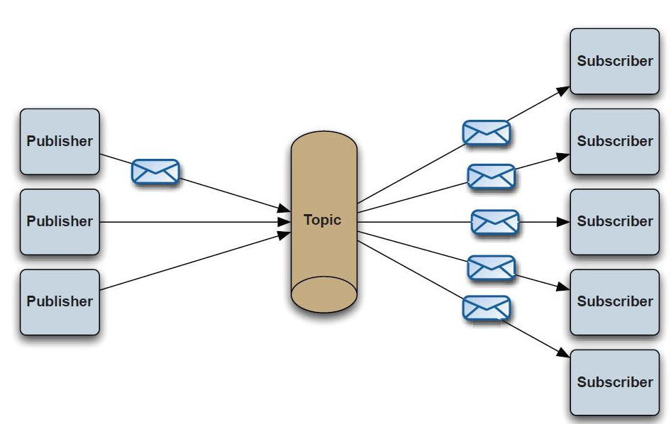
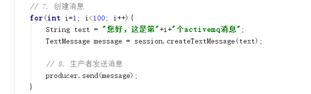
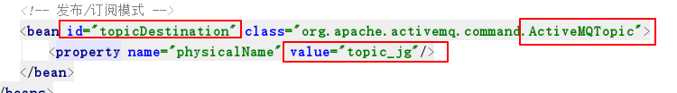
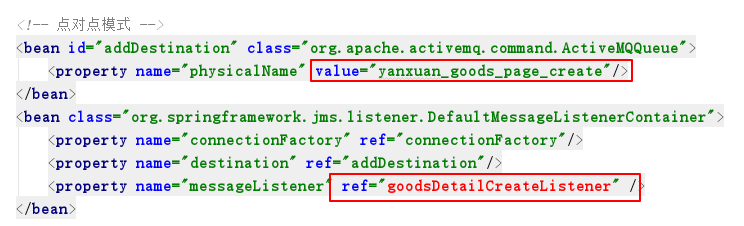

# 极光严选-第十三章-消息中间件解决方案

## 课程内容

- 消息中间件
  - 概念介绍
  - ActiveMQ环境搭建
  - 入门案例
  - Spring整合ActiveMQ
- 系统功能
  - 更新Solr索引库中的数据
  - 删除Solr索引库中的数据
  - 生成html页面
  - 删除html页面


## 学习目标

- [ ] 了解JMS的应用场景
- [ ] 能够说出消息中间件涉及的多个概念：broker、producer、consumer、topic、queue、message
- [ ] 能够完成ActiveMQ的环境准备
- [ ] 能够向ActiveMQ服务器发送消息
- [ ] 能够从ActiveMQ服务器中读取消息
- [ ] 能够完成Spring整合ActiveMQ的开发
- [ ] 能够编码完成更新Solr索引库的业务功能
- [ ] 能够编码完成删除Solr索引库中的数据的业务功能
- [ ] 能够编码完成生成HTML文件的业务功能
- [ ] 能够编码完成删除HTML文件的业务功能


## 一、消息中间件概述

### 1.1. 消息中间件和JMS协议

#### 1.1.1. 消息中间件

​	消息中间件是一种由消息传送机制或消息队列模式组成的中间件技术，利用高效可靠的消息传递机制进行平台无关的数据交流，并基于数据通信来进行分布式系统的集成。

​	一个客户端程序可以创建消息并且发送给消息服务提供者，另一个客户端程序可以从消息服务提供者中读取消息并进行业务规则处理。两个客户端程序不需要同时运行。

​	目前的解决方案是消息队列（Message Queue），简称MQ。

#### 1.1.2. JMS

​	JMS即Java消息服务（Java Message Service）应用程序接口，是一个Java平台中关于面向消息中间件的API，用于在两个应用程序之间，或分布式系统中发送消息，进行异步通信。Java消息服务是一个与具体平台无关的API，绝大多数消息中间件提供商都对JMS提供支持。

​	JMS是一种与厂商无关的 API，用来访问收发系统消息，它类似于JDBC(Java Database Connectivity)。这里，JDBC 是可以用来访问许多不同关系数据库的 API，而 JMS 则提供同样与厂商无关的访问方法，以访问消息收发服务。


### 1.2. 常用的消息中间件产品

#### 1.2.1. ActiveMQ

​	ActiveMQ是Apache旗下的产品，是一个纯Java程序，因此只需要操作系统支持Java虚拟机，ActiveMQ便可执行。其完全支持JMS1.1和J2EE1.4规范的JMS Provider实现。流行度较高。

#### 1.2.2. RabbitMQ

​	使用Erlang编写的一个开源的消息队列，本身支持很多的协议：AMQP，XMPP, SMTP,STOMP，也正是如此，使的它变的非常重量级，更适合于企业级的开发。同时实现了Broker架构，核心思想是生产者不会将消息直接发送给队列，消息在发送给客户端时先在中心队列排队。对路由(Routing)，负载均衡(Load balance)、数据持久化都有很好的支持。多用于进行企业级的ESB整合。

#### 1.2.3. Kafka

​	Apache下的一个子项目，使用scala实现的一个高性能分布式Publish/Subscribe消息队列系统，具有以下特性：

- 快速持久化：通过磁盘顺序读写与零拷贝机制，可以在O(1)的系统开销下进行消息持久化；
- 高吞吐：在一台普通的服务器上既可以达到10W/s的吞吐速率；
- 高堆积：支持topic下消费者较长时间离线，消息堆积量大；
- 完全的分布式系统：Broker、Producer、Consumer都原生自动支持分布式，依赖zookeeper自动实现负载均衡；
- 支持Hadoop数据并行加载：对于像Hadoop的一样的日志数据和离线分析系统，但又要求实时处理的限制，这是一个可行的解决方案。

#### 1.2.4. RocketMQ

​	RocketMQ是阿里开源的消息中间件，目前也已经孵化为Apache顶级项目。用Java语言实现，在设计时参考了Kafka，并做出了自己的一些改进，消息可靠性上比Kafka更好。RocketMQ在阿里内部被广泛应用在订单，交易，充值，流计算，消息推送，日志流式处理，binglog分发等场景。


### 1.3. 消息中间件的应用场景

#### 1.3.1. 系统解耦

​	交互系统之间没有直接的调用关系，只是通过消息传输，故系统的耦合度较低。

#### 1.3.2. 异步处理

​	我们在更新商品状态之后，要生成html页面，这两部分工作都完成之后，才会响应客户端，但是如果使用了消息中间件，直接发送消息告诉页面生成的服务端要生成html页面，而不需要等待就可以响应客户端，提高了响应效率。

#### 1.3.3. 流量削峰

​	一般应用在秒杀活动中，在秒杀活动一般会因为流量过大，服务器宕机，为了解决这个问题一般把请求写入到消息队列中，控制参与活动的人数，缓解短时间内高流量出现的服务器宕机的问题。


### 1.4.  JMS消息传递类型

> 消息传递类型有两种
>
> 1. 点对点（即一个消息只会被一名消费者消费）
> 2. 发布/订阅（一个消息可以被多个消费者接收，并消费）

#### 1.4.1. 点对点


#### 1.4.2. 发布/订阅



#### 1.4.3. 主要名词

| 名词     | 说明                                                         |
| -------- | ------------------------------------------------------------ |
| Broker   | 消息服务器，作为Server提供消息核心服务                       |
| Producer | 消息生产者，业务的发起方，负责生产消息传输给broker           |
| Consumer | 消息消费者，业务的处理方，负责从broker获取消息并进行业务处理 |
| Topic    | 主题，发布/订阅模式下的消息统一汇集地，不同生产者向topic发送消息，由MQ服务器分发到不同的订阅者，实现消息的广播。 |
| Queue    | 队列，点对点模式下，特定生产者向特定queue发送消息，消费者订阅特定的queue完成指定消息的接收 |
| Message  | 消息，据不同通信协议定义的固定格式进行编码的数据包，来封装业务数据，实现消息的传输 |


## 二、ActiveMQ

> 本次项目中的消息中间件采用ActiveMQ，所以针对ActiveMQ进行详解

### 2.1. 下载、安装、启动

#### 2.2.1. 下载

下载地址：http://activemq.apache.org/download.html


#### 2.2.2. Linux下安装

> 前提条件：安装JDK

1. 上传安装包至linux服务器
2. 解压上传之后的安装包

```shell
tar -zxvf apache-activemq-5.15.9-bin.tar.gz
```


3. 目录说明

| 目录名称 | 作用                                                         |
| -------- | ------------------------------------------------------------ |
| `./bin`  | 执行脚本目录                                                 |
| `./conf` | 配置信息目录<br/>`activemq.xml`：activemq的相关配置信息，其中指明服务端口是61616，协议为tcp<br/>`jetty-realm.properties`：配置了控制台的登录名/密码<br/>`jetty.xml`：配置了控台的访问端口是8161 |
| `./data` | 存放数据                                                     |
| `./docs` | 文档目录                                                     |
| `./lib`  | 相关jar包                                                    |

#### 2.2.3. 启动

```
./bin/activemq start
```

访问控制台 http://[ip]:8161/, 其中[ip]为虚拟机的ip地址，例如：http://192.168.253.130:8161/


### 2.2. 入门操作

#### 2.2.1. 准备工作

> 创建 `jms-demo`工程，并添加依赖

```xml
    <dependencies>
        <dependency>
            <groupId>org.apache.activemq</groupId>
            <artifactId>apache-activemq</artifactId>
            <version>5.15.9</version>
        </dependency>
    </dependencies>
```


#### 2.2.2. 点对点模式

1. 生产者

```java
public class Producer {

    public static void main(String[] args) throws  Exception{
        // 1. 创建连接工厂
        ConnectionFactory factory = new ActiveMQConnectionFactory("tcp://192.168.253.130:61616");
        // 2. 创建连接
        Connection connection = factory.createConnection();
        // 3. 开启连接
        connection.start();
        // 4. 创建会话
        Session session = connection.createSession(false, Session.AUTO_ACKNOWLEDGE);

        // 5. 创建点对点模式的消息存放Queue
        Destination destination = session.createQueue("queue_jg");

        // 6. 根据会话、消息存放中心创建消息生产者
        MessageProducer producer = session.createProducer(destination);

        // 7. 创建消息
        String text = "您好，这是第一个activemq消息";
        TextMessage message = session.createTextMessage(text);

        // 8. 生产者发送消息
        producer.send(message);

        // 9. 释放资源
        session.close();
        connection.close();
    }
}
```

控制台查看：


2. 消费者

```java
public class Consumer {

    public static void main(String[] args) throws Exception{
        // 1. 创建连接工厂
        ActiveMQConnectionFactory connectionFactory = new ActiveMQConnectionFactory("tcp://192.168.253.130:61616");

        // 2. 创建连接
        Connection connection = connectionFactory.createConnection();
        connection.start();

        // 3. 创建会话
        Session session = connection.createSession(false, Session.AUTO_ACKNOWLEDGE);

        // 4. 创建消息存放中心
        Destination destination = session.createQueue("queue_jg");

        // 5. 创建消费者
        MessageConsumer consumer = session.createConsumer(destination);

        // 6. 设置消息监听器
        consumer.setMessageListener(new MessageListener() {
            public void onMessage(Message message) {
                if (message instanceof TextMessage) {
                    TextMessage textMessage = (TextMessage) message;
                    try {
                        String text = textMessage.getText();
                        System.out.println("Received: " + text);
                    } catch (Exception e) {
                        e.printStackTrace();
                    }
                } else {
                    System.out.println("Received: " + message);
                }
            }
        });
       

        // 7. 释放资源
        consumer.close();
        session.close();
        connection.close();
    }
}
```

控制台查看：


#### 2.2.3. 特性测试

> 测试一个消息只会被一个消费者消费

1. 生产者代码调整



2. 消费者代码调整


测试发现，一个消息只会被一个消费者消费掉。

#### 2.2.4. 发布/订阅模式

1. 生产者

> 代码基本上与点对点模式中的生产者相同，但需要需改的地方是


2. 消费者

> 代码基本上与点对点模式中的消费者相同，但需要修改的是


3. 启动多个消费者实例，测试

结果：一个消息被多个消费者消费。


## 三、Spring应用整合JMS

### 3.1. 点对点模式

#### 3.1.1. 生产者

1. xml配置

```xml
<?xml version="1.0" encoding="UTF-8"?>
<beans xmlns="http://www.springframework.org/schema/beans"
       xmlns:xsi="http://www.w3.org/2001/XMLSchema-instance"
       xmlns:context="http://www.springframework.org/schema/context"
       xsi:schemaLocation="http://www.springframework.org/schema/beans 
                           http://www.springframework.org/schema/beans/spring-beans.xsd 
                           http://www.springframework.org/schema/context 
                           http://www.springframework.org/schema/context/spring-context.xsd">

    <!-- 包扫描路径 -->
    <context:component-scan base-package="com.itjiguang.demo" />
    <!-- 配置连接工厂 -->
    <bean id="activeMQConnectionFactory" class="org.apache.activemq.ActiveMQConnectionFactory">
        <property name="brokerURL" value="tcp://192.168.253.130:61616"/>
    </bean>
    <!-- spring 管理activemq的连接工厂 -->
    <bean id="connectionFactory" class="org.springframework.jms.connection.SingleConnectionFactory">
        <!-- 被管理的连接工厂 -->
        <property name="targetConnectionFactory" ref="activeMQConnectionFactory" />
    </bean>
    <!-- Spring提供的消息模板 jmsTemplate -->
    <bean id="jmsTemplate" class="org.springframework.jms.core.JmsTemplate">
        <property name="connectionFactory" ref="connectionFactory"/>
    </bean>

    <!-- 点对点模式 -->
    <bean id="queueDestination" class="org.apache.activemq.command.ActiveMQQueue">
        <property name="physicalName" value="queue_jg"/>
    </bean>
</beans>
```

2. java程序

```java
@Component
public class Producer {

    @Autowired
    private JmsTemplate template;

    @Autowired
    private Destination destination;

    public void createMessage(final String text){
        template.send(destination, new MessageCreator() {
            public Message createMessage(Session session) throws JMSException {
                return session.createTextMessage(text);
            }
        });
    }
}
```

3. 测试程序

```java
@ContextConfiguration(locations = {"classpath:spring/applicationContext-jms-producer.xml"})
@RunWith(SpringJUnit4ClassRunner.class)
public class ProducerTest {

    @Autowired
    private Producer producer;

    @Test
    public void test(){
        producer.createMessage("spring 整合 ActiveMQ 发送消息");
    }
}
```

#### 3.1.2. 消费者

1. xml配置

```xml
<?xml version="1.0" encoding="UTF-8"?>
<beans xmlns="http://www.springframework.org/schema/beans"
       xmlns:xsi="http://www.w3.org/2001/XMLSchema-instance"
       xmlns:context="http://www.springframework.org/schema/context"
       xsi:schemaLocation="http://www.springframework.org/schema/beans 
                           http://www.springframework.org/schema/beans/spring-beans.xsd 
                           http://www.springframework.org/schema/context 
                           http://www.springframework.org/schema/context/spring-context.xsd">

    <!-- 包扫描路径 -->
    <context:component-scan base-package="com.itjiguang.demo" />
    <!-- 配置连接工厂 -->
    <bean id="activeMQConnectionFactory" class="org.apache.activemq.ActiveMQConnectionFactory">
        <property name="brokerURL" value="tcp://192.168.253.130:61616"/>
    </bean>
    <!-- spring 管理activemq的连接工厂 -->
    <bean id="connectionFactory" class="org.springframework.jms.connection.SingleConnectionFactory">
        <!-- 被管理的连接工厂 -->
        <property name="targetConnectionFactory" ref="activeMQConnectionFactory" />
    </bean>
    <!-- Spring提供的消息模板 jmsTemplate -->
    <bean id="jmsTemplate" class="org.springframework.jms.core.JmsTemplate">
        <property name="connectionFactory" ref="connectionFactory"/>
    </bean>

    <!-- 点对点模式 -->
    <bean id="queueDestination" class="org.apache.activemq.command.ActiveMQQueue">
        <property name="physicalName" value="queue_jg"/>
    </bean>

    <bean class="org.springframework.jms.listener.DefaultMessageListenerContainer">
        <property name="connectionFactory" ref="connectionFactory"/>
        <property name="destination" ref="queueDestination"/>
        <property name="messageListener" ref="jgMessageListener" />
    </bean>
</beans>
```

2. Java程序

```java
@Component
public class JgMessageListener implements MessageListener{

    public void onMessage(Message message) {
        TextMessage textMessage = (TextMessage) message;
        try {
            String text = textMessage.getText();
            System.out.println("Received: " + text);
        } catch (Exception e) {
            e.printStackTrace();
        }
    }
}
```

3. 测试程序

```java
@ContextConfiguration(locations = {"classpath:/spring/applicationContext-jms-consumer.xml"})
@RunWith(SpringJUnit4ClassRunner.class)
public class ConsumerTest {

    @Test
    public void test(){
        // 保证程序处于运行状态
        while(true){
		
        }
    }
}
```

### 3.2. 发布/订阅模式

#### 3.2.1. 生产者

1. xml配置



2. Java程序

```java
@Component
public class TopicProducer {

    @Autowired
    private JmsTemplate template;

    @Autowired
    private Destination destination;

    public void sendMessage(final String text){
        template.send(destination, new MessageCreator() {
            public Message createMessage(Session session) throws JMSException {
                return session.createTextMessage(text);
            }
        });
    }
}
```


3. 测试程序

```java
@ContextConfiguration(locations = {"classpath:spring/applicationContext-topic-producer.xml"})
@RunWith(SpringJUnit4ClassRunner.class)
public class ProducerTest {

    @Autowired
    private TopicProducer producer;

    @Test
    public void test(){
        producer.createMessage("spring 整合 ActiveMQ 发送的Topic消息");
    }
}
```


#### 3.2.2. 消费者

1. xml配置


2. Java程序

```java
@Component
public class TopicMessageListener implements MessageListener {
    public void onMessage(Message message) {
        TextMessage textMessage = (TextMessage) message;
        try {
            String text = textMessage.getText();
            System.out.println("Received: " + text);
        } catch (Exception e) {
            e.printStackTrace();
        }
    }
}
```


3. 测试程序

```java
@ContextConfiguration(locations = {"classpath:/spring/applicationContext-topic-consumer.xml"})
@RunWith(SpringJUnit4ClassRunner.class)
public class ConsumerTest {

    @Test
    public void test(){
        while(true){

        }
    }
}
```


## 四、数据导入Solr索引库

### 4.1. 需求分析

> 在商品审核通过时，完成商品数据保存到solr索引库，如果直接调用远程的服务完成，会导致系统之间的耦合度较高，现在借助于消息中间件，在完成商品审核后，发送消息到broker，搜索服务从ActiveMQ接收消息，并导入到Solr索引库中。


### 4.2. 消息生产者（运营商后台）

#### 4.2.1. 准备工作

1. 完善依赖信息


2. 完善activemq的配置信息（不需要消费者的配置）


applicationContext-jms.xml的内容为：

```xml
<?xml version="1.0" encoding="UTF-8"?>
<beans xmlns="http://www.springframework.org/schema/beans"
       xmlns:xsi="http://www.w3.org/2001/XMLSchema-instance"
       xmlns:context="http://www.springframework.org/schema/context"
       xsi:schemaLocation="http://www.springframework.org/schema/beans http://www.springframework.org/schema/beans/spring-beans.xsd http://www.springframework.org/schema/context http://www.springframework.org/schema/context/spring-context.xsd">

    <!-- 配置连接工厂 -->
    <bean id="activeMQConnectionFactory" class="org.apache.activemq.ActiveMQConnectionFactory">
        <property name="brokerURL" value="tcp://192.168.253.130:61616"/>
    </bean>
    <!-- spring 管理activemq的连接工厂 -->
    <bean id="connectionFactory" class="org.springframework.jms.connection.SingleConnectionFactory">
        <!-- 被管理的连接工厂 -->
        <property name="targetConnectionFactory" ref="activeMQConnectionFactory" />
    </bean>
    <!-- Spring提供的消息模板 jmsTemplate -->
    <bean id="jmsTemplate" class="org.springframework.jms.core.JmsTemplate">
        <property name="connectionFactory" ref="connectionFactory"/>
    </bean>

    <!-- 点对点模式 -->
    <bean id="addDestination" class="org.apache.activemq.command.ActiveMQQueue">
        <property name="physicalName" value="yanxuan_goods_solr_add"/>
    </bean>
</beans>
```

#### 4.2.2. 发送消息

> 修改 `jiguangyanxuan-manager-server`工程中的GoodsInfoController


### 4.3. 消息消费者（搜索服务）

#### 4.3.1. 准备工作

1. 完善依赖信息


2. activemq配置信息


applicationContext-jms.xml的内容为：


#### 4.3.2. 接收消息，并导入Solr索引库

```java
@Component
public class GoodsSearchListener implements MessageListener {
    @Autowired
    private SolrTemplate solrTemplate;
    @Override
    public void onMessage(Message message) {
        try{
            TextMessage textMessage = (TextMessage)message;
            GoodsInfo goodsInfo = JSON.parseObject(textMessage.getText(), GoodsInfo.class);
            // 设置动态域
            // 商品的规格信息
            String specCheckedList = goodsInfo.getSpecCheckedList();
            List<Map> specList = JSONArray.parseArray(specCheckedList, Map.class);
            // 创建specMap集合
            Map<String, Object> specMap = new HashMap<>();
            if(specList == null){
                continue;
            }
            for (Map map :specList) {
                String key = (String) map.get("specName");
                Object optionValue = map.get("optionValue");

                specMap.put(key, optionValue);
            }

            goodsInfo.setSpecMap(specMap);
            // 执行导入solr索引库
            solrTemplate.saveBean(goodsInfo);
            solrTemplate.commit();
        }catch (Exception e){
            e.printStackTrace();
        }
    }
}
```

> **注意**：要保证spring扫描能扫描到该类


## 五、移除索引库

### 5.1. 需求分析

> 商品删除或者下架时，向ActiveMQ服务器发送消息，由消息消费者进行移除Solr索引库操作


### 5.2. 消息生产者（商家后台）

#### 5.2.1. 配置文件


#### 5.2.2. 发送消息


### 5.3. 消息消费者

#### 5.3.1. 配置文件


#### 5.3.2. 接收消息

```java
@Component
public class GoodsDeleteListener implements MessageListener {
    @Autowired
    private SolrTemplate solrTemplate;
    @Override
    public void onMessage(Message message) {
        try{
            TextMessage textMessage = (TextMessage)message;
            Long goodsId = Long.valueOf(textMessage.getText());
            // 执行删除操作
            solrTemplate.deleteById(goodsId);
            // 提交事务
            solrTemplate.commit();
        }catch (Exception e){
            e.printStackTrace();
        }
    }
}
```


## 六、商品审核-生成详情html页面

### 6.1. 需求分析

> 运营商执行商品审核通过后，向ActiveMQ消息服务器发送消息，网页生成服务从ActiveMQ接收到消息后执行网页生成操作。

### 6.2. 消息生产者

#### 6.2.1. 接触耦合

1. 删除系统依赖

> 从 `jiguangyanxuan-manager-server`中移除网页生成服务的依赖


2. 删除调用服务的相关代码


#### 6.2.2. 配置ActiveMQ


#### 6.2.3. 发送消息


### 6.3. 消息消费者

> 在 `jiguangyanxuan-detail-service`中完成解耦操作

#### 6.3.1. 移除Dubbox相关配置

1. 移除依赖信息


2. 移除配置信息


3. 添加Spring的包扫描

```
<context:component-scan base-package="cc.jgxy.yanxuan.search"/>
```

修改类的注解为Spring的Service中的注解

#### 6.3.2. ActiveMQ配置

1. 依赖信息 


2. 配置信息



#### 6.3.3. 接收消息

```java
@Component
public class GoodsDetailCreateListener implements MessageListener {

    @Autowired
    private IGoodsDetailService service;
    @Override
    public void onMessage(Message message) {
        try{
            TextMessage textMessage = (TextMessage)message;
            String goodsId = textMessage.getText();

            service.createHtml(Long.valueOf(goodsId));

        }catch (Exception e){
            e.printStackTrace();
        }
    }
}
```


## 七、商品删除-删除html页面

### 7.1. 消息生产者

#### 7.1.1. 配置信息


#### 7.1.2. 发送消息


### 7.2. 消息消费者

#### 7.2.1. 配置信息


#### 7.2.2. 接收消息

```java
@Component
public class GoodsDetailDeleteListener implements MessageListener {

    @Autowired
    private IGoodsDetailService service;
    @Override
    public void onMessage(Message message) {
        try{
            TextMessage textMessage = (TextMessage)message;
            String goodsId = textMessage.getText();

            service.deleteHtml(Long.valueOf(goodsId));

        }catch (Exception e){
            e.printStackTrace();
        }
    }
}
```

service方法：

```java
    @Override
    public boolean deleteHtml(Long goodsId) {
        File file = new File(pagePath + goodsId + ".html");

        System.out.println("删除文件:"+file.getPath());
        // 如果文件存在，则删除文件
        if(file.exists()){
            file.delete();
        }

        return true;
    }
```

