# 极光严选-第十九章-秒杀解决方案

## 课程内容

- 秒杀业务概述
- 秒杀商品详情
  - 详细信息展示
  - 倒计时展示
- 秒杀业务功能
  - 业务逻辑实现
  - 超卖问题解决
- 订单确认
- 订单支付


## 学习目标

- [ ] 能够说出秒杀业务逻辑实现思路
- [ ] 能够完成秒杀商品详细信息的展示
- [ ] 能够实现商品详情页面倒计时的展示
- [ ] 能够完成商品秒杀的业务逻辑实现
- [ ] 能够解决秒杀商品超卖的问题
- [ ] 了解Lua脚本语言的基本语法
- [ ] 了解JMeter压力测试工具的使用
- [ ] 能够完成订单的确认和订单支付


## 一、 业务概述和需求分析

### 1.1. 业务概述

#### 1.1.1. 简介

​	秒杀场景一般会在电商网站举行一些活动或者节假日在12306网站上抢票时遇到。对于电商网站中一些稀缺或者特价商品，电商网站一般会在约定时间点对其进行限量销售，因为这些商品的特殊性，会吸引大量用户前来抢购，并且会在约定的时间点同时在秒杀页面进行抢购。

#### 1.1.2. 业务场景特点

1. 秒杀时大量用户会在同一时间同时进行抢购，网站瞬时访问流量激增，读多。
2. 秒杀一般是访问请求数量远远大于库存数量，只有少部分用户能够秒杀成功，写少。
3. 秒杀业务处理时一定要校验库存。

#### 1.1.3. 架构设计思路

- 限流
  - 抢购的人多，但是只有少部分用户能够秒杀成功；
  - 设计的原则时尽可能的把流量拦截在请求上层。
- 削峰
  - 秒杀开始的那一瞬间，会有大量用户冲击进来，所以在开始时候会有一个瞬间流量峰值。如何把瞬间的流量峰值变得更平缓，是能否成功设计好秒杀系统的关键因素。实现流量削峰填谷，一般的采用缓存和 MQ 中间件来解决；
- 异步处理
  - 秒杀系统是一个高并发系统，采用异步处理模式可以极大地提高系统并发量，其实异步处理是削峰的一种实现方式；
- 内存缓存
  - 秒杀开始之前、开始时会有大量的用会访问秒杀的页面，会产生大量的数据读的操作，而查询到的数据基本上是一致，所以可以提前把数据缓存到内存中。

### 1.2. 需求分析

### 1.2.1. 表结构分析

1. 秒杀商品表

| 字段名称       | 字段类型   | 类型长度 | 含义       |
| -------------- | ---------- | -------- | ---------- |
| `id`           | `bigint`   |          | 主键ID     |
| `goods_id`     | `bigint`   |          | 商品编号   |
| `sku_id`       | `bigint`   |          | SKU编号    |
| `label`        | `varchar`  | 50       | 标题       |
| `small_pic`    | `varchar`  | 100      | 商品图片   |
| `old_price`    | `decimal`  | 10,2     | 原价格     |
| `new_price`    | `decimal`  | 10,2     | 打折价格   |
| `seller_id`    | `bigint`   |          | 商家编号   |
| `total_count`  | `int`      |          | 秒杀商品数 |
| `stock_count`  | `int`      |          | 库存数     |
| `introduction` | `varchar`  | 1000     | 商品介绍   |
| `start_date`   | `datetime` |          | 开始时间   |
| `end_date`     | `datetime` |          | 结束时间   |
| `create_date`  | `datetime` |          | 创建时间   |
| `check_date`   | `datetime` |          | 审核时间   |
| `status`       | `varchar`  | 1        | 审核状态   |

2. 秒杀订单表

| 字段名称           | 字段类型   | 类型长度 | 含义       |
| ------------------ | ---------- | -------- | ---------- |
| `id`               | `bigint`   |          | 主键ID     |
| `seckill_id`       | `bigint`   |          | 秒杀商品ID |
| `pay_money`        | `decimal`  | 10,2     | 支付金额   |
| `account_id`       | `bigint`   |          | 用户编号   |
| `create_date`      | `datetime` |          | 创建时间   |
| `pay_date`         | `datetime` |          | 支付时间   |
| `receiver`         | `varchar`  | 40       | 收货人     |
| `receiver_address` | `varchar`  | 100      | 收货地址   |
| `receiver_phone`   | `varchar`  | 40       | 收货电话   |
| `transaction_id`   | `varchar`  | 30       | 交易流水号 |

#### 1.2.2. 业务执行流程

1. 商家在后台系统提交商品的秒杀申请，由运营商进行申请的审批；
2. 用户通过浏览器查询所有参与秒杀的商品列表，并可以查看商品的详细信息；
3. 在商品详细信息页面可以查询商品的详情，并在秒杀开始后点击购买，确认订单信息；
4. 用户完成订单的支付，秒杀流程结束；（用户取消订单/或者未支付，恢复秒杀商品的库存）。

## 二、 前置工作

### 2.1. 准备工作

#### 2.1..1. 服务接口工程

参照其他的api工程创建`jiguangyanxuan-seckill-api`工程

#### 2.1.2. 服务实现工程

参照其他的service工程创建`jiguangyanxuan-seckill-service`工程

#### 2.1.3. 秒杀web工程

参照`jiguangyanxuan-cart-server`工程，创建`jiguangyanxuan-seckill-server`工程

拷贝秒杀相关的html、css、js、images文件至工程中

### 2.2. 前置业务

#### 2.2.1. 商家后台

1. 秒杀活动申请
2. 秒杀商品列表
3. 秒杀订单管理

#### 2.2.2. 运营商后台

1. 秒杀活动申请审核
2. 秒杀商品管理

#### 2.2.3. 门户

1. 秒杀商品列表


## 三、 秒杀商品详情

### 3.1. 需求分析

​	用户访问商品页面时，根据访问商品的id进行查询商品的信息，并完成商品的信息的渲染。这是一个读的操作，并且可能有大量的用户进行访问，所以需要加入缓存机制。

### 3.2. 前端业务模块

#### 3.2.1. module

```js
angular.module("seckill", []);
```

#### 3.2.2. service

```js
angular.module("seckill").service("goodsService", function ($http) {

    this.get = function (options) {
        var url = "/seckillGoods";
        // 如果是根据主键ID进行查询，那么需要修改资源路径
        if(options !== undefined && typeof options !== "object"){
            url = url + "/"+ options;
        }
        // 完成的是分页条件查询
        return $http.get(url, {params: options});
    }
});
```

#### 3.2.3. controller

拷贝`common.js`文件，封装了读取url中参数的js方法

```js
angular.module("seckill").controller("seckillController",function($scope, goodsService){

    // 读取url中的秒杀商品的id，发起请求根据id进行查询
    // 接收地址中请求参数
    var id = getQueryVariable("id");
    // 发送请求
    goodsService.get(id).then(
        function(res){
            $scope.entity = res.data;
        }
    );
});
```


#### 3.2.3. 启用业务模块

1. 引入js文件

```html
<script src="js/custom/common.js"></script>
<script type="text/javascript" src="js/plugins/angular/angular.min.js"></script>
<script type="text/javascript" src="js/custom/seckill/seckill.module.js"></script>
<script type="text/javascript" src="js/custom/seckill/seckill.goods.service.js"></script>
<script type="text/javascript" src="js/custom/seckill/seckill.controller.js"></script>
```

2. 设置模块

```html
<body ng-app="seckill" ng-controller="seckillController">
    ......
</body>
```


### 3.3. 服务端处理逻辑

#### 3.3.1. 封装实体类

```java
public class SecKillGoodsInfo extends SecondKillGoods {

    private GoodsSpu goodsSpu;
    private GoodsSku goodsSku;
    
    public GoodsSpu getGoodsSpu(){
        return goodsSpu;
    }
    
    public void setGoodsSpu(GoodsSpu goodsSpu){
        this.goodsSpu = goodsSpu;
    }

    public goodsSku getGoodsSku(){
        return goodsSku;
    }
    
    public void setGoodsSku(GoodsSku goodsSku){
        this.goodsSku = goodsSku;
    }
}
```

#### 3.3.2. controller

```js
@RestController
@RequestMapping("/seckill")
public class SecKillController{
    
    @Reference
    private ISecKillService secKillService;
    
    @GetMapping("/{id}")
    public ResponseEntity<SecKillGoodsInfo> queryById(@PathVariable("id") Long id ){
        // 根据秒杀商品的主键值查询商品信息
        SecKillGoodsInfo secKillGoodsInfo = secKillService.queryById(id);
		
        return new ResponseEntity<>(secKillGoodsInfo, HttpStatus.OK);
    }
}  
```


#### 3.3.3. 服务接口

```java
public interface ISecKillService{
    
    SecKillGoodsInfo queryById(Long id);
}
```


#### 3.3.4. 服务实现

```java
@Service
public class SecKillServiceImpl implements ISecKillService{

    @Autowired
    private SecondKillGoodsMapper secKillGoodsMapper;
    @Autowired
    private GoodsSpuMapper goodsSpuMapper;
    @Autowired
    private GoodsSkuMapper goodsSkuMapper;
    
    public SecKillGoodsInfo queryById(Long id){
        // 查询秒杀信息
        SecondKillGoods secKillGoods = secKillGoodsMapper.selectByPrimaryKey(id);
        // 查询商品主信息
        GoodsSpu goodsSpu = goodsSpuMapper.selectByPrimaryKey(secKillGoods.getGoodsId());
        // 查询规格信息
        GoodsSku goodsSku = goodsSkuMapper.selectByPrimaryKey(secKillGoods.getSkuId());
        
        // 创建返回结果
        SecKillGoodsInfo goodsInfo = new SecKillGoodsInfo();
        BeanUtils.copyProperties(secKillGoods, goodsInfo);
        goodsInfo.setGoodsSpu(goodsSpu);
        goodsInfo.setGoodsSku(goodsSku);
        
        return goodsInfo;
    }
}
```


### 3.4. 页面数据展示

#### 3.4.1. 响应数据处理

```js
$scope.skuInfo = "";
// 发送请求获取商品信息
$scope.queryById = function () {
    seckillGoodsService.get(id).then(
        function (res) {
            $scope.entity = res.data;
            // 处理图片数组
            $scope.entity.goodsSku.picUrl = JSON.parse($scope.entity.goodsSku.picUrl);
            // 处理规格信息
            $scope.entity.goodsSku.specs = JSON.parse($scope.entity.goodsSku.specs);
            for(var key in $scope.entity.goodsSku.specs){
                $scope.skuInfo += $scope.entity.goodsSku.specs[key];
            }
        }
    );
}
```

#### 3.4.2. 数据展示

```html
<div class="prod_opt">
    <div id="preview" class="prod_check">
        <ul class="prod_show">
            <span class="jqzoom">
                
            </span>
        </ul>
        <ul class="check_show">
            <li ng-repeat="picUrl in entity.goodsSku.picUrl">
                
            </li>
        </ul>
    </div>
    <div class="opt_check">
        <div class="opt_title">
            <h6>{{entity.label}}</h6>
            <p>{{entity.goodsSpu.sellPoint}}</p>
        </div>
        <div class="opt_info">
            <div class="price_info">
                <dl class="price_details">
                    <dt>本店价格</dt>
                    <dd class="big_font">￥{{entity.newPrice}}</dd>
                    <dt>原价</dt>
                    <dd class="details_del">${{entity.oldPrice}}</dd>
                    <dt class="dis_time">{{countDownMessage}}</dt>
                    <dd class="time">
                        <span class="hour">{{timeStr}}</span>
                    </dd>
                </dl>
            </div>
            <dl class="model_opt">
                <dd>
                    <a class="current" href="javascript:;">{{skuInfo}}</a>
                </dd>
            </dl>
            <div class="opt_btn">
                <a href="javascript:;" ng-click="submitOrder()">立即抢购</a>
            </div>
        </div>
    </div>
</div>
```

```html
<div class="infor_con" ng-bind-html="entity.goodsSpu.detail| to_trusted">
</div>
```


### 3.5. 加入缓存机制

```java
@Service
public class SecKillServiceImpl implements ISecKillService{

    @Autowired
    private SecondKillGoodsMapper secKillGoodsMapper;
    @Autowired
    private GoodsSpuMapper goodsSpuMapper;
    @Autowired
    private GoodsSkuMapper goodsSkuMapper;
    @Autowired
    private RedisTemplate redisTemplate;

    public SecondKillGoods queryById(Long id){
        // 从缓存中读取秒杀商品的信息
        SecKillGoodsInfo goodsInfo = (SecKillGoodsInfo)redisTemplate.boundHashOps("seckillGoods").get(id.toString());
        // 如果从缓存中没有读取到，就去数据库查询，并且存放到缓存中
        if(goodsInfo == null){
            // 查询秒杀信息
            SecondKillGoods secKillGoods = secKillGoodsMapper.selectByPrimaryKey(id);
            // 查询商品主信息
            GoodsSpu goodsSpu = goodsSpuMapper.selectByPrimaryKey(secKillGoods.getGoodsId());
            // 查询规格信息
            GoodsSku goodsSku = goodsSkuMapper.selectByPrimaryKey(secKillGoods.getSku);
            // 创建返回结果
            goodsInfo = new SecKillGoodsInfo();
            BeanUtils.copyProperties(secKillGoods, goodsInfo);
            goodsInfo.setGoodsSpu(goodsSpu);
            goodsInfo.setGoodsSku(goodsSku);
            
            // 存储到缓存中
            redisTemplate.boundHashOps("seckillGoods").put(id.toString(), goodsInfo);
        }

        return goodsInfo;
    }
}
```

## 四、 秒杀倒计时

### 4.1. 需求分析

详情页面中显示的倒计时可以分为两种情况

1. 秒杀开始倒计时

   根据秒杀商品开始时间和当前系统时间之间的差值进行计算，分别得到时、分、秒

2. 秒杀结束倒计时

   根据秒杀商品的结束时间和当前系统时间之前的差值进行计算，分别得到时、分、秒

这里所提到的当前系统时间应该是服务器的系统时间。

当已经过了秒杀结束的时间或者库存<=0时，应该展示的时**秒杀结束**。

### 4.2. 实现思路

1. 详情页面加载后，向服务器发送请求获取系统时间与秒杀商品的开始时间、结束时间的差值
2. 服务器计算差值之后，响应客户端
3. 客户端根据得到的数据进行页面初始时间的展示
4. 客户端定时每秒更新倒计时的时间

### 4.3. 服务端逻辑

#### 4.3.1. 实体类添加属性

```java
public class SecKillGoodsInfo extends SecondKillGoods {

    private GoodsSpu goodsSpu;
    private GoodsSku goodsSku;

    private String countDownFlag ;
    private Long countDownSeconds;

    // setter、getter方法
}
```

#### 4.3.2. 服务实现

```java
@Override
public SecKillGoodsInfo queryById(Long id) {
    // 从缓存中读取秒杀商品的信息
    SecKillGoodsInfo goodsInfo = (SecKillGoodsInfo)redisTemplate.boundHashOps("seckillGoods").get(id.toString());
    // 如果从缓存中没有读取到，就去数据库查询，并且存放到缓存中
    if(goodsInfo == null){
        // 查询秒杀信息
        SecondKillGoods secKillGoods = secKillGoodsMapper.selectByPrimaryKey(id);
        // 查询商品主信息
        GoodsSpu goodsSpu = goodsSpuMapper.selectByPrimaryKey(secKillGoods.getGoodsId());
        // 查询规格信息
        GoodsSku goodsSku = goodsSkuMapper.selectByPrimaryKey(secKillGoods.getSkuId());

        // 创建返回结果
        goodsInfo = new SecKillGoodsInfo();
        BeanUtils.copyProperties(secKillGoods, goodsInfo);
        goodsInfo.setGoodsSpu(goodsSpu);
        goodsInfo.setGoodsSku(goodsSku);

        // 存储到缓存中
        redisTemplate.boundHashOps("seckillGoods").put(id.toString(), goodsInfo);
    }

    // 计算倒计时的时间
    // 当前系统时间
    Date nowDate = new Date();
    // 如果在开始时间之前为before；如果结束之后为after；否则为middle
    goodsInfo.setCountDownFlag(nowDate.before(goodsInfo.getStartDate())?
                               "before":
                               (nowDate.before(goodsInfo.getEndDate())?"middle":"after"));
    // 计算差值
    if("before".equals(goodsInfo.getCountDownFlag())){
        goodsInfo.setCountDownSeconds(goodsInfo.getStartDate().getTime()-nowDate.getTime());
    }else{
        goodsInfo.setCountDownSeconds(goodsInfo.getEndDate().getTime()-nowDate.getTime());
    }

    return goodsInfo;
}
```

### 4.4. 前端处理逻辑

```js
// 发送请求获取商品信息
$scope.queryById = function () {
    seckillGoodsService.get(id).then(
        function (res) {
            $scope.entity = res.data;
            // 设置初始显示倒计时
            if ($scope.entity.countDownFlag === "before") {
                $scope.countDownMessage = "距离秒杀开始还有";
                $scope.timeStr = convertSeconToStr($scope.entity.countDownSeconds / 1000);
            } else if ($scope.entity.countDownFlag === "middle" && $scope.entity.stockCount > 0) {
                $scope.countDownMessage = "距离秒杀结束还有";
                $scope.timeStr = convertSeconToStr($scope.entity.countDownSeconds / 1000);
            } else {
                $scope.countDownMessage = "秒杀活动已结束";
                $scope.timeStr = "";
            }
            var tempSeconds = $scope.entity.countDownSeconds / 1000;
            var countDown = $interval(function () {
                if (tempSeconds > 2) {
                    tempSeconds--;
                    $scope.timeStr = convertSeconToStr(tempSeconds);
                } else if(tempSeconds>0) {
                    // 倒计时快结束时，发送请求获取最新数据
                    $interval.cancel(countDown);
                    $scope.queryById();
                }else{
                    $interval.cancel(countDown);
                }
            }, 1000);
        }
    );
};

convertSeconToStr = function (second) {
    var days = Math.floor(second/60/60/24);
    var hours = Math.floor(second/60/60%24);
    var mins = Math.floor(second/60%60);
    var seconds = Math.floor(second%60);
    if(days>0){
        timeStr = days+"天";
    }
    timeStr = timeStr + hours+":"+ mins+":"+seconds+"";
    return timeStr;
}
```


## 五、 秒杀下单

### 5.1. 需求分析

​	用户通过点击*立即购买*按钮触发秒杀的请求，由于秒杀的商品数量是有限制的，所以在接收到秒杀的请求后，要先进行库存的校验，如果库存为0，则说明秒杀活动结束了；如果库存大于0，则进行减库存的操作，并且生成预订单信息，然后由秒杀成功的用户进行订单确认并完成秒杀订单的支付。

### 5.2. 前端秒杀请求

#### 5.2.1. 请求触发

```html
<div class="opt_btn">
    <a href="javascript:;" ng-click="submitOrder()">立即抢购</a>
</div>
```

#### 5.2.2. 请求发送

```js
    // 提交秒杀商品的订单
    $scope.submitOrder = function () {
        seckillOrderService.post({id:$scope.entity.id}).then(
            function (res) {
                if(res.status === 201){
                    // 秒杀成功，完善订单信息，进行订单确认
                    location.href="goods_cart_submit.html?orderNo="+res.data.orderNo;
                }else{
                    alert("秒杀活动已结束，谢谢参与");
                }
            },
            function (reason) {
                alert("秒杀活动已结束，谢谢参与");
            }
        )
    }
```

#### 5.2.3. 业务模块service

1. servie定义

```js
angular.module("seckill").service("orderService", function ($http) {

    this.post = function (options) {
        return $http.post("/seckillOrder", options);
    };

});
```

2. 启用servie

```html
<script type="text/javascript" src="js/custom/seckill/seckill.order.service.js"></script>
```

3. 注入到controller

```js
angular.module("seckill").controller("seckillController", 
                                     function ($scope, goodsService, orderService) {

    // 处理逻辑
});
```


### 5.3. 服务端处理逻辑

#### 5.3.1. controller

```java
@RestController
@RequestMapping("/seckillOrder")
public class SecKillOrderController {

    @Autowired
    private ISeckillOrderService orderService;

    @PostMapping
    public ResponseEntity submit(@RequestBody Long seckillId){
        // 获取登陆人
        String loginName = SecurityContextHolder.getContext().getAuthentication().getName();

        try{
            // 保存订单信息
            String orderNo = orderService.submitOrder(seckillId, loginName);
            // 创建返回结果
            Map<String,String> result = new HashMap<String, String>();
            result.put("orderNo", orderNo);
            
            return new ResponseEntity(result, HttpStatus.CREATED);
        }catch (RuntimeException re){
            re.printStackTrace();
            return new ResponseEntity(HttpStatus.OK);
        }
    }
}
```

#### 5.3.2. 服务接口

```java
public interface ISeckillOrderService {

    /**
     * 保存秒杀商品的订单信息
     * @param seckillId
     * @param LoginName
     */
    public String submitOrder(Long seckillId, String LoginName);
}
```

#### 5.3.3. 服务实现

```java
@Service
public class SeckillOrderServiceImpl implements ISeckillOrderService {

    @Autowired
    private RedisTemplate redisTemplate;
    @Autowired
    private SecondKillGoodsMapper secondKillGoodsMapper;
    @Autowired
    private AccountMapper accountMapper;

    @Autowired
    private SnowFlake snowFlake;

    @Override
    public String submitOrder(Long seckillId, String loginName) {
        // 从redis中查找秒杀商品
       SecKillGoodsInfo goodsInfo = （SecKillGoodsInfo）redisTemplate.boundHashOps("seckillGoods")
           .get(id.toString());
        if(goodsInfo==null){
            //商品不存在
            throw new RuntimeException("商品不存在");
        }
        if(goodsInfo.getStockCount()<=0){
            // 库存不足
            throw new RuntimeException("商品已销售完毕");
        }

        // 扣减库存数量
        goodsInfo.setStockCount(goodsInfo.getStockCount()-1);
        // 如果扣减库存后数量为0
        if(goodsInfo.getStockCount() ==0 ){
            // 更新数据库中的秒杀商品信息
            SecondKillGoods seckillGoods = new SecondKillGoods();
            seckillGoods.setId(goodsInfo.getId());
            goodsInfo.setStockCount(goodsInfo.getStockCount());
            secondKillGoodsMapper.updateByPrimaryKeySelective(seckillGoods);
        }

        redisTemplate.boundHashOps("seckillGoods").put(goodsInfo.getId().toString(), goodsInfo);

        // 登录账户
        Account loginAccount = this.getLoginAccount(loginName);
        // 秒杀订单信息
        SecondKillOrder seckillOrder = new SecondKillOrder();
        seckillOrder.setId(snowFlake.nextId());// 订单号
        seckillOrder.setAccountId(loginAccount.getId());
        seckillOrder.setCreateDate(new Date());
        seckillOrder.setSeckillId(goodsInfo.getId());
        seckillOrder.setPayMoney(goodsInfo.getNewPrice());

        // 保存订单信息
       redisTemplate.boundHashOps("seckillOrder").put(loginAccount.getId()+"",seckillOrder);

        return seckillOrder.getId().toString();
    }

    private Account getLoginAccount(String loginName){
        AccountExample example = new AccountExample();
        example.createCriteria().andLoginNameEqualTo(loginName);
        List<Account> accountList = accountMapper.selectByExample(example);
        return accountList.get(0);
    }
}
```

### 5.4. 并发测试

#### 5.4.1. Jmeter简介

​	JMeter是Apache组织开发的基于Java的压力测试工具。用于对软件做压力测试，它最初被设计用于Web应用测试，但后来扩展到其他测试领域。 它可以用于测试静态和动态资源，例如静态文件、Java 小服务程序、CGI 脚本、Java 对象、数据库、FTP 服务器， 等等。JMeter 可以用于对服务器、网络或对象模拟巨大的负载，来自不同压力类别下测试它们的强度和分析整体性能。另外，JMeter能够对应用程序做功能/回归测试，通过创建带有断言的脚本来验证你的程序返回了你期望的结果。为了最大限度的灵活性，JMeter允许使用正则表达式创建断言。

#### 5.4.2. 下载并安装

1. 下载地址

http://mirrors.tuna.tsinghua.edu.cn/apache//jmeter/binaries/apache-jmeter-5.2.1.zip

2. 解压是安装

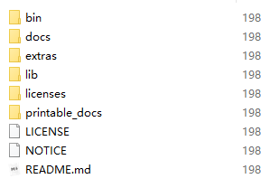

使用`bin`目录下的`jmeter.bat`即可启动

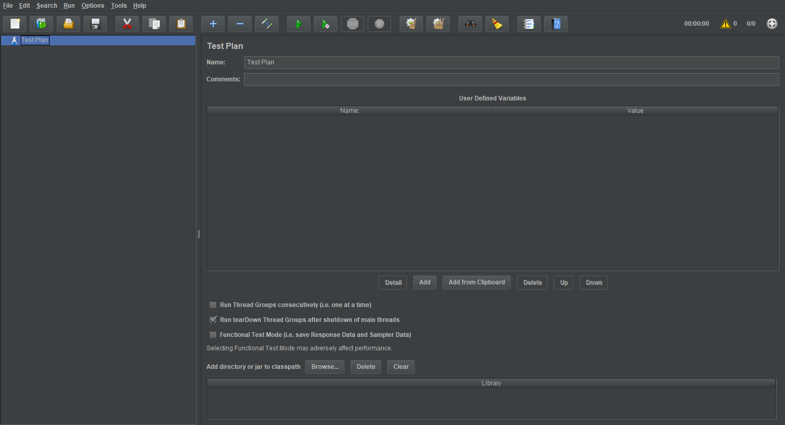

#### 5.4.3. 使用步骤

##### 5.4.3.1. 添加线程组

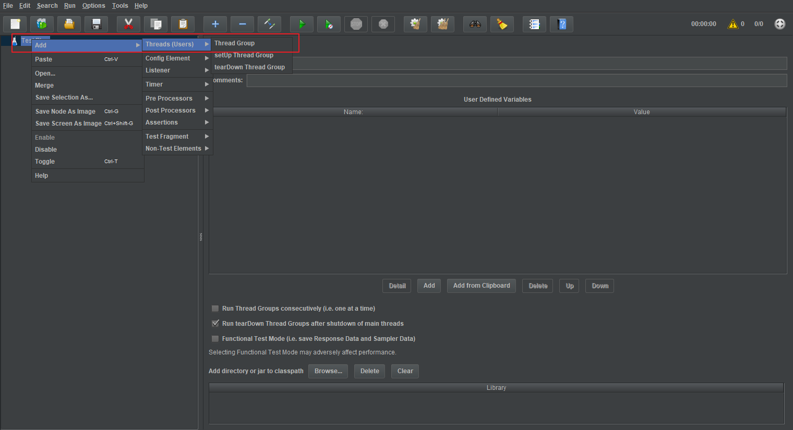

并设置并发线程数（用户数）

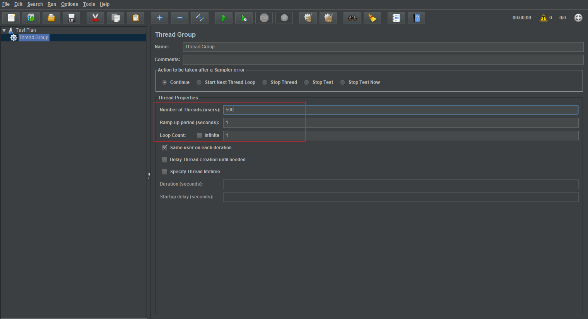

##### 5.4.3.2. 设置请求

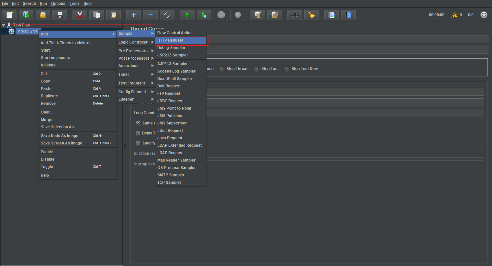

并设置请求的相关信息

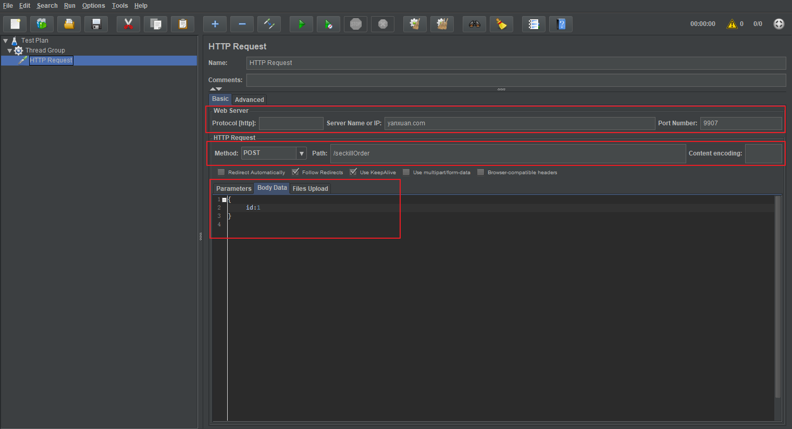

##### 5.4.3.3. 设置头信息

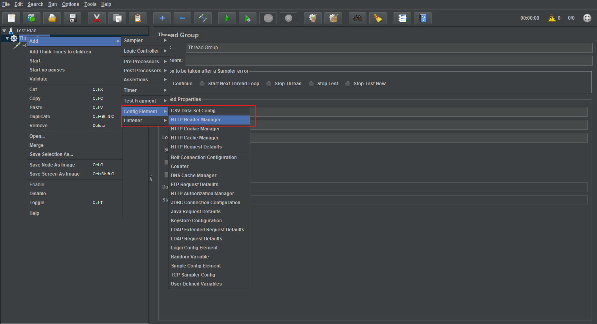

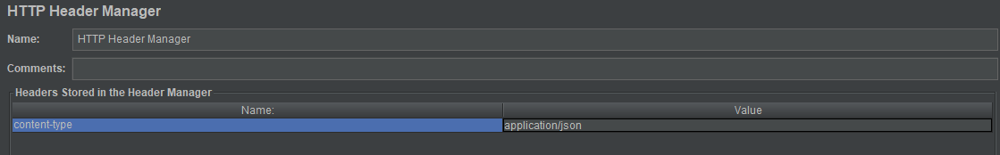

##### 5.4.3.4. 结果观察

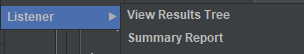

##### 5.4.3.5. 执行测试

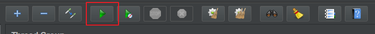

### 5.5. 超卖问题

#### 5.5.1. 问题说明

现在处理的逻辑是：从redis中读取秒杀商品的库存信息，在java程序中进行校验，并减库存，然后存储更新到redis中，并创建订单。

可能会出现的情况，一个用户的请求在java程序中减库存，还未更新到redis中，有另一个用户读取到redis中的数据，并进行了减库存，并创建了订单。这样一来可能当库存为1时，就生成了两个订单信息，造成了超卖问题。

这种问题出现的原因就在于**校验库存**和**减库存** 这两个操作在redis中执行不具备**原子性**。解决该问题就是把这两个操作放在一起，即在一个事务中完成两个操作。

#### 5.5.2. lua简介

Lua 是一种轻量小巧的脚本语言，用标准[c++](http://www.dba.cn/book/cplusplus/)语言编写并以源代码形式开放， 其设计目的是为了嵌入应用程序中，从而为应用程序提供灵活的扩展和定制功能。

其设计目的是为了嵌入应用程序中，从而为应用程序提供灵活的扩展和定制功能。

对Java开发工程师来说，lua的应用场景有两个：

1. Nginx+lua完成动态服务器配置，请求的动态处理
2. Reids+lua完成多个操作的原子性，分布式锁的应用

#### 5.5.3. 基本语法

参照 `资料/lua_5.3_中文手册.pdf`

1. jedis调用lua脚本

```java
public class LuaScriptTest {

    @Test
    public void testJedis(){
        // 创建redis连接
        Jedis jedis = new Jedis();
        // 创建脚本
        String script = "local name = redis.call('get',KEYS[1]);" +
                "if (name == ARGV[1] ) " +
                "then " +
                "return 1; " +
                "else " +
                "return 2; " +
                "end ";
        // 创建参数
        List<String> keyList = new ArrayList<String>();
        keyList.add("name");
        List<String> argvList = new ArrayList<String>();
        argvList.add("itjiguang");
        // 执行脚本
        Object eval = jedis.eval(script, keyList, argvList);

        System.out.println(eval);
    }
}
```

2. redisTemplate调用lua脚本

```java
@ContextConfiguration(locations = {"classpath:spring-redis.xml"})
@RunWith(SpringJUnit4ClassRunner.class)
public class LuaScriptTest {

    @Autowired
    private RedisTemplate redisTemplate;

    @Test
    public void testRedisTemplate(){
        // 创建脚本
        String script = "local name = redis.call('get',KEYS[1]);" +
            "if (name == ARGV[1] ) " +
            "then " +
            "return 1; " +
            "else " +
            "return 0; " +
            "end ";
        // 创建参数
        List<String> keyList = new ArrayList<String>();
        keyList.add("name");
        List<String> argvList = new ArrayList<String>();
        argvList.add("itjiguang");

        Object execute = redisTemplate.execute(new DefaultRedisScript(script, Boolean.class), keyList, argvList);

        System.out.println(execute);
    }
}
```

#### 5.5.4. 解决超卖问题

在lua脚本中完成库存的校验和减库存的操作，并返回秒杀商品的信息。

```java
@Service
public class SeckillOrderServiceImpl implements ISeckillOrderService {

    @Autowired
    private RedisTemplate redisTemplate;
    @Autowired
    private SecondKillGoodsMapper secondKillGoodsMapper;
    @Autowired
    private AccountMapper accountMapper;

    @Autowired
    private SnowFlake snowFlake;

    @Override
    public String submitOrder(Long seckillId, String loginName) {
        // 执行lua脚本预减库存,如果库存>0，则进行减操作，返回1，否则直接返回0
        String script = " local stock = redis.call('hget', 'seckillGoods_stock', '1'); " +
            " if ( tonumber(stock) > 0 ) " +
            " then " +
            " redis.call('hincrby', 'seckillGoods_stock', '1', -1); " +
            " return 1; " +
            " else " +
            " return 0; " +
            " end ";
        DefaultRedisScript defaultRedisScript = new DefaultRedisScript(script, Boolean.class);
        // 执行脚本
        Boolean execute = (Boolean) redisTemplate.execute(defaultRedisScript, null);

        if(execute){
            // 查询秒杀商品的信息
            SecKillGoodsInfo goodsInfo = (SecKillGoodsInfo)redisTemplate.boundHashOps("seckillGoods").get(id.toString());
            // 登录账户
            Account loginAccount = this.getLoginAccount(loginName);
            // 秒杀订单信息
            SecondKillOrder seckillOrder = new SecondKillOrder();
            seckillOrder.setId(snowFlake.nextId());// 订单号
            seckillOrder.setAccountId(loginAccount.getId());
            seckillOrder.setCreateDate(new Date());
            seckillOrder.setSeckillId(goodsInfo.getId());
            seckillOrder.setPayMoney(goodsInfo.getNewPrice());


            redisTemplate.boundHashOps("seckillOrder"+id).put(loginAccount.getId()+"", seckillOrder);
            return seckillOrder.getId().toString();
        }else{
            throw new RuntimeException("库存不足");
        }
        
    }

    private Account getLoginAccount(String loginName){
        AccountExample example = new AccountExample();
        example.createCriteria().andLoginNameEqualTo(loginName);
        List<Account> accountList = accountMapper.selectByExample(example);
        return accountList.get(0);
    }
}
```

#### 5.5.5. 功能测试

1. 在redis中添加秒杀商品的库存信息

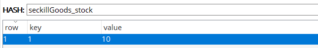

2. 使用JMeter进行并发测试


## 六、订单确认与支付

### 6.1. 订单确认

1. 读取用户的收货地址信息，供用户进行选择
2. 读取用户秒杀的商品信息，供用户浏览
3. 根据用户选择的支付方式完成订单的支付


### 6.2. 订单支付

1. 调用支付宝的下单支付接口，进行支付
2. 调用支付宝的订单查询接口，查询支付完成情况