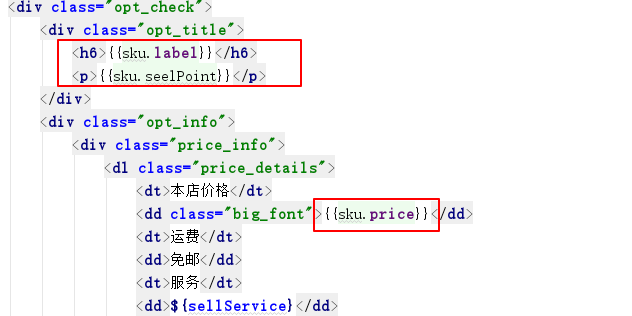

# 极光严选-第十二章-商品详情展示

## 课程内容

- 页面静态化技术
  - FTL指令
  - 内建函数
  - 插值规则
  - 运算符

- 商品详情展示
  - 商品基本信息
  - 图片信息
  - 规格信息
  - SKU信息更新
  - 购买数量操作
- 系统对接
  - 运营商生成html页面
  - 搜索系统对接详情页系统


## 学习目标

- [ ] 掌握Freemarker中的FTL指令
- [ ] 掌握Freemarker常用的内建函数
- [ ] 记忆Freemarker的插值规则
- [ ] 完成商品详情页面的生成，并显示基本信息、图片信息、规格信息
- [ ] 完成商品规格的选择及SKU信息的更新
- [ ] 完成商品购买数量的操作
- [ ] 完成系统之间的对接


## 一、 网页静态化技术

### 1.1. 简介

​	FreeMarker是一款模板引擎： 即一种基于模板和要展示的数据，并用来生成输出文本（HTML网页、电子邮件、配置文件、源代码等）的通用工具。它不是面向最终用户的，而是一个Java类库，是一款程序员可以嵌入他们所开发产品的组件。

​	FreeMarker是免费的，基于Apache许可证2.0版本发布。其模板编写为FreeMarker Template Language（FTL），属于简单、专用的语言。需要准备数据在真实编程语言中来显示，比如数据库查询和业务运算，之后模板显示已经准备好的数据。在模板中，主要用于如何展现数据，而在模板之外注意于要展示什么数据。

在线使用手册：<http://freemarker.foofun.cn/index.html>

### 1.2. 应用场景

- 新闻门户网站的文章类型频道一般都用到了网页静态化技术。点击新闻直接会跳到静态化的页面。
- 电商网站的商品详情页也十分常用，我们在存储商品的时候会生成静态化页面，点击商品详情，会直接跳到生成的商品详情的静态化页面。
- 此外网页静态化技术可以结合Nginx这种高性能web服务器来提高并发访问量。

### 1.3. 原理


### 1.4. 入门案例

#### 1.4.1. 创建模板

```html
<span>hello,${username} welcome to freemarker!</span>
```

#### 1.4.2. 根据模板生成网页

```xml
<dependency>
    <groupId>org.freemarker</groupId>
    <artifactId>freemarker</artifactId>
    <version>2.3.23</version>
</dependency>
```


```java
public static void main(String[] args) throws Exception{
    // 1. 创建配置实例
    Configuration configuration = new Configuration(Configuration.VERSION_2_3_23);
    // 2. 设置模板所在的路径
    configuration.setDirectoryForTemplateLoading(new File("src/main/resources"));
    // 3. 设置字符集
    configuration.setDefaultEncoding("UTF-8");
    // 4. 加载模板
    Template hello = configuration.getTemplate("hello.ftl");
    // 5. 设置模板传入参数
    Map<String,Object> params = new HashMap<String, Object>();
    params.put("username","张三丰");

    // 6. 模板加载数据，并输出页面内容
    Writer writer = new FileWriter(new File("d:/hello.html"));
    hello.process(params, writer);
    // 7. 关闭输入流
    writer.close();

}
```

####  1.4.3. 结果检查


### 1.5. FTL指令

> ftl指令都是以`<#`开头，例如注释
>
> `<#-- 这是注释 -->`

| 指令名称                            | 描述         |
| ----------------------------------- | ------------ |
| `<#assign >`                        | 定义变量     |
| `<#include >`                       | 引入其他模板 |
| `<#if>...<#elseif>...<#else></#if>` | 条件判断     |
| `<#list list as item>`              | 集合遍历     |


#### 1.5.1. assign指令

1. 定义简单类型

```html
<#assign username="张三丰">
用户姓名：${username}
```

2. 定义对象类型

```html
<#assign user={"name":"张三丰","age":18,"address":"北京市天安门"}>
用户姓名：${user.name}<br/>
用户年龄：${user.age}<br/>
用户地址：${user.address}
```

#### 1.5.2. include指令

1. 创建模板`head.ftl`

```html
<h1>极光学苑</h1>
```

2. 在`hello.ftl`中引入`head.ftl`

```html
<#include "head.ftl">
```

#### 1.5.3.  if指令

> 此指令用于数据的逻辑判断


#### 1.5.4. list指令

```html
<#list list as item>
    ${item.id}————${item.name}<br/>
</#list>
```

> 如果想获得遍历到的数据的索引值，直接使用变量名称+?index即可，例如“`${item?index}`"


### 1.6. 内建函数

支持的数据类型

- 基本类型
  - 字符串
  - 数字
  - 布尔值
  - 日期/时间
- 容器：
  - 哈希表：{"name":"green mouse", "price":150}
  - 序列：0..9
  - 集合：["foo", "bar", 123.45]

#### 1.6.1. 语法

```html
${变量名?方法名}
```

#### 1.6.2. 原样输出

```
${"设置确定值"}
```

> 在网页中会把双引号中的值原样输出出来

#### 1.6.3. 数字

```java
params.put("count",1000000);
```

显示结果：


如果不希望显示成这个格式，那么就需要把数字转换成字符串进行展示，在模板中进行设置

```
${count?c}
```

#### 1.6.4. 日期/时间

1. java代码中设置数据

```
params.put("today",new Date())
```

2. 模板中设置显示时间

```
日期：${today?date}<br/>
时间：${today?time}<br/>
日期+时间 :${today?datetime} <br/>
日期格式化： ${today?string("今天是yyyy年MM月")}
```

3. 显示效果


#### 1.6.5. 容器类型数据

> 可以使用list指令进行遍历

```html
<#list 1..9 as num>
${num}<br/>
</#list>
```

#### 1.6.6. 字符串转JSON对象

```html
<#assign text="{"name":"green mouse", "price":150}" />
<#assign data=text?evel />
名称：${data.name}; 价格：${data.price}
```

#### 1.6.7. 空值处理

1. 判断变量是否存在(使用`??`)

```html
<#if value??>
值存在
<#else>
值不存在
</#if>
```

2. 缺值设置默认值(使用 `！`)

```html
${value!'-'}
```


### 1.7. 运算符

#### 1.7.1. 算术运算符

> Freemarker表达式完全支持 +,-,*,/,%算数运算符

#### 1.7.2. 逻辑运算符

> 支持的逻辑运算符
>
> && ：逻辑与
>
> || ： 逻辑或
>
> ！ ： 逻辑非

#### 1.7.3. 比较运算符

> 支持的比较运算符
>
> - =或==：判断两个值是否相等
> - != ：判断两个值是否不相等
> - \>或gt：大于
> - \>= 或 gte：大于等于
> - \< 或 lt：小于
> - \<=或lte：小于等于


## 二、 商品详情展示

> 当查看某件商品的详情时，直接生成商品详情的静态html页面

### 2.1. 准备工作

#### 2.1.1. 服务接口

> 创建 `jiguangyanxuan-detail-api` 工程，创建 `com.itjiguang.yanxuan.detail.api`包，并创建服务接口

```java
public interface IGoodsDetailService {

    /**
     * 根据模板和数据内容，创建商品详情页面的html文件
     * @return
     */
    public boolean createHtml(Long goodsId);
}
```


#### 2.1.2. 服务实现

1. 创建 `jiguangyanxuan-detail-service`工程，创建 `com.itjiguang.yanxuan.detail.service`包，并创建服务实现

2. 完善依赖信息

```xml
        <dependency>
            <groupId>org.freemarker</groupId>
            <artifactId>freemarker</artifactId>
        </dependency>
```

3. 完善freemarker配置

```xml
<bean id="freemarkerConfig"
      class="org.springframework.web.servlet.view.freemarker.FreeMarkerConfigurer">
    <property name="freemarkerSettings" >
        <props>
            <prop key="incompatible_improvements">2.3.23</prop>
            <prop key="template_exception_handler">rethrow</prop>
        </props>
    </property>
    <property name="templateLoaderPath" value="classpath:template/"/>
</bean>
```

```properties
tag_syntax=auto_detect
template_update_delay=2
default_encoding=UTF-8
output_encoding=UTF-8
locale=zh_CN
date_format=yyyy-MM-dd
time_format=HH:mm:ss
datetime_format=yyyy-MM-dd HH:mm:ss
# 配置网页生成的目录
pagePath=D:/goods_detail/
```


### 2.2. 基本信息展示

#### 2.2.1. 功能实现

```java
public class GoodsDetailServiceImpl implements IGoodsDetailService {

    @Value("${pagePath}")
    private String pagePath;
    @Autowired
    private FreeMarkerConfigurer configurer;
    @Autowired
    private GoodsSpuMapper goodsSpuMapper;
    @Autowired
    private GoodsSkuMapper goodsSkuMapper;

    @Override
    public boolean createHtml(Long goodsId) {
        try {
            // 读取模板
            Template template = configurer.getConfiguration().getTemplate("goods.ftl");
            // 查询商品的spu信息
            GoodsSpu goodsSpu = goodsSpuMapper.selectByPrimaryKey(goodsId);
            // 设置生成文件输出流
            FileWriter fileWriter = new FileWriter(new File(pagePath + goodsId + ".html"));
            // 生成文件
            template.process(goodsSpu, fileWriter);
            // 关闭流文件
            fileWriter.close();

        }catch (Exception e){
            e.printStackTrace();
        }
        return false;
    }
}
```

5. 配置模板，把goods.html拷贝到 `resources/template/`下，并修改扩展名为 `ftl`,

修改展示标题、卖点


> 在D盘下创建目录 `goods_detail`并拷贝相关的css、image、js到该目录下

#### 2.2.2. 测试程序

在 `jiguangyanxuan-manager-server`中引入 `jiguangyanxuan-detail-api`

修改GoodsInfoController中的方法


测试生成页面


#### 2.2.3. 显示商品详情


### 2.3. 页面图片展示


展示效果：


### 2.4. 生成规格列表

> 转换规格列表为json对象


### 2.5. 显示面包屑

#### 2.5.1. 修改模板

```html
    <!-- 面包屑导航开始 -->
    <div class="bread_nav inner_c">
        <span>${categoryName}</span>
        <span class="arrow_right"></span>
        <div class="bit_nav">
            <span>${name}</span>
            <a href="javascript:;"></a>
        </div>
    </div>
    <!-- 面包屑导航结束 -->
```


## 三、商品详情页-前端逻辑

### 3.1. 购买数量加减操作

#### 3.1.1. 准备工作

> 在html生成的目录中添加angular相关的文件


> 添加相关js文件
>
> 1. 拷贝 custom/app.module.js
> 2. 创建controller目录，并添加文件 goods.detail.controller.js

```javascript
app.controller("goodsController",function($scope){
	// 购买数量初始化
	$scope.count = 1;
	// 购买数量加减逻辑
	$scope.addNum = function (count) {
		// 根据传入的值计算购买数量
		$scope.count = $scope.count+count;
		// 控制购买数量不能小于1
		if($scope.count < 1 ){
			$scope.count = 1;
		}
	}
})
```

#### 3.1.2. 修改模板

1. 引入js文件

```html
<script type="text/javascript" src="js/plugins/angular/angular.min.js"></script>
<script type="text/javascript" src="js/custom/app.module.js"></script>
<script type="text/javascript" src="js/custom/goods.detail.controller.js"></script>
```


2. 设置angular应用


3. 调用方法

```html
<dt>数量</dt>
<dd class="number">
    <span class="minus" ng-click="setCount(-1)">-</span>
    <input type="number" ng-model="count">
    <span class="plus" ng-click="setCount(1)">+</span>
</dd>
```


### 3.2. 规格选择

#### 3.2.1. 实现效果


#### 3.2.2. 前端控制层

> 修改goodsController.js

```javascript
	// 用户选择的规格
	$scope.selectedSpec = {};
	// 用户选择规格
	$scope.selectSpecOption = function (name, value){
		// 如果已选中，则取消选中；如果未选中，则设置选中
		if($scope.selectedSpec[name] === value ){
			$scope.selectedSpec[name] = null;
		}else{
			$scope.selectedSpec[name] = value;
		}
	}
	// 判断某规格是否被选中
	$scope.isSelected = function(name, value){
		if($scope.selectedSpec[name] === value){
			return true;
		}else{
			return false;
		}
	}
```

#### 3.2.3. 修改模板


## 四、 商品详情页-读取SKU信息

> 不同规格组合的价格、描述可能是不同的，而在用户选择了一组规格之后，应该在页面上更新商品的价格为SKU的价格及描述

### 4.1. 页面生成SKU列表变量

#### 4.1.1. 服务实现


#### 4.1.2. 修改模板

```html
<script type="text/javascript">
	var skuList = [
	    <#list skuList as sku>
			{
			    "id":${sku.id?c},
				"label":"${sku.label!'-'}",
				"price":"${sku.price?string.currency}",
				"spec":${sku.specs}
			}
			<#if sku?has_next>,</#if>
	    </#list>
	];
</script>
```

### 4.2. 显示SKU标题和价格

#### 4.2.1. 加载默认的SKU信息

1. js代码

```JavaScript
	// 加载默认SKU信息
	$scope.loadSku = function () {
		$scope.sku = skuList[0];
		$scope.selectedSpec = $scope.sku.spec;
	};
	// 初始化调用
	$scope.loadSku();
```

2. 修改模板



#### 4.2.1. 选择规格更新SKU信息

1. 更新逻辑

```JavaScript
	getSelectedSku = function(){
		goodsSkuList.forEach(
			function(sku){
				// 比对是sku.spec 和 $scope.selectedSpec
				if(match(sku.spec, $scope.selectedSpec)){
					$scope.sku = sku;
				}
			}
		);
	}

	// 用来完成两个json对象的对比
	var match = function(obj1, obj2){

		for(var key in obj1){
			if(obj1[key] !== obj2[key]){
				return false;
			}
		}

		return true;

	}
```

2. 选中规格时更细腻SKU信息


### 4.3. 添加购物车

#### 4.3.1. js方法

```JavaScript
	// 添加商品到购物车
	$scope.addToCart = function () {
		console.log("skuid="+$scope.sku.id);
	}
```

#### 4.3.2. 修改模板


## 五、系统模块对接

### 5.1. 运营商后台调用页面生成服务

> 商品审核通过后立即生成商品html页面


### 5.2. 商品详情页面展示

​	商品详情页面都是静态的html页面，并且存放在计算机磁盘的路径中，针对这些磁盘路径我们可以借助于web服务器可以被浏览器进行访问，本次采用过的nginx服务器。

#### 5.2.1. Nginx服务器简介

​	Nginx ("engine x") 是一个开源的，支持高性能、高并发的 Web 服务和代理服务软件。在国内，使用Nginx的用户有：百度、京东、新浪、腾讯、淘宝等。大公司使用必有独特之处。

#### 5.2.2. 应用场景

1. web服务

相比 Apache，Nginx 使用更少的资源，支持更多的并发连接，体现更高的效率，这点使 Nginx 尤其受到虚拟主机提供商的欢迎。能够支持高达 50,000 个并发连接数的响应。

2. 反向代理

客户端向服务器发送请求时，会首先经过 Nginx 服务器，由Nginx服务器将请求分发到相应的 WEB 服务器。正向代理是代理客户端，而反向代理则是代理服务器，Nginx 在提供反向代理服务方面，通过使用正则表达式进行相关配置，采取不同的转发策略，配置相当灵活，而且在配置后端转发请求时，完全不用关心网络环境如何，可以指定任意的IP地址和端口号，或其他类型的连接、请求等。

3. 负载均衡

Nginx的负载均衡是将大量的前端并发请求或数据流量分担到多个后端网络节点分别处理，这样可以有效减少前端用户等待相应的时间，并可以减少后端服务器处理压力。

#### 5.2.3. 安装过程

1. linux系统中安装参照 资料/轻松完成Nginx的安装与配置.md

2. windows安装解压即可使用


#### 5.2.4. 常用指令

1. 启动双击nginx.exe
2. 关闭 

```shell
./nginx.exe -s quit
```

3. 重新加载配置文件

```shell
./nginx.exe -s reload
```

#### 5.2.5. 配置文件 nginx.conf

修改http服务器的相关配置

```
#设定http服务器，利用它的反向代理功能提供负载均衡支持
http {
    #文件扩展名与文件类型映射表
    include       mime.types;
    #默认文件类型
    default_type  application/octet-stream;

    #日志打印格式
    #log_format  main  '$remote_addr - $remote_user [$time_local] "$request" '
    #                  '$status $body_bytes_sent "$http_referer" '
    #                  '"$http_user_agent" "$http_x_forwarded_for"';

    #access_log  logs/access.log  main;

    #开启高效文件传输模式，sendfile指令指定nginx是否调用sendfile函数来输出文件，对于普通应用设为on，如果用来进行下载等应用磁盘IO重负载应用，可设置为off，以平衡磁盘与网络I/O处理速度，降低系统的负载。注意：如果图片显示不正常把这个改成off。
    sendfile        on;
    #此选项允许或禁止使用socke的TCP_CORK的选项，此选项仅在使用sendfile的时候使用
    #tcp_nopush     on;

    #长连接超时时间，单位是秒
    #keepalive_timeout  0;
    keepalive_timeout  65;

    #开启gzip压缩输出
    #gzip  on;

    #虚拟主机的配置
    server {
        #监听端口
        listen       80;
        #域名可以有多个，用空格隔开
        server_name  localhost;
        # server_name detail.yanxuan.com;

        #字符编码
        #charset koi8-r;

        #access_log  logs/host.access.log  main;

        #对/进行反向代理
        location / {
            #反向代理的文件目录
            root   d:/goods_detail;
            #反向代理默认首页映射
            # index  index.html index.htm;
        }

        #error_page  404              /404.html;

        # redirect server error pages to the static page /50x.html
        #
        error_page   500 502 503 504  /50x.html;
        location = /50x.html {
            root   html;
        }

    }
}
```

#### 5.2.6. 服务启动并测试

在浏览器中中访问 http://detail.yanxuan.com/{id}.html


### 5.3.  搜索系统与商品详情页对接

> 修改 `jiguangyanxuan-search-server`中的search.html，修改点击连接为 `http://detail.yanxuan.com/{{item.id}}.html`

```html
<ul class="product_list clearfix">
    <li ng-repeat="data in dataList">
        <div>
            <a href="javascript:http://detail.yanxuan.com/{{data.id}}.html">
                
            </a>
            <span class="collect">收藏</span>
        </div>
        <span>￥{{data.price}}</span>
        <p title="{{data.sellPoint}}">
            <a href="http://detail.yanxuan.com/{{data.id}}.html" 
               ng-bind-html="data.label | to_trusted">
            </a>
        </p>
        <p>{{data.sellerName}}</p>
        <a href="javascript:;" class="cart_btn">加入购物车</a>
    </li>
</ul>
```

