# 极光严选-第十五章-单点登录（SSO）解决方案

## 课程内容

- 开源单点登录解决方案
  - 执行流程
  - 环境搭建及测试
  - 动态用户认证
- 自定义单点登录页面
- CAS Client 与Spring Security整合
- 极光严选用户中心


## 学习目标

- [ ] 能够理解CAS单点登陆系统的执行流程
- [ ] 能够完成CAS单点登录系统服务端的环境搭建
- [ ] 能够完成CAS单点登录系统数据源的配置
- [ ] 能够完成CAS单点登录系统页面的个性化
- [ ] 能够完成CAS与SpringSecurity的集成
- [ ] 能够完成极光严选用户中心单点登录功能


## 一、开源单点登录系统（CAS）

### 1.1. 什么是单点登录

​	单点登录（Single Sign On），简称为 SSO，是目前比较流行的企业业务整合的解决方案之一。SSO的定义是在多个应用系统中，用户只需要登录一次就可以访问所有相互信任的应用系统。

​	极光严选的商城是拆分成了多个子系统，而这些子系统是部署在不同的服务器上，传统的方式是使用session记录用户的登录信息，而现在是不可行的，我们需要使用相关的单点登录技术来解决登录问题 的。


### 1.2. 什么是CAS

​	CAS是Central Authentication Service的缩写，中央认证服务，一种独立开放指令协议。CAS 是 Yale 大学发起的一个开源项目，旨在为 Web 应用系统提供一种可靠的单点登录方法。

​	CAS的特点：

1. 开源的企业级单点登录解决方案。
2. CAS Server 为需要独立部署的 Web 应用。
3. CAS Client 支持非常多的客户端(这里指单点登录系统中的各个 Web 应用)，包括 Java, .Net, PHP, Perl, Apache, uPortal, Ruby 等。

从结构上看，CAS 包含两个部分： CAS Server 和 CAS Client。CAS Server 需要独立部署，主要负责对用户的认证工作；CAS Client 负责处理对客户端受保护资源的访问请求，需要登录时，重定向到 CAS Server。CAS的基本协议流程为：

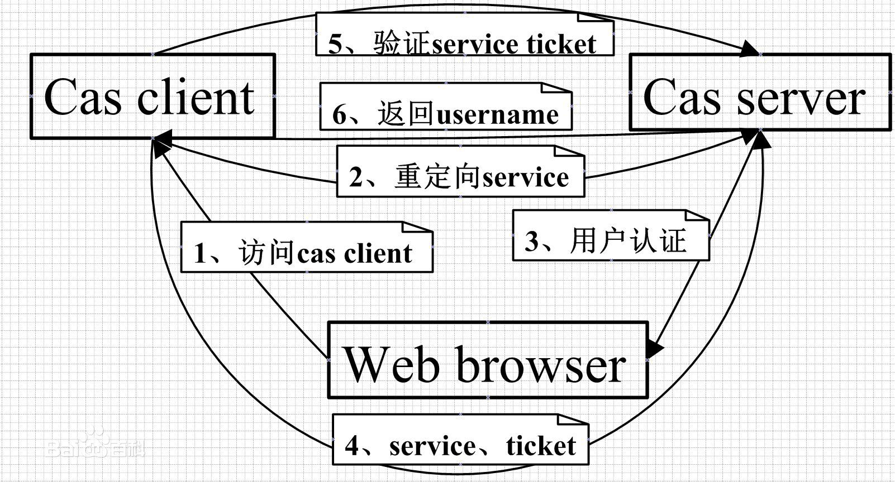

协议流程说明：

1. 访问应用服务：用户访问应用服务器提供的服务资源，
2. 定向认证：用户通过应用服务器进行认证时，会重定向用户请求到SSO服务器
3. 用户认证：用户进行SSO服务器的认证
4. 发放票据：认证通过后，SSO服务器会产生一个随机的Service Ticket
5. 验证票据：用户再次访问应用系统时，会直接进行SSO服务器验证票据Serive Ticket的合法性，验证通过后，允许客户端访问服务。
6. 传输用户信息：SSO服务器验证票据通过后，传输用户认证信息结果给客户端


### 1.3. 搭建CAS Server

> 目前cas最新的版本是6.x，为了保证系统的稳定性、可靠性，本次课程中采用的是5.3.8版本的进行教学演示。

​	官方推荐的安装方式采用war overlay的方式进行搭建，overlay是maven中用来在多个web工程里面共享通用资源的一个插件。在搭建cas server时不需要下载cas的源代码再进行编译构建，而是通过下载项目本身提供的预构建CAS web应用程序，并向其中添加个性化的功能实现逻辑，实现对cas server应用程序的零侵入。

#### 1.3.1. 下载并编译

下载地址：https://github.com/apereo/cas-overlay-template/archive/5.3.zip

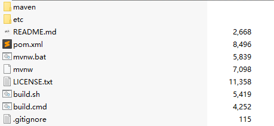

在解压开的目录中打开命令窗口（win+r）,执行maven的打包命令 `mvn clean package`，完成工程的编译，在当前目录下会生成 `target`目录，在该目录中就生成了 `cas.war`。

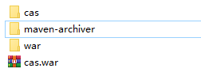

#### 1.3.2. 部署和访问

1. 部署到tomcat的webapps目录下；
2. 运行tomcat的启动脚本；
3. 打开浏览器访问：http://localhost:8080/cas

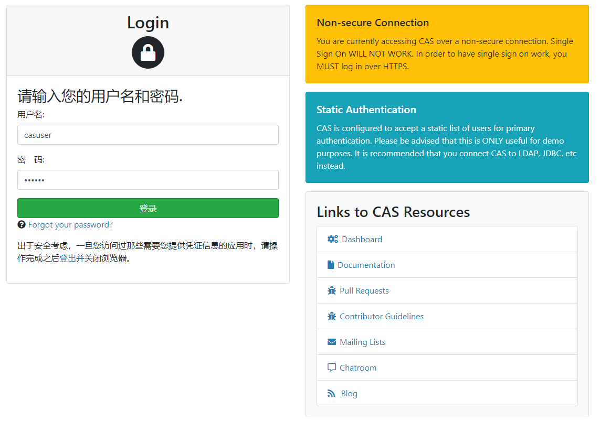

登录的用户名和密码为：`casuser`/`Mellon`

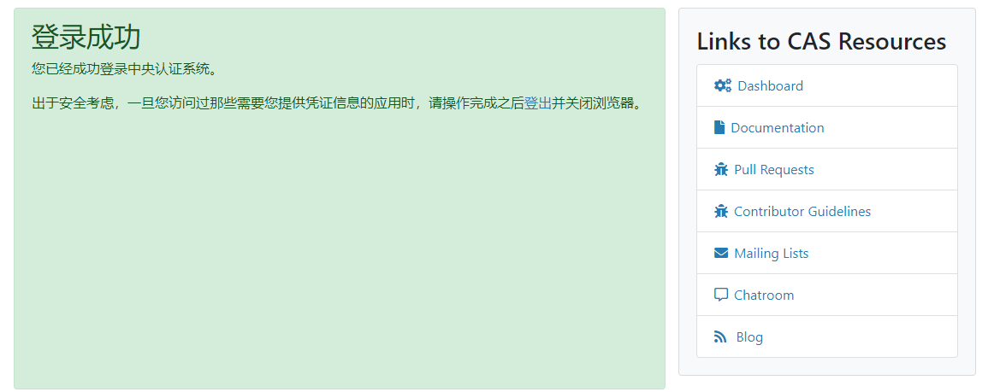

#### 1.3.3. 配置访问协议（启用https协议）

1. 创建密钥库

```shell
 keytool -genkeypair -alias "jiguangyanxuan" -keyalg "RSA" -keystore ".\jiguangyanxuan.keystore"
```

按照如下信息填写

```shell
输入密钥库口令: [123456]
再次输入新口令:[123456]
您的名字与姓氏是什么?
  [Unknown]:  localhost
您的组织单位名称是什么?
  [Unknown]:  localhost
您的组织名称是什么?
  [Unknown]:  localhost
您所在的城市或区域名称是什么?
  [Unknown]:  beijing
您所在的省/市/自治区名称是什么?
  [Unknown]:  beijing
该单位的双字母国家/地区代码是什么?
  [Unknown]:  zh-CH
CN=localhost, OU=localhost, O=localhost, L=beijing, ST=beijing, C=zh-CH是否正确?
  [否]:  y

输入 <jiguangyanxuan> 的密钥口令
        (如果和密钥库口令相同, 按回车):[123456]
再次输入新口令:[123456]
```

2. 生成证书

```shell
keytool -export -alias "jiguangyanxuan" -keystore ".\jiguangyanxuan.keystore" -file "./jiguangyanxuan.crt" -storepass 123456
```

3. 把证书导入到jdk中

```shell
keytool -import -keystore "D:\installed\Java\jdk1.8.0_101\jre\lib\security\cacerts" -file ".\jiguangyanxuan.crt" -alias "jiguangyanxuan" -storepass changeit
```

```shell
-- 删除jdk中的证书
keytool -delete -alias "jiguangyanxuan" -keystore "D:\installed\Java\jdk1.8.0_101\jre\lib\security\cacerts" -storepass changeit
```

```shell
-- 查看jdk中的证书
keytool -list -keystore "D:\installed\Java\jdk1.8.0_101\jre\lib\security\cacerts" -storepass changeit
```


4. 配置tomcat中的server.xml

注释掉原有配置

```xml
<!-- <Connector port="8080" protocol="HTTP/1.1"
               connectionTimeout="20000"
               redirectPort="8443" /> -->
```

添加启用`https`的配置

```xml
<Connector
		protocol="org.apache.coyote.http11.Http11NioProtocol"
         port="8443" maxThreads="200"
         scheme="https" secure="true" SSLEnabled="true"
         keystoreFile="E:/yanxuan/jiguangyanxuan.keystore" keystorePass="123456"
         clientAuth="false" sslProtocol="TLS"/>
```

其中 `keystoreFile`设置为证书在本地存放的位置， `keystorePass`为设置的口令密码

5. 配置浏览器导入证书

在 `chrome`浏览器中打开高级设置

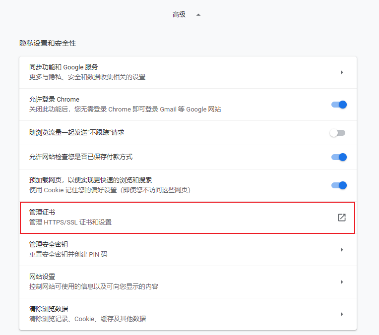

导入证书

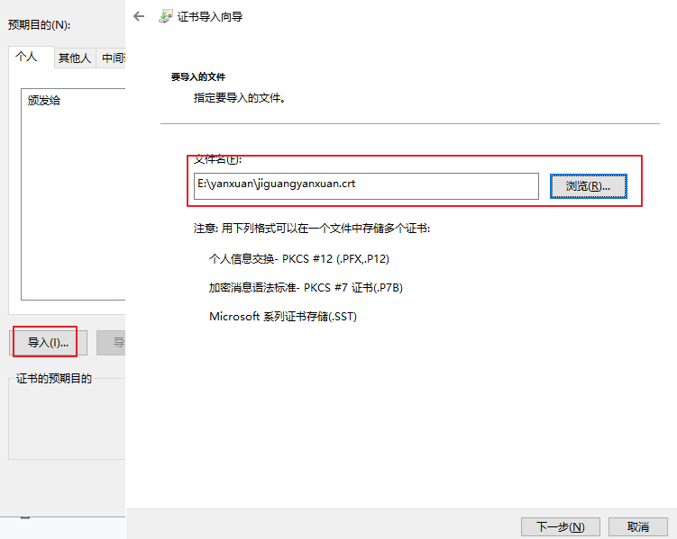

6. 重启tomcat服务器进行测试，访问 https://localhost:8443/cas 

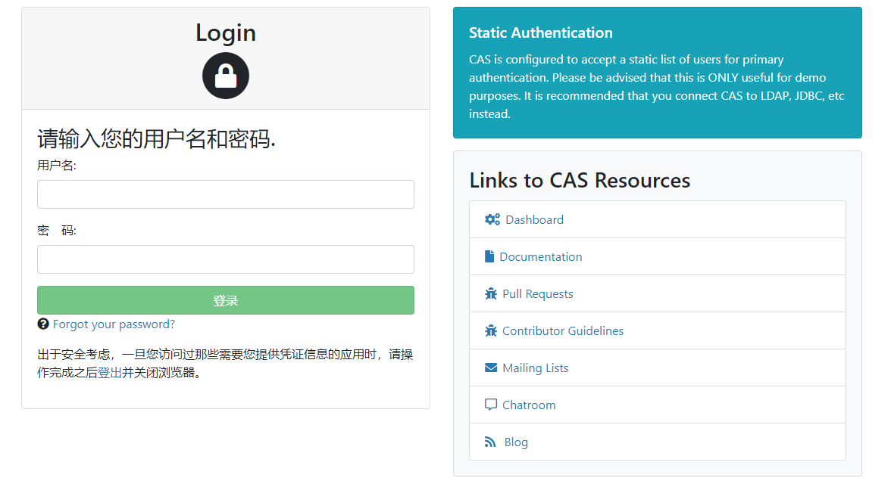

#### 1.3.4. 创建CAS Server工程

1. 把cas-overlay-template工程导入到idea中

2. 创建文件目录 `src/mian/resources`，并复制文件

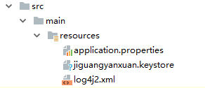

3. 修改 `application.properties`

```properties
# 开启https
server.ssl.enbaled=true
server.ssl.key-store=classpath:jiguangyanxuan.keystore
server.ssl.key-store-password=123456
server.ssl.key-password=123456

# 自定义登录的用户/密码
cas.authn.accept.users=itjiguang::itjiguang
```

4. 添加本地的tomcat服务器（开启https协议的tomcat）

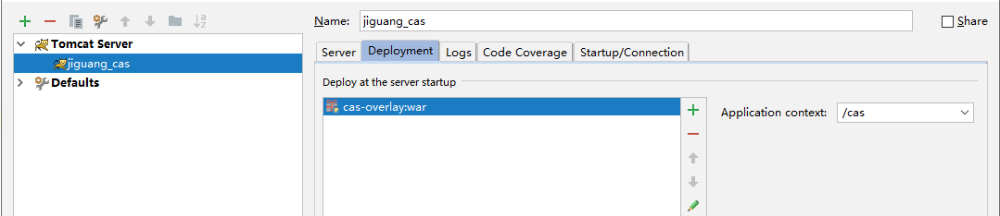

5. 启动tomcat服务器（时间可能比较长），访问 https://localhost:8443/cas 进行测试

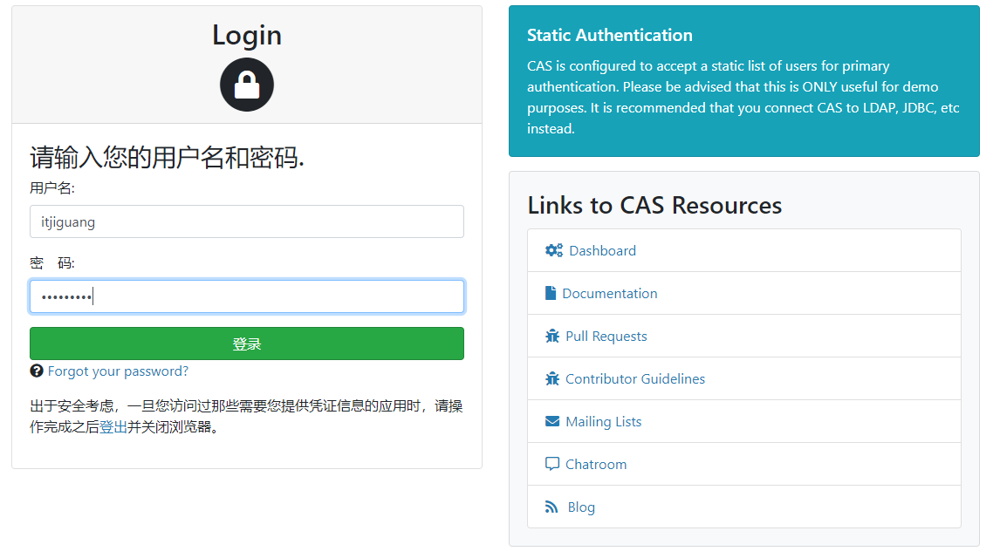

### 1.4. CAS Client搭建测试

#### 1.4.1 搭建CAS Client 1

1. 创建maven war工程，完善依赖信息

```xml
<?xml version="1.0" encoding="UTF-8"?>
<project xmlns="http://maven.apache.org/POM/4.0.0"
         xmlns:xsi="http://www.w3.org/2001/XMLSchema-instance"
         xsi:schemaLocation="http://maven.apache.org/POM/4.0.0 http://maven.apache.org/xsd/maven-4.0.0.xsd">
    <modelVersion>4.0.0</modelVersion>

    <groupId>com.itjiguang</groupId>
    <artifactId>client_1</artifactId>
    <version>1.0-SNAPSHOT</version>

    <packaging>war</packaging>
    <dependencies>
        <dependency>
            <groupId>org.jasig.cas.client</groupId>
            <artifactId>cas-client-core</artifactId>
            <version>3.5.1</version>
        </dependency>
        <dependency>
            <groupId>org.jasig.cas.client</groupId>
            <artifactId>cas-client-integration-tomcat-v7</artifactId>
            <version>3.5.1</version>
        </dependency>
        <dependency>
            <groupId>javax.servlet</groupId>
            <artifactId>servlet-api</artifactId>
            <version>2.5</version>
            <scope>provided</scope>
        </dependency>
    </dependencies>
    <build>
        <plugins>
            <plugin>
                <groupId>org.apache.maven.plugins</groupId>
                <artifactId>maven-compiler-plugin</artifactId>
                <version>2.5.1</version>
                <configuration>
                    <source>1.8</source>
                    <target>1.8</target>
                </configuration>
            </plugin>
            <plugin>
                <groupId>org.apache.tomcat.maven</groupId>
                <artifactId>tomcat7-maven-plugin</artifactId>
                <version>2.2</version>
                <configuration>
                    <port>8091</port>
                    <path>/</path>
                </configuration>
            </plugin>
        </plugins>
    </build>
    
</project>
```

2. 配置`web.xml`

```xml
<?xml version="1.0" encoding="UTF-8"?>
<web-app xmlns:xsi="http://www.w3.org/2001/XMLSchema-instance"
         xmlns="http://java.sun.com/xml/ns/javaee"
         xsi:schemaLocation="http://java.sun.com/xml/ns/javaee http://java.sun.com/xml/ns/javaee/web-app_2_5.xsd"
         version="2.5">

    <!--单点退出slo-->
    <filter>
        <filter-name>CAS Single Sign Out Filter</filter-name>
        <filter-class>org.jasig.cas.client.session.SingleSignOutFilter</filter-class>
        <init-param>
            <param-name>casServerUrlPrefix</param-name>
            <param-value>https://localhost:8443/cas</param-value>
        </init-param>
    </filter>
    <filter-mapping>
        <filter-name>CAS Single Sign Out Filter</filter-name>
        <url-pattern>/*</url-pattern>
    </filter-mapping>
    <listener>
        <listener-class>org.jasig.cas.client.session.SingleSignOutHttpSessionListener</listener-class>
    </listener>

    <filter>
        <filter-name>CAS Authentication Filter</filter-name>
        <filter-class>org.jasig.cas.client.authentication.AuthenticationFilter</filter-class>
        <init-param>
            <param-name>casServerUrlPrefix</param-name>
            <param-value>https://localhost:8443/cas</param-value>
        </init-param>
        <init-param>
            <param-name>serverName</param-name>
            <param-value>http://127.0.0.1:8091</param-value>
        </init-param>
    </filter>
    <filter-mapping>
        <filter-name>CAS Authentication Filter</filter-name>
        <url-pattern>/*</url-pattern>
    </filter-mapping>

    <filter>
        <filter-name>CAS Validation Filter</filter-name>
        <filter-class>org.jasig.cas.client.validation.Cas30ProxyReceivingTicketValidationFilter</filter-class>
        <init-param>
            <param-name>casServerUrlPrefix</param-name>
            <param-value>https://localhost:8443/cas</param-value>
        </init-param>
        <init-param>
            <param-name>serverName</param-name>
            <param-value>http://127.0.0.1:8091</param-value>
        </init-param>
    </filter>
    <filter-mapping>
        <filter-name>CAS Validation Filter</filter-name>
        <url-pattern>/*</url-pattern>
    </filter-mapping>

    <!--request增强，使得request可以通过getRemoteUser获取登录的用户名-->
    <filter>
        <filter-name>CAS HttpServletRequest Wrapper Filter</filter-name>
        <filter-class>org.jasig.cas.client.util.HttpServletRequestWrapperFilter</filter-class>
    </filter>
    <filter-mapping>
        <filter-name>CAS HttpServletRequest Wrapper Filter</filter-name>
        <url-pattern>/*</url-pattern>
    </filter-mapping>

</web-app>
```

3. 创建index页面

```jsp
<%@ page contentType="text/html;charset=UTF-8" language="java" %>
<html>
<head>
    <title>index</title>
</head>
<body>
<h1>client-1</h1>
    <%=request.getRemoteUser()%>
</body>
</html>
```

#### 1.4.2. 搭建CAS Client 2

> 参照client_1的创建方式创建client_2，但要注意以下位置需要修改

1. `pom.xml`

```xml
<plugin>
    <groupId>org.apache.tomcat.maven</groupId>
    <artifactId>tomcat7-maven-plugin</artifactId>
    <version>2.2</version>
    <configuration>
        <port>8082</port>
        <path>/</path>
    </configuration>
</plugin>
```

2. `web.xml`

```xml
<!--单点退出slo-->
    <filter>
        <filter-name>CAS Single Sign Out Filter</filter-name>
        <filter-class>org.jasig.cas.client.session.SingleSignOutFilter</filter-class>
        <init-param>
            <param-name>casServerUrlPrefix</param-name>
            <param-value>https://localhost:8443/cas</param-value>
        </init-param>
        <init-param>
            <param-name>serverName</param-name>
            <param-value>http://127.0.0.1:8092</param-value>
        </init-param>
    </filter>
    <filter-mapping>
        <filter-name>CAS Single Sign Out Filter</filter-name>
        <url-pattern>/*</url-pattern>
    </filter-mapping>
    <listener>
        <listener-class>org.jasig.cas.client.session.SingleSignOutHttpSessionListener</listener-class>
    </listener>

    <filter>
        <filter-name>CAS Authentication Filter</filter-name>
        <filter-class>org.jasig.cas.client.authentication.AuthenticationFilter</filter-class>
        <init-param>
            <param-name>casServerUrlPrefix</param-name>
            <param-value>https://localhost:8443/cas</param-value>
        </init-param>
        <init-param>
            <param-name>serverName</param-name>
            <param-value>http://127.0.0.1:8092</param-value>
        </init-param>
    </filter>
    <filter-mapping>
        <filter-name>CAS Authentication Filter</filter-name>
        <url-pattern>/*</url-pattern>
    </filter-mapping>

    <filter>
        <filter-name>CAS Validation Filter</filter-name>
        <filter-class>org.jasig.cas.client.validation.Cas30ProxyReceivingTicketValidationFilter</filter-class>
        <init-param>
            <param-name>casServerUrlPrefix</param-name>
            <param-value>https://localhost:8443/cas</param-value>
        </init-param>
        <init-param>
            <param-name>serverName</param-name>
            <param-value>http://127.0.0.1:8092</param-value>
        </init-param>
    </filter>
    <filter-mapping>
        <filter-name>CAS Validation Filter</filter-name>
        <url-pattern>/*</url-pattern>
    </filter-mapping>

    <!--request增强，使得request可以通过getRemoteUser获取登录的用户名-->
    <filter>
        <filter-name>CAS HttpServletRequest Wrapper Filter</filter-name>
        <filter-class>org.jasig.cas.client.util.HttpServletRequestWrapperFilter</filter-class>
    </filter>
    <filter-mapping>
        <filter-name>CAS HttpServletRequest Wrapper Filter</filter-name>
        <url-pattern>/*</url-pattern>
    </filter-mapping>
```

#### 1.4.3. CAS Server服务授权

1. 修改 `application.properties`

```properties
# 从json文件中读取服务注册的信息
cas.serviceRegistry.initFromJson=true
```

2. 修改 `service/HTTPSandIMAPS-10000001.json`

```json
{
  "@class" : "org.apereo.cas.services.RegexRegisteredService",
  "serviceId" : "^(https|imaps|http)://.*",
  "name" : "HTTPS and IMAPS",
  "id" : 10000001,
  "description" : "This service definition authorizes all application urls that support HTTPS and IMAPS protocols.",
  "evaluationOrder" : 10000
}
```


#### 1.4.4. 测试

1. 启动cas部署的Tomcat
2. 启动客户端工程 client-1、client-2
3. 地址栏输入 http://localhost:8091/、http://localhost:8092 地址均会跳转到CAS的登录页
4. 在8801的窗口输入用户名/密码（casuser/Mellon)，页面跳转到 http://localhost:8081并显示内容：

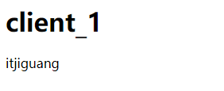

5. 再次访问 http://localhost:8002 会直接在页面显示

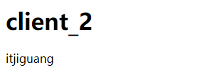

### 1.5. 系统退出

#### 1.5.1. CAS logout

> 此时退出系统需要在CAS服务器进行退出，直接访问 https://localhost:8443/cas/logout即可退出

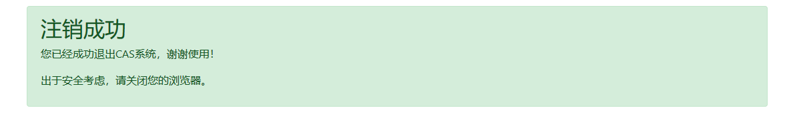

#### 1.5.2. 退出的相关配置

```properties
# 配置允许退出后跳转到指定的页面
cas.logout.followServiceRedirects=true
# 配置退出后跳转到指定页面的参数名
cas.logout.redirectParameter=service
# 退出后跳转到的地址，如果配置则service将无效
cas.logout.redirectUrl=https://localhost:8443/cas
# 配置在退出时是否进行确认，即弹出确认框
cas.logout.confirmLogout=false
# 配置是否移除子系统中的ticket
cas.logout.removeDescendantTickets=true

# 是否禁用单点退出
cas.slo.disabled=false
# 通知客户端清除session
cas.slo.asynchronous=true
```


## 二、 CAS服务端数据源设置

### 2.1. 需求分析

> 入门案例中使用的登录用户名和密码是cas默认的，但是实际情况是需要读取数据库中已经注册的用户名和密码，所以需要在cas中配置数据源

### 2.2. 修改cas_server工程

#### 2.2.1. 添加依赖信息

```xml
<!--添加数据库驱动依赖-->
<dependency>
    <groupId>org.apereo.cas</groupId>
    <artifactId>cas-server-support-jdbc</artifactId>
    <version>${cas.version}</version>
</dependency>
<dependency>
    <groupId>mysql</groupId>
    <artifactId>mysql-connector-java</artifactId>
    <version>5.1.47</version>
</dependency>
```

#### 2.2.2. 修改`application.properties`

1. 注释掉静态用户名和密码

```properties
#cas.authn.accept.users=itjiguang::itjiguang
```

2. 设置数据库访问的相关信息

```properties
# 配置数据的连接信息
cas.authn.jdbc.query[0].user=root
cas.authn.jdbc.query[0].password=123456
cas.authn.jdbc.query[0].driverClass=com.mysql.jdbc.Driver
cas.authn.jdbc.query[0].url=jdbc:mysql://localhost:3306/yanxuan_db?characterEncoding=utf-8&autoReconnect=true&useSSL=false
cas.authn.jdbc.query[0].dialect=org.hibernate.dialect.MySQLDialect
# 配置认证查询的语句
cas.authn.jdbc.query[0].sql=select * from account where login_name=?
# 设置查询语句返回值中对应密码的列名
cas.authn.jdbc.query[0].fieldPassword=password

```


#### 2.2.3. 测试

1. 重启cas服务
2. 使用数据库的用户名/密码进行测试

#### 2.2.4. 配置密码解析相关信息

```properties
# 配置密码解析类型NONE|DEFAULT|STANDARD|BCRYPT|SCRYPT|PBKDF2|com.example.CustomPasswordEncoder
cas.authn.jdbc.query[0].passwordEncoder.type=BCRYPT
cas.authn.jdbc.query[0].passwordEncoder.characterEncoding=UTF-8
cas.authn.jdbc.query[0].passwordEncoder.encodingAlgorithm=BCRYPT
cas.authn.jdbc.query[0].passwordEncoder.secret=
cas.authn.jdbc.query[0].passwordEncoder.strength=16
```


## 三、 自定义CAS Server登录页面

### 3.1. 需求分析

> 商城系统的登录页面是给用户来进行登录的，所以需要跟商城的整体样式是一致的，而cas的默认登录页是不符合要求的，所以制作商城的登录页面

### 3.2. 主题设置

#### 3.2.1. 创建主题文件 

1. 在resources目录下创建`yanxuan.properties`主题配置文件

```properties
# cas的标准样式，可以移除
cas.standard.css.file=themes/apereo/css/cas.css
# 自定义样式、js文件
cas.javascript.file=/themes/yanxuan/js/jquery-1.12.4.js
cas.myself.css.file=themes/yanxuan/css/yanxuan.css
# 登陆页面标题
cas.login.pagetitle=极光严选
```

2. css文件

在 `src/main/resources`目录下创建出 `static/themes/yanxuan/css`，并拷贝用户中心目录下的login.css文件

3. js文件

在 `src/main/resources`目录下创建出 `static/themes/yanxuan/js`，并拷贝用户中心目录下的js文件 `jquery-1.12.4.js`

3. images文件

在 `src/main/resources`目录下创建出 `static/themes/yanxuan/js`，并拷贝用户中心目录下的images文件

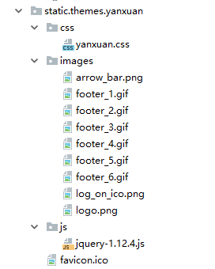

#### 3.2.2. 设置模板

在 `src/main/resources`目录下创建出 `templates/yanxuan`，并拷贝用户中心中的html文件


#### 3.2.3. 启用主题

修改 `HTTPSandIMAPS-10000001.json`文件

```json
{
  "@class" : "org.apereo.cas.services.RegexRegisteredService",
  "serviceId" : "^(https|imaps|http)://.*",
  "name" : "HTTPS and IMAPS",
  "id" : 10000001,
  "description" : "This service definition authorizes all application urls that support HTTPS and IMAPS protocols.",
  "evaluationOrder" : 10000,
  "theme": "yanxuan"
}
```

在`applicatioin.properties`中设置系统的默认主题

```properties
cas.theme.defaultThemeName=yanxuan
```


## 四、CAS Client与SpringSecurity集成

### 4.1. 搭建测试工程

> 参照第四章中`spring-security-demo`的搭建过程

1. 创建maven项目，添加Spring依赖、springSecurity依赖，tomcat端口设置为8093
2. 添加web.xml文件，并完善配置信息
3. 创建配置文件applicationContext-security.xml
4. 添加html页面

### 4.2. Spring Security与CAS集成

#### 4.2.1. 添加依赖信息

```xml
<dependency>
            <groupId>org.springframework.security</groupId>
            <artifactId>spring-security-web</artifactId>
            <version>5.1.6.RELEASE</version>
        </dependency>
        <dependency>
            <groupId>org.springframework.security</groupId>
            <artifactId>spring-security-config</artifactId>
            <version>5.1.6.RELEASE</version>
        </dependency>
        <dependency>
            <groupId>javax.servlet</groupId>
            <artifactId>javax.servlet-api</artifactId>
            <version>3.1.0</version>
            <scope>provided</scope>
        </dependency>
        <dependency>
            <groupId>org.springframework.security</groupId>
            <artifactId>spring-security-cas</artifactId>
            <version>5.1.6.RELEASE</version>
        </dependency>
        <dependency>
            <groupId>org.jasig.cas.client</groupId>
            <artifactId>cas-client-core</artifactId>
            <version>3.5.1</version>
        </dependency>
        <dependency>
            <groupId>org.jasig.cas.client</groupId>
            <artifactId>cas-client-integration-tomcat-v7</artifactId>
            <version>3.5.1</version>
        </dependency>
        <dependency>
            <groupId>org.slf4j</groupId>
            <artifactId>slf4j-log4j12</artifactId>
            <version>1.7.20</version>
        </dependency>
```

#### 4.2.1. 完善集成配置

```xml
<?xml version="1.0" encoding="UTF-8"?>
<beans xmlns="http://www.springframework.org/schema/beans"
       xmlns:xsi="http://www.w3.org/2001/XMLSchema-instance"
       xmlns:security="http://www.springframework.org/schema/security"
       xsi:schemaLocation="http://www.springframework.org/schema/beans
          http://www.springframework.org/schema/beans/spring-beans-3.0.xsd http://www.springframework.org/schema/security http://www.springframework.org/schema/security/spring-security.xsd">

    <security:http pattern="/out_index.html" security="none" />

    <!--   entry-point-ref  入口点引用 -->
    <security:http use-expressions="false" entry-point-ref="casProcessingFilterEntryPoint">
        <security:intercept-url pattern="/**" access="ROLE_USER"/>
        <security:csrf disabled="true"/>
        <!-- custom-filter为过滤器， position 表示将过滤器放在指定的位置上，before表示放在指定位置之前  ，after表示放在指定的位置之后  -->
        <security:custom-filter ref="casAuthenticationFilter"  position="CAS_FILTER" />
        <security:custom-filter ref="requestSingleLogoutFilter" before="LOGOUT_FILTER"/>
        <security:custom-filter ref="singleLogoutFilter" before="CAS_FILTER" />
    </security:http>

    <!-- CAS入口点 开始 -->
    <bean id="casProcessingFilterEntryPoint" class="org.springframework.security.cas.web.CasAuthenticationEntryPoint">
        <!-- 单点登录服务器登录URL -->
        <property name="loginUrl" value="https://localhost:8443/cas/login"/>
        <property name="serviceProperties" ref="serviceProperties"/>
    </bean>
    <bean id="serviceProperties" class="org.springframework.security.cas.ServiceProperties">
        <!--service 配置自身工程的根地址+/login/cas   -->
        <property name="service" value="http://127.0.0.1:8093/login/cas"/>
    </bean>
    <!-- CAS入口点 结束 -->


    <!-- 认证过滤器 开始 -->
    <bean id="casAuthenticationFilter" class="org.springframework.security.cas.web.CasAuthenticationFilter">
        <property name="authenticationManager" ref="authenticationManager"/>
    </bean>
    <!-- 认证管理器 -->
    <security:authentication-manager alias="authenticationManager">
        <security:authentication-provider  ref="casAuthenticationProvider">
        </security:authentication-provider>
    </security:authentication-manager>
    <!-- 认证提供者 -->
    <bean id="casAuthenticationProvider" class="org.springframework.security.cas.authentication.CasAuthenticationProvider">
        <property name="authenticationUserDetailsService">
            <bean class="org.springframework.security.core.userdetails.UserDetailsByNameServiceWrapper">
                <constructor-arg ref="accountService" />
            </bean>
        </property>
        <property name="serviceProperties" ref="serviceProperties"/>
        <!-- ticketValidator 为票据验证器 -->
        <property name="ticketValidator">
            <bean class="org.jasig.cas.client.validation.Cas30ServiceTicketValidator">
                <constructor-arg name="casServerUrlPrefix" value="https://localhost:8443/cas"/>
            </bean>
        </property>
        <property name="key" value="an_id_for_this_auth_provider_only"/>
    </bean>
    <!-- 认证类 -->
    <bean id="accountService" class="com.itjiguang.security.service.AccountServiceImpl"/>
    <!-- 认证过滤器 结束 -->

</beans>
```

#### 4.2.2. 创建AccountServiceImpl

```java
/**
 * 用户认证
 *  在用户登录后，根据用户名和角色名称进行相应的逻辑
 */
public class AccountServiceImpl implements UserDetailsService {

    public UserDetails loadUserByUsername(String username) throws UsernameNotFoundException {
        // 添加用户的访问权限信息
        ArrayList<GrantedAuthority> authorityList = new ArrayList<GrantedAuthority>();
        authorityList.add(new SimpleGrantedAuthority("ROLE_USER"));
        // 返回用户信息至Security中，由SpringSecurity完成认证过程
        return new User(username, "", authorityList);
    }
}
```

### 4.3. 获取登录用户名

> 我们在处理后端逻辑时，需要获取到登录名，获取的方式和之前获取用户名的方式是完全相同的，接下来做个小测试。

#### 4.3.1. 添加SpringMVC的依赖

```xml
<dependency>
    <groupId>org.springframework</groupId>
    <artifactId>spring-webmvc</artifactId>
    <version>5.1.6.RELEASE</version>
</dependency>
<dependency>
    <groupId>com.fasterxml.jackson.core</groupId>
    <artifactId>jackson-databind</artifactId>
    <version>2.9.8</version>
</dependency>
<dependency>
    <groupId>com.fasterxml.jackson.core</groupId>
    <artifactId>jackson-annotations</artifactId>
    <version>2.9.8</version>
</dependency>
<dependency>
    <groupId>com.fasterxml.jackson.core</groupId>
    <artifactId>jackson-core</artifactId>
    <version>2.9.8</version>
</dependency>
```


#### 4.3.2. 在 `web.xml`中配置 `SpringMVC`

```xml
	<!--SpringMVC 前端控制器-->
    <servlet>
        <servlet-name>mvcServelt</servlet-name>
        <servlet-class>org.springframework.web.servlet.DispatcherServlet</servlet-class>
        <init-param>
            <param-name>contextConfigLocation</param-name>
            <param-value>classpath:spring-mvc.xml</param-value>
        </init-param>
    </servlet>
    <servlet-mapping>
        <servlet-name>mvcServelt</servlet-name>
        <url-pattern>/</url-pattern>
    </servlet-mapping>
```

#### 4.3.3. 配置信息

```xml
    <!--设置包扫描路径-->
    <context:component-scan base-package="com.itjiguang.security" />

    <!--开启SpringMVC注解-->
    <mvc:annotation-driven />

    <!--开启默认的servlet支持-->
    <mvc:default-servlet-handler />

```

#### 4.3.4.  创建AccountController

```java
@RestController
@RequestMapping("/account")
public class AccountController {

    @GetMapping
    public ResponseEntity getLoginName(){
        String loginName = SecurityContextHolder.getContext().getAuthentication().getName();
        return new ResponseEntity(loginName, HttpStatus.OK);
    }
}
```

#### 4.3.5. 测试

> 地址栏输入 http://localhost:8083/account,即可在控制台看到输出的登录名称


### 4.4. 退出登录

修改 `applicationContext-security.xml`

```xml
<!--   entry-point-ref  入口点引用 -->
<security:http use-expressions="false" entry-point-ref="casProcessingFilterEntryPoint">
    <security:intercept-url pattern="/**" access="ROLE_USER"/>
    <security:csrf disabled="true"/>
    <!-- custom-filter为过滤器， position 表示将过滤器放在指定的位置上，before表示放在指定位置之前  ，after表示放在指定的位置之后  -->
    <security:custom-filter ref="casAuthenticationFilter"  position="CAS_FILTER" />
    <security:custom-filter ref="requestSingleLogoutFilter" before="LOGOUT_FILTER"/>
    <security:custom-filter ref="singleLogoutFilter" before="CAS_FILTER" />
</security:http>


<!-- 单点登出  开始  -->
<beans:bean id="singleLogoutFilter" class="org.jasig.cas.client.session.SingleSignOutFilter"/>
<!-- 经过此配置，当用户在地址栏输入本地工程 /logout/cas  -->
<beans:bean id="requestSingleLogoutFilter" class="org.springframework.security.web.authentication.logout.LogoutFilter">
    <beans:constructor-arg value="http://localhost:8080/cas/logout?service=http://localhost:8083/index2.html"/>
    <beans:constructor-arg>
        <beans:bean class="org.springframework.security.web.authentication.logout.SecurityContextLogoutHandler"/>
    </beans:constructor-arg>
    <beans:property name="filterProcessesUrl" value="/logout/cas"/>
</beans:bean>
<!-- 单点登出  结束 -->
```

在页面添加连接

```html
<a href="/logout/cas">退出登录</a>
```

创建out_index.html,将 out_index.html设置不登陆即可访问

```xml
<http pattern="/out_index.html" security="none" />
```


## 五、极光严选用户中心

### 5.1. 需求分析

> 极光严选用户中心系统进行单点登录

### 5.2. 系统建设

#### 5.2.1. 创建web工程 ，并完善相关配置

> 创建 `jiguangyanxuan-account-server`工程
>
> 1. 完善依赖信息
> 2. 完善web.xml
> 3. 完善Spring的相关配置
> 4. 拷贝页面文件至该工程

#### 5.2.2. 完善spring security集成cas的依赖

> 参照集成案例

#### 5.2.3. 完善web.xml

> 添加 Spring-Security过滤器，设置首页为personal_home.html

#### 5.2.4. 构建AccountServiceImpl

>  （参照集成案例）

#### 5.2.5. 添加applicationContext-security.xml,

设置无需登录即可访问的资源

```xml
<http pattern="/css/**" security="none"></http>
<http pattern="/js/**" security="none"></http>
<http pattern="/images/**" security="none"></http>
```

设置服务地址属性

```xml
<beans:bean id="servicePorperties" class="org.springframework.security.cas.ServiceProperties">
	<beans:property name="service" value="http://127.0.0.1:9906/login/cas"
</beans:bean>
```

设置认证类

```xml
<beans:bean id="accountService" class="com.itjiguang.yanxuan.account.service.AccountServiceImpl" />
```

### 5.3. 页面显示用户名

#### 5.3.1. 控制层

```java
@RestController
@RequestMapping("/account")
public class AccountController {
	
	@GetMapping
	public Map showName () {
		String userName = SecurityContextHolder.getContext.getAuthentication().getName();
		Map<String, Object> resultMap = new HashMap();
		resultMap.put("loginName", userName);
		
		return resultMap；
	}
}
```

#### 5.3.2. 前端业务模块

1. 完善基础的文件

   拆分 index.js 为 app.module.js 和app.route.js

   添加 app.service.js

2. `service`（personal.service.js)

```js
angular.module("personal").service("personalService",function(restService){
    // 定义请求的资源路径
    var baseUrl = "../../loginUser";
    // get请求
    this.get = function(options){
        return restService.get(baseUrl, options);
    };

    // post请求
    this.post = function (entity) {
        return restService.post(baseUrl, entity);
    };

    // put请求
    this.put = function (entity) {
        return restService.put(baseUrl, entity);
    };

    // Delete请求
    this.delete = function (id) {
        return restService.delete(baseUrl, id);
    }
});
```

3. controller

```JavaScript
app.controller("personalController",function($scope, personalService){

    $scope.loginName = "";
    //获取登录用户名
    personalService.get().then(
        function (res) {
            $scope.loginName = res.data.loginName;
        }
    )
});
```

#### 5.3.3. 启用业务模块

1. 引入js文件

```html
<script type="text/javascript" src="js/personal/app.module.js"></script>
<script type="text/javascript" src="js/personal/app.route.js"></script>
<script type="text/javascript" src="js/personal/personal.service.js"></script>
<script type="text/javascript" src="js/personal/personal.controller.js"></script>
```

2. 设置controller

```html
<body  ng-app="personal" ng-controller="personalController">
```


3. 显示用户名 

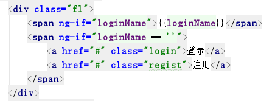

### 5.4. 退出登录

1. 设置退出登录后的跳转地址

```xml
<!-- 单点登出  开始  -->
<bean id="singleLogoutFilter" class="org.jasig.cas.client.session.SingleSignOutFilter"/>
<!-- 经过此配置，当用户在地址栏输入本地工程 /logout/cas  -->
<bean id="requestSingleLogoutFilter" class="org.springframework.security.web.authentication.logout.LogoutFilter">
    <constructor-arg 
          value="https://localhost:8443/cas/logout?service=http://127.0.0.1:9903/index.html"/>
    <constructor-arg>
        <bean class="org.springframework.security.web.authentication.logout.SecurityContextLogoutHandler"/>
    </constructor-arg>
    <property name="filterProcessesUrl" value="/logout/cas"/>
</bean>
<!-- 单点登出  结束 -->
```

2. 页面触发

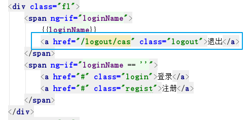

