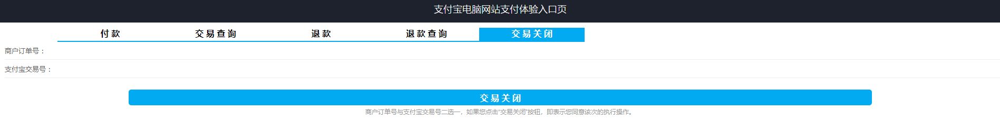

# 极光严选-第十八章-订单支付

## 课程内容

- 支付宝支付
  - 支付宝开放平台
  - 官方示例
- 系统功能实现
  - 生成支付日志
  - 支付宝支付
  - 支付结果
- 二维码
  - 简介及特点
  - 生成方案
- 个人中心-订单管理


## 学习目标

- [ ] 能够完成支付宝开放平台的入驻
- [ ] 能够完成支付宝开放平台中沙箱应用的公钥配置
- [ ] 能够搭建运行官方的功能示例
- [ ] 能够完成系统支付日志信息的生成和更新
- [ ] 能够基于支付接口完成商品订单支付功能
- [ ] 能够基于支付信息查询接口完成商品订单支付信息提示
- [ ] 能够了解二维码的生成方案


## 一、支付宝开放平台

官网首页：https://open.alipay.com/platform/home.htm

### 1.1. 平台概述

支付宝开放平台基于支付宝的海量用户，将强大的支付、营销、数据能力，通过接口等形式开放给第三方合作伙伴，帮助第三方合作伙伴创建更具竞争力的应用。

通过接入支付宝开放平台，第三方合作伙伴可以获得更多的流量、用户和收益，而第三方合作伙伴提供的服务也让用户获得了更丰富的体验，平台生态更加繁荣，最终实现多方共赢。

### 1.2. 入驻开放平台

1. 在官网首页的右上角点击**立即入驻**


2. 使用自己的手机端支付宝进行扫码登录


3. 完善个人的开发者信息，选择服务类型为**自研**

   点击**切换入驻身份**进行切换，并完善个人信息


### 1.3. 创建应用

#### 1.3.1. 应用概述 

​	应用是开发者以软件形式向用户提供的特定场景或行业解决方案。具备开发能力的服务商入驻开放平台后，需要通过创建应用的方式接入蚂蚁各项产品（如当面付、开店、发券、服务窗、余利宝等）接口并进行开发，基于对行业及业务场景的理解，创造能够满足市场需要的解决方案，以应用的形式服务用户。


#### 1.3.2. 应用类型

目前开放平台支持两种应用类型：

- 第三方应用（供他人使用）：适用于服务商（ISV），为商户开发应用，拓展商户使用；
- 自用型应用（供自己使用）：使用开放的功能，为自己或自己公司开发应用。自研型应用分为网页/移动应用，小程序和生活号应用。


⚠️在创建应用时需要填写真实的信息，本次课程采用测试环境（沙箱环境）。

#### 1.3.3. 沙箱应用

在以下标识的位置进入到沙箱环境，支付宝自动创建沙箱应用


沙箱环境控制台


### 1.4. 配置密钥

#### 1.4.1. 加签模式

在设置密钥时可以选择加签的模式，两者的区别在于是否使用资金支出类接口，在实际的生产环境中用户购买商品后，又发起退货，这时对商家来说就产生了资金支出，故**生产环境中需要使用公钥证书**；在本次课程中我们并不需要进行退款，故而直接使用公钥模式即可。

选择公钥模式后，需要借助于支付宝密钥生成器进行密钥的生成。

⚠️**注意：**密钥和应用（APPID）一一对应，即开发者需要为名下的每个应用分别设置密钥，且不同应用的密钥不能混用。


#### 1.4.2. 下载工具并生成密钥

密钥生成说明文档：https://docs.open.alipay.com/291/105971

1. 版本选择

| 操作系统  | 下载地址                                                     |
| --------- | ------------------------------------------------------------ |
| `Windows` | https://ideservice.alipay.com/ide/getPluginUrl.htm?clientType=assistant&platform=win&channelType=WEB |
| `MacOS`   | https://ideservice.alipay.com/ide/getPluginUrl.htm?clientType=assistant&platform=mac&channelType=WEB |

⚠️注意：Windows系统中安装时，安装的路径中不要存在空格

2. 生成密钥

   设置密钥格式和密钥长度，然后点击生成密钥

   

可以通过打开文件位置查看生成的密钥


3. 配置密钥

复制应用公钥文件中的内容，设置到输入框中，点击保存设置


### 1.5. 沙箱版支付宝

沙箱钱包只支持扫一扫、付款码、门店详情页功能，其余功能不提供。

使用沙箱账户中提供的信息进行登录。


## 二、 官方示例

下载地址：http://p.tb.cn/rmsportal_6680_alipay.trade.page.pay-JAVA-UTF-8.zip


### 2.1. 官方示例演示

#### 2.1.1. 搭建演示工程

1. 创建Maven工程，并完善依赖信息

```xml
<?xml version="1.0" encoding="UTF-8"?>
<project xmlns="http://maven.apache.org/POM/4.0.0"
         xmlns:xsi="http://www.w3.org/2001/XMLSchema-instance"
         xsi:schemaLocation="http://maven.apache.org/POM/4.0.0 http://maven.apache.org/xsd/maven-4.0.0.xsd">
    <modelVersion>4.0.0</modelVersion>

    <groupId>com.itjiguang</groupId>
    <artifactId>alipay_demo</artifactId>
    <version>1.0-SNAPSHOT</version>
    <build>
        <plugins>
            <plugin>
                <groupId>org.apache.tomcat.maven</groupId>
                <artifactId>tomcat7-maven-plugin</artifactId>
                <version>2.2</version>
                <configuration>
                    <uriEncoding>UTF-8</uriEncoding>
                    <port>8094</port>
                    <path>/</path>
                </configuration>
            </plugin>
        </plugins>
    </build>
    <packaging>war</packaging>

    <dependencies>
        <!--支付宝的核心依赖-->
        <dependency>
            <groupId>com.alipay.sdk</groupId>
            <artifactId>alipay-sdk-java</artifactId>
            <version>4.7.11.ALL</version>
            <exclusions>
                <exclusion>
                    <groupId>org.bouncycastle</groupId>
                    <artifactId>bcprov-jdk15on</artifactId>
                </exclusion>
            </exclusions>
        </dependency>
        <!--日志依赖-->
        <dependency>
            <groupId>commons-logging</groupId>
            <artifactId>commons-logging</artifactId>
            <version>1.1</version>
            <exclusions>
                <exclusion>
                    <groupId>javax.servlet</groupId>
                    <artifactId>servlet-api</artifactId>
                </exclusion>
            </exclusions>
        </dependency>
        <dependency>
            <groupId>javax.servlet</groupId>
            <artifactId>javax.servlet-api</artifactId>
            <version>3.1.0</version>
            <scope>provided</scope>
        </dependency>
        <dependency>
            <groupId>javax.servlet.jsp</groupId>
            <artifactId>javax.servlet.jsp-api</artifactId>
            <version>2.3.3</version>
            <scope>provided</scope>
        </dependency>
    </dependencies>

</project>
```

2. 完善工程目录，创建`webapp/WEB-INF/web.xml`

```xml
<?xml version="1.0" encoding="UTF-8"?>
<web-app xmlns:xsi="http://www.w3.org/2001/XMLSchema-instance" xmlns="http://java.sun.com/xml/ns/javaee" xsi:schemaLocation="http://java.sun.com/xml/ns/javaee http://java.sun.com/xml/ns/javaee/web-app_2_5.xsd" version="2.5">

    <welcome-file-list>
        <welcome-file>index.jsp</welcome-file>
    </welcome-file-list>
    
</web-app>
```

3. 拷贝官方示例中的文件：java、jsp


4. 配置`AlipayConfig`

```java
public class AlipayConfig {
	
	// 应用ID,您的APPID，收款账号既是您的APPID对应支付宝账号
	public static String app_id = "";
	
	// 商户私钥，使用工具生成的商家应用私钥
    public static String merchant_private_key = "";
	
	// 支付宝公钥,在开放平台设置应用公钥后，生成的支付宝密钥
    public static String alipay_public_key = "";

	// 服务器异步通知页面路径  需http://格式的完整路径，不能加?id=123这类自定义参数，必须外网可以正常访问
	public static String notify_url = "http://工程公网访问地址/alipay.trade.page.pay-JAVA-UTF-8/notify_url.jsp";

	// 页面跳转同步通知页面路径 需http://格式的完整路径，不能加?id=123这类自定义参数，必须外网可以正常访问
	public static String return_url = "http://工程公网访问地址/alipay.trade.page.pay-JAVA-UTF-8/return_url.jsp";

	// 签名方式
	public static String sign_type = "RSA2";
	
	// 字符编码格式
	public static String charset = "utf-8";
	
	// 支付宝网关，沙箱应用中的网关地址
	public static String gatewayUrl = "https://openapi.alipay.com/gateway.do";

}
```

#### 2.1.2. 运行演示工程

访问：http://localhost:8094/index.jsp




### 2.2. 执行流程


### 2.3. 接口与通知

开发文档：<https://docs.open.alipay.com/270/105899/>

#### 2.3.1. 接口列表

| **接口英文名**                                               | **接口中文名**             | 示例                                    |
| ------------------------------------------------------------ | -------------------------- | --------------------------------------- |
| [alipay.trade.page.pay](https://docs.open.alipay.com/api_1/alipay.trade.page.pay/) | 统一收单下单并支付页面接口 | `alipay.trade.query.jsp`                |
| [alipay.trade.refund](https://docs.open.alipay.com/api_1/alipay.trade.refund) | 统一收单交易退款接口       | `alipay.trade.refund.jsp`               |
| [alipay.trade.fastpay.refund.query](https://docs.open.alipay.com/api_1/alipay.trade.fastpay.refund.query) | 统一收单交易退款查询接口   | `alipay.trade.fastpay.refund.query.jsp` |
| [alipay.trade.query](https://docs.open.alipay.com/api_1/alipay.trade.query) | 统一收单线下交易查询接口   | `alipay.trade.query.jsp`                |
| [alipay.trade.close](https://docs.open.alipay.com/api_1/alipay.trade.close) | 统一收单交易关闭接口       | `alipay.trade.close.jsp`                |
| [alipay.data.dataservice.bill.downloadurl.query](https://docs.open.alipay.com/api_15/alipay.data.dataservice.bill.downloadurl.query) | 查询对账单下载地址         |                                         |

#### 2.3.2. 通知

​	目前支付宝系统支持的通知类型有两种：异步通知（`notify_url`）和同步通知（`return_url`），都是支付宝系统向支付发起的系统的信息反馈。

二者的区别有：

1. 接收方法不同
   同步通知是在同步返回的页面使用**get**方式来获取的，异步通知是使用**post**方式发送到异步地址上的，只能使用post方式来接收。
2. 返回的参数不同
   同步通知返回的参数比异步通知返回的参数是要少一些的，最明显的就是异步返回参数会返回trade_status（交易状态）参数 但是同步返回的参数是没有的，所以建议使用异步返回的参数来确认交易是否成功。如果trade_status=TRADE_SUCCESS 表示就是交易成功了
3. 发送的时间不同
   一般情况下，异步通知比同步通知稍慢（几乎无感知）。同步和异步通知的发送和网络环境、服务器处理速度等因素关系较大，具体是先接收到同步通知还是异步通知，建议以实际接收到的为准。
4. 参数返回的逻辑不一样
   （1）同步通知是在支付成功后的页面跳转，一般是用于展示给用户的。
   付款成功页面会同步跳转到商户请求参数中传入的return_url地址页面。
   （2）异步通知参数是直接由支付宝服务器发送到商户的异步地址上的，不存在页面跳转是直接的服务器交互。

⚠️ 注意：两种通知接收后都需要进行验证签名，且方式相同。


## 三、订单支付

### 3.1. 需求与实现说明

#### 3.1.1. 需求说明

系统中已经保存了订单的信息，并且订单的状态为待支付，按照以往购物的经验，应该在确认订单之后直接跳转到支付的页面让用户进行支付。

#### 3.1.2. 实现思路

1. 在保存完订单信息之后，生成订单支付的信息；
2. 页面跳转后，读取订单支付信息；
3. 根据读取到订单信息调用支付宝的支付接口，并把返回的结果展示到页面中（即在页面上展示支付的二维码）；
4. （用户操作）用户打开手机端支付宝扫描屏幕上的二维码根据提示信息完成订单的支付；
5. 接收到支付成功的反馈信息后更新订单的状态和更新支付信息，并且前端页面进行支付成功的提示。

### 3.2. 工程环境准备

#### 3.2.1. 接口工程

参照其他的api工程创建 `jiguangyanxuan-pay-api`工程

#### 3.2.2. 服务实现工程

1. 参照其他的service工程创建 `jiguangyanxuan-pay-service`工程
2. 添加支付的依赖信息

#### 3.2.3. 通用工程

配置应用信息

```java
public class AlipayConfig {

    // 应用ID,您的APPID，收款账号既是您的APPID对应支付宝账号
    public static String app_id ="支付宝生成的沙箱应用id";

    // 商户私钥，您的PKCS8格式RSA2私钥
    public static String merchant_private_key ="商家应用私钥" ;

    // 支付宝公钥,
    public static String alipay_public_key ="支付宝公钥，在开放平台设置应用公钥时生成的";

    // 服务器异步通知页面路径  需http://格式的完整路径，不能加?id=123这类自定义参数，必须外网可以正常访问
    public static String notify_url ="http://localhost:9906/notify_url.jsp";

    // 页面跳转同步通知页面路径 需http://格式的完整路径，不能加?id=123这类自定义参数，必须外网可以正常访问
    public static String return_url ="http://localhost:9906/return_url.jsp";

    // 签名方式
    public static String sign_type ="RSA2";

    // 字符编码格式
    public static String charset="utf-8";

    // 支付宝网关
    public static String gatewayUrl = "https://openapi.alipaydev.com/gateway.do";
}
```

#### 3.2.4. server工程

1. 完善依赖信息


### 3.3. 支付功能实现

#### 3.3.1. 生成支付信息（支付日志）

1. 支付信息表结构

| 字段名称         | 类型       | 描述         |
| ---------------- | ---------- | ------------ |
| `account_id`     | `bigint`   | 账户编号     |
| `pay_order_no`   | `varchar`  | 支付订单号   |
| `create_date`    | `datetime` | 创建时间     |
| `pay_date`       | `datetime` | 支付时间     |
| `total_fee`      | `bigint`   | 支付金额     |
| `trade_no`       | `varchar`  | 支付流水号   |
| `trade_status`   | `varchar`  | 支付状态     |
| `pay_type`       | `char`     | 支付方式     |
| `goods_order_no` | `varchar`  | 购物订单列表 |

2. 初始化支付信息

```java
public int saveOrderInfo(String loginName, OrderInfoViewModel orderInfoViewModel) {
	// 查询相关信息业务逻辑
    
    // 保存生成订单的编号
    List<Long> orderNoList = new ArrayLiat<Long>();
    for(CartInfo cartInfo : cartInfoList) {
         // 创建订单
        OrderInfo orderInfo = new OrderInfo();
        // ...
        // 获取订单编号
        long orderNum = snowFlake.nextId();
        orderInfo.setOrderNo(orderNum);
        // ...
        
        
        
        // 保存订单信息
        int insert = orderInfoMapper.insert(orderInfo);
        if(insert>0){
            orderNoList.add(orderInfo.getOrderNo());
        }
    }
    
    // 移除购物车相关逻辑
    
    // 生成支付信息
    PayLog payLog = this.createPayLog();
    
    return result;
}

@Autowired
private PayLogMapper payLogMapper;

private PayLog createPayLog(){
    // 创建支付信息
    PayLog payLog = new PayLog();
    // 设置支付信息
    payLog.setPayOrderNo(snowFlake.nextId()+"");
    payLog.setPayType(orderInfoViewModel.getPayType);
    payLog.setCreateDate(new Date());
    payLog.setTotalFee((long)(orderViewModel.getTotalFee().doubleValue()*100));
    payLog.setTradeStatus("0");
    payLog.setAccountId(loginAccount.getId());
    payLog.setGoodsOrderNo(JSONArray.toJSONString(goodsOrderNoList));

    // 保存支付信息
    payLogMapper.insertSelective(payLog);
    
    return payLog;
}
```

3. 修改返回结果

   在之前的订单保存服务中返回的是保存的记录数，用来判断业务处理是否成功，而现在再处理成功之后就要发起订单的支付，也就是完成所有订单金额的支付操作，在支付时需要读取到支付信息，然后根据支付信息调用支付宝开放平的接口。

   服务实现返回支付信息中的流水号

```java
public String saveOrderInfo(String loginName, OrderInfoViewModel orderInfoViewModel) {

    // 相关数据查询逻辑
    
    // 保存订单的逻辑
    
    // 移除购物车的逻辑
    
    // 生成支付信息逻辑
    PayLog payLog = this.createPayLog();
    return payLog.getPayOrderNo();
}
```

​	控制层返回支付编号

```java
@PostMapping
public ResponseEntity<Map> saveOrderInfo(@RequestBody OrderInfoViewModel orderInfoViewModel){
    // 获取当前登录人
    String loginName = SecurityContextHolder.getContext().getAuthentication().getName();
    // 调用远程服务，完成 loginName的订单信息保存
    String payLogOrderNo = orderInfoService.saveOrderInfo(loginName, orderInfoViewModel);

    Map<String,String> result = new HashMap<String,String>();
    result.put("payLogOrderNo", payLogOrderNo);
    
    return new ResponseEntity(result, HttpStatus.CREATED);
}
```


#### 3.3.2. 前端发起支付请求

前端根据返回的结果发起请求

```js
$scope.saveOrder = function () {
    var order = {
        cartInfoList : $scope.selectedGoods,
        payType: $scope.payType,
        fareFee: 0,
        addressId: $scope.selectedAddressId,
        message: $scope.message,
        status: "1"
    };
    orderService.post(order).then(
        function (res){
            // 清空本地存储的商品信息 localStorage 中的信息
            localStorage.removeItem("selectedGoods");
            alert("订单信息已生成，请尽快完成支付！");
            location.href = "./pay?payLogNo="+res.data.payLogOrderNo;
        }
    );
}
```

#### 3.3.3. 控制层逻辑

在接收到请求中的支付编号后，查询对应的支付信息，并根据支付信息调用支付宝支付的接口。

```java
@Controller
@RequestMapping
public class PayController {

    @Reference
    private IAlipayService alipayService;
    @Reference
    private IPayLogService payLogService;

    @GetMapping(value="/pay", produces = {"text/html;charset=utf-8"})
    @ResponseBody
    public String goPay(String payLogOrderNo){
        // 查询支付日志信息
        PayLog payLog = payLogService.getByPayOrderNo(payLogOrderNo);
        if("0".equals(pageLog.getPayType()){
            // 支付宝支付
            return alipayService.goAlipay(payLogOrderNo);
        }else{
            // 其他支付方式
			return "<h1>其他支付方式</h1>"
        }
    };
}
```

#### 3.3.4. 服务接口

```java
public interface IAlipayService {
    // 根据支付编号查询支付信息
    String goAlipay(String payOrderNo);
}
```

```java
public interface IPayLogService{
    // 查询支付日志信息
    PayLog getByPayOrderNo(String payOrderNo);
}
```


#### 3.3.5. 服务实现

```java
@Service
public class AlipaySerivceImpl implements IAlipayService {
    
    @Override
    public PayLog goAlipay(String payLogOrderNo) {
        // 支付宝支付
        AlipayClient alipayClient = new DefaultAlipayClient(
            AlipayConfig.gatewayUrl,
            AlipayConfig.app_id,
            AlipayConfig.merchant_private_key, "json",
            AlipayConfig.charset,
            AlipayConfig.alipay_public_key,
            AlipayConfig.sign_type);
        //设置公共请求参数
        AlipayTradePagePayRequest alipayRequest = new AlipayTradePagePayRequest();
        alipayRequest.setReturnUrl(AlipayConfig.return_url);
        alipayRequest.setNotifyUrl(AlipayConfig.notify_url);
        // 初始化请求参数
        HashMap<String, Object> contentParam = new HashMap<>();
        contentParam.put("out_trade_no", payLog.getPayOrderNo);
        contentParam.put("total_amount", payLog.getTotalFee);
        contentParam.put("subject", "支付测试");
        contentParam.put("product_code", "FAST_INSTANT_TRADE_PAY");
        // 设置请求参数
        alipayRequest.setBizContent(JSON.toJSONString(contentParam));
        try {
            // 发送请求，并取得响应结果
            content = alipayClient.pageExecute(alipayRequest).getBody();
        } catch (AlipayApiException e) {
            e.printStackTrace();
        }
        return content;
    }
}
```

```java
@Service
public class PayLogServiceImpl implements IPayLogService{
    @Autowired
    private PayLogMapper payLogMapper;
    
    public PayLog getByPayOrderNo(String payOrderNo){
        return payLogMapper.selectByPrimaryKey(payLogOrderNo.toString());
    }
}
```


### 3.4. 支付反馈信息

#### 3.4.1. 同步反馈

1. 定制同步反馈参数实体类

```java
public class AlipayResponse implements Serializable {

    private String out_trade_no;// 自己系统生成的订单号
    private String method; // 同步反馈通知的接口名称
    private String total_amount; // 支付总金额
    private String sign; // 签名
    private String trade_no; // 支付宝系统的支付流水号
    private String sign_type; // 签名方式
    private String timestamp; // 通知的时间
    private String auth_app_id; // 授权appid
    private String charset; // 字符集
    private String version; // 版本号
    private String app_id; // 开发者ID
    private String seller_id; // 商家编号
    
    // setter、getter方法
}
```

2. 定制同步通知接收

```java
@Controller
@RequestMapping
public class AlipayController {

    @Reference
    private IPayLogSerivce payLogSerivce;

    @GetMapping("/alipay_return")
    public ModelAndView returnUrl(AlipayResponse alipayResponse){
        // 把对象转换成Map类型
        Map params = JSON.parseObject(JSON.toJSONString(alipayResponse), Map.class);
        // 初始化返回模型和视图
        ModelAndView modelAndView = new ModelAndView();

        try {
            // 执行验证签名
            boolean signVerified = AlipaySignature.rsaCheckV1(params, AlipayConfig.alipay_public_key, AlipayConfig.charset, AlipayConfig.sign_type); //调用SDK验证签名

            if(signVerified){
                // 验证成功,跳转到检查支付状态的地址
                modelAndView.addObject("trade_no", alipayResponse.getTrade_no());
                modelAndView.addObject("out_trade_no", alipayResponse.getOut_trade_no());
                modelAndView.setViewName("redirect:/alipay_status");
            }else{
                // 验证失败，支付可能存在问题，跳转到失败的页面
                modelAndView.setViewName("./goods_pay_failed.html");
            }
        } catch (AlipayApiException e) {
            e.printStackTrace();
        }

        return modelAndView;
    }
}
```

#### 3.4.2. 支付状态查询

1. 控制层

```java
@Controller
@RequestMappering
public class AlipayController{
    
    @Reference
    private IAlipayService alipayService;
    @Reference
    private IPayLogService payLogService;
    
    @GetMapping("/alipay_status")
    public ModelAndView queryStatus(String trade_no){
        // 调用远程服务进行查询处理
        Map queryResponse = alipaySerivce.queryStatus(trade_no);
        // 判断支付状态
        if("TRADE_SUCCESS".equals(queryResponse.get("trade_status").toString())){
            payLogService.updatePayLogStatus(queryResponse);
        }
        
        // 创建视图和模型
        ModelAndView mv = new ModelAndView();
        mv.setViewName("./goods_pay_suucess.html");
    }
}
```

2. 服务接口

```java
public interface IAlipayService {
    // 根据支付编号查询支付信息
    String goAlipay(String payOrderNo);
    
    // 查询订单支付状态
    Map queryStatus(String tradeNo);
}
```

```java
public interface IPayLogService{
    // 查询支付日志信息
    PayLog getByPayOrderNo(String payOrderNo);
    
    int updatePayLogStatus(Map QueryResponse);
}
```

3. 服务实现

```java
public Map queryStatus(String tradeNo){
    // 初始化返回结果
    Map resultMap = new HashMap<String,Object>();
    //获得初始化的AlipayClient
    AlipayClient alipayClient = new DefaultAlipayClient(AlipayConfig.gatewayUrl,
                                                        AlipayConfig.app_id,
                                                        AlipayConfig.merchant_private_key,
                                                        "json", AlipayConfig.charset,
                                                        AlipayConfig.alipay_public_key,
                                                        AlipayConfig.sign_type);
    // 设置请求参数
    AlipayTradeQueryRequest alipayRequest = new AlipayTradeQueryRequest();

    // 构建参数
    HashMap<String, String> paramContent = new HashMap<>();
    paramContent.put("trade_no", tradeNo);

    alipayRequest.setBizContent(JSON.toJSONString(paramContent));

    //请求
    try {
        String result = alipayClient.execute(alipayRequest).getBody();

        resultMap = JSON.parseObject(result, Map.class);
    }catch (AlipayApiException e) {
        e.printStackTrace();
    }
    return resultMap;
}
```


```java
public PayLog updatePayLogStatus(Map payResult){
    PayLog payLog = new PayLog();
    try{
        // 更新支付信息
        payLog.setTradeNo(payResult.get("trade_no").toString());
        SimpleDateFormat dateFormat = new SimpleDateFormat("yyyy-MM-dd hh:mm:ss");
        payLog.setPayDate(dateFormat.parse(payResult.get("send_pay_date").toString()));
        // 主键
        payLog.setPayOrderNo(payResult.get("out_trade_no").toString());
        // 执行更新操作
        payLogMapper.updateByPrimaryKeySelective(payLog);

    }catch(ParseException e){
        e.printStackTrace();
    }
    
    return payLog;
}
```

### 3.5. 页面提示信息

在页面中需要展示的数据有：订单号（支付信息的订单号）、支付日期（当前的日期）、支付方式（动态判断显示）。

由于提示页面为html，无法直接显示服务端返回的数据，解决该问题我们可以使用`thymeleaf`模板技术完成页面数据的展示。

thymeleaf模板中可以使用`th:text`指令完成指定变量的输出例如： `<span th:text="${orderNo}"></span>`

#### 3.5.1. 添加依赖信息

```xml
<dependency>
    <groupId>org.thymeleaf</groupId>
    <artifactId>thymeleaf-spring5</artifactId>
    <version>3.0.9.RELEASE</version>
</dependency>
```

#### 3.5.2. spring整合`thymeleaf`

```xml
<?xml version="1.0" encoding="UTF-8"?>
<beans xmlns="http://www.springframework.org/schema/beans"
       xmlns:xsi="http://www.w3.org/2001/XMLSchema-instance"
       xsi:schemaLocation="http://www.springframework.org/schema/beans http://www.springframework.org/schema/beans/spring-beans.xsd">

    <!--Spring模板解析器-->
    <bean id="resolver" class="org.thymeleaf.spring5.templateresolver.SpringResourceTemplateResolver">
        <property name="characterEncoding" value="utf-8"/>
    </bean>

    <!--模板引擎-->
    <bean id="springTemplateEngine" class="org.thymeleaf.spring5.SpringTemplateEngine">
        <property name="templateResolver" ref="resolver" />
    </bean>

    <!--Thymeleaf视图解析器-->
    <bean class="org.thymeleaf.spring5.view.ThymeleafViewResolver">
        <property name="templateEngine" ref="springTemplateEngine" />
        <property name="characterEncoding"  value="UTF-8" />
    </bean>

</beans>
```

#### 3.5.3. 修改控制层

```java
@Controller
@RequestMappering
public class AlipayController{
    
    @Reference
    private IAlipayService alipayService;
    @Reference
    private IPayLogService payLogService;
    
    @GetMapping("/alipay_status")
    public ModelAndView queryStatus(String trade_no, Model model){
        // 调用远程服务进行查询处理
        Map queryResponse = alipaySerivce.queryStatus(trade_no);
        // 判断支付状态
        if("10000".equals(queryResponse.get("code").toString())){
            payLogService.updatePayLogStatus(queryResponse);
        }
        
        // 创建视图和模型
        model.addAttribute(payLog);
        return "./goods_pay_suucess.html";
    }
}
```


#### 3.5.4. 修改页面

1. 添加约束信息

```html
<html lang="en" xmlns="http://www.w3.org/1999/xhtml" xmlns:th="http://www.thymeleaf.org">
</html>
```

2. 修改数据展示

```html
<li class="current">
    <div class="out_t">
        <p style="font-size: 20px">恭喜您，支付成功！</p>
    </div>
    <div class="out_b">
        <p>订单号: <span th:text="${payLog.payOrderNo}"></span></p>
        <p>支付日期：
            <span th:text="${#dates.format(payLog.payDate, 'yyyy-MM-dd hh:mm:ss')}"></span>
        </p>
        <p>支付方式：<span th:text="${payLog.payType eq '0' ? '支付宝':'其他支付'}">支付宝</span></p>
    </div>
</li>
```


## 四、二维码

### 4.1. 简介

​    二维码又称二维条码，常见的二维码为QR Code，QR全称Quick Response，是一个近几年来移动设备上超流行的一种编码方式，它比传统的Bar Code条形码能存更多的信息，也能表示更多的数据类型。

​	二维条码/二维码（2-dimensional bar code）是用某种特定的几何图形按一定规律在平面（二维方向上）分布的黑白相间的图形记录数据符号信息的；在代码编制上巧妙地利用构成计算机内部逻辑基础的“0”、“1”比特流的概念，使用若干个与二进制相对应的几何形体来表示文字数值信息，通过图象输入设备或光电扫描设备自动识读以实现信息自动处理：它具有条码技术的一些共性：每种码制有其特定的字符集；每个字符占有一定的宽度；具有一定的校验功能等。同时还具有对不同行的信息自动识别功能、及处理图形旋转变化点。


### 4.2. 二维码的特点

- 高密度编码，信息容量大：可容纳多达1850个大写字母或2710个数字或1108个字节，或500多个汉字，比普通条码信息容量约高几十倍。
- 编码范围广：该条码可以把图片、声音、文字、签字、指纹等可以数字化的信息进行编码，用条码表示出来；可以表示多种语言文字；可表示图像数据。
- 容错能力强，具有纠错功能：这使得二维条码因穿孔、污损等引起局部损坏时，照样可以正确得到识读，损毁面积达30%仍可恢复信息。
- 译码可靠性高：它比普通条码译码错误率百万分之二要低得多，误码率不超过千万分之一。
- 可引入加密措施：保密性、防伪性好。
- 成本低，易制作，持久耐用。
- 条码符号形状、尺寸大小比例可变。
- 二维条码可以使用激光或CCD阅读器识读。


### 4.3. 二维码生成插件

​	使用较为广泛的是QRCode，本课程也主要采用qrcode插件生成二维码图片。

#### 4.3.1. 入门案例

```html
<!DOCTYPE html>
<html>
<head>
	<title>二维码</title>
</head>
<body>
	<div id="qrcode"></div>
</body>
<script type="text/javascript" src="./qrcode.min.js"></script>
<script type="text/javascript">
	// 二维码显示的位置
	var qrNode = document.getElementById("qrcode");
	// 设置二维码
	new QRCode(qrNode, "http://www.jgxy.cc");
</script>
</html>
```

#### 4.3.2. 属性详解

> 可设置的属性：
>
> 1. text：二维码的内容
> 2. width：二维码图片的宽度
> 3. height：二维码图片的高度
> 4. colorDark：深色线条的颜色，默认为黑色
> 5. colorLight：浅色线条的颜色，默认为白色
> 6. correntLevel：容错级别，级别越高，越容易识别
>    1. QRErrorCorrectLevel.L： 容错率7%
>    2. QRErrorCorrectLevel.M：容错率15%
>    3. QRErrorCorrectLevel.Q：容错率25%
>    4. QRErrorCorrectLevel.H：容错率30%

#### 4.3.3. 详细示例

```html
<!DOCTYPE html>
<html>
<head>
	<title>二维码</title>
</head>
<body>
	<div id="qrcode"></div>
	<hr/>
	<div id="qrcode1"></div>
</body>
<script type="text/javascript" src="./qrcode.min.js"></script>
<script type="text/javascript">
	// 二维码显示的位置
	var qrNode = document.getElementById("qrcode");
	var qrNode1 = document.getElementById("qrcode1");
	// 设置二维码
	new QRCode(qrNode, "http://www.jgxy.cc");

	new QRCode(qrNode1,{
		text: "http://www.jgxy.cc",
		width: 256,
		height: 256,
		colorDark : "#000000",
		colorLight : "#ffffff",
		correctLevel : QRCode.CorrectLevel.L
	})
</script>
</html>
```

#### 4.3.4. 其他操作

1. 清除二维码

```j&#39;s
qrCode.clear();
```

2. 重新生成二维码

```js
qrCode.makeCode("极光学苑");
```


## 五、 订单管理

### 5.1. 订单列表展示


此处指的订单是支付订单，查询所有的支付信息，并查询支付信息关联的订单信息及商品信息。

作为课下扩展作业，自主完成。