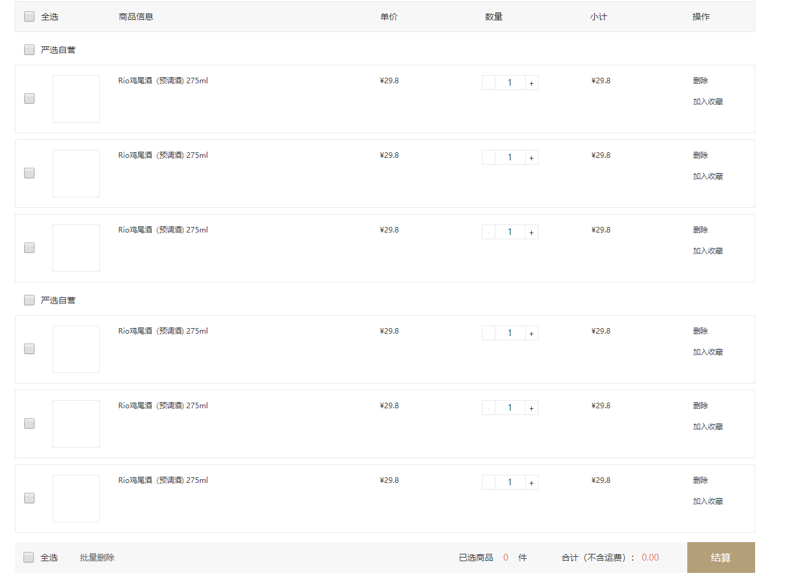
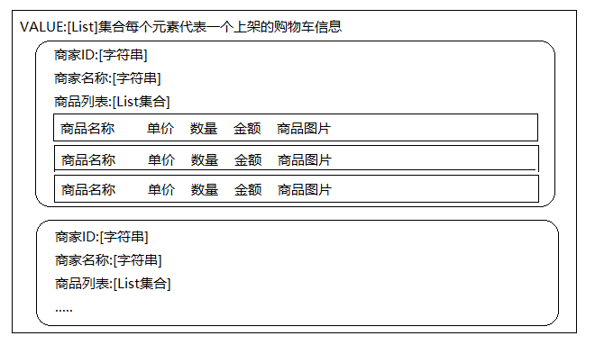
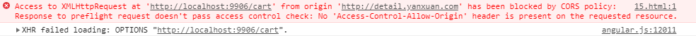
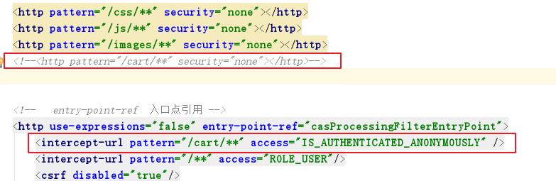

# 极光严选-第十六章-购物车解决方案

## 课程内容

- 购物车解决方案
  - 需求分析
  - 准备工作
- 未登录时购物车信息保存
  - 读取购物车信息
  - 添加购物车信息
- 登录时购物车信息保存
  - 读取购物车信息
  - 添加购物车信息
  - 合并购物车信息
- 跨域问题的解决方案


## 学习目标

- [ ] 理解购物车实现的思路和购物车数据的存储结构
- [ ] 能够完成未登陆时购物车信息的存取
- [ ] 能够完成登陆时购物车信息的存取
- [ ] 能够完成购物车中商品数量的加减操作、移除操作
- [ ] 能够掌握跨域问题的解决方案


## 一、购物车需求分析与解决方案

### 1.1. 需求分析

​	用户在商品详情页面点击加入购物车，提交商品信息和购买数量，添加到购物车。



### 1.2. 购物车数据结构

购物车数据的存储结构如下：



​	当用户在未登录时，将此购物车的数据存入cookie中，在用户登录的情况下，将此购物车存入redis中。如果用户添加了商品到购物车，然后登录，那么就需要将Cookies中的购物车信息与Redis中的合并，并存储到Redis中。


### 1.3. 准备工作

#### 1.3.1. 服务接口工程

> 创建 `jiguangyanxuan-cart-api`，依赖于 `jiguangyanxuan-model`

#### 1.3.2. 服务实现工程

> 参照其他的service工程

1. 修改tomcat端口号

```xml
<build>
    <plugins>
        <plugin>
            <groupId>org.apache.tomcat.maven</groupId>
            <artifactId>tomcat7-maven-plugin</artifactId>
            <version>2.2</version>
            <configuration>
                <port>8806</port>
                <!-- 请求路径 -->
                <path>/</path>
            </configuration>
        </plugin>
    </plugins>
</build>
```

2. 修改dubbo的注册信息

```xml
    <!-- dubbbo相关 -->
    <dubbo:protocol name="dubbo" port="20886" />
    <dubbo:registry address="zookeeper://192.168.142.129:2181" timeout="50000"/>
    <dubbo:application name="yanxuan_cart_service"/>

    <dubbo:annotation package="com.itjiguang.yanxuan" />
```


#### 1.3.3. 控制层工程

> 参照其他的server工程创建

1. 修改tomcat端口号

```xml
<build>
    <plugins>
        <plugin>
            <groupId>org.apache.tomcat.maven</groupId>
            <artifactId>tomcat7-maven-plugin</artifactId>
            <version>2.2</version>
            <configuration>
                <!-- 指定端口
                        服务提供者的端口都是以88 开头
                        服务消费者的端口都是以99 开头
                    -->
                <port>9906</port>
                <!-- 请求路径 -->
                <path>/</path>
            </configuration>
        </plugin>
    </plugins>
</build>
```

2. 完善Spring的配置

```xml
    <!-- 引用dubbo 服务 -->
    <dubbo:application name="yanxuan_cart_server" />
    <dubbo:registry address="zookeeper://192.168.142.129:2181" timeout="50000"/>
    <dubbo:annotation package="com.itjiguang.yanxuan" />
```

3. 添加SpringSecurity整合cas的配置信息

   参考用户中心的配置文件

4. 页面资源

   复制静态模型中的js、css、images文件到工程目录webapp下

#### 1.3.4. Model工程

> 创建购物车实体类

```java
public class CartInfo implements Serializable {

    private Long sellerId; // 卖家编号
    private String sellerName; // 卖家店铺名称
    private List<OrderGoods> goodsList ; // 商品列表

    public Long getSellerId() {
        return sellerId;
    }

    public void setSellerId(Long sellerId) {
        this.sellerId = sellerId;
    }

    public String getSellerName() {
        return sellerName;
    }

    public void setSellerName(String sellerName) {
        this.sellerName = sellerName;
    }

    public List<OrderGoods> getGoodsList() {
        return goodsList;
    }

    public void setGoodsList(List<OrderGoods> goodsList) {
        this.goodsList = goodsList;
    }
}
```


## 二、非登录状态添加购物车

### 2.1. 需求分析

 	1. 用户在浏览器商品详情时，触发添加购物车
 	2. 传递的主要参数是选中的商品SKU的编号，商品的数量
 	3. 由于用户未登录，无法确定是哪个用户建立关联；但可以把数据保存在浏览器的本地，用户一旦登录，那么就把浏览器本地的数据与用户建立联系；即数据存储在浏览器的cookie中。

### 2.2. 服务端逻辑实现

#### 2.2.1.  服务接口

> `jiguangyanxuan-cart-api`新建 `com.itjiguang.yanxuan.cart.api.ICartService`

```java
public interface ICartService {

    /**
     * 把指定的商品添加到购物车中
     * @param cartInfoList
     * @param orderGoods
     * @return
     */
    List addCart(List<CartInfo> cartInfoList, OrderGoods orderGoods);
}
```

#### 2.2.2.  服务实现

```java
@Service
public class CartServiceImpl implements ICartService {

    @Autowired
    private GoodsSkuMapper goodsSkuMapper;

    /**
     * 把指定的OrderGoods信息设置到cartInfoList中。
     * 1. 如果cartInfoList中还没有任何信息，那么直接根据OrderGoods创建一个CartInfo，添加到cartInfoList中；
     * 2. 如果cartInfoList中存在CartInfo，并且没有当前店铺的CartInfo, 那么还是直接根据OrderGoods创建一个CartInfo，添加到cartInfoList中；
     * 3. 如果cartInfoList中存在cartInfo，并且存在当前店铺的cartInfo，
     *      3.1. 如果当前cartInfo中的orderGoodsList中没有当前的OrderGoods，那么直接把OrderGoods添加到当前cartInfo中的orderGoodsList中；
     *      3.2. 如果当前cartInfo中的orderGoodsList中存在当前的OrderGoods，那么应该从orderGoodsList中拿到对应的orderGoods，进行数量上的加减操作。
     *
     *  逻辑判断：
     *      1. cartInfoList中是否存在指定店铺的cartInfo信息(可根据sellerId、sellerName进行判断）；
     *      2. cartInfo中的orderGoodsList中是否存在指定的orderGoods信息（可使用skuId进行判断）；
     * @param cartInfoList
     * @param orderGoods
     * @return
     */
    @Override
    public List addCart(List<CartInfo> cartInfoList, OrderGoods orderGoods) {
        // 从数据库中查询得到商品SKU信息
        GoodsSku goodsSku = goodsSkuMapper.selectByPrimaryKey(orderGoods.getSkuId());
        // 从购物车列表中获取当前店铺相关购物信息
        CartInfo targetCartInfo = this.getCartInfoFromList(cartInfoList, goodsSku.getSellerId());
        if(targetCartInfo == null){
            // 创建CartInfo，并存入cartInfoList中
            targetCartInfo = new CartInfo();
            // 设置店铺信息
            targetCartInfo.setSellerId(goodsSku.getSellerId());
            targetCartInfo.setSellerName(goodsSku.getSellerName());
            // 设置OrderGoods信息
            orderGoods.setGoodsId(goodsSku.getGoodsId());
            orderGoods.setGoodsLabel(goodsSku.getLabel());
            orderGoods.setGoodsPrice(goodsSku.getPrice());
            // 设置商品的图片
            List<String> picList = JSON.parseArray(goodsSku.getPicUrl(), String.class);
            orderGoods.setPicUrl(picList.get(0).toString());
            orderGoods.setTotalFee(new BigDecimal(goodsSku.getPrice().doubleValue()*orderGoods.getCount()));
            // orderGoods添加到CartInfo中
            List<OrderGoods> orderGoodsList = new ArrayList<>();
            orderGoodsList.add(orderGoods);
            targetCartInfo.setOrderGoodsList(orderGoodsList);
            // 加入到cartInfoList中
            cartInfoList.add(targetCartInfo);
        }else{
            // 从cartInfo中获取当前商品SKU相关的orderGoods
            OrderGoods targetOrderGoods = this.getOrderGoodsFromList(targetCartInfo.getOrderGoodsList(), goodsSku.getId());
            if(targetOrderGoods == null){
                // 创建OrderGoods，并存入 targetCartInfo中的OrderGoodsList中
                orderGoods.setGoodsId(goodsSku.getGoodsId());
                orderGoods.setGoodsLabel(goodsSku.getLabel());
                orderGoods.setGoodsPrice(goodsSku.getPrice());
                // 设置商品的图片
                List<String> picList = JSON.parseArray(goodsSku.getPicUrl(), String.class);
                orderGoods.setPicUrl(picList.get(0).toString());
                orderGoods.setTotalFee(new BigDecimal(goodsSku.getPrice().doubleValue()*orderGoods.getCount()));
                // orderGoods添加到CartInfo中
                targetCartInfo.getOrderGoodsList().add(orderGoods);
            }else{
                // 对获取到的OrderGoods进行数量的加减计算，总计计算
                // 数量计算
                Integer targetCount = targetOrderGoods.getCount()+orderGoods.getCount();
                // 如果数量<=0 ，应该从购物车中移除该商品
                if(targetCount <= 0){
                    // 把商品从当前店铺的orderGoodsList中移除
                    targetCartInfo.getOrderGoodsList().remove(targetOrderGoods);
                    // 如果当前orderGoodsList中没有任何商品，那么就需要把cartInfo从购物车列表中移除
                    cartInfoList.remove(targetCartInfo);
                }else{
                    // 设置数量
                    targetOrderGoods.setCount(targetCount);
                    // 计算总价
                    targetOrderGoods.setTotalFee(new BigDecimal(targetOrderGoods.getGoodsPrice().doubleValue()*targetOrderGoods.getCount()));
                }
            }
        }
        return cartInfoList;
    }


    /**
     * 根据店铺的信息，从购物车中找到对应的购物车信息
     * @param cartInfoList
     * @param sellerId
     * @return
     */
    private CartInfo getCartInfoFromList(List<CartInfo> cartInfoList, Long sellerId){
        for (CartInfo cartInfo : cartInfoList) {
            if(cartInfo.getSellerId() == sellerId){
                // 找到了目标购物车信息
                return cartInfo;
            }
        }
        return null;
    }

    /**
     * 根据指定的商品编号，找到目标商品信息
     * @param orderGoodsList
     * @param skuId
     * @return
     */
    private OrderGoods getOrderGoodsFromList(List<OrderGoods> orderGoodsList, Long skuId){
        for (OrderGoods orderGoods : orderGoodsList) {
            if(orderGoods.getSkuId() == skuId){
                return orderGoods;
            }
        }
        return null;
    }
}
```


#### 2.2.3. 控制层

​	添加`CookieUtils`工具类 至 `com.itjiguang.yanxuan.util`包下

```java
@RestController
@RequestMapping("/cart")
public class CartController {

    @Reference
    private ICartService cartService;

    @PostMapping
    public ResponseEntity addCart(@RequestBody OrderGoods orderGoods, HttpServletRequest request, HttpServletResponse response){
        // 定义购物车列表
        List<CartInfo> cartInfoList = new ArrayList<CartInfo>();

        // 未登录时，从cookie中获取当前的购物车信息
        String cartListCookie = CookieUtils.getValue(request, "cartList");
        if(cartListCookie !=null && !"".equals(cartListCookie)){
            cartInfoList = JSON.parseArray(cartListCookie, CartInfo.class);
        }

        // 向购物车列表中添加商品信息
        cartInfoList = cartService.addCart(cartInfoList, orderGoods);

        // 写回Cookie中
        cartListCookie = JSON.toJSONString(cartInfoList);
        CookieUtils.setCookie(request, response,"cartList", cartListCookie,0);

        return new ResponseEntity(HttpStatus.OK);
    }
}
```

### 2.3. 前端添加商品到购物车

#### 2.3.1. 完善文件

在商品详情页的js目录下添加 service相关的js文件

```js
angular.module("yanxuan").service("cartService", function ($http) {

    // post请求
    this.post = function (entity, config) {
        return $http.post("http://yanxuan.com:9906/cart", entity, config);
    };

});
```

#### 2.3.2. 完善添加购物的请求

```js
	// 添加购物车，
	$scope.addCart = function(){
		console.log($scope.sku.id);
		var entity = {
			skuId: $scope.sku.id,
			count : $scope.count
		};
        cartService.post(entity,options).then(
        	function (res) {
				location.href = "http://yanxuan.com:9906/goods_cart.html";
            }
		)
	}
```

### 2.4. 跨域问题的解决




#### 2.4.1. 同源策略和跨域问题

**同源策略**限制了从同一个源加载的文档或脚本如何与来自另一个源的资源进行交互。这是一个用于隔离潜在恶意文件的重要安全机制。

只要协议、域名、端口三者都一样的访问地址才是同一源。

| URL                                               | 结果 | 原因                           |
| ------------------------------------------------- | ---- | ------------------------------ |
| `http://store.company.com/dir2/other.html`        | 成功 | 只有路径不同                   |
| `http://store.company.com/dir/inner/another.html` | 成功 | 只有路径不同                   |
| `https://store.company.com/secure.html`           | 失败 | 不同协议 ( https和http )       |
| `http://store.company.com:81/dir/etc.html`        | 失败 | 不同端口 ( http:// 80是默认的) |
| `http://news.company.com/dir/other.html`          | 失败 | 不同域名 ( news和store )       |

跨域问题就是不同源之间进行访问出现的问题。

#### 2.4.2.  CORS（跨域资源共享）

整个CORS通信过程，都是浏览器自动完成，不需要用户参与。对于开发者来说，CORS通信与同源的AJAX通信没有差别，代码完全一样。浏览器一旦发现AJAX请求跨源，就会自动添加一些附加的头信息，有时还会多出一次附加的请求，但用户不会有感觉。

因此，实现CORS通信的关键是服务器。只要服务器实现了CORS接口，就可以跨源通信。

#### 2.4.3. 服务端设置

1. 自定义Filter并启用

```java
public class CorsFilter implements Filter {
    @Override
    public void init(FilterConfig filterConfig) throws ServletException {

    }

    @Override
    public void doFilter(ServletRequest request, ServletResponse response, FilterChain chain) throws IOException, ServletException {
        //设置跨域请求
        HttpServletResponse httpServletResponse = (HttpServletResponse) response;
        //此处ip地址为需要访问服务器的ip及端口号
        httpServletResponse.setHeader("Access-Control-Allow-Origin", "http://detail.yanxuan.com");
        httpServletResponse.setHeader("Access-Control-Allow-Credentials", "true");
        httpServletResponse.setHeader("Access-Control-Allow-Methods", "GET, HEAD, POST, PUT, DELETE, TRACE, OPTIONS, PATCH");
        httpServletResponse.setHeader("Access-Control-Allow-Headers", "Origin, X-Requested-With, Content-Type,Token,Accept, Connection, User-Agent, Cookie");
        httpServletResponse.setHeader("Access-Control-Max-Age", "3628800");

        chain.doFilter(request, response);
    }

    @Override
    public void destroy() {

    }
}
```

```xml
<filter>
    <filter-name>customCorsFilter</filter-name>
    <filter-class>com.itjiguang.yanxuan.cors.CorsFilter</filter-class>
</filter>
<filter-mapping>
    <filter-name>customCorsFilter</filter-name>
    <url-pattern>/*</url-pattern>
</filter-mapping>
```

2. 使用Spring的注解 @CrossOrigin

```java
@RestController
@RequestMapping("/cart")
public class CartController {

    @Reference
    private ICartService cartService;

    @PostMapping
    @CrossOrigin(origins = {"*"}, allowCredentials = "true", methods = {RequestMethod.POST})
    public ResponseEntity addCart(@RequestBody OrderGoods orderGoods, HttpServletRequest request, HttpServletResponse response){
        // 。。。。业务处理逻辑
    }
}
```

2.4.4. 客户端发送请求

```js
	// 添加购物车，
	$scope.addCart = function(){
		console.log($scope.sku.id);
		var entity = {
			skuId: $scope.sku.id,
			count : $scope.count
		};
		var options = {
            // 作用是能够把cookie发送到服务器
            withCredentials:true
		};
		cartService.post(entity, options).then(
        	function (res) {
				location.href = "http://yanxuan.com:9906/goods_cart.html";
            }
		)
	}
```


## 三、购物车列表展示

### 3.1. 需求分析

​	前端展示购物车列表中可以修改商品的数量，数量总计、价格总计


### 3.2. 前端业务模块

#### 3.2.1. module模块

```js
angular.module("cart", []);
```

####  3.2.2. service

```js
angular.module("cart").service("cartService", function (restService) {

    // 定义请求的资源路径
    var baseUrl = "../../cart";
    // get请求
    this.get = function(options){
        return restService.get(baseUrl, options);
    };

    // post请求
    this.post = function (entity) {
        return restService.post(baseUrl, entity);
    };

    // put请求
    this.put = function (entity) {
        return restService.put(baseUrl, entity);
    };

    // Delete请求
    this.delete = function (id) {
        return restService.delete(baseUrl, id);
    }
});
```

#### 3.2.3. controller

```js
angular.module("cart").controller("cartController", function($scope, cartService){
    
});
```


#### 3.2.4. 启用业务模块

1. 引入js文件

```html
<script type="text/javascript" src="./js/plugins/angular/angular.min.js"></script>
<script type="text/javascript" src="./js/custom/app.module.js"></script>
<script type="text/javascript" src="./js/custom/app.service.js"></script>
<script type="text/javascript" src="./js/custom/cart.service.js"></script>
<script type="text/javascript" src="./js/custom/cart.controller.js"></script>
```

2. 设置angular应用

```html
<body  ng-app="cart" ng-controller="cartController">
```


### 3.3. 展示购物车列表

#### 3.3.1. 前端发起请求

```js
// 初始化方法
$scope.queryCart();

// 查询购物车的信息
$scope.queryCart = function () {
    cartService.get().then(
        function(res){
            $scope.cartList = res.data;
        }
    );
}
```

#### 3.3.2. 页面展示数据

```html
<div class="check_list" ng-repeat="item in cartList">
    <h6>
        <input type="checkbox" class="check_items">{{item.sellerName}}
    </h6>
    <ul class="cart_list">
        <li ng-repeat="orderGoods in item.orderGoodsList">
            <input type="checkbox">
            
            <span>{{orderGoods.goodsLabel}}</span>
            <span>¥<b>{{orderGoods.goodsPrice}}</b></span>
            <div class="number">
                <span class="minus">-</span>
                <input type="text" value="1">
                <span class="plus">+</span>
            </div>
            <span class="sum">¥{{orderGoods.totalFee}}</span>
            <span>
                <a href="javascript:;" class="del">删除</a>
                <a href="javascript:;" class="add_coll">加入收藏</a>
            </span>
        </li>
    </ul>
</div>
```


#### 3.3.3. 后台服务

```java
    @GetMapping
    public ResponseEntity getCart(HttpServletRequest request){
        // 定义购物车列表
        List<CartInfo> cartInfoList = new ArrayList<CartInfo>();
        // 未登录时从Cookie中读取并进行响应
        String cartListCookie = CookieUtils.getValue(request, "cartList");
        if(cartListCookie!=null && !"".equals(cartListCookie)){
            cartInfoList = JSON.parseArray(cartListCookie, CartInfo.class);
        }

        return new ResponseEntity(cartInfoList, HttpStatus.OK);
    }
```


### 3.4. 商品数量控制

#### 3.4.1. 控制逻辑

```JavaScript
	// 添加商品到购物车
    $scope.addCart = function (skuId, count) {
        var entity = {
            skuId: skuId,
            count: count
        };
        cartService.post(entity).then(
              function (res) {
                  // 添加成功，重新刷新页面
                  $scope.queryCart();
              }
        )
    };
```

#### 3.4.2. 页面触发

1. 商品数量增减，减少

```html
<div class="number">
    <span class="minus" ng-click="addCart(orderGoods.skuId, -1)">-</span>
    <input type="text" ng-model="orderGoods.count">
    <span class="plus" ng-click="addCart(orderGoods.skuId, 1)">+</span>
</div>
```

2. 移除商品功能


## 四、 Redis存储购物车信息

### 4.1. 需求分析

1. 如果用户在登录状态添加商品，直接添加到Redis中
2. 如果用户登录之前在cookie中添加了商品，那么需要把cookie中的商品添加到Redis中，并清空Cookie

### 4.2. 获取当前登录账号

#### 4.2.1. 修改权限配置文件



`access="IS_AUTHENTICATED_ANONYMOUSLY"` 表示资源可以在不登录时被访问。

与 `security="none"`的区别在于当用户未登录时获取登陆人账号的值为anonymousUser，而 `security="none"`时，无论是否登录都不能获取登陆人的账号信息

#### 4.2.2. 代码实现

> 在 `jiguangyanxuan-cart-server`的 CartController中获取登陆人的用户名

```java
// 获取登录人的用户名，如果未登录，登录名为 anonymousUser
String loginName = SecurityContextHolder.getContext().
    getAuthentication().getName();
```

### 4.3. 存取Redis购物车

#### 4.3.1. 服务接口

```java
    /**
     * 从Redis中读取已经保存的购物车信息
     * @param loginName
     * @param cartInfoList
     */
    void saveCartToRedis(String loginName, List<CartInfo> cartInfoList);

    /**
     * 把购物车信息保存到Redis中
     * @param loginName
     * @return
     */
    List getCartFromRedis(String loginName);
```

#### 4.3.2. 服务实现

```java
    @Autowired
    private RedisTemplate redisTemplate;

    @Override
    public void saveCartToRedis(String loginName, List<CartInfo> cartInfoList) {
        // 保存购物车信息到Redis
        redisTemplate.boundHashOps("cartList").put(loginName, cartInfoList);
    }

    @Override
    public List getCartFromRedis(String loginName) {
        List<CartInfo> cartList = (List<CartInfo>)redisTemplate.boundHashOps("cartList").get(loginName);
        return cartList;
    }
```

#### 4.3.3. 控制层

> 修改 读取购物车信息的方法

1. 读取购物车信息

```java
@GetMapping
    public ResponseEntity getCart(){
        // 获取登录人的用户名，如果未登录，登录名为 anonymousUser
        String loginName = SecurityContextHolder.getContext().getAuthentication().getName();

        // 定义购物车列表
        List<CartInfo> cartInfoList = new ArrayList<CartInfo>();

        // 未登录时从Cookie中读取并进行响应
        String cartListCookie = CookieUtils.getCookieValue(request, "cartList");
        if(cartListCookie!=null && !"".equals(cartListCookie)){
            cartInfoList = JSON.parseArray(cartListCookie, CartInfo.class);
        }

        if(!"anonymousUser".equals(loginName)){
            // 读取Redis中购物车
            cartInfoList = cartService.getCartFromRedis(loginName);
        }

        return new ResponseEntity(cartInfoList, HttpStatus.OK);
    }
```

2. 添加购物车

```java
   @PostMapping
    public ResponseEntity addCart(@RequestBody OrderGoods orderGoods, HttpServletRequest request, HttpServletResponse response){
        // 获取登录人的用户名，如果未登录，登录名为 anonymousUser
        String loginName = SecurityContextHolder.getContext().getAuthentication().getName();

        // 定义购物车列表
        List<CartInfo> cartInfoList = new ArrayList<CartInfo>();


        if("anonymousUser".equals(loginName)){
            // 未登录时，从cookie中获取当前的购物车信息
            String cartListCookie = CookieUtils.getValue(request, "cartList");
            if(cartListCookie!=null && !"".equals(cartListCookie)){
                cartInfoList = JSON.parseArray(cartListCookie, CartInfo.class);
            }
            // 向购物车列表中添加商品信息
            cartInfoList = cartService.addCart(cartInfoList, orderGoods);

            // 写回Cookie中
            cartListCookie = JSON.toJSONString(cartInfoList);
            CookieUtils.setCookie(request, response,"cartList", cartListCookie,0);
        }else{
            // 读取Redis中购物车
            List cartListRedis = cartService.getCartFromRedis(loginName);
            // 添加新商品到购物车中
            cartInfoList = cartService.addCart(cartListRedis, orderGoods);

            // 保存如Redis中
            cartService.saveCartToRedis(loginName, cartInfoList);
        }

        return new ResponseEntity(HttpStatus.OK);
    }
```


### 4.4. 合并购物车

#### 4.4.1. 服务接口

```java
    /**
     * 完成Cookie购物车和
     * @param cartInfoList
     * @param cartListRedis
     * @return
     */
    List<CartInfo> mergeCarList(List<CartInfo> cartInfoList, List<CartInfo> cartListRedis);
```

#### 4.4.2. 服务实现

```java
    @Override
    public List<CartInfo> mergeCarList(List<CartInfo> cartInfoList, List<CartInfo> cartListRedis) {
        // 遍历其中的一个购物车，把添加到另一个里面
        for (CartInfo cartInfo: cartInfoList ) {
            for (OrderGoods orderGoods : cartInfo.getOrderGoodsList()) {
                // 调用添加商品到购物车的方法进行添加
                this.addCart(cartListRedis, orderGoods);
            }
        }
        return cartListRedis;
    }

```

#### 4.4.3. 控制层

1. 添加购物车

```java
@PostMapping
@CrossOrigin(origins = {"*"}, allowCredentials = "true", methods = {RequestMethod.POST})
public ResponseEntity addCart(@RequestBody OrderGoods orderGoods){

    // 获取登录人的用户名，如果未登录，登录名为 anonymousUser
    String loginName = SecurityContextHolder.getContext().getAuthentication().getName();

    // 定义购物车列表
    List<CartInfo> cartInfoList = new ArrayList<CartInfo>();

    // 未登录时，从cookie中获取当前的购物车信息
    String cartListCookie = CookieUtils.getCookieValue(request, "cartList");
    if(cartListCookie!=null && !"".equals(cartListCookie)){
        cartInfoList = JSON.parseArray(cartListCookie, CartInfo.class);
    }


    if("anonymousUser".equals(loginName)){
        // 向购物车列表中添加商品信息
        cartInfoList = cartService.addCart(cartInfoList, orderGoods);

        // 写回Cookie中
        cartListCookie = JSON.toJSONString(cartInfoList);
        CookieUtils.setCookie(request, response,"cartList", cartListCookie,1800);
    }else{
        // 读取Redis中购物车
        List cartListRedis = cartService.getCartFromRedis(loginName);
        // 向Redis购物车中添加商品
        cartListRedis = cartService.addCart(cartListRedis, orderGoods);
        if(cartInfoList.size()>0){
            // 合并Cookie中的购物车和Redis中读取的购物车信息
            cartListRedis = cartService.mergeCarList(cartInfoList, cartListRedis);
            // 移除Cookie中的购物车
            CookieUtils.deleteCookie(request, response,"cartList");
        }

        // 保存Redis中
        cartService.saveCartToRedis(loginName, cartListRedis);
    }

    return new ResponseEntity(HttpStatus.OK);
}
```

2. 查询购物车

```java
@GetMapping
public ResponseEntity getCart(){
    // 获取登录人的用户名，如果未登录，登录名为 anonymousUser
    String loginName = SecurityContextHolder.getContext().getAuthentication().getName();

    // 定义购物车列表
    List<CartInfo> cartInfoList = new ArrayList<CartInfo>();

    Cookie[] cookies = request.getCookies();

    // 未登录时从Cookie中读取并进行响应
    String cartListCookie = CookieUtils.getCookieValue(request, "cartList");
    if(cartListCookie!=null && !"".equals(cartListCookie)){
        cartInfoList = JSON.parseArray(cartListCookie, CartInfo.class);
    }

    if(!"anonymousUser".equals(loginName)){
        // 读取Redis中购物车
        List cartListRedis = cartService.getCartFromRedis(loginName);
        if(cartInfoList.size()>0){
            // 把Cookie中购物车合并到Redis的购物车中
            cartInfoList = cartService.mergeCarList(cartInfoList, cartListRedis);
            // 清空Cookie中的购物车
            CookieUtils.deleteCookie(request, response, "cartList");
        }else{
            cartInfoList = cartListRedis;
        }
    }

    return new ResponseEntity(cartInfoList, HttpStatus.OK);
}
```


#### 4.4.4. 功能测试

1. 部署中央认证服务（cas）
2. 启动Redis
3. 重新启动购物车服务

