#  极光严选-第十四章-用户注册&短信验证

## 课程内容

- 短信服务
  - 使用流程
  - 使用案例
- 短信服务工程
  - ActiveMQ+短信服务
- 用户注册
  - 发送短信验证码
  - 检查短信验证码


## 学习目标

- [ ] 能够使用阿里云通信-短信服务发送短信
- [ ] 能够使用Spring&ActiveMQ&阿里云短信服务建立短信服务平台
- [ ] 能够完成严选用户注册（短信验证码验证）


## 一、 阿里云通信-短信服务

### 1.1. 简介

​	短信服务（Short Message Service）是阿里云为用户提供的一种通信服务的能力，支持快速发送短信验证码、短信通知等。 三网合一专属通道，与工信部携号转网平台实时互联。电信级运维保障，实时监控自动切换，到达率高达99%。

​	短信服务API提供短信发送、发送状态查询、短信批量发送等能力，在短信服务控制台上添加签名、模板并通过审核之后，可以调用短信服务API完成短信发送等操作。

帮助文档：<https://help.aliyun.com/product/44282.html?spm=a2c4g.750001.list.157.5a837b13tVRNJX>

### 1.2. 使用流程

<https://help.aliyun.com/document_detail/59210.html?spm=a2c4g.11186623.6.559.d3171a81GWIzub>


#### 1.2.1. 入驻阿里云

> 即注册成为阿里云的用户，
>
> 注册地址：https://account.aliyun.com/register/register.html
>
> 注册流程（略）

#### 1.2.2. 开通短信服务

> 开通地址：https://dysms.console.aliyun.com/dysms.htm?spm=a2c4g.11186623.2.26.4e302e79eWH7Bx#/

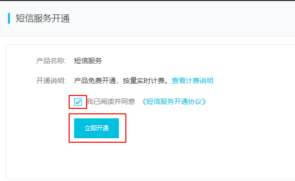

> 勾选 “我已阅读并同意”，然后点击“立即开通”
>
> 开通时会要求实名认证，按照真实情况进行认证即可

#### 1.2.3. 获取AccessKey

> 在管理控制台的右上方有 AccessKey的入口

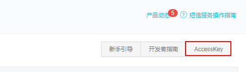

会出现提示信息

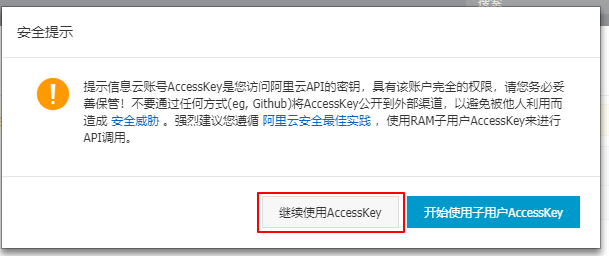

> 右上方有“创建AccessKey”的按钮

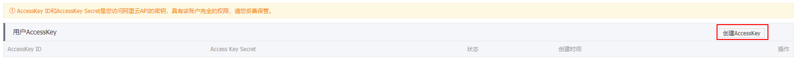

> 需要校验手机号

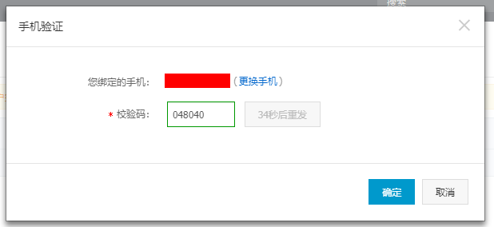

> **提示保存AccessKey，一定要保存起来**

#### 1.2.4. 创建签名和模板

> 控制台中 “国内消息”，进行签名、模板的操作

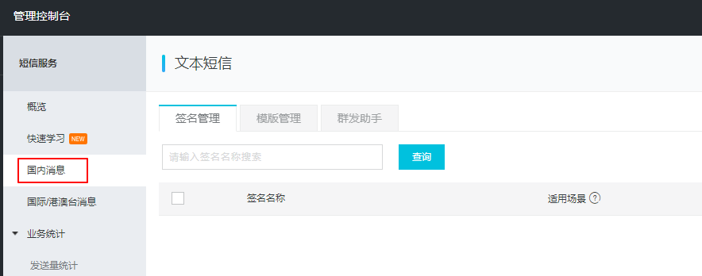

1. 添加签名

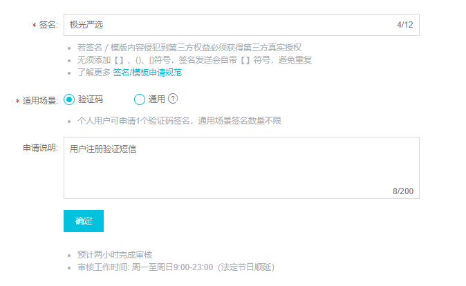

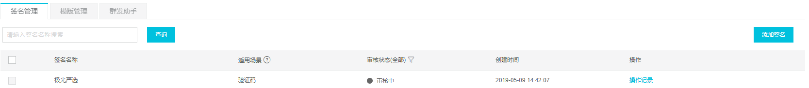

2. 添加模板

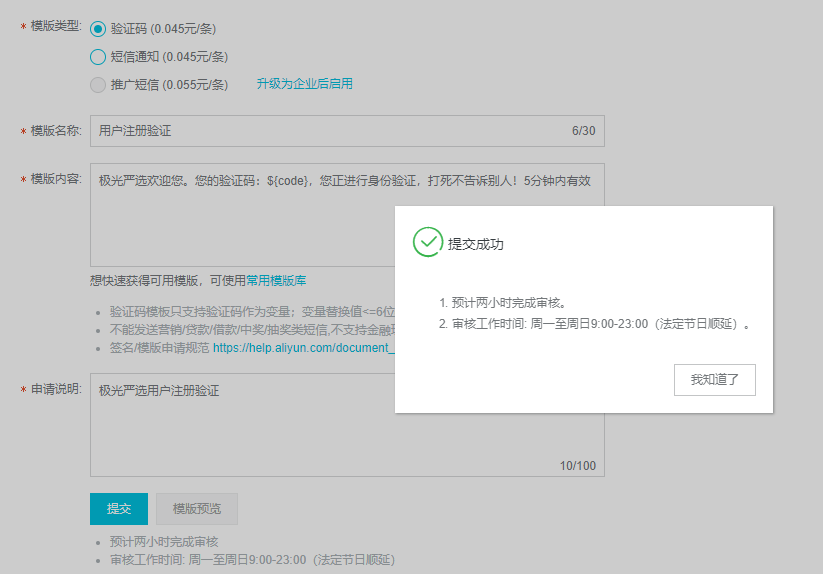

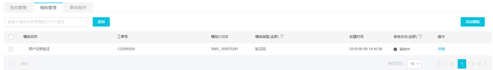

#### 1.2.5 短信接口配置

​	访问权限控制，参考官网帮助文档设置

<https://help.aliyun.com/document_detail/108069.html?spm=a2c4g.11186623.2.35.65672e79U4YxWZ>


### 1.3. 短信发送

> https://api.aliyun.com/new?spm=a2c4g.11186623.2.13.260d19d94pfOgB#/?product=Dysmsapi
>
> 在该地址下可以看到官方给出的消息发送示范

> 开始搭建本地的开发环境并发送短信

#### 1.3.1. 创建工程，并添加依赖

```xml
    <dependencies>
        <dependency>
            <groupId>com.aliyun</groupId>
            <artifactId>aliyun-java-sdk-core</artifactId>
            <version>4.1.0</version>
        </dependency>
        <dependency>
            <groupId>com.aliyun</groupId>
            <artifactId>aliyun-java-sdk-dysmsapi</artifactId>
            <version>1.1.0</version>
        </dependency>
    </dependencies>
```

#### 1.3.2. 编写入门案例

```java
public class SmsSend {

    public static void main(String[] args) {
        // 1. 设置 accessKey&accessKeySecret
        DefaultProfile profile = DefaultProfile.getProfile("default", "<accessKeyId>", "<accessKeySecret>");
        // 2. 创建客户端实例
        IAcsClient client = new DefaultAcsClient(profile);
        // 3. 创建请求，并配置请求参数
        CommonRequest request = new CommonRequest();
        request.setProtocol(ProtocolType.HTTPS);
        request.setMethod(MethodType.POST);
        request.setDomain("dysmsapi.aliyuncs.com");
        request.setVersion("2017-05-25");
        request.setAction("SendSms");
        // 设置用户的手机号
        request.putQueryParameter("PhoneNumbers", "手机号");
        // 设置签名名称
        request.putQueryParameter("SignName", "极光严选");
        // 设置模板的ID
        request.putQueryParameter("TemplateCode", "SMS_165070291");
        // 设置模板内容参数
        request.putQueryParameter("TemplateParam", "{\"code\":666666}");

        try {
            // 4. 发送请求，并接收响应结果
            CommonResponse response = client.getCommonResponse(request);
            System.out.println(response.getData());
        } catch (ServerException e) {
            e.printStackTrace();
        } catch (ClientException e) {
            e.printStackTrace();
        }
    }
}
```

测试结果：

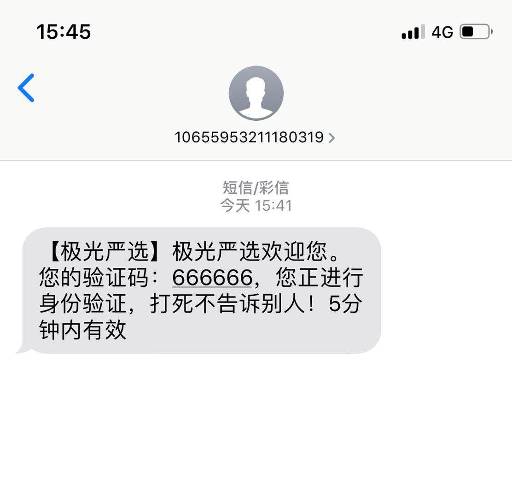

## 二、短信服务工程

> 构建一个通用的短信发送服务（独立于极光严选的单独工程），接收ActiveMQ的消息（Map类型），消息内容包含
>
> phoneNum：手机号
>
> templateCode：短信模板号
>
> singName：签名
>
> parameter：模板参数

### 2.1. 创建工程

> 创建 web工程，名称为 `jiguang-sms`

#### 2.1.1. 完善依赖信息

```xml
<?xml version="1.0" encoding="UTF-8"?>
<project xmlns="http://maven.apache.org/POM/4.0.0"
         xmlns:xsi="http://www.w3.org/2001/XMLSchema-instance"
         xsi:schemaLocation="http://maven.apache.org/POM/4.0.0 http://maven.apache.org/xsd/maven-4.0.0.xsd">
    <modelVersion>4.0.0</modelVersion>

    <groupId>com.itjiguang.sms</groupId>
    <artifactId>jiguang-sms</artifactId>
    <version>1.0-SNAPSHOT</version>
    <packaging>war</packaging>
    <dependencies>
        <!--Spring 的运行环境 -->
        <dependency>
            <groupId>org.springframework</groupId>
            <artifactId>spring-context-support</artifactId>
            <version>5.0.15.RELEASE</version>
        </dependency>
        <dependency>
            <groupId>org.springframework</groupId>
            <artifactId>spring-web</artifactId>
            <version>5.0.15.RELEASE</version>
        </dependency>
        <!-- 消息中间件的运行环境 -->
        <dependency>
            <groupId>org.springframework</groupId>
            <artifactId>spring-jms</artifactId>
            <version>5.0.15.RELEASE</version>
        </dependency>
        <dependency>
            <groupId>javax.jms</groupId>
            <artifactId>javax.jms-api</artifactId>
            <version>2.0.1</version>
        </dependency>
        <dependency>
            <groupId>org.apache.activemq</groupId>
            <artifactId>activemq-client</artifactId>
            <version>5.13.4</version>
        </dependency>
        <!-- 阿里云通信-短信服务环境 -->
        <dependency>
            <groupId>com.aliyun</groupId>
            <artifactId>aliyun-java-sdk-core</artifactId>
            <version>4.1.0</version>
        </dependency>
        <dependency>
            <groupId>com.aliyun</groupId>
            <artifactId>aliyun-java-sdk-dysmsapi</artifactId>
            <version>1.1.0</version>
        </dependency>
    </dependencies>

    <build>
        <plugins>
            <plugin>
                <groupId>org.apache.tomcat.maven</groupId>
                <artifactId>tomcat7-maven-plugin</artifactId>
                <version>2.2</version>
                <configuration>
                    <!-- 指定端口 -->
                    <port>8081</port>
                    <!-- 请求路径 -->
                    <path>/</path>
                </configuration>
            </plugin>
        </plugins>
    </build>
</project>
```

#### 2.1.2. 完善web.xml配置信息


其内容：

```xml
<?xml version="1.0" encoding="UTF-8"?>
<web-app xmlns:xsi="http://www.w3.org/2001/XMLSchema-instance"
	xmlns="http://java.sun.com/xml/ns/javaee"
	xsi:schemaLocation="http://java.sun.com/xml/ns/javaee http://java.sun.com/xml/ns/javaee/web-app_2_5.xsd"
	version="2.5">	
	
	<!-- 加载spring容器 -->
	<context-param>
		<param-name>contextConfigLocation</param-name>
		<param-value>classpath:spring/applicationContext*.xml</param-value>
	</context-param>
	<listener>
		<listener-class>org.springframework.web.context.ContextLoaderListener</listener-class>
	</listener>
</web-app>
```

#### 2.1.3. 完善Spring&ActiveMQ的相关配置

```xml
<?xml version="1.0" encoding="UTF-8"?>
<beans xmlns="http://www.springframework.org/schema/beans"
       xmlns:xsi="http://www.w3.org/2001/XMLSchema-instance"
       xmlns:context="http://www.springframework.org/schema/context"
       xsi:schemaLocation="http://www.springframework.org/schema/beans http://www.springframework.org/schema/beans/spring-beans.xsd
       http://www.springframework.org/schema/context http://www.springframework.org/schema/context/spring-context.xsd">

    <context:component-scan base-package="com.itjiguang.sms"/>

    <!-- 配置连接工厂 -->
    <bean id="activeMQConnectionFactory" class="org.apache.activemq.ActiveMQConnectionFactory">
        <property name="brokerURL" value="tcp://192.168.253.130:61616"/>
    </bean>
    <!-- spring 管理activemq的连接工厂 -->
    <bean id="connectionFactory" class="org.springframework.jms.connection.SingleConnectionFactory">
        <!-- 被管理的连接工厂 -->
        <property name="targetConnectionFactory" ref="activeMQConnectionFactory" />
    </bean>

    <bean id="smsDestination" class="org.apache.activemq.command.ActiveMQQueue">
        <property name="physicalName" value="jiguang_sms"/>
    </bean>
    <bean class="org.springframework.jms.listener.DefaultMessageListenerContainer">
        <property name="connectionFactory" ref="connectionFactory"/>
        <property name="destination" ref="smsDestination"/>
        <property name="messageListener" ref="smsListener" />
    </bean>

</beans>
```

### 2.2. 添加短信服务的配置信息

#### 2.2.1. 配置文件

```properties
# 短信服务配置信息
sms.domain=dysmsapi.aliyuncs.com
sms.version=2017-05-25
sms.action=SendSms
# <> 中的内容需要修改
sms.accessKeyId=<accessKeyId>
# <> 中的内容需要修改
sms.accessKeySecret=<accessKeySecret>
```

#### 2.2.2. 配置类

```java
/**
 * 读取配置文件中的短信服务相关的信息
 */
@Component
public class Configuration {

    @Value("${sms.domain}")
    private String domain;
    @Value("${sms.version}")
    private String version;
    @Value("${sms.action}")
    private String action;
    @Value("${sms.protocol}")
    private String protocol;
    @Value("${sms.accessKeyId}")
    private String accessKeyId;
    @Value("${sms.accessKeySecret}")
    private String accessKeySecret;

    public String getDomain() {
        return domain;
    }

    public String getVersion() {
        return version;
    }

    public String getAction() {
        return action;
    }

    public String getProtocol() {
        return protocol;
    }

    public String getAccessKeyId() {
        return accessKeyId;
    }

    public String getAccessKeySecret() {
        return accessKeySecret;
    }
}
```

### 2.3. 编写发送短信的工具类

```java
@Component
public class SmsUtil {

    @Autowired
    private Configuration configuration;

    /**
     * 发送短信工具方法
     * @param phoneNum 手机号
     * @param templateCode 模板编号
     * @param signName 签名
     * @param parameter 模板参数，格式 {"code",666666}
     * @return
     */
    public String sendShortMessage(String phoneNum, String templateCode, String signName, String parameter){
        // 初始化响应结果
        Map resultMap = new HashMap();
        
        // 1. 设置 accessKey&accessKeySecret
        DefaultProfile profile = DefaultProfile.getProfile("default", "LTAIghMLGEBlm5Kk", "VME2Do13xFzgIYcZ1ZlEHDGd5TboRk");
        // 2. 创建客户端实例
        IAcsClient client = new DefaultAcsClient(profile);
        // 3. 创建请求
        CommonRequest request = new CommonRequest();
        // 4. 设置公共请求参数
        request.setProtocol(ProtocolType.HTTPS);
        request.setMethod(MethodType.POST);
        request.setDomain(configuration.getDomain());
        request.setAction(configuration.getAction());
        request.setVersion(configuration.getVersion());
        // 5. 设置个性参数
        // 设置用户的手机号
        request.putQueryParameter("PhoneNumbers", phoneNum);
        // 设置签名名称
        request.putQueryParameter("SignName", signName);
        // 设置模板的ID
        request.putQueryParameter("TemplateCode", templateCode);
        // 设置模板内容参数
        request.putQueryParameter("TemplateParam", parameter);

        try {
            // 4. 发送请求，并接收响应结果
            CommonResponse response = client.getCommonResponse(request);
            System.out.println(response.getData());
            // 解析结果，返回响应码
            Map map = JSON.parseObject(response.getData(), Map.class);
            resultMap.put("code",map.get("Code"));
            resultMap.put("message",map.get("Message"));
        } catch (ServerException e) {
            e.printStackTrace();
            resultMap.put("code",e.getErrCode());
            resultMap.put("message",e.getMessage());
        } catch (ClientException e) {
            e.printStackTrace();
            resultMap.put("code",e.getErrCode());
            resultMap.put("message",e.getMessage());
        }finally {
            return resultMap;
        }
    }
}
```

### 2.4. 编写监听器

```java
@Component
public class SmsListener implements MessageListener{

    @Autowired
    private SmsUtil smsUtil;

    public void onMessage(Message message) {
        try{
            // 转换消息类型
            MapMessage mapMessage = (MapMessage)message;
            // 读取所需参数
            String phoneNum = mapMessage.getString("phoneNum");
            String signName = mapMessage.getString("signName");
            String templateCode = mapMessage.getString("templateCode");
            String parameter = mapMessage.getString("parameter");

            // 发送消息
            Map resultMap = smsUtil.sendShortMessage(phoneNum, templateCode, signName, parameter);

            System.out.println("========================");
            System.out.println(resultMap.get("message"));
            System.out.println("phoneNum="+phoneNum);
            System.out.println("parameter="+parameter);
        }catch (Exception e){
            e.printStackTrace();
        }
    }
}
```

### 2.5. 测试

#### 2.5.1. 消息发送程序

```java
public static void main(String[] args) throws  Exception{
        // 1. 创建连接工厂
        ConnectionFactory factory = new ActiveMQConnectionFactory("tcp://192.168.253.130:61616");
        // 2. 创建连接
        Connection connection = factory.createConnection();
        // 3. 开启连接
        connection.start();
        // 4. 创建会话
        Session session = connection.createSession(false, Session.AUTO_ACKNOWLEDGE);

        // 5. 创建点对点模式的消息存放Queue
        Destination destination = session.createQueue("jiguang_sms");

        // 6. 根据会话、消息存放中心创建消息生产者
        MessageProducer producer = session.createProducer(destination);
        producer.setDeliveryMode(DeliveryMode.NON_PERSISTENT);

        // 7. 创建消息
        MapMessage mapMessage = session.createMapMessage();
        mapMessage.setString("phoneNum","18653844760");
        mapMessage.setString("signName","极光严选");
        mapMessage.setString("templateCode","SMS_165070291");
        mapMessage.setObject("parameter","{\"code\":666666}");

        // 8. 生产者发送消息
        producer.send(mapMessage);

        // 9. 释放资源
        session.close();
        connection.close();
    }
```

#### 2.5.2. 测试结果

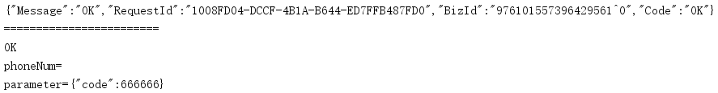


## 三、 用户注册

### 3.1. 需求分析

> 商城用户浏览商品不需要登录，一旦要购买商品就需要注册成为商城的用户

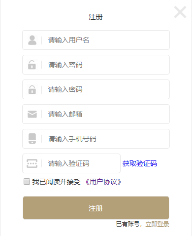

> 输入手机号码之后点击，获取验证码，再输入短信中的验证码，最终点击注册
>
> 1. 点击验证码，完成发送验证码短信操作
> 2. 点击注册，完成验证码校验
>    1. 如果验证码校验成功，保存用户信息
>    2. 如果校验验证码不成功，响应浏览器：”验证码错误“

### 3.2. 搭建工程

#### 3.2.1. 服务接口工程

> 创建服务接口 `jiguangyanxuan-account-api`，添加Model工程的依赖

#### 3.2.2. 服务实现工程

> 创建服务实现工程 `jiguangyanxuan-account-service`，web工程

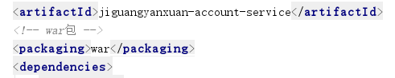

1. 配置tomcat插件

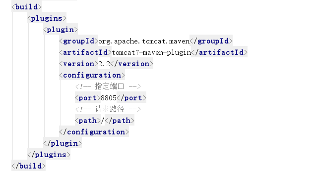

2. 完善web.xml

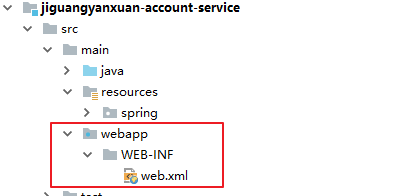

3. 完善Spring的配置信息

```xml
<dubbo:protocol name="dubbo" port="20885" />
<dubbo:registry address="zookeeper://192.168.142.129:2181" timeout="50000"/>
<dubbo:application name="yanxuan_account_service"/>

<dubbo:annotation package="com.itjiguang.yanxuan" />
```


#### 3.3.3. 完善web工程

> 修改 `jiguangyanxuan-portal-server`工程

1. 添加依赖

```xml
        <dependency>
            <groupId>com.itjiguang.yanxuan</groupId>
            <artifactId>jiguangyanxuan-account-api</artifactId>
            <version>1.0-SNAPSHOT</version>
        </dependency>
```


#### 3.3.4. 其他

> 基于ActiveMQ完成验证短信发送功能，可能在其他系统中也需要使用到短信发送，则在 `jiguangyanxuan-common` 配置短信发送的相关信息，以供其他的系统也能使用

```
signName=极光严选
templateCode=SMS_165070291
```


### 3.3. 发送短信验证码

#### 3.3.1. 前端业务模块

1. `service`

```js
angular.module("yanxuan").service("smsService", function (restService) {

    // 定义请求的资源路径
    var baseUrl = "../../sms";
    // get请求
    this.get = function(options){
        return restService.get(baseUrl, options);
    };

    // post请求
    this.post = function (entity) {
        return restService.post(baseUrl, entity);
    };

    // put请求
    this.put = function (entity) {
        return restService.put(baseUrl, entity);
    };

    // Delete请求
    this.delete = function (id) {
        return restService.delete(baseUrl, id);
    }
});
```

1. controller

```js
angular.module("yanxuan").controller("accountController", function($http, smsService){
    // 调用sms发送手机获取验证码的请求
    $scope.sendCheckCode = function(phoneNumbers){
        // 正则表达式
        var reg=/^[1][3,4,5,7,8][0-9]{9}$/ ;
        if(!reg.test($scope.entity.phone)){
            alert("手机格式不正确，请重新确认");

            return false;
        }
        
        smsService.get(phoneNumbers).then(
            function(res){
                console.log("验证码发送成功");
            }
        );
    }
})
```

1. 启用业务模块

```html
	<script type="text/javascript" src="js/custom/account.controller.js" ></script>
	<script type="text/javascript" src="js/custom/sms.service.js" ></script>
```

```html
<!-- 注册页面开始 -->
	<div class="mask register" ng-controller="accountController">
		<div class="reg_box">
			<h4>注册</h4>
			<form>
				<input type="text" placeholder="请输入用户名" >
				<input type="password" placeholder="请输入密码" >
				<input type="password" placeholder="请输入密码">
				<input type="email" placeholder="请输入邮箱">
				<input type="text" placeholder="请输入手机号码" ng-model="entity.phone">
				<input type="text" class="checkCode" placeholder="请输入验证码">
				<a href="javascript:;" ng-click="sendCheckCode()">获取验证码</a>
				<div class="assist">
					<input type="checkbox">我已阅读并接受
					<a href="#" class="user_agr">《用户协议》</a>
				</div>
				<input type="submit" value="注册" class="reg_btn" />
			</form>
			<span class="ple_reg">已有账号，<a href="javascript:;" class="enroll">立即登录</a></span>
			<a href="javascript:;" class="log_close">×</a>
		</div>
	</div>
	<!-- 注册页面结束 -->
```

#### 3.3.2. 后端业务实现

1. 控制层

```java
@RestController
@RequestMapping("/sms")
public class SmsController{
    @Reference
    private IAccountService accountService;

    @GetMapping("{phone}")
    public ResponseEntity sendSmsCode(@PathVariable("phone") String phone){
        accountService.sendSmsCode(phone);

        return new ResponseEntity(HttpStatus.OK);
    }
}

```

2. service

```java
    /**
     * 生成短信验证码，并发送消息至ActiveMQ
     * @param phone
     */
    public void sendSmsCode(String phone);
```

```java
    @Autowired
    private RedisTemplate redisTemplate;
    @Autowired
    private JmsTemplate jmsTemplate;
    @Autowired
    private Destination smdCodeDestination;

    @Value("${signName}")
    private String signName;
    @Value("${templateCode}")
    private String templateCode;
    /**
     * 随机生成6位数验证码，并保存到reids中，然后发送消息至Activemq
     * @param phone
     */
    @Override
    public void sendSmsCode(final String phone) {
        // 生成随机验证码
        final String smsCode = Integer.toString((int)(Math.random()+1)*100000));
        // 保存验证码到reids中
        redisTemplate.boundHashOps("smsCode").put(phone, smsCode);

        // 发送消息至ActiveMQ
        jmsTemplate.send(smdCodeDestination, new MessageCreator() {
            @Override
            public Message createMessage(Session session) throws JMSException {
                MapMessage mapMessage = session.createMapMessage();
                mapMessage.setString("phoneNum",phone);
                mapMessage.setString("parameter","{\"code\","+smsCode+"}");
                mapMessage.setString("signName", signName);
                mapMessage.setString("templateCode", templateCode);
                return mapMessage;
            }
        });
    }
```


### 3.4. 注册功能实现

#### 3.4.1. 前端业务模块

1. service

```js
angular.module("yanxuan").service("accountService", function (restService) {

    // 定义请求的资源路径
    var baseUrl = "../../account";
    // get请求
    this.get = function(options){
        return restService.get(baseUrl, options);
    };

    // post请求
    this.post = function (entity) {
        return restService.post(baseUrl, entity);
    };

    // put请求
    this.put = function (entity) {
        return restService.put(baseUrl, entity);
    };

    // Delete请求
    this.delete = function (id) {
        return restService.delete(baseUrl, id);
    }
});
```

2. controller

```js
angular.module("yanxuan").controller("accountController", function($http, smsService){
    // 调用sms发送手机获取验证码的请求
    
    // 发送用户注册信息
    $scope.regist = function () {
        accountService.post($scope.entity).then(
            function (res) {
                console.log("恭喜您注册成为极光严选的会员，您继续可以浏览喜欢的商品。");
            },
            function (res) {
                console.log(res.data);
            }
        );
    }
})
```

3. 启用业务模块

```html
<script type="text/javascript" src="js/custom/account.service.js" ></script>
```

4. 参数绑定，触发请求

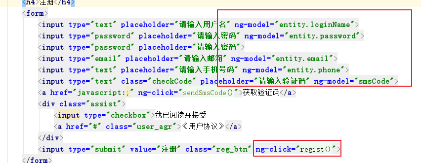


#### 3.4.2. 后台代码

1. 服务接口

```java
    /**
     * 保存账户信息
     * @param account
     * @return
     */
    public Map saveAccount(Account account);
```

2. 服务实现

```java
    @Autowired
    private AccountMapper accountMapper;

    @Override
    public Map<String,Object> saveAccount(Account account) {
        Map<String,Object> resultMap = new HashMap<>();

        // 检查验证码是否正确
        String redisSmsCode = (String)redisTemplate.boundHashOps("smsCode").get(account.getPhone());
        if(redisSmsCode.equals(account.getSmsCode())){
            // 验证通过，保存用户信息
            // 设置注册时间
            account.setCreateDate(new Date());
            // 生成加密密码
       	 	BCryptPasswordEncoder passwordEncoder = new BCryptPasswordEncoder();
        	String bcPassword = passwordEncoder.encode(sellerInfo.getPassword());
            account.setPassword(bcPassword);

            accountMapper.insertSelective(account);
            resultMap.put("code","OK");
            resultMap.put("message","用户注册成功");
        }else{
            // 验证不通过
            resultMap.put("code","invalid smscode");
            resultMap.put("message","验证码不匹配，请重新输入");
        }
        return resultMap;
    }
```

3. 控制层

```java
@RestController
@RequestMapping("/account")
public class AccountController {

    @Reference
    private IAccountService accountService;
    @PostMapping
    public ResponseEntity<String> saveAccount(@RequestBody Account account){
        System.out.println(account.getSmsCode());
        Map<String,Object> map = accountService.saveAccount(account);
        if ("OK".equals(map.get("code"))){
            return new ResponseEntity("OK",HttpStatus.CREATED);
        }else{
            return new ResponseEntity((String)map.get("message"), HttpStatus.BAD_REQUEST);
        }
    }
}
```

