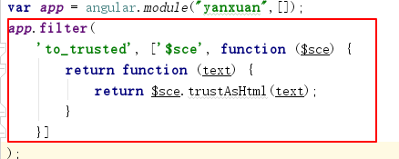
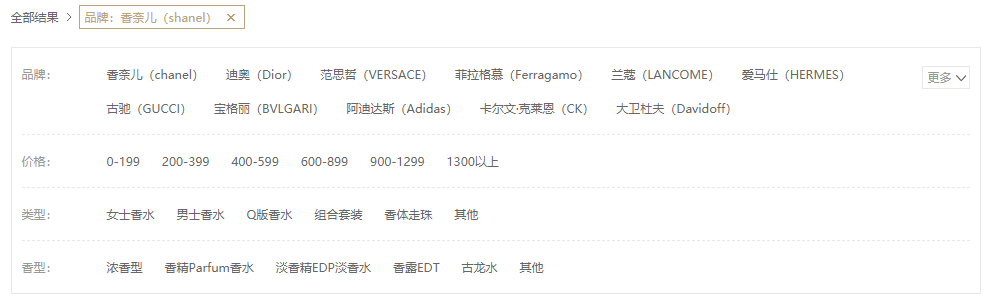
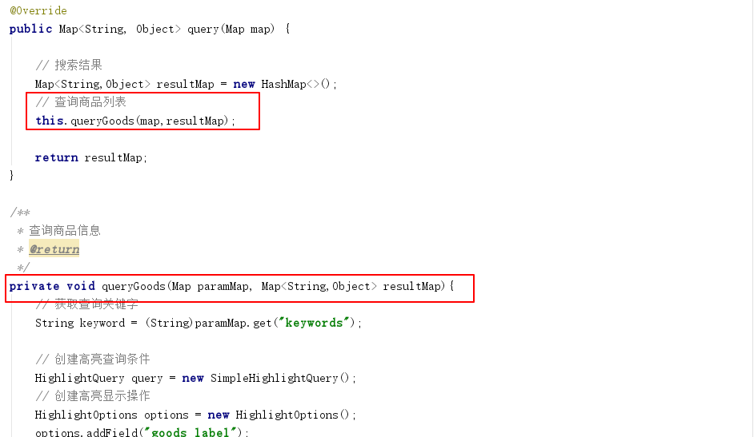
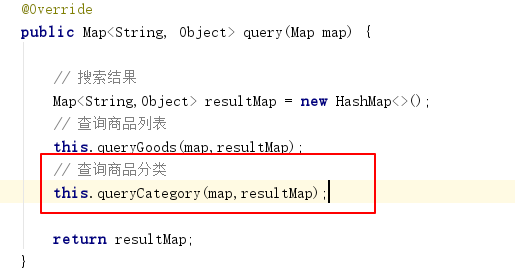
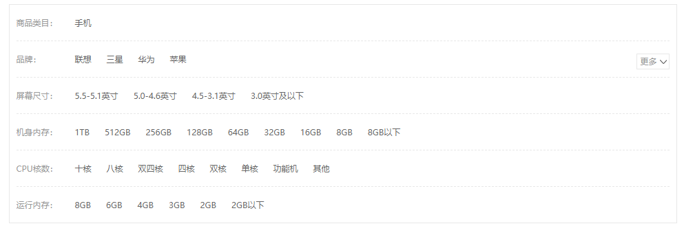
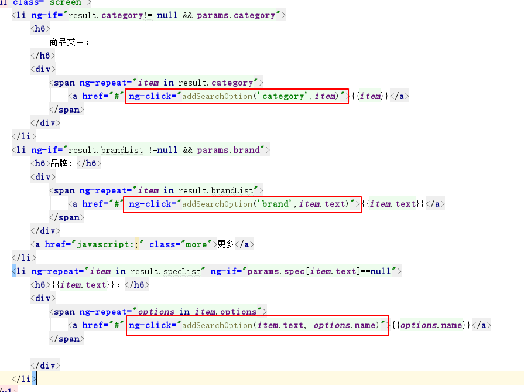
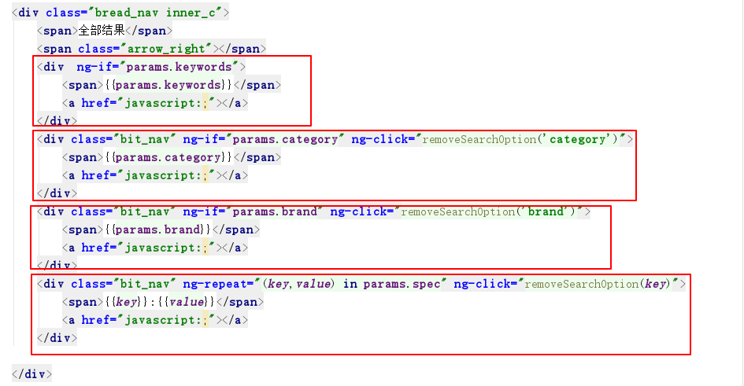
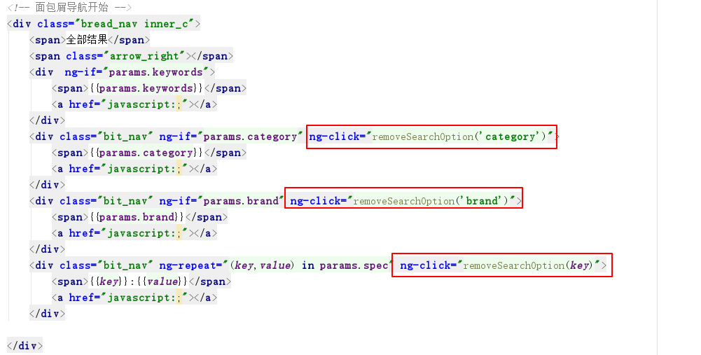
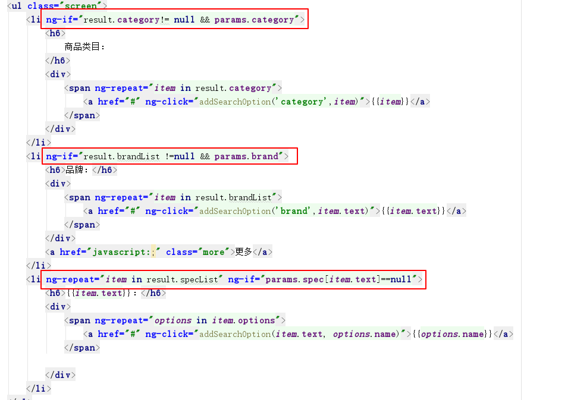
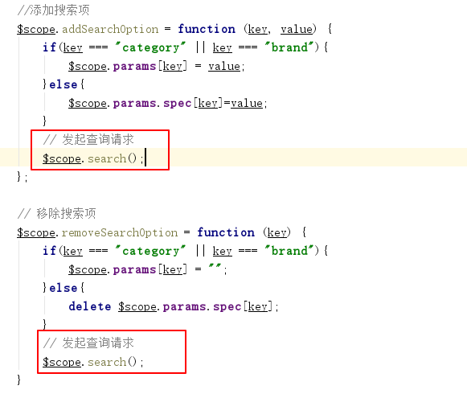

# 极光严选-第十章-商品搜索

## 课程内容

- 商品搜索结果中关键词高亮显示

- 商品搜索业务规则

- 根据条件进行商品搜索
  - 商品类目
  - 商品品牌
  - 商品规格


## 学习目标

- [ ] 能够理解并应用solr的高亮查询完成结果中关键字的高亮显示

- [ ] 理解商品搜索业务的规则

- [ ] 能够根据商品类目进行商品搜索

- [ ] 能够根据商品品牌进行商品搜索

- [ ] 能够根据商品规格信息进行商品搜索


## 一、搜索关键字高亮显示

### 1.1. 需求分析

> 为了更加明显的让用户找到自己预期的商品，在数据展示时会把搜索结果中的关键字显示为红色，这是常用的方式


### 1.2. solr高亮查询简介

```java
	@Autowired
    private SolrTemplate solrTemplate;

    @Test
    public void testHigh(){

        // 创建高亮查询条件
        HighlightQuery query = new SimpleHighlightQuery();
        // 创建高亮显示操作
        HighlightOptions options = new HighlightOptions();
        options.addField("goods_label");
        // 设置高亮前缀
        options.setSimplePrefix("</em style='color:red;'>");
        // 设置高亮后缀
        options.setSimplePostfix("</em>");
        // 把高亮操作添加到query中
        query.setHighlightOptions(options);

        // 添加查询条件
        query.addCriteria(new Criteria("goods_label").contains("华为"));

        // 执行查询获取查询数据
        HighlightPage<GoodsDocument> page = solrTemplate.queryForHighlightPage(query, GoodsDocument.class);

        // 获取查询的返回结果数据
        List<HighlightEntry<GoodsDocument>> highlighted = page.getHighlighted();

        for (HighlightEntry<GoodsDocument> highLight:highlighted ) {
            // 获取原始数据
            GoodsDocument entity = highLight.getEntity();
            // 获取高亮信息，包含field、和高亮片段
            List<HighlightEntry.Highlight> highlights = highLight.getHighlights();
            String goodsLabel = entity.getLabel();
            for (HighlightEntry.Highlight tmp : highlights){
                // 获取高亮片段List，并连接成String设置到原始数据中
                goodsLabel = StringUtils.join(tmp.getSnipplets(), "");
            }
            entity.setLabel(goodsLabel);

            System.out.println(entity.toString());
        }
        System.out.println(page.getTotalElements());
    }
```

### 1.3. 高亮显示搜索结果

#### 1.3.1. 修改搜索实现

```java
public Map<String, Object> query(Map queryParams) {
        // 查询请求中的关键词
        String keywords = (String) queryParams.get("keywords");
        // 创建条件
        Criteria criteria = new Criteria("goods_keywords").is(keywords);
        SimpleHighlightQuery highlightQuery = new SimpleHighlightQuery(criteria);
        // 设置高亮查询操作
        HighlightOptions highlightOptions = new HighlightOptions();
        highlightOptions.addField("goods_label");
        highlightOptions.setSimplePrefix("<em style='color: red'>");
        highlightOptions.setSimplePostfix("</em>");

        highlightQuery.setHighlightOptions(highlightOptions);
        // 进行查询
        HighlightPage<GoodsSpu> highlightPage = solrTemplate.queryForHighlightPage(highlightQuery, GoodsSpu.class);

        // 获取返回的结果
        List<HighlightEntry<GoodsSpu>> entryList = highlightPage.getHighlighted();

        // 返回的结果
        ArrayList<GoodsSpu> resultList = new ArrayList<>();

        for (HighlightEntry<GoodsSpu> entry : entryList) {
            // 获取文档数据（原始数据）
            GoodsSpu goodsSpu = entry.getEntity();
            // 高亮的信息
            List<HighlightEntry.Highlight> highlights = entry.getHighlights();
            for (HighlightEntry.Highlight highlight : highlights){
                List<String> snipplets = highlight.getSnipplets();
                StringBuffer stringBuffer = new StringBuffer();
                for (String str : snipplets) {
                    stringBuffer.append(str);
                }

                goodsSpu.setLabel(stringBuffer.toString());
            }

            resultList.add(goodsSpu);
        }

        Map<String, Object> result = new HashMap<>();
        result.put("result", resultList);
        result.put("total", highlightPage.getTotalElements());
        result.put("keywords", keywords);
        return result;
    }
```


#### 1.3.2. 前端代码修改

> 测试发现，高亮处理的后的数据直接显示在页面中，而没有作为html代码展示，解决方案使用angular中的$sce服务



修改html代码

```html
<p title="{{data.sellPoint}}"><a href="" ng-bind-html="data.label | to_trusted"></a></p>
```


## 二、 搜索业务规则

### 2.1.  需求分析

> 在搜索页面用户可以使用多项搜索条件进行搜索商品，例如：



>  业务规则
>
> 1. 当用户输入关键字搜索后，除了显示列表结果外，还应该显示通过这个关键字搜索到的商品类目信息
> 2. 根据搜索到的商品类目信息，查找关联的商品品牌信息，并展示出来
> 3. 根据搜索到的商品类目信息，查找关联的商品规格信息，并展示出来
> 4. 当用户点击搜索面板的商品分类时，显示按照这个关键字查询结果的基础上，筛选此分类的结果
> 5. 当用户点击搜索面板的品牌时，显示在以上结果的基础上，筛选此品牌的结果
> 6. 当用户点击搜索面板的规格时，显示在以上结果的基础上，筛选此规格的结果
> 7. 当用户点击搜索面板的相对应条件时，隐藏已点击的条件。


### 2.2. 实现思路

#### 2.2.1. 展示搜索条件

1. 根据关键字在solr系统中进行分组查询，得到关联的类目信息
2. 根据类目信息查询关联的品牌、规格信息
3. 在搜索页面展示类目、品牌、规格信息

#### 2.2.2. 根据条件进行结果过滤

1. 在服务端根据条件进行过滤搜索结果
2. 隐藏已选中的搜索条件


## 三、 查询分类列表

### 3.1. SpringDataSolr分组查询案例

```java
@ContextConfiguration(locations = "classpath:spring/spring-solr.xml")
@RunWith(SpringJUnit4ClassRunner.class)
public class SolrGroupTest {

    @Autowired
    private SolrTemplate solrTemplate;

    @Test
    public void testGroupQuery(){
        // 创建查询条件
        Criteria criteria = new Criteria("goods_keywords").is("华为");
        SimpleQuery simpleQuery = new SimpleQuery(criteria);
        // 设置分组的相关操作
        GroupOptions groupOptions = new GroupOptions();
        groupOptions.addGroupByField("goods_category");
        simpleQuery.setGroupOptions(groupOptions);
        // 执行分组的查询
        GroupPage<GoodsSpu> groupPage = solrTemplate.queryForGroupPage(simpleQuery, GoodsSpu.class);

        // 根据fieldname获取分页结果
        GroupResult<GoodsSpu> groupResult = groupPage.getGroupResult("goods_category");
        // 获取分组的实体对象
        Page<GroupEntry<GoodsSpu>> groupEntryPage = groupResult.getGroupEntries();
        // 具体的分页信息
        List<GroupEntry<GoodsSpu>> groupEntryList = groupEntryPage.getContent();

        for (GroupEntry<GoodsSpu> groupEntry:groupEntryList) {
            String groupValue = groupEntry.getGroupValue();
            System.out.println(groupValue);
        }
    }
}
```


### 3.2. 系统功能实现

#### 3.2.1. 服务实现

1. 把原来的根据关键字搜索商品的代码提取到一个方法中，在原方法中调用该方法



2. 添加搜索商品类目信息的方法，并在query方法中调用

```java
private void queryCategory(Map paramMap, Map resultMap){
    String keyword = (String)paramMap.get("keywords");

    // 初始化商品类目结果
    List<String> resultList= new ArrayList<>();

    // 创建查询条件
    Criteria criteria = new Criteria("goods_keywords").is(keyword);
    SimpleQuery simpleQuery = new SimpleQuery(criteria);
    //设置分组条件
    GroupOptions groupOptions = new GroupOptions();
    groupOptions.addGroupByField("goods_category");
    simpleQuery.setGroupOptions(groupOptions);
    // 进行分组查询
    GroupPage<GoodsSpu> groupPage = solrTemplate.queryForGroupPage(simpleQuery, GoodsSpu.class);
    // 读取指定field的分页结果
    GroupResult<GoodsSpu> groupResult = groupPage.getGroupResult("goods_category");
    // 读取分组结果中分组信息
    Page<GroupEntry<GoodsSpu>> groupEntryPage = groupResult.getGroupEntries();
    List<GroupEntry<GoodsSpu>> content = groupEntryPage.getContent();

    // 遍历每个分组，获取每组的名称，即group by 的值
    for (GroupEntry<GoodsSpu> groupEntry: content){
        String groupValue = groupEntry.getGroupValue();
        System.out.println(groupValue);
        resultList.add(groupValue);
    }

    resultMap.put("category",resultList);
}
```

#### 3.2.2. 调用方法



#### 3.2.3. 前端数据获取

```js
    // 发送分页的请求
    $scope.search = function(){
        searchService.get($scope.queryParams)
            .then(
                function (value) {
                    // 当前页显示的商品数据
                    $scope.dataList = value.data.result;
                    $scope.dataList.forEach(
                        function(element){
                            element.picUrl = JSON.parse(element.picUrl);
                        }
                    );
                    // 类目信息
                    $scope.categoryList = value.data.category;
                }
            );
    };
```

#### 3.2.4. 数据展示

```html
<li>
    <h6>类目：</h6>
    <div>
        <a href="javascript:;" ng-repeat="value in categoryList">{{value}}</a>
    </div>
</li>
```


## 四、显示品牌和规格列表

### 4.1. 需求分析

​	根据关键词已经搜索到了商品的类目信息，商品的类目信息与商品品牌、商品规格有所关联，所以根据商品的类目进行搜索得到关联的商品品牌、规格信息，然后完成展示。

### 4.2. 查询逻辑实现

#### 4.2.1. 查询类目的主键ID

​	在solr库中 类目信息的格式为 **一级类目>二级类目>三级类目** ，但是在数据库中类目信息表中没有与之关联的字段，解决的方式是读取数据库的类目信息存放到redis数据库中，根据solr库中的类目信息从redis数据库的查询，既不需要切割字符串，也充分利用了缓存，提高的响应的效率。

```java
// 读取查询得到的类目信息
List<String> categoryList = (List)resultMap.get("category");
// 根据查询得到的第一个类目信息进行查询
if(categoryList.size() > 0 ){
    String category = categoryList.get(0);
    // 从redis中读取类目信息
    Integer categoryId = (Integer)redisTemplate.boundHashOps("categoryList").get(category);
    if(categoryId == null){
        // 如果缓存中没有查询到数据(可能redis数据没有更新、可能没有缓存数据），那就从数据库中查询所有的三级类目信息
        GoodsCategoryExample goodsCategoryExample = new GoodsCategoryExample();
        goodsCategoryExample.createCriteria().andLevelEqualTo(3);
        List<GoodsCategory> goodsCategoryList = goodsCategoryMapper.selectByExample(goodsCategoryExample);
        // 处理所有的三级类目信息
        Map<String, Long> categoryMap = new HashMap<>();
        for(GoodsCategory goodsCategory: goodsCategoryList){
            // key的格式为 一级类目>二级类目>三级类目
            categoryMap.put(goodsCategory.getStructName()+">"+goodsCategory.getName(), goodsCategory.getId());
        }
        // 存放入redis中
        redisTemplate.boundHashOps("categoryList").putAll(categoryMap);
        // 获取当前的类目对应的categoryId
        categoryId = categoryMap.get(category).intValue();

    }
}
```

#### 4.2.2. 查询关联信息

```java
// 查询关联的品牌、规格信息
GoodsCategoryBrandSpecExample goodsCategoryBrandSpecExample = new GoodsCategoryBrandSpecExample();
goodsCategoryBrandSpecExample.createCriteria().andCategoryIdEqualTo(new Long(categoryId));
List<GoodsCategoryBrandSpec> brandSpecList = goodsCategoryBrandSpecMapper.selectByExample(goodsCategoryBrandSpecExample);
// 如果能查询结果，list中应该存在一个元素
GoodsCategoryBrandSpec goodsCategoryBrandSpec = brandSpecList.get(0);

// 品牌信息
String brandIds = goodsCategoryBrandSpec.getBrandIds();
List<Map> brandList = JSON.parseArray(brandIds, Map.class);
// 规格信息
String specIds = goodsCategoryBrandSpec.getSpecIds();
List<Map> specList = JSON.parseArray(specIds, Map.class);
// 规格项信息
for(Map spec : specList){
    // 规格项的ID, ID的类型应该是Long，但是FastJson的转换时会处理成Integer类型
    Integer specId = (Integer) spec.get("id");
    // 查询规格项
    GoodsSpecOptionExample goodsSpecOptionExample = new GoodsSpecOptionExample();
    goodsSpecOptionExample.createCriteria().andSpecIdEqualTo(new Long(specId));
    List<GoodsSpecOption> specOptionList = goodsSpecOptionMapper.selectByExample(goodsSpecOptionExample);
    // 设置规格项
    spec.put("optionList", specOptionList);
}

// 设置品牌信息和规格信息到返回结果
resultMap.put("brandList", brandList);
resultMap.put("specList", specList);
```

#### 4.2.3. 方法调用

```java
    @Override
    public Map<String, Object> query(Map queryParams) {
        // 创建返回的最终结果
        Map<String, Object> result = new HashMap<>();
        // 根据关键词查询商品
        this.queryGoods(queryParams, result);
        // 根据关键词查询商品类目的信息
        this.queryCategory(queryParams, result);
        // 查询关联的品牌和规格信息
        this.queryBrandAndSpec(result);

        return result;
    }
```

### 4.3. 前端数据设置与展示

#### 4.3.1. 数据设置

```js
// 发送分页的请求
$scope.search = function(){
    searchService.get($scope.queryParams)
        .then(
        function (value) {
            // 当前页显示的商品数据
            $scope.dataList = value.data.result;
            $scope.dataList.forEach(
                function(element){
                    element.picUrl = JSON.parse(element.picUrl);
                }
            );
            // 类目信息
            $scope.categoryList = value.data.category;
            // 品牌信息
            $scope.brandList = value.data.brandList;
            // 规格信息
            $scope.specList = value.data.specList;
        }
    );
};
```

#### 4.3.2. 数据展示

```html
<li>
    <h6>品牌：</h6>
    <div>
        <a href="javascript:;" ng-repeat="brand in brandList">{{brand.name}}</a>
    </div>
    <a href="javascript:;" class="more">更多</a>
</li>
```

```html
<li ng-repeat="spec in specList">
    <h6>{{spec.name}}：</h6>
    <div>
        <a href="javascript:;" ng-repeat="option in spec.optionList">{{option.name}}</a>
    </div>
</li>
```


### 4.4. 页面展示效果



### 4.5. 功能优化

​	频繁的查询会多次访问数据库，给数据库造成压力，所以缓存部分数据，即品牌数据和规格数据

#### 4.5.1. 实现

1. 从数据库查询得到结果之后存入redis中

```java
// 缓存品牌、规格信息
redisTemplate.boundHashOps("brandList").put(category, brandList);
redisTemplate.boundHashOps("specList").put(category, specList);
```

2. 在查询数据库之前从redis中读取

```java
// 从redis中读取品牌、规格信息
List<Map> brandList1 = (ArrayList<Map>)redisTemplate.boundHashOps("brandList").get(category);
List<Map> specList1 = (ArrayList<Map>)redisTemplate.boundHashOps("specList").get(category);
if(brandList1 !=null && specList1!=null){
    resultMap.put("brandList", brandList1);
    resultMap.put("specList", specList1);
    return ;
}
```


## 五、请求中条件设置

### 5.1. 需求分析

> 用户输入关键字搜索的出的商品会有很多，为了更精确的找到所需商品，可以选择品牌、某几项规格进行筛选商品。
>
> 选中某一条件后，在搜索面板顶部面包屑显示选中的条件，同时隐藏对应的选项
>
> 用户可以点击面包屑上的“×”，撤销某个查询条件，撤销后，并显示选项内容。


### 5.2. 添加搜索项

#### 5.2.1. js代码

```JavaScript
    //添加搜索项
    $scope.addSearchOption = function (key, value) {
        if(key === "category" || key === "brand"){
            $scope.params[key] = value;
        }else{
            $scope.params.spec[key]=value;
        }
        // 发起查询请求
        $scope.search();
    };
```

#### 5.2.2. html代码



### 5.3. 展示已选择的条件

#### 5.3.1. html代码



### 5.4. 移除选中的条件

#### 5.4.1. js代码

```JavaScript
    // 移除搜索项
    $scope.removeSearchOption = function (key) {
        if(key === "category" || key === "brand"){
            $scope.params[key] = "";
        }else{
            delete $scope.params.spec[key];
        }
        // 发起查询请求
        $scope.search();
    }
```

#### 5.4.2. html代码



### 5.5. 隐藏条件面板



### 5.6. 提交查询



## 六、过滤查询

### 6.1. 商品类目过滤

#### 6.1.1. 根据类目过滤查询

```java
// 设置过滤条件-过滤商品类目
if(!"".equals(paramMap.get("category"))){
    // 创建过滤条件
    Criteria criteria = new Criteria("goods_category").is(paramMap.get("category"));
    FilterQuery filterQuery=new SimpleFilterQuery(criteria);
    // 向查询条件中添加过滤条件
    query.addFilterQuery(filterQuery);
}
```

#### 6.1.2. 修改类目关联信息查询

```java
private void queryBrandAndSpec(Map queryParams, Map resultMap){
    // 获取查询条件中的类目名称
    String category = (String)queryParams.get("category");
    // 读取查询得到的类目信息
    List<String> categoryList = (List)resultMap.get("category");
    if((category==null||"".equals(category)) && categoryList.size()>0){
        // 根据查询得到的第一个类目信息进行查询
        category = categoryList.get(0);
    }

    // 从redis中读取品牌、规格信息
    List<Map> brandList1 = (ArrayList<Map>)redisTemplate.boundHashOps("brandList").get(category);
    List<Map> specList1 = (ArrayList<Map>)redisTemplate.boundHashOps("specList").get(category);
    if(brandList1 !=null && specList1!=null){
        resultMap.put("brandList", brandList1);
        resultMap.put("specList", specList1);
        return ;
    }
    // 从redis中读取类目信息
    Integer categoryId = (Integer)redisTemplate.boundHashOps("categoryList").get(category);
    if(categoryId == null){
        // 如果缓存中没有查询到数据(可能redis数据没有更新、可能没有缓存数据），那就从数据库中查询所有的三级类目信息
        GoodsCategoryExample goodsCategoryExample = new GoodsCategoryExample();
        goodsCategoryExample.createCriteria().andLevelEqualTo(3);
        List<GoodsCategory> goodsCategoryList = goodsCategoryMapper.selectByExample(goodsCategoryExample);
        // 处理所有的三级类目信息
        Map<String, Long> categoryMap = new HashMap<>();
        for(GoodsCategory goodsCategory: goodsCategoryList){
            // key的格式为 一级类目>二级类目>三级类目
            categoryMap.put(goodsCategory.getStructName()+">"+goodsCategory.getName(), goodsCategory.getId());
        }
        // 存放入redis中
        redisTemplate.boundHashOps("categoryList").putAll(categoryMap);
        // 获取当前的类目对应的categoryId
        categoryId = categoryMap.get(category).intValue();

    }

    // 查询关联的品牌、规格信息
    GoodsCategoryBrandSpecExample goodsCategoryBrandSpecExample = new GoodsCategoryBrandSpecExample();
    goodsCategoryBrandSpecExample.createCriteria().andCategoryIdEqualTo(new Long(categoryId));
    List<GoodsCategoryBrandSpec> brandSpecList = goodsCategoryBrandSpecMapper.selectByExample(goodsCategoryBrandSpecExample);
    // 如果能查询结果，list中应该存在一个元素
    GoodsCategoryBrandSpec goodsCategoryBrandSpec = brandSpecList.get(0);

    // 品牌信息
    String brandIds = goodsCategoryBrandSpec.getBrandIds();
    ObjectMapper objectMapper = new ObjectMapper();
    List<Map> brandList = JSON.parseArray(brandIds, Map.class);
    // 规格信息
    String specIds = goodsCategoryBrandSpec.getSpecIds();
    List<Map> specList = JSON.parseArray(specIds, Map.class);
    // 规格项信息
    for(Map spec : specList){
        // 规格项的ID, ID的类型应该是Long，但是FastJson的转换时会处理成Integer类型
        Integer specId = (Integer) spec.get("id");
        // 查询规格项
        GoodsSpecOptionExample goodsSpecOptionExample = new GoodsSpecOptionExample();
        goodsSpecOptionExample.createCriteria().andSpecIdEqualTo(new Long(specId));
        List<GoodsSpecOption> specOptionList = goodsSpecOptionMapper.selectByExample(goodsSpecOptionExample);
        // 设置规格项
        spec.put("optionList", specOptionList);
    }

    // 设置品牌信息和规格信息到返回结果
    resultMap.put("brandList", brandList);
    resultMap.put("specList", specList);

    // 缓存品牌、规格信息
    redisTemplate.boundHashOps("brandList").put(category, brandList);
    redisTemplate.boundHashOps("specList").put(category, specList);

}
```


### 6.2. 商品品牌过滤

```java
// 设置过滤条件-过滤商品品牌
if(!"".equals(paramMap.get("brand"))){
    Criteria criteria = new Criteria("goods_brand").is(paramMap.get("brand"));
    FilterQuery filterQuery=new SimpleFilterQuery(criteria);
    query.addFilterQuery(filterQuery);
}
```

### 6.3. 规格项过滤查询

#### 6.3.1. 修改实体类，设置动态域

```java
@Dynamic
@Field("goods_spec_*")
private Map<String,String> specMap;
public Map<String, String> getSpecMap() {
    return specMap; 
}
public void setSpecMap(Map<String, String> specMap) {
    this.specMap = specMap; 
}
```

```xml
<dynamicField name="goods_spec_*" type="text_general" indexed="true" stored="true" multiValued="true"/>
```


#### 6.3.2. 修改数据导入

```java
public void importToSolr(){
    // 查询所有商品
    List<GoodsSpu> goodsSpuList = this.queryAll();

    for (GoodsSpu goodsSpu :goodsSpuList) {
        String specCheckedList = goodsSpu.getSpecCheckedList();

        HashMap<String, Object> specMap = new HashMap<>();

        List<Map> specList = JSONArray.parseArray(specCheckedList, Map.class);

        if(specList!=null){
            for (Map spec :specList) {
                String specName = (String) spec.get("specName");
                Object optionValue = spec.get("optionValue");

                specMap.put(specName, optionValue);
            }

            goodsSpu.setSpecMap(specMap);
        }
    }

    // 保存批量的就可以
    solrTemplate.saveBeans(goodsSpuList);

    solrTemplate.commit();
}
```

#### 6.3.3. 过滤查询实现

```java
// 设置过滤条件-根据规格进行过滤
if(!"{}".equals(paramMap.get("spec"))){
    Map<String,String> specMap= JSON.parseObject(paramMap.get("spec").toString(),Map.class);
    for(String key :specMap.keySet()){

        FilterQuery filterQuery=new SimpleFilterQuery();
        Criteria filterCriteria=new Criteria("goods_spec_"+key).is( specMap.get(key)  );
        filterQuery.addCriteria(filterCriteria);
        query.addFilterQuery(filterQuery);
    }
}
```

